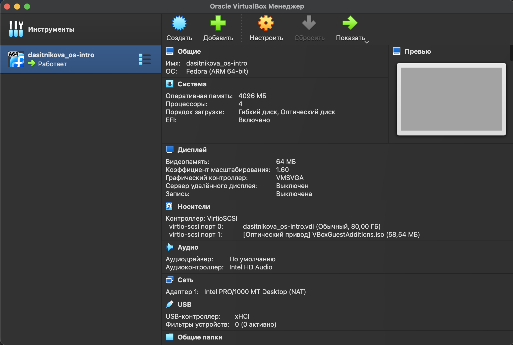
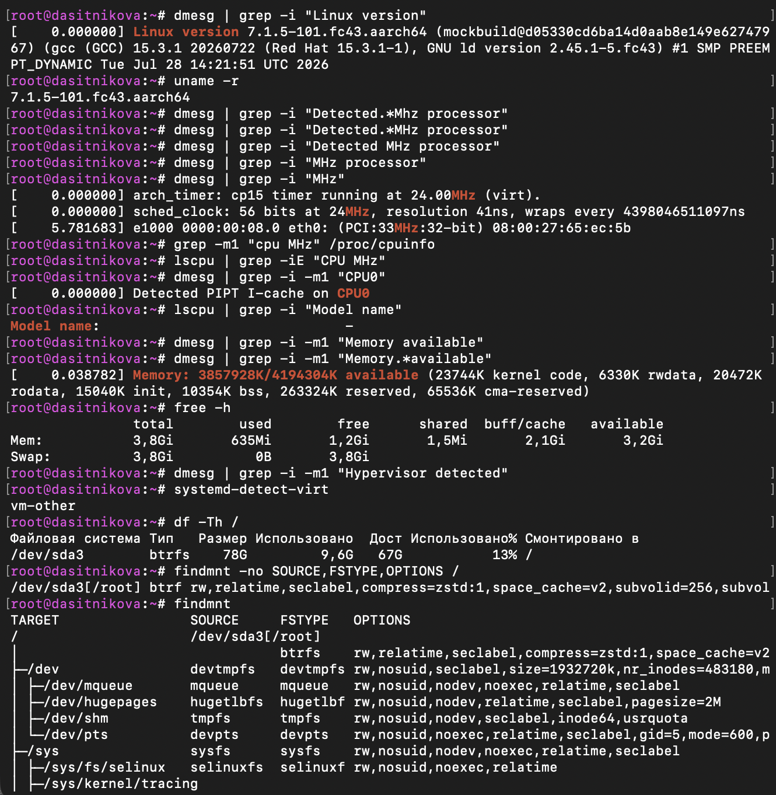

---
## Author
author:
  name: Ситникова Диана Александровна
  degrees: BSc
  email: 1032201746@rudn.ru
  affiliation:
    - name: Российский университет дружбы народов
      country: Российская Федерация
      postal-code: 117198
      city: Москва
      address: ул. Миклухо-Маклая, д. 6
## Title
title: "Лабораторная работа № 1"
subtitle: "Установка ОС Linux"
license: CC BY
date: today
date-format: "YYYY-MM-DD"
---

# Введение

## Докладчик

:::::::::::::: {.columns align=center}
::: {.column width="68%"}

- Ситникова Диана Александровна
- направление 09.03.03 «Прикладная информатика»
- Российский университет дружбы народов
- [1032201746@rudn.ru](mailto:1032201746@rudn.ru)

:::
::: {.column width="32%"}

{width=100%}

:::
::::::::::::::

## Цель и задачи работы

**Цель:** приобрести практические навыки установки операционной системы на виртуальную машину и настройки необходимых сервисов.

**Задачи:**

- создать виртуальную машину для Fedora Linux;
- установить и первоначально настроить гостевую ОС;
- подготовить средства для создания документации;
- исследовать загрузочные сообщения и файловые системы.

## Используемая среда

:::::::::::::: {.columns align=center}
::: {.column width="36%"}

- хостовая ОС: macOS;
- гипервизор: Oracle VM VirtualBox;
- гостевая ОС: Fedora 43 ARM64;
- 4 виртуальных процессора;
- 4096 МБ оперативной памяти;
- виртуальный диск VDI объёмом 80 ГБ.

:::
::: {.column width="64%"}

{width=100%}

:::
::::::::::::::

# Выполнение работы

## Fedora установлена на виртуальный диск

- К виртуальной машине подключён установочный образ Fedora ARM64.
- В программе установки выбраны язык, раскладка клавиатуры и часовой пояс.
- Для системы использован виртуальный диск объёмом 80 ГБ.
- Создан пользователь `dasitnikova` и задано одноимённое имя хоста.
- После установки система перезагружена, установочный образ отключён.
- Подключён образ дополнений гостевой ОС VirtualBox.

## Первоначальная настройка подготовила систему к работе

```bash
sudo dnf -y group install development-tools
sudo dnf -y update
sudo dnf -y install tmux mc
sudo dnf -y install dnf-automatic
sudo systemctl enable --now dnf-automatic.timer
```

- Установлены средства разработки и консольные утилиты.
- Включена служба автоматического обновления пакетов.

## Настроены основные параметры гостевой ОС

- SELinux переведён в режим `permissive`.
- Настроены русская и английская раскладки клавиатуры.
- Переключение раскладки назначено на правую клавишу `Ctrl`.
- Проверены имя пользователя и имя хоста `dasitnikova`.
- Для подготовки документации установлены Pandoc и TeX Live.

# Результаты

## Анализ загрузки подтвердил параметры системы

:::::::::::::: {.columns align=center}
::: {.column width="43%"}

- ядро: `7.1.5-101.fc43.aarch64`;
- доступно `3857928K` из `4194304K` памяти;
- VirtualBox предоставляет 4 виртуальных процессора;
- модель и частота CPU гостевой ARM64-системой не раскрываются;
- `systemd-detect-virt` определил среду как `vm-other`.

:::
::: {.column width="57%"}

{width=100%}

:::
::::::::::::::

## Корневая файловая система использует Btrfs

:::::::::::::: {.columns align=center}
::: {.column width="35%"}

- корневой раздел `/dev/sda3[/root]` использует Btrfs;
- объём раздела — 78 ГБ: занято 9,6 ГБ, свободно 67 ГБ;
- используется сжатие `zstd`;
- дерево монтирования проверено командой `findmnt`.

:::
::: {.column width="65%"}

{height=66%}

:::
::::::::::::::

## Система готова к дальнейшим лабораторным работам

- Создана и настроена виртуальная машина Fedora 43 ARM64.
- Освоены установка, обновление и первоначальное администрирование Linux.
- Настроены пользовательская среда и средства подготовки документации.
- Получены сведения о ядре, памяти, виртуализации и файловых системах.

**Результат:** гостевая операционная система установлена и подготовлена для дальнейшей работы по курсу.
