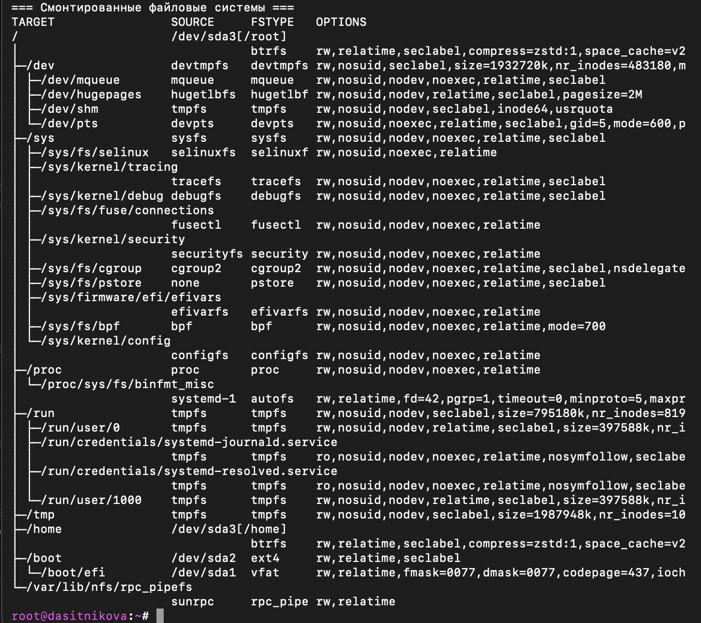

---
## Author
author:
  name: Ситникова Диана Александровна
  degrees: BSc
  email: 1032201746@rudn.ru
  affiliation:
    - name: Российский университет дружбы народов
      country: Российская Федерация
      postal-code: 117198
      city: Москва
      address: ул. Миклухо-Маклая, д. 6

## Title
title: "Отчёт по лабораторной работе №1"
subtitle: "Установка ОС Linux"
license: "CC BY"
bibliography: bib/cite.bib
---

# Цель работы

Целью данной работы является приобретение практических навыков установки операционной системы на виртуальную машину и настройки минимально необходимых для дальнейшей работы сервисов.

# Задание

- Создать в Oracle VM VirtualBox виртуальную машину для установки Fedora Linux.
- Установить операционную систему на виртуальный диск.
- Выполнить первоначальную настройку установленной системы: обновить программное обеспечение, установить необходимые консольные утилиты, настроить раскладку клавиатуры, имя пользователя и имя хоста.
- Установить программное обеспечение, необходимое для подготовки документации в Markdown и TeX.
- Проанализировать загрузочные сообщения ядра при помощи команды `dmesg`.
- Ответить на контрольные вопросы.

# Теоретическое введение

## Виртуализация

Виртуализация позволяет запускать одну операционную систему внутри другой в изолированной программной среде. Физический компьютер и установленная на нём операционная система называются хостом, а система внутри виртуальной машины --- гостевой операционной системой. Гипервизор предоставляет гостевой системе виртуальные процессоры, оперативную память, накопители, сетевые и другие устройства [@tanenbaum_book_modern-os_ru].

В данной работе хостовой системой является macOS, гипервизором --- Oracle VM VirtualBox, а гостевой системой --- Fedora Linux для архитектуры ARM64. Виртуальная машина позволяет изучать установку и администрирование Linux, не изменяя разделы и настройки основной операционной системы компьютера.

## Операционная система Fedora Linux

Fedora --- дистрибутив GNU/Linux, в котором для управления программным обеспечением используется пакетный менеджер `dnf`. Ядро Linux управляет процессами, оперативной памятью, файловыми системами и аппаратными устройствами. Во время загрузки ядро выводит диагностические сообщения в кольцевой буфер. Просмотреть эти сообщения можно командой `dmesg`.

Для выполнения административных операций используется механизм `sudo`. Команда `sudo -i` открывает интерактивную оболочку суперпользователя. Работать с правами суперпользователя следует только при выполнении действий, изменяющих системную конфигурацию.

## Учётные записи и файловая система

Учётная запись пользователя содержит имя пользователя, числовые идентификаторы UID и GID, принадлежность к группам, путь к домашнему каталогу и командную оболочку. Основные сведения об учётных записях хранятся в файле `/etc/passwd`, а защищённые данные для проверки пароля --- в `/etc/shadow`.

Файловая система определяет способ организации и хранения файлов на носителе. В Linux все доступные файловые системы объединяются в единое дерево, начинающееся с корневого каталога `/`. Подключение файловой системы к определённому каталогу называется монтированием. Сведения о смонтированных файловых системах можно получить командами `findmnt`, `mount` и `df`.

В [табл. @tbl-std-dir] приведено краткое описание некоторых стандартных каталогов Linux.

| Имя каталога | Назначение |
|---|---|
| `/` | Корневой каталог файловой системы |
| `/etc` | Общесистемные конфигурационные файлы |
| `/home` | Домашние каталоги обычных пользователей |
| `/root` | Домашний каталог суперпользователя `root` |
| `/tmp` | Временные файлы |
| `/usr` | Пользовательские программы, библиотеки и документация |
| `/var` | Изменяемые данные: журналы, очереди и кэш |

: Описание некоторых каталогов файловой системы GNU Linux {#tbl-std-dir}

Работа в командной оболочке и назначение основных утилит Unix подробно рассматриваются в [@robbins_book_bash_en; @newham_book_learning-bash_en].

# Выполнение лабораторной работы

## Создание виртуальной машины

В Oracle VM VirtualBox была создана виртуальная машина `dasitnikova_os-intro` с типом гостевой операционной системы Fedora ARM 64-bit. Для виртуальной машины были заданы следующие параметры:

- 4 виртуальных процессора;
- 4096 МБ оперативной памяти;
- виртуальный диск VDI объёмом 80 ГБ;
- контроллер накопителей VirtioSCSI;
- графический контроллер VMSVGA и 64 МБ видеопамяти;
- загрузка с использованием EFI;
- сетевой адаптер в режиме NAT;
- USB-контроллер xHCI.

К виртуальному оптическому приводу был подключён установочный образ Fedora ARM64. После установки системы к приводу был подключён образ дополнений гостевой операционной системы `VBoxGuestAdditions.iso`.

Параметры созданной виртуальной машины представлены на [рис. @fig-001].

{#fig-001 width=95%}

## Установка Fedora Linux

После запуска виртуальной машины была выполнена загрузка с установочного образа Fedora. В программе установки были выбраны язык интерфейса, раскладка клавиатуры и часовой пояс. Для размещения системы использовался созданный виртуальный диск объёмом 80 ГБ.

Имя пользователя и сетевое имя компьютера были заданы в соответствии с соглашением об именовании. После завершения копирования файлов виртуальная машина была перезагружена, а установочный образ был отключён. В результате была установлена Fedora 43 для архитектуры ARM64.

## Первоначальная настройка системы

После первого входа в систему был открыт терминал. Для выполнения административных действий использовалась команда:

```bash
sudo -i
```

Для установки средств разработки и обновления пакетов были выполнены команды:

```bash
sudo dnf -y group install development-tools
sudo dnf -y update
```

Для повышения удобства работы в терминале были установлены терминальный мультиплексор `tmux` и файловый менеджер `mc`:

```bash
sudo dnf -y install tmux mc
```

Для настройки автоматического обновления был установлен пакет `dnf-automatic`, после чего был включён соответствующий таймер `systemd`:

```bash
sudo dnf -y install dnf-automatic
sudo systemctl enable --now dnf-automatic.timer
```

## Настройка SELinux

В рамках данной лабораторной работы расширенные механизмы SELinux не рассматриваются. Поэтому в конфигурационном файле `/etc/selinux/config` значение режима было изменено с

```text
SELINUX=enforcing
```

на

```text
SELINUX=permissive
```

После изменения конфигурации система была перезагружена:

```bash
sudo systemctl reboot
```

## Настройка раскладки клавиатуры

Для интеграции системных параметров клавиатуры с оконным менеджером Sway был подготовлен пользовательский конфигурационный файл:

```bash
mkdir -p ~/.config/sway/config.d
touch ~/.config/sway/config.d/95-system-keyboard-config.conf
```

В файл `~/.config/sway/config.d/95-system-keyboard-config.conf` была добавлена строка:

```text
exec_always /usr/libexec/sway-systemd/locale1-xkb-config --oneshot
```

В системном конфигурационном файле `/etc/X11/xorg.conf.d/00-keyboard.conf` были заданы английская и русская раскладки, а также переключение раскладки правой клавишей `Ctrl`:

```text
Section "InputClass"
    Identifier "system-keyboard"
    MatchIsKeyboard "on"
    Option "XkbLayout" "us,ru"
    Option "XkbVariant" ",winkeys"
    Option "XkbOptions" "grp:rctrl_toggle,compose:ralt,terminate:ctrl_alt_bksp"
EndSection
```

После сохранения конфигурационных файлов виртуальная машина была перезагружена.

## Проверка имени пользователя и имени хоста

Текущее имя пользователя было проверено командой:

```bash
id -un
```

Имя хоста и сведения о системе были проверены командой:

```bash
hostnamectl
```

Имя пользователя и имя хоста имеют значение `dasitnikova`, что соответствует принятому соглашению об именовании.

## Установка программного обеспечения для создания документации

Для работы с документами в формате Markdown был установлен универсальный преобразователь документов Pandoc:

```bash
sudo dnf -y install pandoc
```

Для подготовки документов с использованием TeX был установлен полный набор пакетов TeX Live:

```bash
sudo dnf -y install texlive-scheme-full
```

## Анализ загрузочных сообщений

Загрузочные сообщения ядра были просмотрены командой:

```bash
dmesg | less
```

Для поиска отдельных сведений использовалось сочетание `dmesg` и `grep`. Версия ядра была получена командами:

```bash
dmesg | grep -i "Linux version"
uname -r
```

Установлено, что используется ядро Linux версии `7.1.5-101.fc43.aarch64`, собранное для архитектуры AArch64.

Поиск частоты и модели процессора выполнялся командами:

```bash
dmesg | grep -i "Detected.*MHz processor"
grep -m1 "cpu MHz" /proc/cpuinfo
lscpu | grep -i "Model name"
```

Команды не вывели частоту и модель процессора. В конфигурации VirtualBox гостевой системе предоставлено 4 виртуальных процессора, однако для данной ARM64-конфигурации их модель и тактовая частота внутри гостевой системы не указаны. Значение `24 MHz` в сообщении `arch_timer: cp15 timer running at 24.00MHz (virt)` относится к системному таймеру, а не к частоте процессора.

Объём памяти при загрузке был определён командой:

```bash
dmesg | grep -i -m1 "Memory.*available"
```

Ядру было доступно `3857928K` из `4194304K` оперативной памяти. Дополнительная проверка командой `free -h` показала 3,8 ГиБ общего и 3,2 ГиБ доступного объёма памяти на момент выполнения команды.

Поиск сообщения ядра об обнаруженном гипервизоре и дополнительная проверка типа виртуализации выполнялись командами:

```bash
dmesg | grep -i -m1 "Hypervisor detected"
systemd-detect-virt
```

В журнале `dmesg` отдельная строка `Hypervisor detected` отсутствовала. Команда `systemd-detect-virt` вернула значение `vm-other`. При этом по конфигурации виртуальной машины известно, что в качестве гипервизора используется Oracle VM VirtualBox.

Тип файловой системы корневого раздела был определён командами:

```bash
df -Th /
findmnt -no SOURCE,FSTYPE,OPTIONS /
```

Корневая файловая система расположена на разделе `/dev/sda3[/root]` и имеет тип Btrfs. Её доступный пользователю объём составляет 78 ГБ, из которых 9,6 ГБ занято и 67 ГБ свободно. Файловая система смонтирована с параметрами `rw`, `relatime`, `seclabel` и сжатием `zstd`.

Результаты анализа характеристик гостевой операционной системы представлены на [рис. @fig-002].

{#fig-002 width=95%}

Дерево и последовательность монтирования файловых систем были просмотрены командой:

```bash
findmnt
```

Сначала в корень `/` был смонтирован подтом Btrfs с устройства `/dev/sda3`. Внутри корневой иерархии были подключены виртуальные системные файловые системы `/dev`, `/dev/mqueue`, `/dev/hugepages`, `/dev/shm`, `/dev/pts`, `/sys`, `/sys/fs/selinux` и `/sys/kernel/tracing`.

Полная иерархия смонтированных файловых систем представлена на [рис. @fig-003].

{#fig-003 width=95%}

## Контрольные вопросы

1. **Какую информацию содержит учётная запись пользователя?**

   Учётная запись содержит имя пользователя, идентификаторы UID и GID, список дополнительных групп, домашний каталог, командную оболочку и данные, необходимые для проверки пароля. Общедоступная часть сведений хранится в `/etc/passwd`, а хеш пароля и параметры его действия --- в защищённом файле `/etc/shadow`.

2. **Укажите команды терминала и приведите примеры.**

   Для получения справки по команде используются `man`, `info` и параметр `--help`:

   ```bash
   man ls
   ls --help
   ```

   Для определения текущего каталога и перемещения по файловой системе используются `pwd` и `cd`:

   ```bash
   pwd
   cd /etc
   cd ~
   ```

   Для просмотра содержимого каталога используется `ls`:

   ```bash
   ls -la /etc
   ```

   Для определения объёма каталога используется `du`:

   ```bash
   du -sh ~/Documents
   ```

   Для создания каталогов и файлов применяются `mkdir` и `touch`, а для удаления --- `rmdir` и `rm`:

   ```bash
   mkdir example
   touch example/file.txt
   rm example/file.txt
   rmdir example
   ```

   Для изменения прав доступа используется `chmod`:

   ```bash
   chmod 640 file.txt
   chmod u+x script.sh
   ```

   Для просмотра истории введённых команд используется `history`:

   ```bash
   history
   ```

3. **Что такое файловая система? Приведите примеры с краткой характеристикой.**

   Файловая система --- это способ организации, хранения и поиска файлов на носителе. Она определяет структуру каталогов, правила именования, метаданные и права доступа. Ext4 является распространённой журналируемой файловой системой Linux. XFS рассчитана на эффективную работу с большими файлами и объёмами данных. Btrfs поддерживает подтома, снимки состояния, контрольные суммы и прозрачное сжатие. FAT32 обеспечивает широкую совместимость, но имеет ограничение размера одного файла в 4 ГБ.

4. **Как посмотреть, какие файловые системы подмонтированы в операционной системе?**

   Наиболее наглядно дерево монтирования показывает команда `findmnt`. Также можно использовать `mount` без параметров и `df -Th`:

   ```bash
   findmnt
   mount
   df -Th
   ```

5. **Как удалить зависший процесс?**

   Сначала необходимо определить идентификатор процесса при помощи `ps`, `pgrep` или `top`. Затем процессу следует отправить сигнал корректного завершения `SIGTERM`:

   ```bash
   ps aux
   kill -TERM PID
   ```

   Если процесс не реагирует на `SIGTERM`, в качестве крайней меры используется сигнал `SIGKILL`:

   ```bash
   kill -KILL PID
   ```

   Для завершения процесса по имени можно использовать `pkill`. Сигнал `SIGKILL` не позволяет процессу выполнить освобождение ресурсов, поэтому применять его следует только после неудачной попытки штатного завершения.

# Выводы

В ходе лабораторной работы были приобретены практические навыки создания и настройки виртуальной машины в Oracle VM VirtualBox, установки Fedora Linux для архитектуры ARM64 и первоначального администрирования гостевой операционной системы. Были настроены необходимые системные параметры и установлены программы для дальнейшей работы и подготовки документации. С помощью команд `dmesg`, `uname`, `free`, `systemd-detect-virt`, `df` и `findmnt` были проанализированы характеристики установленной системы, загрузочные сообщения ядра и структура смонтированных файловых систем.

# Список литературы{.unnumbered}

::: {#refs}
:::
