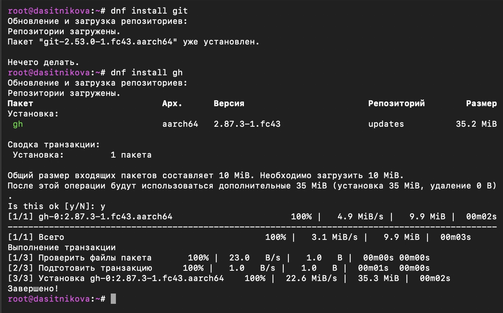
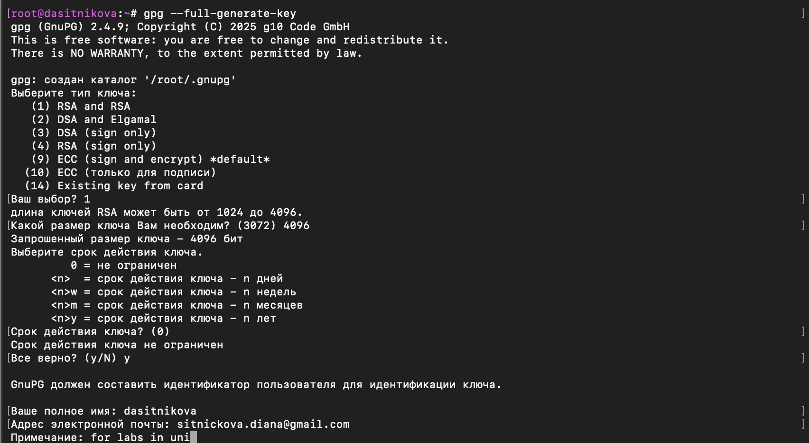
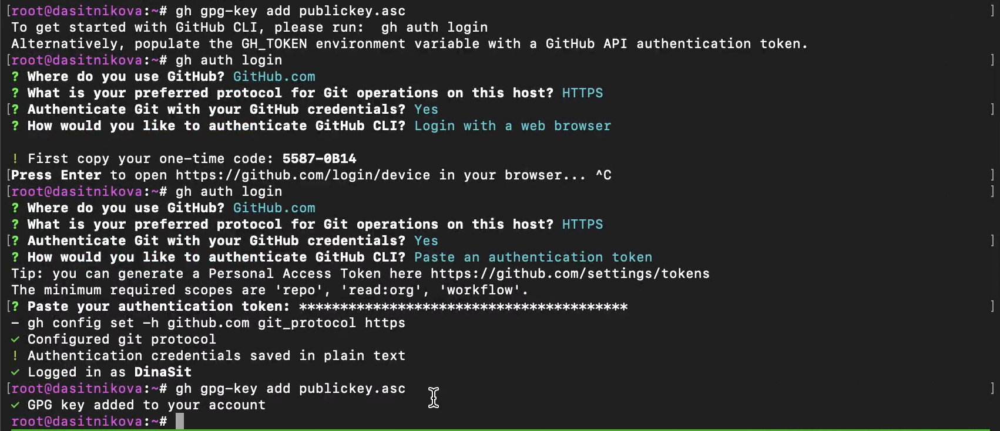

---
## Author
author:
  name: Ситникова Диана Александровна
  degrees: BSc
  email: 1032201746@rudn.ru
  affiliation:
    - name: Российский университет дружбы народов
      country: Российская Федерация
      postal-code: 117198
      city: Москва
      address: ул. Миклухо-Маклая, д. 6
## Title
title: "Лабораторная работа № 2"
subtitle: "Первоначальная настройка Git"
license: CC BY
date: today
date-format: "YYYY-MM-DD"
---

# Введение

## Докладчик

:::::::::::::: {.columns align=center}
::: {.column width="68%"}

- Ситникова Диана Александровна
- направление 09.03.03 «Прикладная информатика»
- Российский университет дружбы народов
- [1032201746@rudn.ru](mailto:1032201746@rudn.ru)

:::
::: {.column width="32%"}

{width=100%}

:::
::::::::::::::

## Цель и задачи работы

**Цель:** изучить принципы применения систем контроля версий и освоить работу с Git.

**Задачи:**

- установить Git и GitHub CLI;
- выполнить базовую конфигурацию Git;
- создать ключи SSH и PGP;
- настроить подпись коммитов;
- создать репозиторий и рабочий каталог курса.

## Git хранит историю проекта локально

- Git относится к распределённым системам контроля версий.
- Каждый разработчик получает рабочую копию и полную историю проекта.
- Коммиты фиксируют логически завершённые изменения.
- Удалённый репозиторий используется для синхронизации и совместной работы.

**Рабочий цикл:** `pull` → изменение → `add` → `commit` → `push`.

# Настройка Git

## Git и GitHub CLI установлены

:::::::::::::: {.columns align=center}
::: {.column width="36%"}

- Git управляет локальной историей проекта.
- GitHub CLI предоставляет команду `gh` для работы с GitHub из терминала.
- Пакеты установлены средствами Fedora.

:::
::: {.column width="64%"}

{width=100%}

:::
::::::::::::::

## Базовая конфигурация задаёт правила работы

- Указаны имя и электронная почта автора коммитов.
- Для начальной ветки задано имя `master`.
- Настроено корректное отображение путей в UTF-8.
- Параметры `autocrlf` и `safecrlf` контролируют переносы строк.

{width=95%}

# Ключи и подписи

## SSH-ключ подготовлен для доступа к GitHub

:::::::::::::: {.columns align=center}
::: {.column width="35%"}

- Создана пара ключей RSA размером 4096 бит.
- Закрытый ключ остаётся в каталоге пользователя.
- Открытый ключ предназначен для добавления в учётную запись GitHub.

:::
::: {.column width="65%"}

{width=100%}

:::
::::::::::::::

## PGP-ключ идентифицирует автора

:::::::::::::: {.columns align=center}
::: {.column width="35%"}

- Ключ создан командой `gpg --full-generate-key`.
- Выбран алгоритм RSA с длиной ключа 4096 бит.
- В данные ключа внесены имя и адрес электронной почты пользователя GitHub.

:::
::: {.column width="65%"}

{width=100%}

:::
::::::::::::::

## Отпечаток связывает ключ с GitHub

- Команда `gpg --list-secret-keys --keyid-format LONG` выводит идентификатор ключа.
- Открытая часть ключа экспортируется в текстовом формате ASCII Armor.
- После добавления ключа GitHub может проверять подпись коммитов.

{width=92%}

## Коммиты подписываются автоматически

- Параметр `user.signingkey` указывает созданный PGP-ключ.
- Параметр `commit.gpgsign` включает подпись каждого нового коммита.
- В качестве программы подписи выбран `gpg2`.

{width=92%}

# Работа с GitHub

## GitHub CLI авторизован

:::::::::::::: {.columns align=center}
::: {.column width="35%"}

- Авторизация запущена командой `gh auth login`.
- Подтверждение выполнено через браузер.
- После входа утилита получила доступ к учётной записи GitHub.

:::
::: {.column width="65%"}

{width=100%}

:::
::::::::::::::

## Репозиторий создан из учебного шаблона

- Команда `gh repo create` создала публичный репозиторий курса.
- В качестве основы использован шаблон рабочего пространства.
- Репозиторий клонирован вместе с подключёнными подмодулями.

{width=94%}

## Каталог курса подготовлен к работе

:::::::::::::: {.columns align=center}
::: {.column width="34%"}

- Задан идентификатор курса `os-intro`.
- Команда `make prepare` создала структуру каталогов.
- Результат зафиксирован коммитом и отправлен на GitHub.

:::
::: {.column width="66%"}

{width=100%}

:::
::::::::::::::

# Результаты

## Среда Git готова к дальнейшей работе

- Установлены Git и GitHub CLI.
- Выполнена базовая конфигурация системы контроля версий.
- Созданы SSH- и PGP-ключи, включена автоматическая подпись коммитов.
- Настроена авторизация GitHub CLI.
- Создан репозиторий и подготовлена структура каталогов курса.

**Результат:** локальная и удалённая среды настроены для выполнения последующих лабораторных работ.
