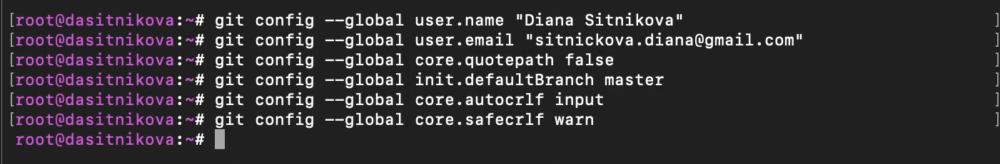
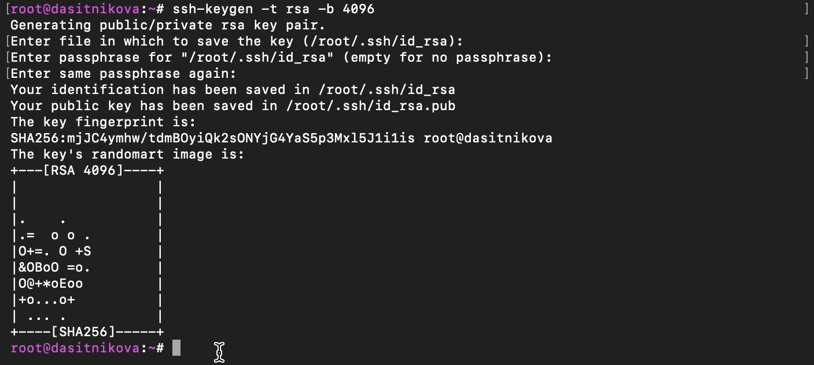
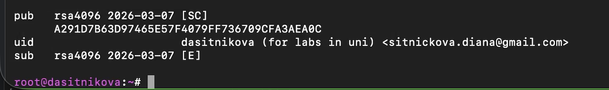
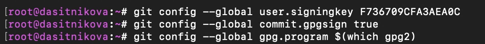
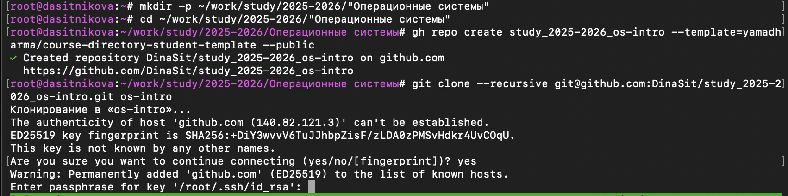
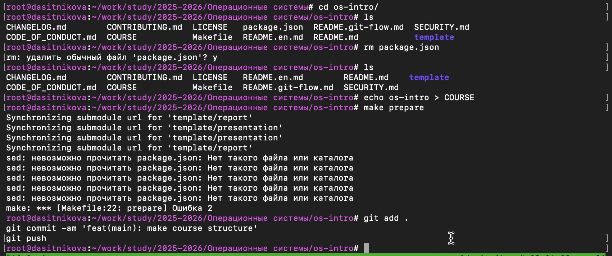

---
## Author
author:
  name: Ситникова Диана Александровна
  degrees: BSc
  email: 1032201746@rudn.ru
  affiliation:
    - name: Российский университет дружбы народов
      country: Российская Федерация
      postal-code: 117198
      city: Москва
      address: ул. Миклухо-Маклая, д. 6

## Title
title: "Отчёт по лабораторной работе № 2"
subtitle: "Первоначальная настройка Git"
license: "CC BY"
bibliography: bib/cite.bib
---

# Цель работы

- Изучить идеологию и применение средств контроля версий.
- Освоить умения по работе с Git.

# Задание

- Создать базовую конфигурацию для работы с Git.
- Создать ключ SSH.
- Создать ключ PGP.
- Настроить подписи Git.
- Зарегистрироваться на GitHub.
- Создать локальный каталог для выполнения заданий по предмету.

# Краткие теоретические сведения

## Системы контроля версий

Система контроля версий (Version Control System, VCS) предназначена для регистрации изменений в файлах проекта и последующего обращения к сохранённым состояниям. Она позволяет определить автора и время изменения, сравнить версии, восстановить предыдущее состояние проекта, организовать параллельную работу и объединить результаты нескольких участников. Эти возможности особенно важны при разработке программного обеспечения и подготовке документов, поскольку исходные материалы изменяются многократно, а история работы должна оставаться воспроизводимой [@rudn_lab02; @chacon_straub_progit].

В централизованной модели основное хранилище располагается на сервере, а пользователи получают из него рабочие копии. К таким системам относятся CVS и Subversion. В распределённой модели каждый участник располагает полноценным локальным репозиторием вместе с историей изменений. Поэтому большинство операций можно выполнять без постоянного соединения с сервером. Git, Mercurial и Bazaar относятся к распределённым системам контроля версий [@rudn_lab02].

При совместном редактировании одного файла могут возникать конфликты. VCS обнаруживает несовместимые изменения и предоставляет средства для их разрешения. Ветвление позволяет создать независимую линию разработки, выполнить в ней отдельную задачу, а затем объединить результат с основной ветвью. Благодаря этому экспериментальные изменения не нарушают стабильное состояние проекта.

## Основные понятия Git

Git хранит данные как последовательность состояний проекта. С каждым коммитом связаны сведения об авторе, времени фиксации, сообщении и предшествующем состоянии. Полноценный локальный репозиторий содержит рабочие файлы, служебный каталог `.git` и историю коммитов [@chacon_straub_progit].

В стандартном цикле работы участвуют следующие объекты:

- **репозиторий** — хранилище данных Git и истории проекта;
- **рабочая копия** — извлечённые из репозитория файлы, с которыми работает пользователь;
- **индекс** — промежуточная область, содержащая изменения для следующего коммита;
- **коммит** — сохранённое состояние подготовленных изменений;
- **ветвь** — именованная последовательность коммитов;
- **удалённый репозиторий** — репозиторий на сервере, используемый для обмена изменениями.

Команда `git status` показывает состояние рабочей копии и индекса, `git diff` позволяет просмотреть изменения, `git add` помещает выбранные изменения в индекс, а `git commit` сохраняет их в истории. Команды `git pull` и `git push` применяются для получения и отправки изменений удалённого репозитория. Официальная справочная документация Git объединяет эти операции в группы создания проектов, фиксации состояний, ветвления, слияния и синхронизации [@git_config_docs].

| Команда | Назначение |
|---|---|
| `git init` | создание нового локального репозитория |
| `git clone` | получение копии существующего репозитория |
| `git status` | просмотр состояния рабочей копии и индекса |
| `git diff` | просмотр ещё не зафиксированных изменений |
| `git add` | добавление изменений в индекс |
| `git commit` | фиксация подготовленных изменений |
| `git pull` | получение и объединение изменений с сервера |
| `git push` | отправка локальных коммитов на сервер |
| `git branch` | создание, просмотр и удаление ветвей |
| `git merge` | объединение истории выбранной ветви с текущей |

## Работа с локальным и удалённым репозиториями

При единоличной работе пользователь создаёт или клонирует репозиторий, изменяет файлы, проверяет результат, добавляет необходимые изменения в индекс и формирует логически завершённые коммиты. Файлы, которые не должны храниться в репозитории, указываются в `.gitignore`. К таким файлам обычно относятся результаты сборки, временные файлы редакторов и локальные настройки.

При работе с общим репозиторием перед началом изменений необходимо получить актуальное состояние основной ветви. Для отдельной задачи создаётся рабочая ветвь. После завершения изменения проверяются командами `git status` и `git diff`, фиксируются коммитом и отправляются в удалённый репозиторий. Затем рабочая ветвь может быть объединена с основной. Такой порядок сохраняет понятную историю проекта и уменьшает вероятность потери чужих изменений [@rudn_lab02; @chacon_straub_progit].

Основной цикл синхронизации имеет следующий вид:

~~~bash
git pull
git status
git diff
git add <имена_файлов>
git commit -m "Описание изменений"
git push
~~~

## Базовая конфигурация Git и переносы строк

Команда `git config` позволяет читать и изменять параметры Git. Настройки могут действовать на системном уровне, для конкретного пользователя или только для одного репозитория. Параметр `--global` записывает значение в пользовательский файл конфигурации, поэтому имя, электронная почта и правила обработки строк применяются ко всем репозиториям пользователя [@git_config_docs].

Параметр `user.name` задаёт имя автора коммита, а `user.email` — связанный с ним адрес электронной почты. `core.quotepath false` обеспечивает читаемый вывод путей с символами вне ASCII. Параметр `init.defaultBranch master` определяет имя начальной ветви нового репозитория.

В разных операционных системах используются различные представления конца строки: LF в Unix-подобных системах и CRLF в Windows. Значение `core.autocrlf input` преобразует CRLF в LF при добавлении текста в репозиторий, но не выполняет обратное преобразование при извлечении файлов. Такой режим подходит для Linux и macOS. Параметр `core.safecrlf warn` предупреждает о потенциально необратимом преобразовании окончаний строк [@rudn_lab02; @git_config_docs].

## Аутентификация по SSH

SSH использует пару взаимосвязанных ключей: закрытый ключ хранится у пользователя, а открытый передаётся серверу. При подключении пользователь подтверждает владение закрытым ключом, не отправляя его по сети. После добавления открытого ключа в учётную запись GitHub можно обращаться к репозиториям по SSH без ввода имени пользователя и персонального токена при каждой операции [@github_about_ssh].

В работе создаются ключи RSA размером 4096 бит и Ed25519. Файлы закрытых ключей по умолчанию имеют имена `id_rsa` и `id_ed25519`, а открытые части — `id_rsa.pub` и `id_ed25519.pub`. Закрытый ключ не должен передаваться другим пользователям или публиковаться в репозитории.

## Подписание и проверка коммитов

Поля автора и коммитера являются частью метаданных коммита, однако сами по себе не доказывают личность пользователя. Криптографическая подпись связывает коммит с закрытым ключом владельца. В рамках работы для этого применяется GPG и ключ PGP. Открытая часть ключа добавляется в GitHub, а закрытая остаётся на компьютере пользователя.

GitHub проверяет подпись при получении коммита и отображает статус `Verified`, если подпись криптографически корректна и соответствует открытому ключу учётной записи. Поддерживаются подписи GPG, SSH и S/MIME [@github_commit_verification]. Параметр `user.signingkey` указывает используемый ключ, а `commit.gpgsign true` включает автоматическое подписание новых коммитов.

## GitHub CLI

GitHub CLI (`gh`) предоставляет доступ к функциям GitHub из терминала: авторизации, созданию репозиториев, работе с ключами, выпусками, задачами и запросами на слияние. Команда `gh auth login` запускает интерактивную настройку подключения к GitHub и позволяет выбрать протокол Git и способ авторизации [@github_cli_auth].

Для лабораторных работ репозиторий курса создаётся на основе готового шаблона. Клонирование с параметром `--recursive` одновременно получает основной репозиторий и его подмодули. Файл `COURSE` содержит код дисциплины, а команда `make` создаёт предусмотренную шаблоном структуру каталогов.

# Выполнение лабораторной работы

## Установка программного обеспечения

В соответствии с заданием была проверена установка Git:

~~~bash
dnf install git
~~~

Система сообщила, что Git уже установлен. После этого был установлен GitHub CLI:

~~~bash
dnf install gh
~~~

Установка пакета gh завершилась успешно (@fig-001).

{#fig-001 width=80%}

## Базовая настройка Git

Были указаны имя и адрес электронной почты владельца репозитория:

~~~bash
git config --global user.name "Diana Sitnikova"
git config --global user.email "<email>"
~~~

Затем были настроены отображение путей, имя начальной ветви и обработка переносов строк:

~~~bash
git config --global core.quotepath false
git config --global init.defaultBranch master
git config --global core.autocrlf input
git config --global core.safecrlf warn
~~~

Выполненные команды представлены на @fig-002.

{#fig-002 width=90%}

## Создание SSH-ключа

Были созданы SSH-ключи по алгоритмам RSA и Ed25519:

~~~bash
ssh-keygen -t rsa -b 4096
ssh-keygen -t ed25519
~~~

После создания пары ключей RSA система вывела отпечаток и графическое представление открытого ключа (@fig-003).

{#fig-003 width=80%}

## Создание PGP-ключа

Генерация PGP-ключа была запущена командой:

~~~bash
gpg --full-generate-key
~~~

При создании были выбраны алгоритм RSA, размер ключа 4096 бит и неограниченный срок действия. Затем были указаны имя, адрес электронной почты и комментарий (@fig-004).

{#fig-004 width=80%}

Наличие созданного ключа подтверждается выводом его открытой части и отпечатка на @fig-005.

{#fig-005 width=90%}

Для добавления ключа в GitHub открытая часть была сохранена в файле publickey.asc.

## Настройка GitHub и добавление PGP-ключа

Для авторизации GitHub CLI была выполнена команда:

~~~bash
gh auth login
~~~

После прохождения интерактивной авторизации GitHub CLI подтвердил успешный вход в учётную запись.

Открытый PGP-ключ был добавлен командой:

~~~bash
gh gpg-key add publickey.asc
~~~

GitHub CLI вывел сообщение об успешном добавлении ключа (@fig-007).

{#fig-007 width=80%}

## Настройка автоматической подписи коммитов

Для автоматического подписывания коммитов были выполнены команды из задания:

~~~bash
git config --global user.signingkey <PGP_Fingerprint>
git config --global commit.gpgsign true
git config --global gpg.program "$(which gpg2)"
~~~

Результат настройки представлен на @fig-006.

{#fig-006 width=90%}

## Создание репозитория курса

Для выполнения работ по курсу был создан каталог с актуальным учебным годом. Репозиторий создан на основе учебного шаблона и клонирован вместе с подмодулями:

~~~bash
mkdir -p ~/work/study/2025-2026/"Операционные системы"
cd ~/work/study/2025-2026/"Операционные системы"
gh repo create study_2025-2026_os-intro \
  --template=yamadharma/course-directory-student-template \
  --public
git clone --recursive \
  git@github.com:<owner>/study_2025-2026_os-intro.git \
  os-intro
~~~

GitHub CLI подтвердил создание публичного репозитория. Затем репозиторий был клонирован вместе с подмодулями (@fig-008).

{#fig-008 width=80%}

## Настройка каталога курса

После клонирования был выполнен переход в каталог курса. Лишний файл package.json удалён, а код курса записан в файл COURSE. Затем была запущена настройка структуры проекта:

~~~bash
cd ~/work/study/2025-2026/"Операционные системы"/os-intro
rm package.json
echo os-intro > COURSE
make
~~~

Подготовленные изменения были добавлены в Git, зафиксированы коммитом и отправлены в удалённый репозиторий:

~~~bash
git add .
git commit -am "feat(main): make course structure"
git push
~~~

Работа с файлами шаблона, подготовка структуры каталога и переход к фиксации изменений представлены на @fig-009.

{#fig-009 width=90%}

# Выводы

В ходе лабораторной работы были изучены основные принципы работы систем контроля версий и получены практические навыки первоначальной настройки Git.

Были проверены Git и GitHub CLI, выполнена базовая конфигурация Git, созданы ключи SSH и PGP, настроена автоматическая подпись коммитов, выполнена авторизация GitHub CLI, добавлен PGP-ключ, создан репозиторий курса на основе учебного шаблона и подготовлена структура рабочего каталога.

# Ответы на контрольные вопросы

1. **Что такое системы контроля версий и для решения каких задач они предназначены?**

   Система контроля версий хранит историю изменений файлов, позволяет сравнивать версии, возвращаться к предыдущим состояниям и объединять изменения нескольких участников.

2. **Как связаны понятия «хранилище», «коммит», «история» и «рабочая копия»?**

   Хранилище содержит файлы проекта и сведения об их изменениях. Рабочая копия используется для редактирования. Коммит фиксирует подготовленные изменения, а история представляет собой последовательность коммитов.

3. **Чем отличаются централизованные и децентрализованные системы контроля версий?**

   В централизованной системе основное хранилище находится на сервере; примеры — CVS и Subversion. В распределённой системе каждый пользователь имеет полноценный локальный репозиторий; примеры — Git, Bazaar и Mercurial.

4. **Каков порядок единоличной работы с хранилищем?**

   Пользователь изменяет рабочую копию, проверяет состояние файлов, добавляет нужные изменения в индекс и создаёт коммит. При наличии удалённого репозитория коммиты отправляются командой git push.

5. **Каков порядок работы с общим хранилищем?**

   Перед началом работы получают актуальные изменения, затем создают отдельную ветвь, вносят изменения, фиксируют их коммитами, отправляют ветвь в удалённый репозиторий и объединяют изменения после проверки.

6. **Какие задачи решает Git?**

   Git хранит историю изменений, управляет версиями и ветвями, объединяет изменения, позволяет отменять ошибочные действия и синхронизирует локальный и удалённый репозитории.

7. **Для чего используются основные команды Git?**

   git init создаёт репозиторий; git clone копирует удалённый репозиторий; git status показывает состояние файлов; git diff показывает изменения; git add добавляет изменения в индекс; git commit создаёт коммит; git pull получает изменения; git push отправляет коммиты; git branch управляет ветвями; git merge объединяет ветви.

8. **Приведите примеры работы с локальным и удалённым репозиториями.**

~~~bash
git init
git add <имя_файла>
git commit -m "Первый коммит"

git clone <адрес_репозитория>
git pull
git push
~~~

9. **Что такое ветви и зачем они нужны?**

   Ветвь — отдельная линия разработки. Она позволяет выполнять изменения независимо от основной версии проекта, а затем объединять готовый результат.

10. **Как и зачем можно игнорировать некоторые файлы при создании коммита?**

    В файл .gitignore записывают имена или шаблоны файлов, которые не следует добавлять в репозиторий: временные файлы, журналы, результаты сборки и локальные настройки. Это предотвращает попадание служебных данных в историю проекта.
