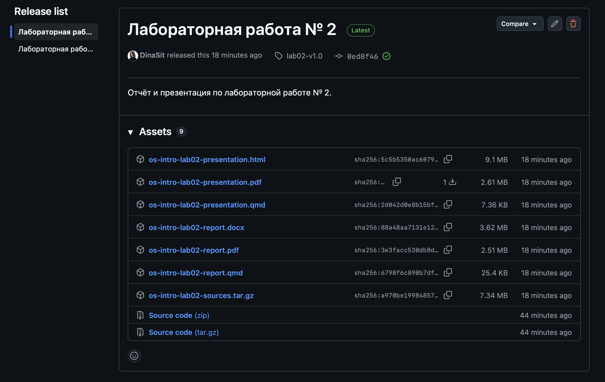

---
## Author
author:
  name: Ситникова Диана Александровна
  degrees: BSc
  email: 1032201746@rudn.ru
  affiliation:
    - name: Российский университет дружбы народов
      country: Российская Федерация
      postal-code: 117198
      city: Москва
      address: ул. Миклухо-Маклая, д. 6
## Title
title: "Лабораторная работа № 3"
subtitle: "Markdown"
license: CC BY
date: today
date-format: "YYYY-MM-DD"
header-includes:
  - \usepackage{tikz}
---

# Информация

## Докладчик

:::::::::::::: {.columns align=center}
::: {.column width="68%"}

- Ситникова Диана Александровна
- направление 09.03.03 «Прикладная информатика»
- Российский университет дружбы народов
- [1032201746@rudn.ru](mailto:1032201746@rudn.ru)

:::
::: {.column width="32%"}

{width=100%}

:::
::::::::::::::

# Вводная часть

## Актуальность

- Отчёты сдаются в PDF и DOCX, но хранить их в репозитории бессмысленно: двоичный файл нельзя сравнить построчно.
- Текстовая разметка версионируется наравне с кодом.
- Один источник избавляет от рассинхронизации форматов.
- Сборка автоматизируется, а значит воспроизводится на любой машине.

## Объект и предмет исследования

**Объект** --- легковесный язык разметки Markdown и его расширение QMD.

**Предмет** --- структура исходного текста отчёта, конвейер преобразования в PDF и DOCX и состав воспроизводимого комплекта материалов.

## Цели и задачи

**Цель** --- научиться оформлять отчёты с помощью легковесного языка разметки Markdown.

**Задачи:**

- подготовить отчёт по предыдущей работе в Markdown;
- сформировать версии отчёта в PDF и DOCX;
- собрать архив исходного текста, изображений и файлов сборки.

## Материалы и методы

| Компонент | Значение |
|---|---|
| Формат источника | QMD --- Markdown с YAML-заголовком |
| Конвейер | Quarto → Pandoc → LuaLaTeX / Word writer |
| Автоматизация | `Makefile`, цели `all` и `clean` |
| Публикация | GitHub Release |

# Содержание исследования

## Один источник разворачивается в два формата

\begin{center}
\resizebox{\linewidth}{!}{%
\begin{tikzpicture}[font=\scriptsize]
  \draw[thick] (0,1.0) rectangle (2.2,2.2);
  \node[align=center] at (1.1,1.6) {\texttt{.qmd}\\источник};
  \draw[thick] (3.0,1.0) rectangle (5.2,2.2);
  \node[align=center] at (4.1,1.6) {Quarto\\конфигурация};
  \draw[thick] (6.0,1.0) rectangle (8.2,2.2);
  \node[align=center] at (7.1,1.6) {Pandoc\\структура};
  \draw[thick] (9.0,1.8) rectangle (11.2,2.6);
  \node at (10.1,2.2) {PDF};
  \draw[thick] (9.0,0.6) rectangle (11.2,1.4);
  \node at (10.1,1.0) {DOCX};

  \draw[->,thick] (2.25,1.6) -- (2.95,1.6);
  \draw[->,thick] (5.25,1.6) -- (5.95,1.6);
  \draw[->,thick] (8.25,1.6) -- (8.95,2.2);
  \draw[->,thick] (8.25,1.6) -- (8.95,1.0);
\end{tikzpicture}%
}
\end{center}

Правка вносится один раз --- оба выходных формата пересобираются согласованно.

## Разметка хранит структуру, а не оформление

| Конструкция | Назначение |
|---|---|
| `#`, `##` | уровни заголовков |
| `-`, `1.` | маркированные и нумерованные списки |
| `` `код` ``, `~~~` | код в строке и блоком |
| `{#fig-001}` | рисунок с меткой для перекрёстной ссылки |

YAML-заголовок задаёт автора, название и библиографию; `_quarto.yml` --- общие параметры выходных форматов.

## Сборка автоматизирована и повторяема

:::::::::::::: {.columns align=center}
::: {.column width="42%"}

Цель `clean` удаляет прежний `_output`, цель `all` запускает `quarto render`.

Одной командой пересобираются и отчёт, и презентация.

:::
::: {.column width="58%"}

{width=100%}

:::
::::::::::::::

## Комплект материалов опубликован релизом

:::::::::::::: {.columns align=center}
::: {.column width="42%"}

Релиз `lab02-v1.0` связан с конкретным коммитом.

Исходный текст, изображения, библиография и `Makefile` упакованы отдельным архивом --- работу можно пересобрать с нуля.

:::
::: {.column width="58%"}

{width=100%}

:::
::::::::::::::

# Результаты

## Задание выполнено в воспроизводимой форме

- Отчёт по предыдущей работе оформлен в QMD.
- Из одного источника получены PDF и DOCX.
- Скриншоты связаны метками с соответствующими этапами.
- Полный комплект опубликован в GitHub Release.

## Отчёт --- это исходный код, а не документ

Пока отчёт хранится как текст, он подчиняется тем же правилам, что и программа: его можно сравнить, отревьюить и собрать одной командой.

Именно поэтому все последующие работы курса ведутся в QMD, а не в текстовом процессоре.
