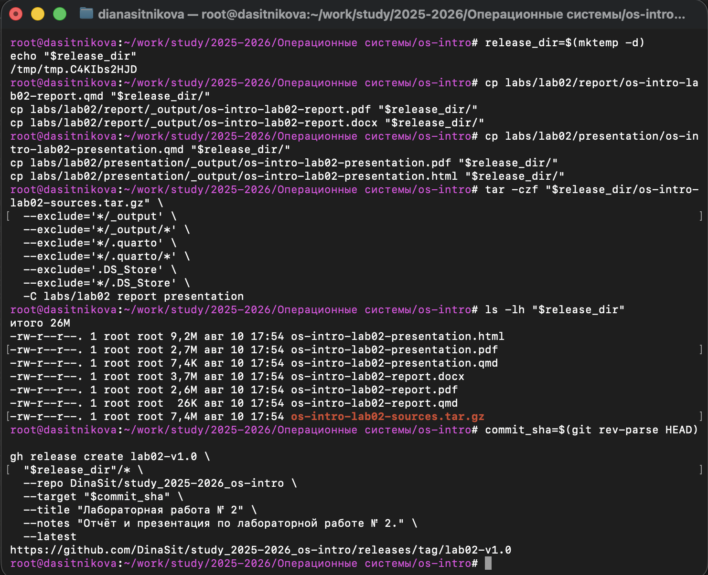

---
## Author
author:
  name: Ситникова Диана Александровна
  degrees: BSc
  email: 1032201746@rudn.ru
  affiliation:
    - name: Российский университет дружбы народов
      country: Российская Федерация
      postal-code: 117198
      city: Москва
      address: ул. Миклухо-Маклая, д. 6
## Title
title: "Лабораторная работа № 3"
subtitle: "Markdown"
license: CC BY
date: today
date-format: "YYYY-MM-DD"
---

# Введение

## Докладчик

:::::::::::::: {.columns align=center}
::: {.column width="68%"}

- Ситникова Диана Александровна
- направление 09.03.03 «Прикладная информатика»
- Российский университет дружбы народов
- [1032201746@rudn.ru](mailto:1032201746@rudn.ru)

:::
::: {.column width="32%"}

{width=100%}

:::
::::::::::::::

## Цель и задание работы

**Цель:** научиться оформлять отчёты с помощью легковесного языка разметки Markdown.

**Задание:**

- подготовить отчёт по предыдущей лабораторной работе в Markdown;
- сформировать версии отчёта в PDF и DOCX;
- подготовить архив исходного текста, изображений и файлов сборки.

# Теоретические сведения

## Markdown хранит структуру в обычном тексте

- Заголовки обозначаются символами `#`.
- Выделение задаётся символами `*` и `**`.
- Списки формируются маркерами `-` или числами.
- Ссылки и изображения задаются компактными конструкциями.
- Код, формулы и таблицы размещаются непосредственно в исходном тексте.

**Преимущество:** исходный файл читается и редактируется в любом текстовом редакторе.

## QMD объединяет Markdown и параметры документа

- YAML-заголовок содержит автора, название и библиографию.
- Основная часть оформляется средствами Markdown.
- Идентификаторы вида `fig-001` обеспечивают перекрёстные ссылки.
- `_quarto.yml` задаёт общие параметры итоговых форматов.

```markdown
{#fig-001 width=80%}
```

## Один источник преобразуется в несколько форматов

**Последовательность обработки:**

`QMD` → `Quarto` → `Pandoc` → `PDF / DOCX`

- Quarto читает конфигурацию проекта.
- Pandoc преобразует структуру документа.
- Для PDF используется LaTeX, для DOCX --- модуль записи Word.
- Makefile сохраняет повторяемую команду сборки.

## Отчёт должен отражать весь ход работы

- титульные данные;
- цель и формулировка задания;
- краткие теоретические сведения;
- последовательность выполненных действий;
- скриншоты и полученные результаты;
- выводы и список литературы.

Исходный текст, изображения, библиография, конфигурация и Makefile образуют воспроизводимый комплект.

# Выполнение работы

## Исходный отчёт подготовлен в QMD

:::::::::::::: {.columns align=center}
::: {.column width="34%"}

- Открыт отчёт по лабораторной работе № 2.
- Заполнены YAML-метаданные.
- Содержание разделено заголовками Markdown.
- Добавлены рисунки, команды и библиографические ссылки.

:::
::: {.column width="66%"}

{width=100%}

:::
::::::::::::::

## Makefile запускает воспроизводимую сборку

:::::::::::::: {.columns align=center}
::: {.column width="35%"}

- Цель `clean` удаляет предыдущий каталог `_output`.
- Цель `all` выполняет `quarto render`.
- Для отчёта формируются PDF и DOCX.
- Одновременно проверена сборка презентации.

:::
::: {.column width="65%"}

{width=100%}

:::
::::::::::::::

## Итоговые документы созданы успешно

:::::::::::::: {.columns align=center}
::: {.column width="30%"}

- LuaLaTeX завершил формирование PDF.
- Отчёт сохранён в PDF и DOCX.
- Презентация сохранена в PDF и HTML.
- Размеры файлов проверены командой `ls -lh`.

:::
::: {.column width="70%"}

{width=78%}

:::
::::::::::::::

## Для релиза подготовлен полный комплект

:::::::::::::: {.columns align=center}
::: {.column width="33%"}

- Временный каталог содержит семь файлов.
- Добавлены исходные QMD и итоговые документы.
- Текст, изображения и Makefile упакованы в TAR.GZ.
- Служебные каталоги и `.DS_Store` исключены.

:::
::: {.column width="67%"}

{width=84%}

:::
::::::::::::::

## Результаты опубликованы на GitHub

:::::::::::::: {.columns align=center}
::: {.column width="28%"}

- Создан релиз `lab02-v1.0`.
- Релиз связан с актуальным коммитом.
- Все требуемые форматы доступны отдельными файлами.
- GitHub добавил архивы исходного состояния репозитория.

:::
::: {.column width="72%"}

{width=100%}

:::
::::::::::::::

# Результаты

## Задание выполнено в воспроизводимой форме

- Отчёт по предыдущей лабораторной работе оформлен в QMD.
- Из одного источника получены версии PDF и DOCX.
- Скриншоты связаны с соответствующими этапами работы.
- Исходные материалы собраны в отдельный архив.
- Полный комплект опубликован в GitHub Release.

**Итог:** Markdown используется как единый редактируемый источник отчёта, а автоматизированная сборка обеспечивает согласованность всех выходных форматов.
