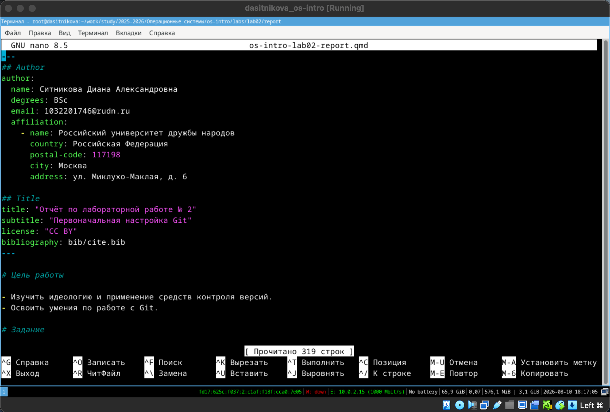
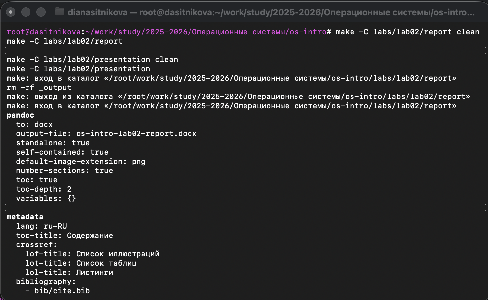
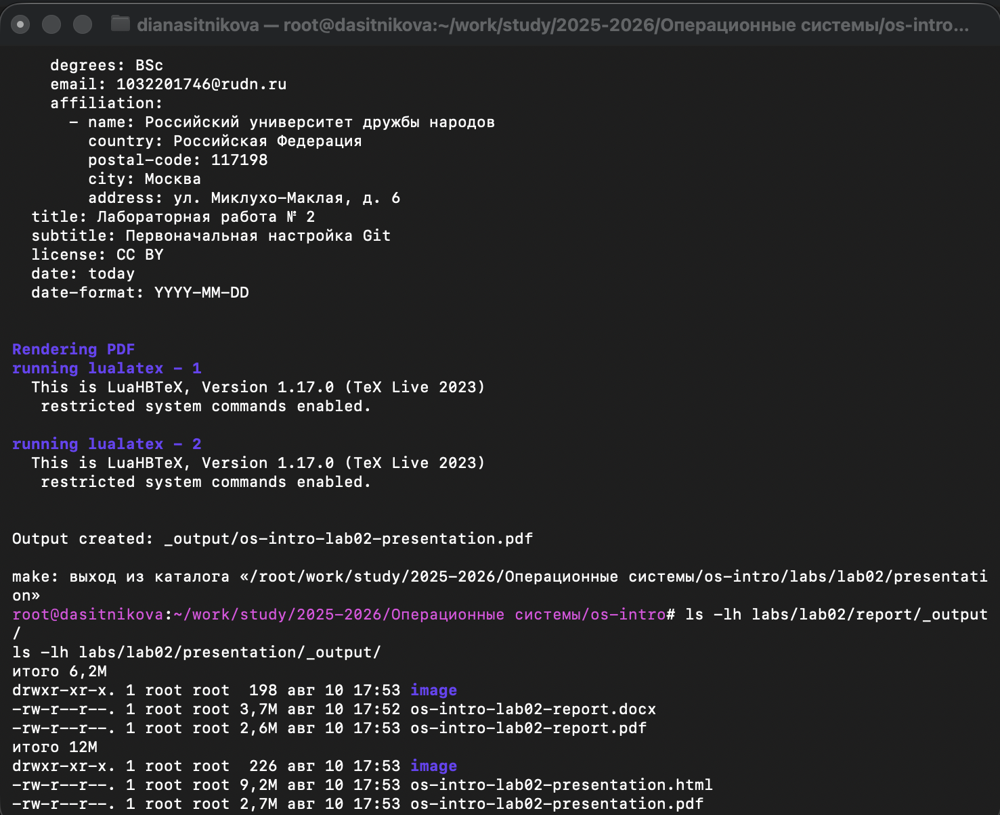

---
## Author
author:
  name: Ситникова Диана Александровна
  degrees: BSc
  email: 1032201746@rudn.ru
  affiliation:
    - name: Российский университет дружбы народов
      country: Российская Федерация
      postal-code: 117198
      city: Москва
      address: ул. Миклухо-Маклая, д. 6

## Title
title: "Отчёт по лабораторной работе № 3"
subtitle: "Markdown"
license: "CC BY"
bibliography: bib/cite.bib
---

# Цель работы

Научиться оформлять отчёты с помощью легковесного языка разметки Markdown.

# Задание

- Подготовить отчёт по предыдущей лабораторной работе в формате Markdown.
- Представить отчёт в форматах PDF, DOCX и Markdown.
- Подготовить архив исходных материалов, содержащий текст отчёта, скриншоты, Makefile и другие необходимые файлы.

# Краткие теоретические сведения

## Назначение и принципы Markdown

Markdown --- легковесный язык разметки, предназначенный для создания структурированных документов в виде обычного текста. В отличие от визуальных текстовых процессоров, автор отмечает не внешний вид элемента, а его смысловую роль: заголовок, абзац, список, ссылку, изображение или фрагмент кода. Конкретное оформление определяется уже при преобразовании исходного текста в PDF, DOCX, HTML или другой формат [@rudn_lab03; @gruber_markdown].

Основной принцип Markdown состоит в разделении содержания и представления. Исходный файл хранит текст и его логическую структуру, поэтому:

- документ можно читать и редактировать в любом текстовом редакторе;
- изменения удобно отслеживать средствами Git;
- один исходный текст можно преобразовывать в несколько форматов;
- разметка не зависит от конкретной версии офисного приложения;
- текст, команды, таблицы и иллюстрации находятся в едином воспроизводимом проекте.

Markdown не заменяет содержание отчёта и не определяет его научную структуру автоматически. Автор по-прежнему должен последовательно представить цель, задание, теоретические сведения, выполненные действия, результаты и выводы. Разметка предоставляет компактный способ обозначить эти элементы в исходном тексте.

## Базовый синтаксис Markdown

Структура документа задаётся заголовками. Заголовок первого уровня начинается с одного символа `#`, второго уровня --- с двух символов `##` и так далее. Уровни должны использоваться последовательно: подраздел не должен появляться раньше содержащего его раздела. Обычный текст оформляется абзацами, разделёнными пустой строкой.

Основные элементы синтаксиса представлены в @tbl-markdown.

| Элемент | Пример записи | Результат и назначение |
|---|---|---|
| Заголовок первого уровня | `# Раздел` | основной раздел документа |
| Заголовок второго уровня | `## Подраздел` | часть основного раздела |
| Полужирное выделение | `**важный текст**` | смысловое выделение ключевого понятия |
| Курсив | `*термин*` | обозначение термина или дополнительный акцент |
| Маркированный список | `- элемент` | перечисление равноправных пунктов |
| Нумерованный список | `1. действие` | последовательность действий |
| Цитата | `> текст цитаты` | визуальное отделение цитируемого фрагмента |
| Ссылка | `[название](адрес)` | переход к внешнему или внутреннему ресурсу |
| Изображение | `` | включение иллюстрации |
| Встроенный код | одинарные обратные кавычки | команда, имя файла или короткий фрагмент кода |
| Блок кода | тройные обратные кавычки | многострочная команда или листинг |
| Горизонтальная линия | `---` | смысловое разделение крупных блоков |

: Основные элементы синтаксиса Markdown {#tbl-markdown}

Маркированные списки применяются, когда порядок пунктов несущественен. Нумерованные списки используются для алгоритмов и последовательностей действий. Вложенность задаётся отступами. Для корректного преобразования сложных списков между ними и окружающими абзацами оставляются пустые строки.

Фрагменты команд необходимо отделять от обычного текста. Короткая команда, например `quarto render`, записывается как встроенный код. Несколько команд помещаются в ограждённый блок с указанием языка:

~~~markdown
```bash
make clean
make
```
~~~

Указание языка после открывающей последовательности позволяет средству преобразования применить синтаксическое выделение. Это особенно важно в техническом отчёте, где требуется визуально различать пояснение автора и команды терминала.

## Таблицы, формулы и специальные символы

Таблица Markdown состоит из строки заголовков, разделительной строки и строк данных. Вертикальные черты отделяют столбцы, а дефисы в разделительной строке обозначают структуру таблицы. Таблицы целесообразно использовать для сопоставимых сведений, например для перечня полученных файлов и их назначения.

~~~markdown
| Формат | Назначение |
|---|---|
| PDF | просмотр и представление отчёта |
| DOCX | редактирование в текстовом процессоре |
~~~

Расширенный Markdown поддерживает математические формулы. Внутритекстовая формула заключается в одиночные символы `$`, например `$a^2+b^2=c^2$`. Формула, размещаемая отдельным блоком, заключается в пары символов `$$`. Такой способ позволяет хранить математическую запись в читаемом текстовом виде [@quarto_markdown].

Если служебный символ Markdown требуется вывести буквально, перед ним ставится обратная косая черта. Экранирование предотвращает ошибочную интерпретацию символов `*`, `#`, `[` и других элементов разметки.

## Иллюстрации и перекрёстные ссылки

Изображение включается конструкцией ``. Подпись должна кратко объяснять, что именно подтверждает снимок экрана. Путь рекомендуется задавать относительно исходного Markdown-файла: это сохраняет работоспособность документа после переноса всего каталога проекта.

В используемом формате QMD рисунку можно назначить идентификатор и ширину:

~~~markdown
{#fig-001 width=90%}
~~~

Идентификатор `#fig-001` позволяет ссылаться на изображение из текста конструкцией `@fig-001`. Номер рисунка и подпись формируются автоматически. Если новый рисунок вставляется раньше существующих, номера и ссылки пересчитываются без ручного исправления [@quarto_figures].

Для отчёта важно размещать иллюстрацию после абзаца, в котором описано соответствующее действие. Скриншот не заменяет пояснение: текст должен назвать выполненную операцию, привести использованную команду и сформулировать полученный результат. Изображение служит подтверждением этого этапа.

## Библиографические ссылки

Markdown-документ может содержать ссылки на литературные и электронные источники. В проекте сведения об источниках хранятся в файле `bib/cite.bib`, а ссылка в тексте записывается в форме `[@идентификатор]`. Например, ссылка `[@gruber_markdown]` указывает на описание исходного синтаксиса Markdown.

Такой способ отделяет библиографические данные от основного текста. При сборке список литературы формируется автоматически, а номера ссылок согласуются с порядком цитирования. В отчёте использованы методические материалы лабораторной работы, описание синтаксиса Markdown и официальные руководства применяемых средств преобразования.

## Формат QMD и структура лабораторного отчёта

Файл `.qmd` является текстовым Markdown-документом с поддержкой расширений Quarto. Основная часть файла записывается обычным синтаксисом Markdown. В начале находится YAML-заголовок, ограниченный строками `---`. В нём указываются метаданные документа:

~~~yaml
---
title: "Отчёт по лабораторной работе № 3"
subtitle: "Markdown"
bibliography: bib/cite.bib
---
~~~

Таким образом, отличие QMD от обычного MD в рамках данной работы заключается прежде всего в наличии метаданных и расширений для автоматической нумерации, библиографии и нескольких выходных форматов. Сам текст отчёта, заголовки, списки, таблицы, ссылки, изображения и блоки кода оформляются средствами Markdown.

В соответствии с заданием отчёт должен содержать:

1. титульные данные с номером работы и сведениями об авторе;
2. цель работы и формулировку задания;
3. краткие теоретические сведения по Markdown;
4. последовательное описание выполнения работы;
5. скриншоты, подтверждающие выполненные действия;
6. результаты и выводы, согласованные с целью работы;
7. список использованных источников [@rudn_lab03].

## Получение итоговых форматов

После завершения разметки один исходный QMD-файл преобразуется в PDF и DOCX. Quarto читает параметры проекта и передаёт Markdown-документ Pandoc, который создаёт требуемое представление [@pandoc_manual]. Для автора отчёта основными остаются две операции:

~~~bash
quarto render
quarto render os-intro-lab03-report.qmd --to pdf
~~~

В проекте команда преобразования вызывается через Makefile. Цель `all` выполняет `quarto render`, а цель `clean` удаляет ранее созданный каталог `_output` [@gnu_make_manual]. Эти средства не изменяют содержание Markdown, а только воспроизводимо формируют итоговые файлы.

# Выполнение лабораторной работы

## Анализ исходных материалов

По условию лабораторной работы требовалось оформить средствами Markdown отчёт по предыдущей работе. В качестве содержательной основы выбран отчёт по лабораторной работе № 2 «Первоначальная настройка Git». Перед редактированием были определены обязательные части документа:

1. титульные данные;
2. цель и задание лабораторной работы № 2;
3. теоретические сведения о системе управления версиями Git;
4. последовательность выполненных действий и использованных команд;
5. иллюстрации, подтверждающие результаты;
6. выводы и список литературы.

Такое предварительное разделение позволило сразу представить содержание в виде иерархии заголовков Markdown, а не формировать внешний вид каждого абзаца вручную.

## Подготовка исходного QMD-файла

Исходный файл `os-intro-lab02-report.qmd` был открыт в текстовом редакторе GNU nano. Формат QMD выбран в соответствии со структурой учебного проекта: это текстовый файл Markdown, дополненный YAML-метаданными и средствами автоматической нумерации.

В YAML-заголовке были указаны:

- фамилия, имя и отчество автора;
- адрес электронной почты;
- образовательная организация;
- название и подзаголовок работы;
- лицензия;
- путь к библиографическому файлу `bib/cite.bib`.

Основная часть была разделена заголовками первого и второго уровней. На @fig-001 видны YAML-заголовок и начало структуры отчёта: разделы «Цель работы» и «Задание».

{#fig-001 width=90%}

## Применение элементов Markdown

При оформлении отчёта были использованы элементы разметки, перечисленные в @tbl-used-markdown.

| Элемент | Применение в отчёте |
|---|---|
| Заголовки `#`, `##`, `###` | формирование разделов и подразделов |
| Маркированные списки | перечисление целей, параметров и результатов |
| Нумерованные списки | описание последовательности действий |
| Встроенный код | команды, имена файлов и каталогов |
| Ограждённые блоки кода | многострочные последовательности команд |
| Таблицы | сопоставление файлов и их назначения |
| Изображения | подтверждение выполненных операций |
| Перекрёстные ссылки | ссылки из текста на рисунки и таблицы |
| Библиографические ссылки | связь утверждений со списком источников |

: Использованные средства Markdown {#tbl-used-markdown}

Команды терминала были отделены от поясняющего текста. Например, имя файла `os-intro-lab02-report.qmd` записано как встроенный код, а последовательности команд помещены в блоки с указанием языка `bash`. Это делает техническое описание однозначным и сохраняет команды в копируемом виде.

Каждый рисунок получил:

- относительный путь к файлу в каталоге `image`;
- содержательную подпись;
- уникальный идентификатор вида `fig-001`;
- ссылку из предшествующего абзаца.

Благодаря этому иллюстрации автоматически нумеруются, входят в список иллюстраций и остаются связанными с соответствующими этапами выполнения работы.

## Подготовка иллюстраций

Для отчёта использованы пять снимков экрана. Их назначение приведено в @tbl-screenshots.

| Файл | Подтверждаемый этап |
|---|---|
| `fig-001.png` | редактирование исходного QMD-файла в GNU nano |
| `fig-002.png` | запуск сборки отчёта и презентации |
| `fig-003.png` | успешное создание итоговых форматов |
| `fig-004.png` | подготовка файлов и архива исходных материалов |
| `fig-005.png` | публикация полного комплекта в GitHub Release |

: Назначение иллюстраций отчёта {#tbl-screenshots}

Файлы изображений были размещены рядом с исходным документом в каталоге `image`. В тексте использованы относительные пути, поэтому связь между QMD-файлом и рисунками сохраняется при переносе всего каталога или его включении в архив исходных материалов.

## Преобразование отчёта в PDF и DOCX

После завершения разметки была выполнена проверочная сборка. Сначала удалён каталог с предыдущими результатами, затем средствами Makefile запущено преобразование отчёта:

~~~bash
make -C labs/lab02/report clean
make -C labs/lab02/report
~~~

Дополнительно была собрана презентация по предыдущей лабораторной работе:

~~~bash
make -C labs/lab02/presentation clean
make -C labs/lab02/presentation
~~~

Команда `make -C` запускает цель Makefile в указанном каталоге. Цель `clean` удаляет старый каталог `_output`, поэтому проверяются именно новые результаты. Обычный вызов `make` выполняет `quarto render` и формирует форматы, перечисленные в конфигурации проекта.

На @fig-002 представлены начало сборки и параметры преобразования Markdown-документа в DOCX. В выводе отображаются имя итогового файла, включение оглавления, нумерации разделов, списка иллюстраций, списка таблиц и библиографии.

{#fig-002 width=95%}

## Проверка полученных результатов

Успешное завершение команды сборки ещё не гарантирует наличие всех требуемых форматов, поэтому содержимое каталогов `_output` было проверено отдельно:

~~~bash
ls -lh labs/lab02/report/_output/
ls -lh labs/lab02/presentation/_output/
~~~

В результате для отчёта были получены:

- `os-intro-lab02-report.pdf`;
- `os-intro-lab02-report.docx`.

Для презентации были сформированы:

- `os-intro-lab02-presentation.pdf`;
- `os-intro-lab02-presentation.html`.

На @fig-003 видны сообщение об успешном завершении LuaLaTeX, пути к созданному PDF и результаты команды `ls -lh`. Наличие файлов ненулевого размера подтверждает, что Markdown-документы были преобразованы в требуемые форматы.

{#fig-003 width=90%}

После сборки были проверены основные элементы оформления: заголовки и оглавление, нумерация разделов, отображение команд, подписи рисунков, перекрёстные ссылки и список литературы. Таким образом проверялась не только техническая возможность создать файл, но и сохранение структуры исходного Markdown-документа.

## Подготовка архива исходных материалов

Задание требует представить не только итоговые PDF и DOCX, но и исходные материалы. Для этого был создан временный каталог:

~~~bash
release_dir=$(mktemp -d)
~~~

В него были скопированы исходные QMD-файлы и сформированные документы отчёта и презентации. Каталоги `report` и `presentation` были упакованы в архив `os-intro-lab02-sources.tar.gz`. Из архива исключены:

- каталоги `_output`, содержащие воспроизводимые результаты сборки;
- служебные каталоги `.quarto`;
- системные файлы macOS `.DS_Store`.

Архив сохраняет исходный текст Markdown, изображения, библиографию, Makefile и конфигурацию, необходимые для повторного формирования документов.

Подготовленный комплект содержал семь пользовательских файлов:

1. отчёт в QMD;
2. отчёт в PDF;
3. отчёт в DOCX;
4. презентацию в QMD;
5. презентацию в PDF;
6. презентацию в HTML;
7. архив исходных материалов.

Команды формирования комплекта и создания релиза `lab02-v1.0` представлены на @fig-004.

{#fig-004 width=90%}

## Публикация подготовленных материалов

Релиз «Лабораторная работа № 2» был опубликован в репозитории GitHub с тегом `lab02-v1.0`. Тег связан с коммитом `0ed8f46`, содержащим использованную конфигурацию сборки. Каждый требуемый формат приложен отдельным файлом, поэтому отчёт можно открыть без распаковки общего архива.

GitHub дополнительно сформировал стандартные архивы исходного состояния репозитория в форматах ZIP и TAR.GZ. Эти автоматические архивы не заменяют подготовленный архив `os-intro-lab02-sources.tar.gz`, поскольку последний содержит специально отобранный комплект исходных материалов лабораторной работы.

Страница релиза и перечень приложенных файлов показаны на @fig-005.

{#fig-005 width=95%}

# Результаты

Результаты выполнения задания перечислены в @tbl-results.

| Файл | Назначение |
|---|---|
| `os-intro-lab02-report.qmd` | редактируемый исходный текст отчёта в формате Markdown |
| `os-intro-lab02-report.pdf` | итоговый отчёт для просмотра и представления |
| `os-intro-lab02-report.docx` | редактируемая версия отчёта для текстового процессора |
| `os-intro-lab02-sources.tar.gz` | архив исходного текста, изображений, конфигурации и Makefile |

: Основные материалы отчёта по лабораторной работе № 2 {#tbl-results}

Таким образом, отчёт по предыдущей лабораторной работе подготовлен на Markdown, преобразован в PDF и DOCX, а исходные материалы собраны в отдельный архив. Результаты опубликованы в релизе GitHub вместе с материалами презентации.

# Выводы

В ходе лабораторной работы были освоены основные элементы языка Markdown и принципы подготовки структурированного отчёта в формате QMD. Изучена роль YAML-метаданных, перекрёстных ссылок, иллюстраций и библиографической базы.

На основе единого исходного файла был оформлен отчёт по предыдущей лабораторной работе. С помощью Quarto, Pandoc и Makefile выполнена воспроизводимая сборка документов в форматах PDF и DOCX. Итоговые файлы проверены, исходные материалы упакованы в архив, а полный комплект опубликован в релизе GitHub.

# Список литературы{.unnumbered}

::: {#refs}
:::
