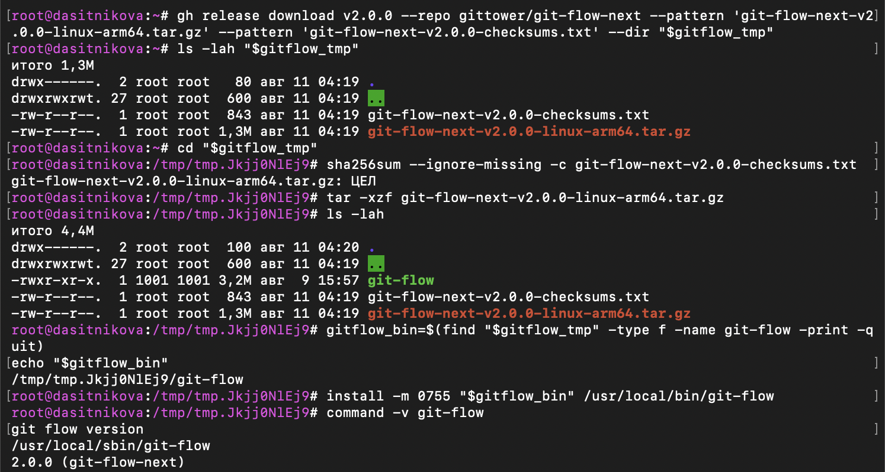
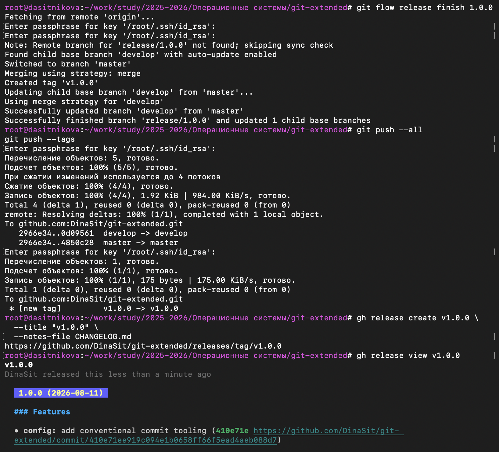
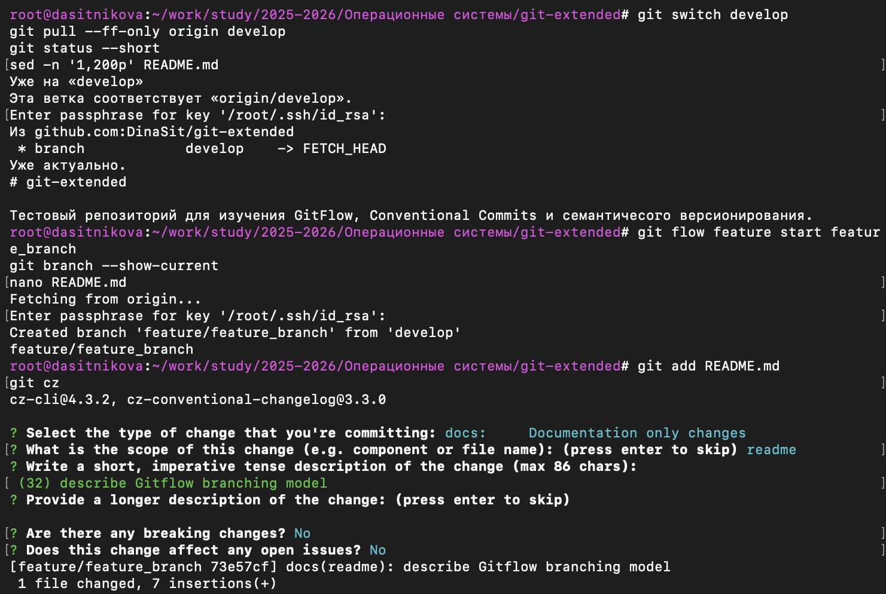

---
## Author
author:
  name: Ситникова Диана Александровна
  degrees: BSc
  email: 1032201746@rudn.ru
  affiliation:
    - name: Российский университет дружбы народов
      country: Российская Федерация
      postal-code: 117198
      city: Москва
      address: ул. Миклухо-Маклая, д. 6
## Title
title: "Лабораторная работа № 4"
subtitle: "Продвинутое использование Git"
license: CC BY
date: today
date-format: "YYYY-MM-DD"
---

# Введение

## Докладчик

:::::::::::::: {.columns align=center}
::: {.column width="68%"}

- Ситникова Диана Александровна
- направление 09.03.03 «Прикладная информатика»
- Российский университет дружбы народов
- [1032201746@rudn.ru](mailto:1032201746@rudn.ru)

:::
::: {.column width="32%"}

{width=100%}

:::
::::::::::::::

## Цель и задание работы

**Цель:** получение навыков правильной работы с репозиториями git.

**Задание:**

1. Выполнить работу для тестового репозитория.
2. Преобразовать рабочий репозиторий в репозиторий с git-flow и conventional commits.

# Организация репозитория

## Gitflow разделяет разработку и стабильные версии

- `master` хранит опубликованные состояния проекта.
- `develop` объединяет изменения следующего выпуска.
- `feature/*` изолирует отдельную задачу.
- `release/*` подготавливает версию, журнал и тег.
- завершение релиза обновляет `master` и `develop`.

**Цикл:** `feature` → `develop` → `release` → `master` + тег.

## Коммиты и версии становятся машиночитаемыми

**Conventional Commits** задаёт структуру сообщения:

```text
<type>(<scope>): <description>
```

- `feat` --- функциональность;
- `fix` --- исправление;
- `docs` --- документация;
- `chore` --- служебное изменение.

**SemVer:** `MAJOR.MINOR.PATCH` связывает номер выпуска с характером изменений.

# Подготовка инструментов

## Fedora ARM64 получила совместимый Gitflow

:::::::::::::: {.columns align=center}
::: {.column width="34%"}

- Установлены Node.js и pnpm.
- Настроен `PNPM_HOME`.
- Загружен архив для `linux-arm64`.
- SHA-256 подтвердил целостность.
- Установлен `git-flow-next 2.0.0`.

:::
::: {.column width="66%"}

{width=100%}

:::
::::::::::::::

## Тестовый репозиторий создан на GitHub

:::::::::::::: {.columns align=center}
::: {.column width="33%"}

- Создан каталог `git-extended`.
- Инициализирована ветка `master`.
- Подготовлен первый коммит.
- `gh repo create` создал публичный репозиторий.
- `origin` использует SSH.

:::
::: {.column width="67%"}

{width=88%}

:::
::::::::::::::

## Commitizen стандартизирует сообщения

- `pnpm init` создал `package.json` с версией `1.0.0`.
- `cz-conventional-changelog` добавлен как зависимость разработки.
- Команда `git cz` задаёт тип, область и описание.
- `node_modules` исключён из Git, а `pnpm-lock.yaml` сохранён.

```text
feat(config): add conventional commit tooling
docs(readme): describe Gitflow branching model
chore(site): update changelog
```

# Выполнение Gitflow

## Классический профиль создал ветку develop

:::::::::::::: {.columns align=center}
::: {.column width="34%"}

```bash
git flow init \
  --preset=classic \
  --main=master \
  --develop=develop \
  --tag=v
```

- `develop` создана автоматически.
- Для тегов задан префикс `v`.

:::
::: {.column width="66%"}

{width=100%}

:::
::::::::::::::

## Первый выпуск опубликован как v1.0.0

:::::::::::::: {.columns align=center}
::: {.column width="31%"}

- Создана `release/1.0.0`.
- Сформирован первый `CHANGELOG.md`.
- Релиз объединён с `master`.
- `develop` автоматически обновлена.
- Тег и GitHub Release опубликованы.

:::
::: {.column width="69%"}

{width=72%}

:::
::::::::::::::

## Изменение выполнено в feature-ветви

:::::::::::::: {.columns align=center}
::: {.column width="32%"}

- Ветка создана от `develop`.
- В README описана модель Gitflow.
- Commitizen сформировал сообщение `docs(readme)`.
- Готовое изменение возвращено в `develop`.

:::
::: {.column width="68%"}

{width=92%}

:::
::::::::::::::

## Второй выпуск зафиксировал версию 1.2.3

:::::::::::::: {.columns align=center}
::: {.column width="30%"}

- Обновлено поле `version`.
- Дополнен `CHANGELOG.md`.
- Создан тег `v1.2.3`.
- Обновлены `master` и `develop`.
- GitHub Release опубликован из терминала.

:::
::: {.column width="70%"}

{width=70%}

:::
::::::::::::::

# Результаты

## Основные источники

- Методические материалы лабораторной работы № 4.
- [Документация Git](https://git-scm.com/docs).
- [Документация git-flow-next](https://git-flow.sh/docs/commands/).
- [Semantic Versioning 2.0.0](https://semver.org/).
- [Conventional Commits 1.0.0](https://www.conventionalcommits.org/en/v1.0.0/).
- [GitHub Releases](https://docs.github.com/en/repositories/releasing-projects-on-github/about-releases).

## Репозиторий получил воспроизводимый цикл выпуска

- `master` содержит стабильные версии.
- `develop` остаётся основной ветвью разработки.
- Временные ветви завершаются после интеграции.
- Коммиты имеют единый формат Conventional Commits.
- Версии `v1.0.0` и `v1.2.3` закреплены тегами.
- Оба тега представлены отдельными GitHub Releases.

**Итог:** изменение проходит контролируемый путь от feature-ветви до опубликованной версии.
