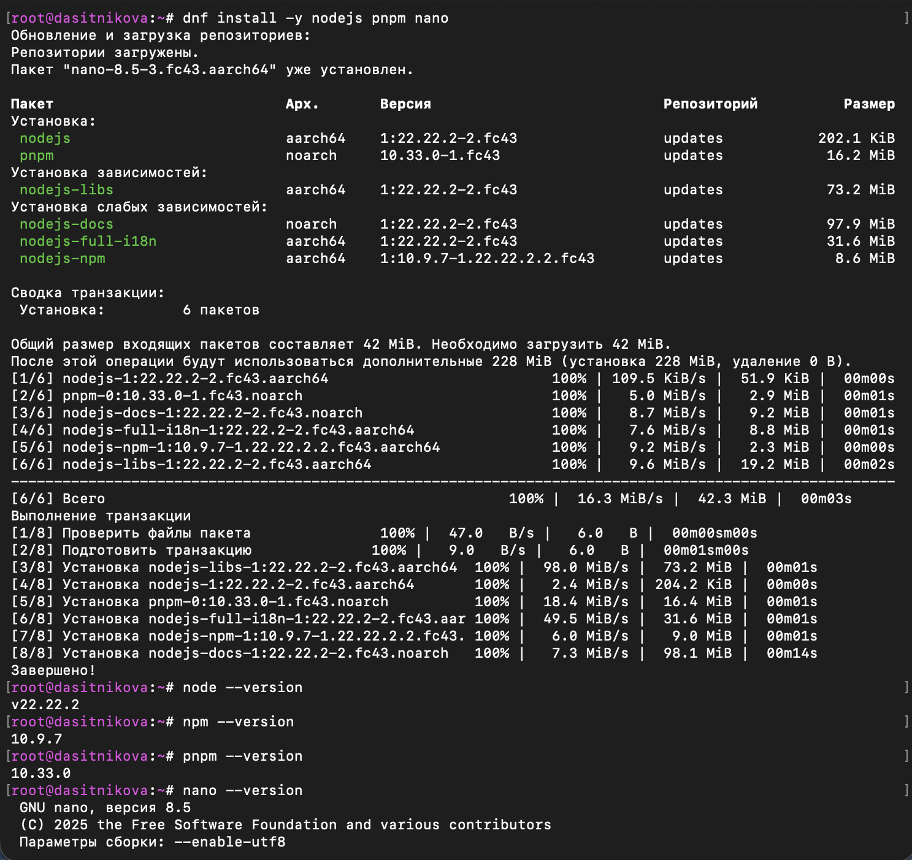
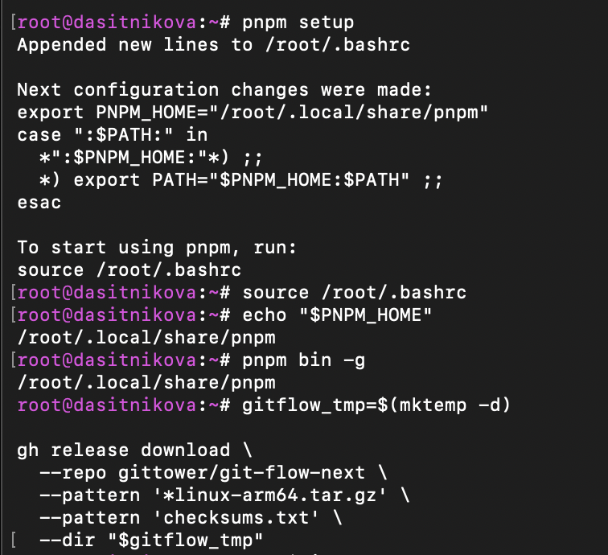
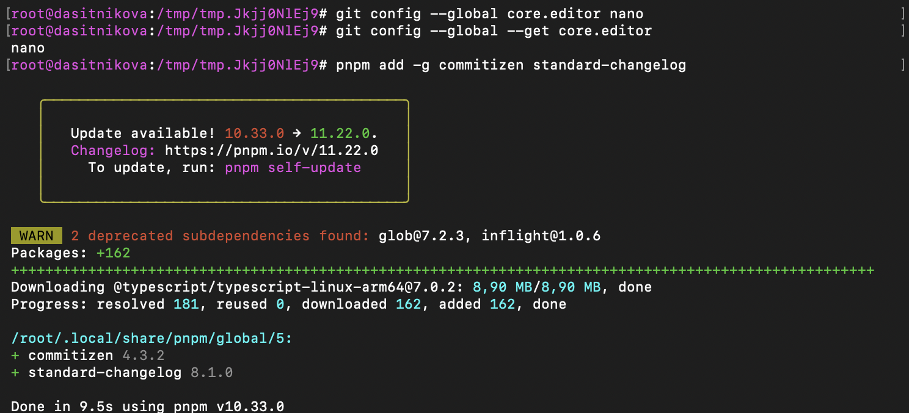
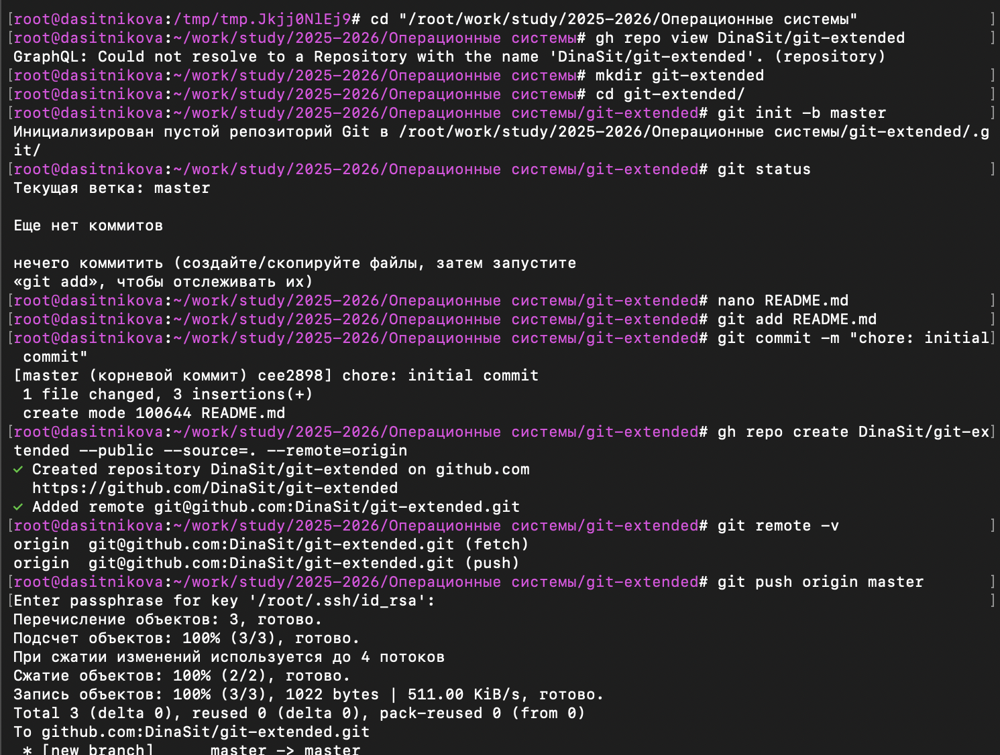
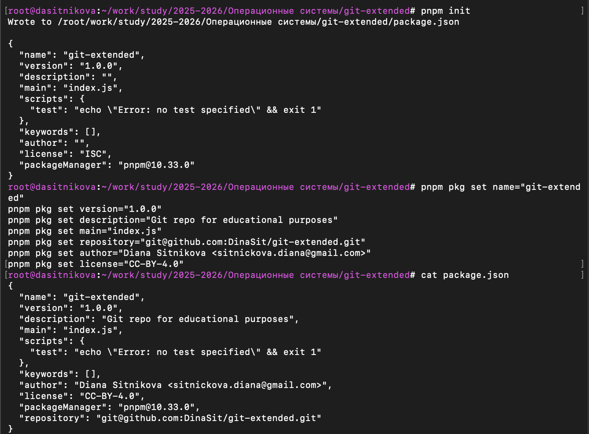
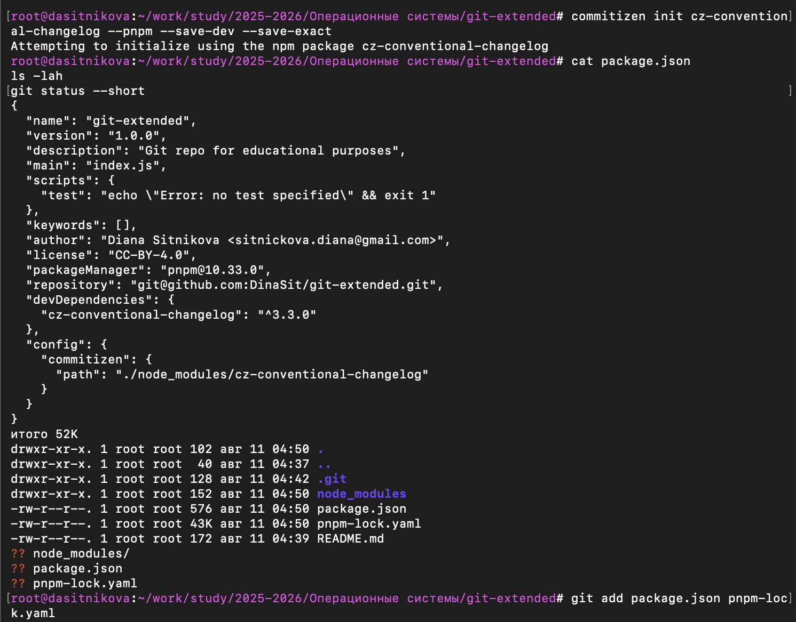
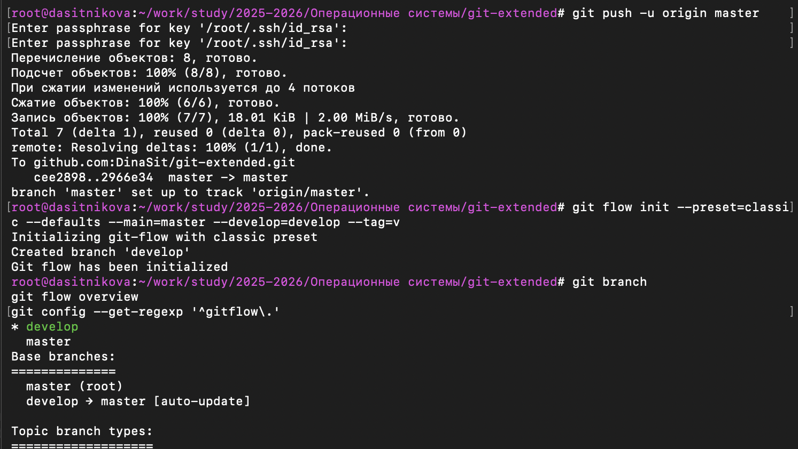
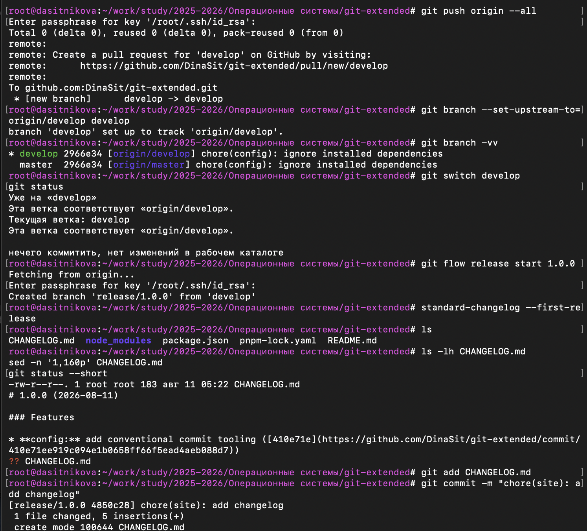
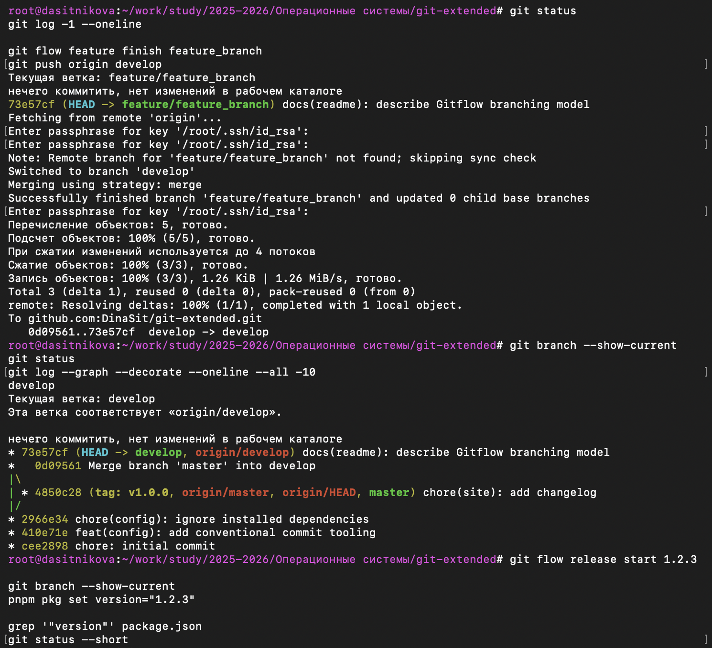
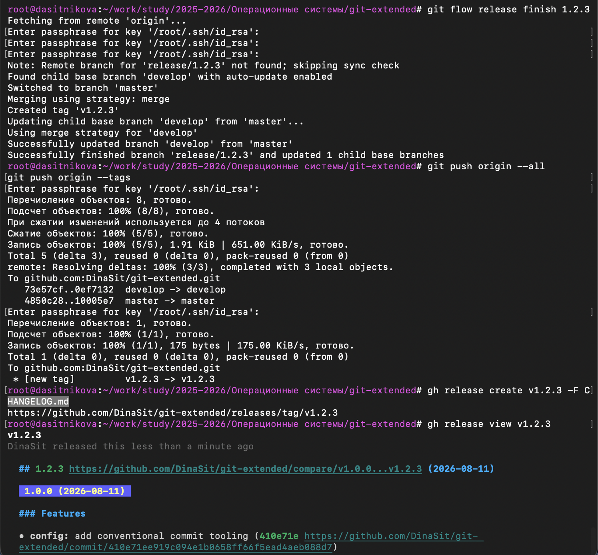

---
## Author
author:
  name: Ситникова Диана Александровна
  degrees: BSc
  email: 1032201746@rudn.ru
  affiliation:
    - name: Российский университет дружбы народов
      country: Российская Федерация
      postal-code: 117198
      city: Москва
      address: ул. Миклухо-Маклая, д. 6

## Title
title: "Отчёт по лабораторной работе № 4"
subtitle: "Продвинутое использование Git"
license: "CC BY"
bibliography: bib/cite.bib
---

# Цель работы

Получение навыков правильной работы с репозиториями git.

# Задание

1. Выполнить работу для тестового репозитория.
2. Преобразовать рабочий репозиторий в репозиторий с git-flow и conventional commits.

# Краткие теоретические сведения

## Назначение ветвления в Git

Git представляет историю проекта в виде ориентированного графа коммитов. Каждый коммит содержит снимок состояния отслеживаемых файлов, метаданные автора и ссылки на один или несколько родительских коммитов. Ветвь является перемещаемым именованным указателем на вершину одной линии истории. Создание ветви не копирует файлы проекта, поэтому изолированная линия разработки появляется практически мгновенно [@chacon_straub_progit].

Ветвление решает несколько связанных задач:

- изолирует незавершённые изменения от стабильной версии;
- позволяет параллельно выполнять несколько задач;
- отделяет разработку функций от подготовки выпуска;
- формирует понятные точки интеграции;
- упрощает проверку и откат изменений;
- сохраняет происхождение изменений в истории проекта.

Команда `git branch` создаёт и перечисляет ветви, `git switch` изменяет текущую ветвь, а `git merge` объединяет линии истории. Долгоживущие ветви могут отражать разные уровни стабильности: например, в `master` хранится готовое к выпуску состояние, а в `develop` интегрируются изменения для следующей версии [@git_branching_workflows].

## Модель ветвления Gitflow

Gitflow --- организационная модель, в которой назначение ветви определяется её типом. Вместо неформального набора ветвей используются две постоянные ветви и несколько классов временных ветвей. Модель подходит для проекта, в котором версии подготавливаются и публикуются отдельными циклами [@rudn_lab04; @gitflow_next_docs].

Постоянными являются ветви `master` и `develop`:

- `master` содержит состояния, соответствующие опубликованным версиям;
- `develop` объединяет изменения, запланированные для следующего выпуска.

Временные ветви создаются для конкретной работы и после интеграции удаляются. Их назначение представлено в @tbl-gitflow-branches.

| Тип ветви | Базовая ветвь | Назначение | Результат завершения |
|---|---|---|---|
| `feature/*` | `develop` | разработка отдельной функции или логически завершённого изменения | слияние в `develop` |
| `release/*` | `develop` | стабилизация версии, обновление номера и журнала изменений | слияние в `master` и `develop`, создание тега |
| `hotfix/*` | `master` | срочное исправление опубликованной версии | слияние в `master` и `develop`, создание тега |

: Назначение ветвей в классической модели Gitflow {#tbl-gitflow-branches}

Операции высокого уровня выполняются командами `git flow`. Например, команда `git flow feature start task` создаёт ветвь `feature/task` от `develop` и переключает рабочую копию на неё. Команда `git flow feature finish task` объединяет готовое изменение с `develop` и завершает временную ветвь. Аналогично пара команд `git flow release start` и `git flow release finish` управляет подготовкой выпуска.

В работе использована современная реализация `git-flow-next`, совместимая с классическим интерфейсом `git flow`. Она поддерживает готовый профиль `classic`, явное назначение основных ветвей и префикса тегов [@gitflow_next_docs]. Конфигурация задаётся один раз и сохраняется в локальных параметрах репозитория.

## Жизненный цикл изменения в Gitflow

Последовательность работы с новой функцией имеет следующий вид:

1. ветвь `develop` синхронизируется с удалённым репозиторием;
2. от `develop` создаётся ветвь `feature/*`;
3. в рабочей ветви выполняются и фиксируются изменения;
4. готовая ветвь объединяется с `develop`;
5. для подготовки версии от `develop` создаётся `release/*`;
6. в release-ветви обновляются версия и журнал изменений;
7. завершение release-ветви переносит результат в `master` и обратно в `develop`;
8. состояние в `master` помечается тегом версии;
9. ветви и теги отправляются на сервер, после чего создаётся GitHub Release.

Такое разделение делает явными три состояния: выполняемая задача, интегрируемая разработка и опубликованный выпуск. Коммиты не теряются при переходе между состояниями, а тег позволяет однозначно восстановить содержимое конкретной версии.

## Семантическое версионирование

Semantic Versioning, или SemVer, задаёт формат версии `MAJOR.MINOR.PATCH`. Три числовых компонента передают характер изменений между выпусками [@semver_spec].

| Компонент | Когда увеличивается | Пример |
|---|---|---|
| `MAJOR` | внесены обратно несовместимые изменения публичного интерфейса | `1.4.2` → `2.0.0` |
| `MINOR` | добавлена обратно совместимая функциональность | `1.4.2` → `1.5.0` |
| `PATCH` | выполнено обратно совместимое исправление ошибки | `1.4.2` → `1.4.3` |

: Интерпретация компонентов семантической версии {#tbl-semver}

Версия `1.0.0` обозначает первый стабильный публичный интерфейс. Версии с нулевым старшим компонентом, например `0.3.0`, относятся к этапу начальной разработки. После выпуска содержимое опубликованной версии не изменяется: новые исправления оформляются новым номером.

Стандарт допускает дополнительные обозначения:

- предварительная версия: `1.2.3-alpha.1`;
- метаданные сборки: `1.2.3+build.45`;
- сочетание: `1.2.3-rc.1+20260811`.

В учебном сценарии номера `1.0.0` и `1.2.3` заданы последовательностью задания. Они используются для освоения механизма release-ветвей, тегов и публикации версий. В рабочем проекте выбор следующего номера должен дополнительно отражать фактическую совместимость изменений.

## Теги Git и опубликованные версии

Ветвь продолжает перемещаться при появлении новых коммитов, тогда как тег предназначен для постоянной ссылки на определённый коммит. Поэтому релиз в Gitflow завершается созданием тега, например `v1.0.0`. Префикс `v` визуально отличает имя версии от имени ветви или числового идентификатора.

Аннотированный или созданный средствами Gitflow тег связывает номер версии с точным состоянием истории. Пользователь может просмотреть список тегов, извлечь состояние проекта на момент выпуска и сравнить две версии. Отправка обычных ветвей не отправляет теги автоматически, поэтому после `git push --all` отдельно выполняется `git push --tags`.

GitHub Release является объектом публикации, основанным на теге. Он добавляет к зафиксированному состоянию название, описание выпуска и прикреплённые файлы. GitHub также автоматически предоставляет архивы исходного состояния репозитория в ZIP и TAR.GZ [@github_releases_docs]. Следовательно, тег относится к истории Git, а Release --- к представлению и распространению конкретной версии на GitHub.

## Соглашение Conventional Commits

Conventional Commits задаёт машиночитаемую структуру сообщения коммита. Базовая форма имеет вид [@conventional_commits]:

~~~text
<type>[optional scope]: <description>

[optional body]

[optional footer(s)]
~~~

Поле `type` определяет назначение изменения, `scope` уточняет затронутую область, а краткое описание формулируется в повелительном наклонении. Примеры:

~~~text
feat(config): add conventional commit tooling
docs(readme): describe Gitflow branching model
chore(site): update changelog
~~~

Часто используемые типы приведены в @tbl-commit-types.

| Тип | Назначение |
|---|---|
| `feat` | новая функциональность |
| `fix` | исправление ошибки |
| `docs` | изменение документации |
| `refactor` | изменение структуры без новой функции и исправления ошибки |
| `perf` | повышение производительности |
| `test` | добавление или исправление тестов |
| `build` | изменение системы сборки или зависимостей |
| `ci` | изменение конфигурации непрерывной интеграции |
| `chore` | служебное изменение, не относящееся к исходной функциональности |

: Основные типы Conventional Commits {#tbl-commit-types}

Несовместимое изменение обозначается восклицательным знаком после типа или области либо разделом `BREAKING CHANGE:` в нижней части сообщения. Соглашение связано с SemVer: `fix` обычно соответствует изменению `PATCH`, `feat` --- `MINOR`, а breaking change --- `MAJOR`. Эта связь позволяет автоматически анализировать историю и подготавливать выпуск.

## Commitizen и адаптер сообщений

Commitizen предоставляет интерактивный интерфейс создания коммита. Вместо ручного составления строки пользователь выполняет `git cz` и последовательно выбирает тип, область, краткое и расширенное описание, наличие несовместимых изменений и ссылки на задачи. Адаптер преобразует ответы в согласованное сообщение [@commitizen_docs].

Адаптер `cz-conventional-changelog` добавляется в `devDependencies` и регистрируется в разделе `config.commitizen` файла `package.json`. Файл `pnpm-lock.yaml` фиксирует точные версии дерева зависимостей. Каталог `node_modules`, напротив, содержит локально установленные копии пакетов и не должен включаться в Git, поскольку восстанавливается по декларации зависимостей и lock-файлу.

Применение Commitizen не отменяет смысловую проверку сообщения. Пользователь по-прежнему должен корректно выбрать тип и область. Интерактивная форма уменьшает количество синтаксических ошибок и делает сообщения разных участников единообразными.

## Автоматическое формирование CHANGELOG

`CHANGELOG.md` содержит сведения об изменениях между опубликованными версиями. Утилита `standard-changelog` анализирует историю после последнего семантического тега и формирует разделы для функций, исправлений, улучшений производительности и несовместимых изменений [@standard_changelog_docs].

Для первого выпуска используется команда:

~~~bash
standard-changelog --first-release
~~~

Для последующих выпусков достаточно:

~~~bash
standard-changelog
~~~

Машиночитаемые сообщения коммитов служат источником данных, SemVer определяет границы выпусков, а `CHANGELOG.md` представляет результат человеку. Коммиты типа `docs` могут отсутствовать в стандартных разделах генератора, поскольку предустановленная схема ориентирована прежде всего на `feat`, `fix`, `perf` и breaking changes. При этом документационный коммит сохраняется в истории Git и остаётся доступным при сравнении тегов.

## Node.js и pnpm в инструментальной цепочке

Commitizen и `standard-changelog` распространяются как пакеты экосистемы Node.js. Node.js предоставляет среду выполнения, а pnpm устанавливает глобальные инструменты и зависимости проекта. Команда `pnpm setup` создаёт каталог для глобальных исполняемых файлов и добавляет `PNPM_HOME` в `PATH` через конфигурацию оболочки [@pnpm_setup_docs].

Файл `package.json` в данной работе выполняет сразу несколько функций:

- идентифицирует проект;
- хранит номер версии;
- содержит описание, автора, лицензию и адрес репозитория;
- перечисляет зависимости для разработки;
- указывает адаптер Commitizen.

Команда `pnpm pkg set` изменяет конкретное поле JSON без ручного нарушения синтаксиса. Команда `pnpm init` формирует начальную структуру файла, после чего метаданные уточняются в соответствии с проектом.

## Проверка целостности устанавливаемого инструмента

Виртуальная машина использует Fedora 43 на архитектуре `aarch64`. Поэтому для `git-flow-next` выбран архив `linux-arm64`. Вместе с архивом загружен файл контрольных сумм, после чего выполнена проверка SHA-256.

Криптографическая контрольная сумма позволяет обнаружить повреждение или подмену загруженного файла. Совпадение вычисленного значения с опубликованным подтверждает целостность архива относительно файла контрольных сумм. После проверки исполняемый файл устанавливается в каталог из `PATH`, а команда `git flow version` подтверждает доступность нужной реализации.

## Связь используемых инструментов

Воспроизводимый выпуск формируется не одной программой, а согласованной цепочкой, представленной в @tbl-toolchain.

| Инструмент | Роль в работе | Получаемый результат |
|---|---|---|
| Git | хранение истории, ветвление и слияние | коммиты и ветви |
| git-flow-next | операции высокого уровня над моделью Gitflow | `feature/*`, `release/*`, теги |
| Node.js | среда выполнения JavaScript-инструментов | запуск Commitizen и генератора журнала |
| pnpm | управление пакетами и метаданными проекта | `package.json`, `pnpm-lock.yaml`, зависимости |
| Commitizen | интерактивное создание сообщений | Conventional Commits |
| standard-changelog | анализ истории выпусков | `CHANGELOG.md` |
| GitHub CLI | создание репозитория и Release из терминала | удалённый репозиторий и публикации |

: Инструментальная цепочка подготовки выпуска {#tbl-toolchain}

# Выполнение лабораторной работы

## Подготовка среды Fedora

Работа выполнена в виртуальной машине Fedora 43 с архитектурой `aarch64`. Сначала установлены Node.js, pnpm и текстовый редактор GNU nano:

~~~bash
dnf install -y nodejs pnpm nano
~~~

После установки проверены версии программ:

~~~bash
node --version
npm --version
pnpm --version
nano --version
~~~

Система установила Node.js 22.22.2, npm 10.9.7 и pnpm 10.33.0; редактор GNU nano версии 8.5 уже был доступен. Вывод команды подтверждает завершение транзакции DNF и наличие всех базовых компонентов (@fig-001).

{#fig-001 width=95%}

## Настройка каталога глобальных программ pnpm

Для глобально устанавливаемых программ pnpm выполнена команда:

~~~bash
pnpm setup
source /root/.bashrc
~~~

Команда добавила в `/root/.bashrc` определение переменной `PNPM_HOME` и включение соответствующего каталога в `PATH`. После повторной загрузки конфигурации оболочки значения проверены командами:

~~~bash
echo "$PNPM_HOME"
pnpm bin -g
~~~

Обе команды указали каталог `/root/.local/share/pnpm`, что подтверждает готовность глобальных исполняемых файлов к запуску. Начало подготовки временного каталога для загрузки Gitflow также показано на @fig-002.

{#fig-002 width=70%}

## Установка git-flow-next для архитектуры ARM64

Пакет `gitflow` из устаревшей инструкции отсутствовал в стандартных репозиториях актуальной Fedora. Для сохранения требуемого интерфейса `git flow` использована современная реализация `git-flow-next` версии 2.0.0, поддерживающая классическую модель Gitflow.

Сначала создан временный каталог, затем средствами GitHub CLI загружены архив для Linux ARM64 и файл контрольных сумм:

~~~bash
gitflow_tmp=$(mktemp -d)

gh release download v2.0.0 \
  --repo gittower/git-flow-next \
  --pattern 'git-flow-next-v2.0.0-linux-arm64.tar.gz' \
  --pattern 'git-flow-next-v2.0.0-checksums.txt' \
  --dir "$gitflow_tmp"
~~~

Целостность архива проверена по SHA-256, после чего архив распакован, а исполняемый файл установлен:

~~~bash
cd "$gitflow_tmp"
sha256sum --ignore-missing -c git-flow-next-v2.0.0-checksums.txt
tar -xzf git-flow-next-v2.0.0-linux-arm64.tar.gz
gitflow_bin=$(find "$gitflow_tmp" -type f -name git-flow -print -quit)
install -m 0755 "$gitflow_bin" /usr/local/bin/git-flow
git flow version
~~~

Проверка завершилась сообщением `ЦЕЛ`, а команда версии вывела `2.0.0 (git-flow-next)` (@fig-003). Следовательно, выбранный архив соответствует опубликованной контрольной сумме и подходит архитектуре виртуальной машины.

{#fig-003 width=92%}

## Установка Commitizen и генератора журнала изменений

В качестве глобального редактора Git выбран GNU nano:

~~~bash
git config --global core.editor nano
git config --global --get core.editor
~~~

Затем установлены инструменты Commitizen и `standard-changelog`:

~~~bash
pnpm add -g commitizen standard-changelog
~~~

pnpm установил Commitizen 4.3.2 и `standard-changelog` 8.1.0. На @fig-004 также виден вывод об успешно добавленных пакетах. Предупреждение о доступной новой версии pnpm не влияет на установленный набор и не препятствует выполнению задания.

{#fig-004 width=94%}

## Создание тестового репозитория

Тестовый проект размещён отдельно от репозитория учебного курса:

~~~text
/root/work/study/2025-2026/Операционные системы/git-extended
~~~

Был создан каталог, инициализирована ветка `master`, подготовлен `README.md` и сформирован первый коммит:

~~~bash
mkdir git-extended
cd git-extended
git init -b master
nano README.md
git add README.md
git commit -m "chore: initial commit"
~~~

После этого GitHub CLI создал публичный репозиторий и автоматически добавил удалённый адрес `origin`:

~~~bash
gh repo create DinaSit/git-extended --public --source=. --remote=origin
git remote -v
git push origin master
~~~

На @fig-005 показаны инициализация локального репозитория, первый коммит, создание `DinaSit/git-extended` на GitHub и успешная отправка ветки `master`.

{#fig-005 width=92%}

## Инициализация package.json

Для хранения версии и конфигурации инструментов выполнена команда:

~~~bash
pnpm init
~~~

После создания начального `package.json` его поля заполнены командами `pnpm pkg set`:

~~~bash
pnpm pkg set name="git-extended"
pnpm pkg set version="1.0.0"
pnpm pkg set description="Git repo for educational purposes"
pnpm pkg set main="index.js"
pnpm pkg set repository="git@github.com:DinaSit/git-extended.git"
pnpm pkg set author="Diana Sitnikova <sitnickova.diana@gmail.com>"
pnpm pkg set license="CC-BY-4.0"
~~~

Сформированный файл содержит имя проекта, начальную версию `1.0.0`, описание, автора, лицензию, адрес репозитория и версию пакетного менеджера. Результат показан на @fig-006.

{#fig-006 width=90%}

## Подключение адаптера Commitizen

Для создания сообщений в формате Conventional Commits к проекту подключён адаптер:

~~~bash
commitizen init cz-conventional-changelog \
  --pnpm --save-dev --save-exact
~~~

Команда добавила пакет `cz-conventional-changelog` в `devDependencies`, создала `pnpm-lock.yaml` и записала путь адаптера в `config.commitizen`. После установки каталог `node_modules` появился как локальный неотслеживаемый каталог (@fig-007).

{#fig-007 width=90%}

Каталог зависимостей исключён из истории с помощью `.gitignore`, а конфигурационные файлы добавлены в коммит. Для фиксации применён интерактивный интерфейс `git cz`. В результате история получила сообщения:

~~~text
feat(config): add conventional commit tooling
chore(config): ignore installed dependencies
~~~

Первое сообщение обозначает добавление инструментария соглашений, второе --- служебную настройку исключения локальных зависимостей.

## Инициализация классического Gitflow

После отправки подготовленной ветки `master` модель Gitflow инициализирована командой:

~~~bash
git push -u origin master

git flow init \
  --preset=classic \
  --defaults \
  --main=master \
  --develop=develop \
  --tag=v
~~~

Параметр `--preset=classic` выбирает классическую модель, `--main=master` и `--develop=develop` задают постоянные ветви, а `--tag=v` определяет префикс тегов. Команда создала `develop` и переключила рабочую копию на неё. Вывод `git flow overview` подтвердил, что `master` является корневой стабильной ветвью, а `develop` автоматически обновляется при завершении релизов (@fig-008).

{#fig-008 width=92%}

## Публикация ветки develop

После инициализации обе постоянные ветви отправлены на GitHub:

~~~bash
git push origin --all
git branch --set-upstream-to=origin/develop develop
git branch -vv
~~~

Удалённая ветвь `develop` была создана и связана с локальной. Связь upstream позволяет выполнять `git pull` и `git push` без повторного указания имени удалённой ветви. Команда `git branch -vv` подтвердила отслеживание `origin/develop` и `origin/master`.

## Подготовка первого релиза 1.0.0

Первая release-ветвь создана от `develop`:

~~~bash
git flow release start 1.0.0
standard-changelog --first-release
~~~

Команда `standard-changelog --first-release` сформировала новый `CHANGELOG.md`. В журнал вошёл коммит типа `feat`, добавляющий инструментарий Conventional Commits. Файл проверен и зафиксирован:

~~~bash
git add CHANGELOG.md
git commit -m "chore(site): add changelog"
~~~

На @fig-009 представлены публикация `develop`, настройка upstream, создание `release/1.0.0`, формирование журнала и добавление `CHANGELOG.md` в коммит.

{#fig-009 width=88%}

## Завершение и публикация релиза 1.0.0

Подготовленная ветвь завершена средствами Gitflow:

~~~bash
git flow release finish 1.0.0
git push --all
git push --tags
~~~

Gitflow выполнил следующие операции:

1. переключился на `master`;
2. объединил изменения release-ветви с `master`;
3. создал тег `v1.0.0`;
4. обновил `develop` из `master`;
5. завершил временную ветвь `release/1.0.0`.

После отправки ветвей и тега создан GitHub Release:

~~~bash
gh release create v1.0.0 \
  --title "v1.0.0" \
  --notes-file CHANGELOG.md

gh release view v1.0.0
~~~

На @fig-010 видны успешное завершение release-ветви, публикация тега и сформированное описание выпуска. Раздел `Features` содержит ссылку на коммит `feat(config)`.

{#fig-010 width=88%}

## Создание и выполнение feature-ветви

Для отработки отдельной линии разработки ветвь `develop` синхронизирована с удалённым репозиторием:

~~~bash
git switch develop
git pull --ff-only origin develop
git status --short
~~~

Затем создана ветвь `feature/feature_branch`:

~~~bash
git flow feature start feature_branch
~~~

В `README.md` добавлено описание принятой модели ветвления. Изменение документации зафиксировано через Commitizen:

~~~bash
git add README.md
git cz
~~~

В интерактивной форме выбран тип `docs`, область `readme` и описание `describe Gitflow branching model`. Сформированное сообщение соответствует назначению изменения:

~~~text
docs(readme): describe Gitflow branching model
~~~

Создание feature-ветви и результат интерактивного коммита представлены на @fig-011.

{#fig-011 width=92%}

## Завершение feature-ветви

Перед объединением проверены состояние рабочей копии и последний коммит. Ветвь завершена и результат отправлен в `develop`:

~~~bash
git status
git log -1 --oneline
git flow feature finish feature_branch
git push origin develop
~~~

Gitflow переключился на `develop`, объединил выполненное изменение и завершил временную feature-ветвь. После отправки команда `git log --graph --decorate --oneline --all -10` показала коммит документации над историей первого релиза.

На том же этапе начата подготовка второй версии:

~~~bash
git flow release start 1.2.3
pnpm pkg set version="1.2.3"
~~~

Последовательность завершения feature-ветви, публикации `develop` и создания `release/1.2.3` показана на @fig-012.

{#fig-012 width=90%}

## Обновление CHANGELOG и выпуск версии 1.2.3

После обновления поля `version` в `package.json` журнал сформирован командой:

~~~bash
standard-changelog
~~~

В начало `CHANGELOG.md` добавлен раздел версии `1.2.3` со ссылкой сравнения `v1.0.0...v1.2.3`. Коммит `docs(readme)` не включён в раздел `Features`, поскольку стандартный генератор разделов ориентируется на функциональные, исправляющие, производительные и несовместимые изменения. При этом сам коммит присутствует в сравнении версий и в истории `develop`.

Версия и журнал зафиксированы одним release-коммитом:

~~~bash
git add CHANGELOG.md
git commit -am "chore(site): update changelog"
~~~

После проверки рабочей копии release-ветвь завершена:

~~~bash
git flow release finish 1.2.3
git push origin --all
git push origin --tags
~~~

Gitflow создал тег `v1.2.3`, обновил `master` и перенёс стабильное состояние обратно в `develop`. На основе опубликованного тега создан второй GitHub Release:

~~~bash
gh release create v1.2.3 -F CHANGELOG.md
gh release view v1.2.3
~~~

Вывод на @fig-013 подтверждает создание тега, отправку обеих постоянных ветвей, публикацию GitHub Release и отображение раздела `1.2.3` в его описании.

{#fig-013 width=88%}

# Анализ полученных результатов

## Состояние ветвей и выпусков

По окончании работы репозиторий содержит две постоянные ветви и два опубликованных тега. Временные ветви завершены после интеграции. Итоговое назначение ссылок представлено в @tbl-result-refs.

| Ссылка | Состояние и назначение |
|---|---|
| `master` | стабильное состояние версии `1.2.3` |
| `develop` | интеграционная ветвь, обновлённая после завершения релиза |
| `v1.0.0` | тег первого выпуска с первоначальной конфигурацией Conventional Commits |
| `v1.2.3` | тег второго выпуска с обновлённой документацией и версией проекта |
| `feature/feature_branch` | завершённая временная ветвь, изменение перенесено в `develop` |
| `release/1.0.0` | завершённая временная ветвь первого выпуска |
| `release/1.2.3` | завершённая временная ветвь второго выпуска |

: Итоговое состояние ссылок репозитория {#tbl-result-refs}

Ветви `master` и `develop` опубликованы на GitHub. Каждая стабильная версия связана с тегом, а каждый тег использован для отдельного GitHub Release. Это обеспечивает два уровня воспроизводимости: Git восстанавливает точное состояние файлов, а GitHub предоставляет описание и готовую точку распространения версии.

## Проверка последовательности выполнения работы

Выполненные этапы методических указаний и соответствующие подтверждения сведены в @tbl-requirements.

| Этап методических указаний | Подтверждение |
|---|---|
| создан тестовый репозиторий | `DinaSit/git-extended`, @fig-005 |
| настроен Node.js-инструментарий | Node.js, pnpm, Commitizen и standard-changelog, @fig-001--@fig-004 |
| применены Conventional Commits | коммиты `feat(config)`, `docs(readme)`, `chore(site)` |
| настроен Gitflow | профиль `classic`, ветви `master` и `develop`, @fig-008 |
| создан первый релиз | тег и GitHub Release `v1.0.0`, @fig-010 |
| выполнена feature-ветвь | `feature/feature_branch`, @fig-011--@fig-012 |
| создан второй релиз | тег и GitHub Release `v1.2.3`, @fig-013 |
| сформирован журнал изменений | файл `CHANGELOG.md` для обеих версий |

: Подтверждение выполнения этапов лабораторной работы {#tbl-requirements}

## Практическая роль соглашений

Результат работы показывает, что Gitflow, SemVer и Conventional Commits решают разные, но взаимосвязанные задачи:

- Gitflow определяет, **где** выполняется изменение и когда оно становится стабильным;
- Conventional Commits определяет, **что** означает каждый коммит;
- SemVer определяет, **как** обозначается опубликованное состояние;
- `standard-changelog` преобразует структурированную историю в читаемое описание;
- Git-тег фиксирует точный коммит выпуска;
- GitHub Release представляет выпуск пользователю.

Если один элемент отсутствует, процесс становится менее однозначным. Например, тег без понятных сообщений не объясняет содержание версии, а аккуратные сообщения без модели ветвления не определяют порядок интеграции. Совместное применение инструментов формирует воспроизводимый цикл разработки и публикации.

# Выводы

В ходе лабораторной работы был создан отдельный тестовый репозиторий `git-extended` и организован полный цикл разработки по модели Gitflow. В Fedora 43 на архитектуре ARM64 установлены Node.js, pnpm, Commitizen, `standard-changelog` и совместимая реализация `git-flow-next`; целостность загруженного архива Gitflow проверена по SHA-256.

Репозиторий настроен для Conventional Commits с адаптером `cz-conventional-changelog`. Созданы постоянные ветви `master` и `develop`, выполнена отдельная feature-ветвь, подготовлены release-ветви `1.0.0` и `1.2.3`. Для версий сформирован `CHANGELOG.md`, созданы и опубликованы теги `v1.0.0` и `v1.2.3`, после чего на GitHub выпущены два Release.

Таким образом, освоены практические связи между ветвлением, структурированными сообщениями коммитов, семантическим номером версии, журналом изменений, тегом и опубликованным выпуском. Полученная организация репозитория делает историю понятной, а процесс подготовки версии --- последовательным и воспроизводимым.

# Список литературы{.unnumbered}

::: {#refs}
:::
