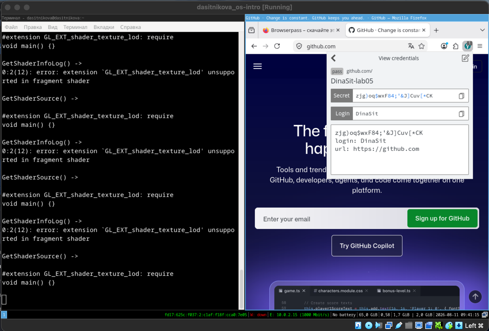
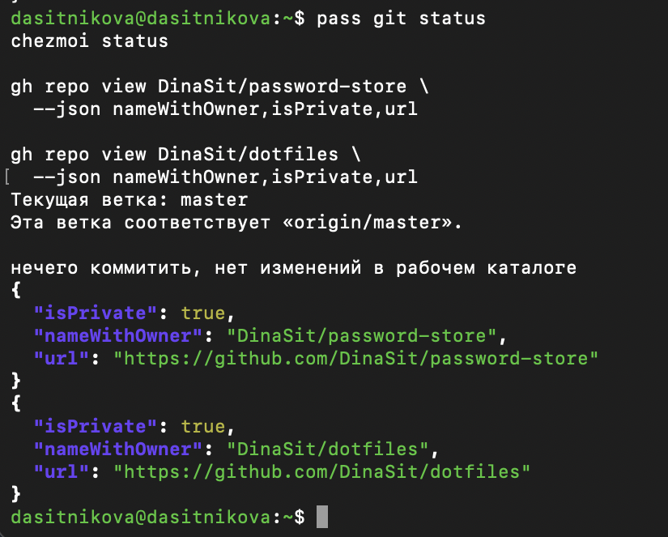

---
## Author
author:
  name: Ситникова Диана Александровна
  degrees: BSc
  email: 1032201746@rudn.ru
  affiliation:
    - name: Российский университет дружбы народов
      country: Российская Федерация
      postal-code: 117198
      city: Москва
      address: ул. Миклухо-Маклая, д. 6
## Title
title: "Лабораторная работа № 5"
subtitle: "Настройка рабочей среды"
license: CC BY
date: today
date-format: "YYYY-MM-DD"
---

# Введение

## Докладчик

:::::::::::::: {.columns align=center}
::: {.column width="68%"}

- Ситникова Диана Александровна
- направление 09.03.03 «Прикладная информатика»
- Российский университет дружбы народов
- [1032201746@rudn.ru](mailto:1032201746@rudn.ru)

:::
::: {.column width="32%"}

{width=100%}

:::
::::::::::::::

## Цель и задачи работы

**Цель:** настроить безопасную и воспроизводимую пользовательскую среду GNU/Linux.

**Задачи:**

- организовать зашифрованное хранилище паролей `pass`;
- синхронизировать его через закрытый Git-репозиторий;
- подключить Browserpass к Firefox;
- установить компоненты рабочей среды и шрифты;
- управлять dotfiles при помощи `chezmoi`.

## Секреты и настройки разделены

| Данные | Инструмент | Защита |
|---|---|---|
| пароли | `pass` | шифрование GnuPG |
| история паролей | Git | в репозитории находятся `.gpg`-файлы |
| браузерный доступ | Browserpass | native messaging + GnuPG |
| конфигурационные файлы | `chezmoi` | контроль изменений и Git |

**Принцип:** секреты не должны попадать в открытый текст dotfiles.

# Выполнение работы

## Подготовлены инструменты рабочей среды

:::::::::::::: {.columns align=center}
::: {.column width="35%"}

- Fedora 43, `aarch64`.
- Установлены `pass`, `pass-otp`.
- Подключены Browserpass и `chezmoi`.
- Установлены компоненты Sway/Wayland.
- Добавлены шрифты Iosevka.

:::
::: {.column width="65%"}

{width=100%}

:::
::::::::::::::

## GPG защищает содержимое хранилища

:::::::::::::: {.columns align=center}
::: {.column width="34%"}

- Использован существующий ключ RSA4096.
- `pass init` записал отпечаток в `.gpg-id`.
- `pass git init` включил историю изменений.
- Создан закрытый репозиторий `password-store`.
- В Git отправляются только зашифрованные файлы.

:::
::: {.column width="66%"}

{width=88%}

:::
::::::::::::::

## Browserpass связал Firefox с pass

:::::::::::::: {.columns align=center}
::: {.column width="34%"}

```text
Firefox
   ↓ native messaging
browserpass-native
   ↓
pass → GnuPG
```

- Запись найдена по адресу сайта.
- Поля логина и URL распознаны.
- Учебный пароль успешно расшифрован.

:::
::: {.column width="66%"}

{width=100%}

:::
::::::::::::::

## chezmoi управляет состоянием dotfiles

:::::::::::::: {.columns align=center}
::: {.column width="35%"}

- Создан закрытый `DinaSit/dotfiles`.
- Репозиторий получен по SSH.
- Исходники размещены в `~/.local/share/chezmoi`.
- `chezmoi diff` показал изменения до записи.
- После резервного копирования выполнен `chezmoi apply -v`.

:::
::: {.column width="65%"}

{width=92%}

:::
::::::::::::::

## Обновление остаётся контролируемым

**Первое развёртывание:**

```bash
chezmoi init git@github.com:DinaSit/dotfiles.git
chezmoi diff
chezmoi apply -v
```

**Ежедневная синхронизация:**

```bash
chezmoi git pull -- --autostash --rebase
chezmoi diff
chezmoi apply
```

Этап `diff` позволяет проверить изменения до применения.

# Результаты

## Итоговая проверка успешна

:::::::::::::: {.columns align=center}
::: {.column width="38%"}

- Хранилище `pass` синхронизировано с `origin/master`.
- Незакоммиченных изменений нет.
- `chezmoi status` не показывает расхождений.
- `password-store` закрыт.
- `dotfiles` закрыт.

:::
::: {.column width="62%"}

{width=88%}

:::
::::::::::::::

## Выводы

- Настроено шифрованное хранилище паролей на базе `pass` и GnuPG.
- Проверены создание, обновление и браузерное получение учебной записи.
- Git обеспечивает историю и синхронизацию зашифрованных данных.
- `chezmoi` делает пользовательскую конфигурацию воспроизводимой.
- Закрытые репозитории разделяют секреты и обычные dotfiles.
- Проверка `diff` перед `apply` сохраняет управляемость изменений.

## Основные источники

- Методические указания к лабораторной работе № 5.
- [Pass — The Standard Unix Password Manager](https://www.passwordstore.org/)
- [The GNU Privacy Guard Manual](https://www.gnupg.org/documentation/manuals/gnupg/)
- [Browserpass](https://github.com/browserpass)
- [Chezmoi Documentation](https://www.chezmoi.io/)
