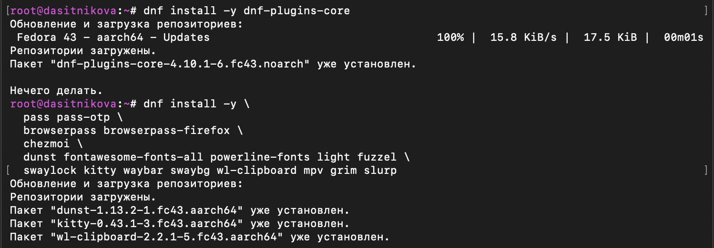
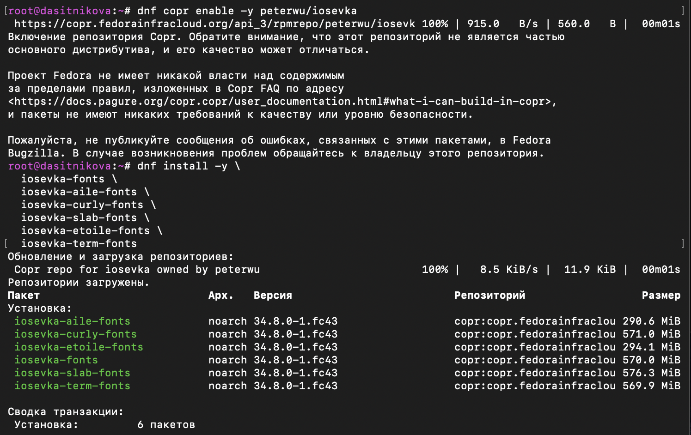
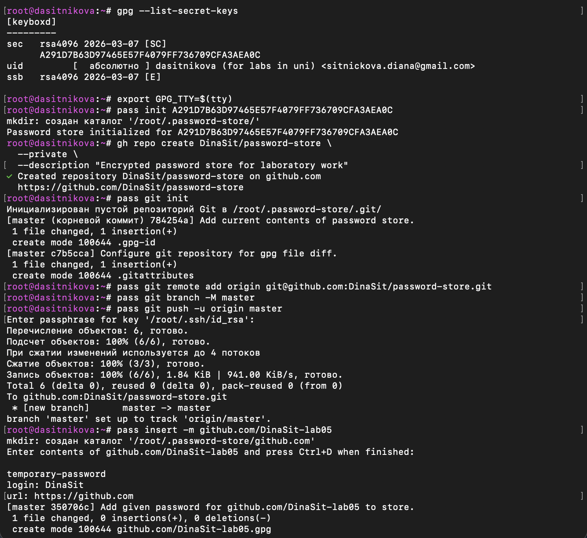
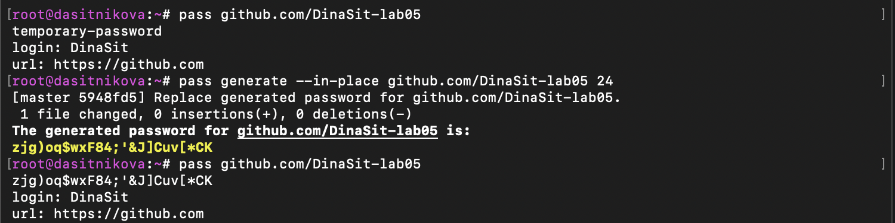
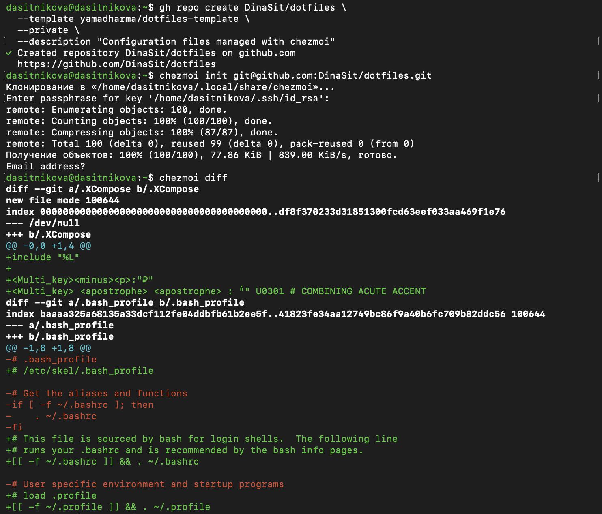

---
## Author
author:
  name: Ситникова Диана Александровна
  degrees: BSc
  email: 1032201746@rudn.ru
  affiliation:
    - name: Российский университет дружбы народов
      country: Российская Федерация
      postal-code: 117198
      city: Москва
      address: ул. Миклухо-Маклая, д. 6

## Title
title: "Отчёт по лабораторной работе № 5"
subtitle: "Настройка рабочей среды"
license: "CC BY"
bibliography: bib/cite.bib
---

# Цель работы

Освоить настройку безопасной и воспроизводимой пользовательской рабочей среды в GNU/Linux с применением менеджера паролей `pass`, шифрования GnuPG, расширения Browserpass и менеджера конфигурационных файлов `chezmoi`.

# Задание

В соответствии с методическими указаниями необходимо выполнить следующие действия [@rudn_lab05]:

1. Установить менеджер паролей `pass` с поддержкой одноразовых паролей либо совместимый менеджер `gopass`.
2. Подготовить ключ GnuPG и инициализировать им хранилище паролей.
3. Инициализировать Git-репозиторий хранилища, настроить удалённый репозиторий и проверить синхронизацию.
4. Настроить интеграцию хранилища с браузером при помощи Browserpass.
5. Создать учебную запись, вывести её содержимое и сгенерировать новый пароль.
6. Установить программное обеспечение и шрифты, необходимые для пользовательской рабочей среды.
7. Создать закрытый репозиторий конфигурационных файлов из предоставленного шаблона.
8. Инициализировать `chezmoi`, изучить предлагаемые изменения и применить конфигурацию.
9. Рассмотреть способы развёртывания конфигурации на другом компьютере и ежедневной синхронизации изменений.

# Краткие теоретические сведения

## Рабочая среда и конфигурационные файлы

Рабочая среда пользователя складывается не только из установленных программ, но и из их настроек: параметров оболочки, терминала, редактора, оконного менеджера, сочетаний клавиш, тем оформления и пользовательских служб. В Unix-подобных системах значительная часть таких настроек хранится в текстовых файлах домашнего каталога. Имена многих файлов начинаются с точки, поэтому их принято называть *dotfiles*.

Ручная настройка каждого нового компьютера имеет два недостатка. Во-первых, трудно воспроизвести одинаковое состояние: отдельные параметры забываются или применяются в другом порядке. Во-вторых, изменения распределены между множеством каталогов, из-за чего их сложно контролировать и переносить. Эту проблему решает подход «конфигурация как код»: текстовые настройки помещаются под контроль версий, а их установка выполняется специализированным инструментом.

При этом конфигурационные файлы и секретные данные требуют разного обращения. Обычные dotfiles можно хранить в Git в открытом виде, если в них нет ключей, паролей и токенов. Секреты необходимо шифровать до записи в репозиторий. Поэтому в работе использованы два независимых механизма:

- `pass` хранит пароли в зашифрованных файлах;
- `chezmoi` управляет воспроизводимым состоянием обычных конфигурационных файлов.

Разделение уменьшает вероятность случайной публикации секрета вместе с настройками.

## Менеджер паролей pass

`pass` --- минималистичный менеджер паролей для Unix-подобных систем. Он хранит каждую запись в отдельном файле с расширением `.gpg`, а структуру каталогов использует как структуру имён. Например, запись `github.com/DinaSit-lab05` располагается в каталоге `github.com` и может быть выведена одноимённой командой [@pass_website; @pass_repository].

По умолчанию хранилище находится в каталоге `~/.password-store`. Первая строка расшифрованной записи трактуется как пароль, а последующие строки могут содержать произвольные метаданные: логин, адрес сайта, комментарий или резервные коды. Это простой текстовый формат без зависимости от конкретной базы данных.

Основные команды приведены в @tbl-pass-commands.

| Команда | Назначение |
|---|---|
| `pass init <GPG-ID>` | инициализация хранилища для указанного получателя GPG |
| `pass insert <name>` | интерактивное создание записи |
| `pass insert -m <name>` | создание многострочной записи |
| `pass <name>` | расшифровка и вывод записи |
| `pass generate <name> 24` | генерация 24-символьного пароля |
| `pass generate --in-place <name> 24` | замена первой строки существующей записи |
| `pass git init` | инициализация Git внутри хранилища |
| `pass git status` | выполнение Git-команды в хранилище |

: Основные команды менеджера `pass` {#tbl-pass-commands}

Программа автоматически шифрует новую запись и при включённой интеграции с Git создаёт коммит. В репозиторий попадает только шифротекст. Для расшифрования требуется закрытая часть соответствующего GPG-ключа.

## Шифрование GnuPG

GnuPG реализует криптографию с открытым ключом. Ключевая пара состоит из открытой и закрытой частей. Открытый ключ используется для шифрования данных, а закрытый --- для расшифрования. Закрытая часть не должна передаваться посторонним и обычно дополнительно защищается парольной фразой [@gnupg_manual].

Команда `gpg --list-secret-keys` выводит закрытые ключи, доступные текущему пользователю. Для идентификации ключа применяется отпечаток --- длинная шестнадцатеричная последовательность. При инициализации `pass` этот отпечаток записывается в файл `.gpg-id`. После этого новые элементы хранилища шифруются для указанного получателя.

В работе использован уже существующий ключ RSA длиной 4096 бит. Основной ключ имеет возможности подписи и сертификации (`[SC]`), а подключ имеет возможность шифрования (`[E]`). Повторное использование подготовленного учебного ключа исключило создание лишней ключевой пары и сохранило единый набор средств доступа к лабораторным данным.

Переменная `GPG_TTY` связывает GnuPG с текущим терминалом:

~~~bash
export GPG_TTY=$(tty)
~~~

Эта настройка позволяет агенту GnuPG корректно открыть запрос парольной фразы в терминальной сессии.

## Хранилище pass под управлением Git

Git фиксирует историю изменения зашифрованных записей и позволяет синхронизировать хранилище между компьютерами. Команда `pass git` передаёт следующие аргументы Git, но автоматически использует каталог `~/.password-store` как рабочий репозиторий.

Синхронизация выполняется обычными операциями:

~~~bash
pass git pull --rebase
pass git push
~~~

Даже зашифрованное хранилище целесообразно размещать в закрытом репозитории. Шифрование защищает содержимое файлов, а приватность репозитория дополнительно скрывает структуру имён, частоту изменений и служебную информацию. GitHub определяет видимость закрытого репозитория так, что доступ к нему получают только явно добавленные пользователи и команды [@github_repo_visibility].

Необходимо помнить, что Git не заменяет резервное копирование закрытого GPG-ключа. Репозиторий содержит зашифрованные данные, но без закрытого ключа восстановить их невозможно.

## Browserpass и native messaging

Browserpass предоставляет доступ к записям `pass` из Firefox и браузеров семейства Chromium. Решение состоит из двух частей [@browserpass_extension; @browserpass_native]:

1. расширение браузера формирует запрос и отображает найденные учётные данные;
2. нативное приложение `browserpass-native` обращается к локальному хранилищу `pass` и вызывает GnuPG.

Браузерное расширение не читает файлы хранилища напрямую. Для взаимодействия с локальной программой применяется механизм native messaging: браузер запускает зарегистрированный исполняемый файл и обменивается с ним структурированными сообщениями через стандартные потоки.

Так как графический сеанс Firefox запущен от обычного пользователя, этому пользователю должны быть доступны:

- каталог `~/.password-store`;
- закрытая часть GPG-ключа, которым зашифрованы записи;
- установленное расширение Browserpass;
- зарегистрированное приложение `browserpass-native`.

Отсутствие любого из этих компонентов приводит к тому, что расширение видит имя записи, но не может расшифровать её содержимое.

## Управление dotfiles при помощи chezmoi

`chezmoi` управляет конфигурационными файлами, отделяя желаемое состояние от файлов, реально расположенных в домашнем каталоге. Исходное состояние по умолчанию находится в `~/.local/share/chezmoi`, а целевым состоянием является домашний каталог пользователя [@chezmoi_docs; @chezmoi_concepts].

Модель работы можно представить последовательностью:

~~~text
репозиторий Git
      ↓ chezmoi init / update
исходное состояние chezmoi
      ↓ шаблоны и преобразования
вычисленное целевое состояние
      ↓ chezmoi diff / apply
файлы домашнего каталога
~~~

В отличие от простого копирования файлов, `chezmoi` умеет:

- представлять одинаковые настройки для нескольких компьютеров;
- использовать шаблоны и данные, зависящие от ОС, имени узла или пользователя;
- показывать разницу до применения изменений;
- устанавливать права доступа;
- управлять каталогами и символическими ссылками;
- запускать скрипты на определённых этапах;
- получать изменения из Git и объединять локальные правки.

Основные команды приведены в @tbl-chezmoi-commands.

| Команда | Назначение |
|---|---|
| `chezmoi init <repo>` | загрузить репозиторий и создать исходное состояние |
| `chezmoi diff` | показать планируемые отличия от домашнего каталога |
| `chezmoi apply -v` | применить вычисленное состояние с подробным выводом |
| `chezmoi status` | показать ещё не применённые различия |
| `chezmoi edit <file>` | изменить управляемую версию файла |
| `chezmoi merge <file>` | согласовать изменения исходной и целевой версий |
| `chezmoi update` | получить изменения репозитория и применить их |
| `chezmoi data` | вывести данные, доступные шаблонам |

: Основные команды `chezmoi` {#tbl-chezmoi-commands}

Команда `diff` является важным контрольным этапом. Она позволяет заранее обнаружить замену существующего файла, машинно-зависимый путь или неподходящий фрагмент конфигурации. Команда `apply` изменяет домашний каталог только после такой проверки. Для дополнительной обратимости перед первым применением полного шаблона целесообразно создать резервную копию текущих конфигурационных файлов.

## Развёртывание на нескольких компьютерах

На новом компьютере исходное состояние можно получить по HTTPS или SSH:

~~~bash
chezmoi init https://github.com/USER/dotfiles.git
chezmoi init git@github.com:USER/dotfiles.git
~~~

После инициализации рекомендуется сначала просмотреть различия, а затем применить их:

~~~bash
chezmoi diff
chezmoi apply -v
~~~

Если репозиторий уже проверен и доверен, операции объединяются в одну команду:

~~~bash
chezmoi init --apply git@github.com:USER/dotfiles.git
~~~

Для ежедневной работы `chezmoi` предусматривает получение обновлений, просмотр разницы и применение изменений [@chezmoi_daily]:

~~~bash
chezmoi update

# либо с раздельным контролем этапов
chezmoi git pull -- --autostash --rebase
chezmoi diff
chezmoi apply
~~~

Раздельная последовательность предпочтительна, когда изменения должны быть проверены перед записью в домашний каталог.

# Выполнение лабораторной работы

## Установка программного обеспечения

Работа выполнялась в виртуальной машине Fedora 43 для архитектуры `aarch64`, запущенной в Oracle VirtualBox на macOS. Сначала был установлен набор системных и пользовательских инструментов:

~~~bash
dnf install -y dnf-plugins-core

dnf install -y \
  pass pass-otp \
  browserpass browserpass-firefox \
  chezmoi \
  dunst fontawesome-fonts-all powerline-fonts light fuzzel \
  swaylock kitty waybar swaybg wl-clipboard mpv grim slurp
~~~

Команда использует актуальные имена пакетов Fedora 43. Пакет `fontawesome-fonts-all` предоставляет полный набор Font Awesome, а `browserpass-firefox` устанавливает расширение для Firefox. На @fig-001 показаны команды и начало транзакции установки.

{#fig-001 width=96%}

В набор входят средства уведомлений, запуска приложений, блокировки экрана, терминал, панель состояния, управление фоном, работа с буфером обмена, медиапроигрыватель и утилиты создания снимков экрана. Такой состав соответствует шаблону графической среды на базе Wayland/Sway.

## Установка семейства шрифтов Iosevka

Шрифты Iosevka отсутствовали в подключённых стандартных репозиториях Fedora, поэтому был включён отдельный COPR-репозиторий и установлены варианты семейства:

~~~bash
dnf copr enable -y peterwu/iosevka

dnf install -y \
  iosevka-fonts \
  iosevka-aile-fonts \
  iosevka-curly-fonts \
  iosevka-slab-fonts \
  iosevka-etoile-fonts \
  iosevka-term-fonts
~~~

Предупреждение DNF указывает, что COPR не является частью основного дистрибутива Fedora. Репозиторий включён осознанно для получения перечисленных в задании шрифтов. На @fig-002 видны адрес подключённого репозитория, перечень пакетов и их архитектура `noarch`.

{#fig-002 width=94%}

## Подготовка ключа GnuPG и хранилища pass

Проверка закрытых ключей показала, что для учебных работ уже существует ключ RSA длиной 4096 бит:

~~~bash
gpg --list-secret-keys
~~~

Его отпечаток:

~~~text
A291D7B63D97465E57F4079FF736709CFA3AEA0C
~~~

Поэтому новый ключ не создавался. После настройки терминала хранилище было инициализировано существующим ключом:

~~~bash
export GPG_TTY=$(tty)
pass init A291D7B63D97465E57F4079FF736709CFA3AEA0C
~~~

Затем на GitHub был создан закрытый репозиторий `DinaSit/password-store`, а локальное хранилище связано с ним:

~~~bash
gh repo create DinaSit/password-store \
  --private \
  --description "Encrypted password store for laboratory work"

pass git init
pass git remote add origin git@github.com:DinaSit/password-store.git
pass git branch -M master
pass git push -u origin master
~~~

На @fig-003 отражены ключ, создание закрытого репозитория, автоматические служебные коммиты `pass git init` и первая отправка ветви `master`.

{#fig-003 width=92%}

## Создание и обновление учебной записи

Для проверки хранилища создана многострочная учебная запись:

~~~bash
pass insert -m github.com/DinaSit-lab05
~~~

В неё внесены демонстрационный пароль, имя пользователя и адрес сайта. После проверки содержимого первая строка была заменена случайным паролем длиной 24 символа:

~~~bash
pass github.com/DinaSit-lab05
pass generate --in-place github.com/DinaSit-lab05 24
pass github.com/DinaSit-lab05
~~~

Результат показан на @fig-004. Отображённое значение создано исключительно для лабораторной работы и не является паролем действующей учётной записи.

{#fig-004 width=96%}

Команда `--in-place` сохранила поля `login` и `url`, заменив только пароль в первой строке. Изменение зашифрованного файла автоматически зафиксировано в Git-истории хранилища.

## Интеграция pass с Firefox

Нативное приложение было проверено командой:

~~~bash
browserpass-native --version
~~~

Установлена версия `3.1.2`. Firefox работает в графическом сеансе обычного пользователя `dasitnikova`, поэтому зашифрованное хранилище и закрытый ключ были размещены в пользовательском домашнем каталоге с корректными правами доступа. После установки расширения Browserpass оно смогло вызвать нативное приложение и расшифровать учебную запись.

На @fig-005 показано окно Browserpass с найденной записью `github.com/DinaSit-lab05`, полем логина и адресом сайта. Сообщения о графических шейдерах в терминале относятся к программному рендерингу Firefox внутри VirtualBox и не влияют на работу менеджера паролей.

{#fig-005 width=94%}

Таким образом, проверена вся цепочка: расширение Firefox → native messaging → `browserpass-native` → `pass` → GnuPG → расшифрованная запись.

## Создание репозитория dotfiles

Операции с пользовательской конфигурацией выполнялись от имени владельца графического сеанса. На основе указанного в задании шаблона создан закрытый репозиторий:

~~~bash
gh repo create DinaSit/dotfiles \
  --template yamadharma/dotfiles-template \
  --private \
  --description "Configuration files managed with chezmoi"
~~~

После создания репозитория `chezmoi` загрузил его по SSH:

~~~bash
chezmoi init git@github.com:DinaSit/dotfiles.git
chezmoi diff
~~~

На @fig-006 показаны успешное создание закрытого репозитория, клонирование в `~/.local/share/chezmoi` и начало разницы между шаблоном и текущим домашним каталогом.

{#fig-006 width=92%}

Шаблон содержит конфигурацию оболочки и компонентов среды Sway. Перед первым применением был просмотрен вывод `chezmoi diff` и создана резервная копия исходных пользовательских настроек. Затем конфигурация применена с подробным выводом:

~~~bash
chezmoi apply -v
~~~

Такой порядок сохраняет контролируемость изменений: Git-репозиторий определяет желаемое состояние, `diff` показывает план действий, а `apply` приводит домашний каталог к этому состоянию.

## Итоговая проверка

После выполнения настройки проверены состояние обоих механизмов и видимость репозиториев:

~~~bash
pass git status
chezmoi status

gh repo view DinaSit/password-store \
  --json nameWithOwner,isPrivate,url

gh repo view DinaSit/dotfiles \
  --json nameWithOwner,isPrivate,url
~~~

На @fig-007 видно, что рабочая ветвь хранилища соответствует `origin/master`, незакоммиченных изменений нет, а оба репозитория имеют признак `isPrivate: true`.

{#fig-007 width=72%}

Пустой вывод `chezmoi status` означает отсутствие неприменённых различий между вычисленным состоянием и домашним каталогом. Следовательно, конфигурация успешно развёрнута.

## Сценарии дальнейшей работы

Для развёртывания dotfiles на другой машине достаточно установить `chezmoi`, получить репозиторий, проверить изменения и применить их:

~~~bash
chezmoi init git@github.com:DinaSit/dotfiles.git
chezmoi diff
chezmoi apply -v
~~~

При изменении уже управляемого файла следует редактировать его исходную версию:

~~~bash
chezmoi edit ~/.bashrc
chezmoi diff
chezmoi apply
~~~

Получение изменений из репозитория выполняется командой `chezmoi update` либо раздельной последовательностью `git pull`, `diff` и `apply`. Раздельный режим удобнее для учебной и административной работы, поскольку сохраняет явный этап проверки.

Для переноса хранилища паролей дополнительно требуется безопасно импортировать закрытый GPG-ключ, клонировать закрытый репозиторий в `~/.password-store` и проверить расшифрование тестовой записи. Один репозиторий без соответствующего ключа доступа к паролям не даёт (@tbl-results).

# Анализ результатов

## Соответствие выполненных действий заданию

| Требование | Полученный результат |
|---|---|
| Установить менеджер паролей | установлены `pass` и `pass-otp` |
| Подготовить GPG | использован существующий ключ RSA4096 с шифрующим подключом |
| Создать хранилище | `pass init` создал `~/.password-store` и `.gpg-id` |
| Настроить Git | создан закрытый `DinaSit/password-store`, ветвь отправлена на GitHub |
| Проверить операции с паролем | выполнены вставка, просмотр и генерация нового значения |
| Настроить Browserpass | запись успешно получена из Firefox через нативное приложение |
| Установить рабочее ПО | установлены компоненты оболочки, терминала, Wayland и мультимедиа |
| Установить шрифты | подключён COPR и установлены шесть вариантов Iosevka |
| Создать dotfiles | закрытый `DinaSit/dotfiles` создан из шаблона |
| Применить chezmoi | выполнены `init`, `diff`, резервное копирование и `apply -v` |
| Проверить итог | нет незакоммиченных и неприменённых изменений, оба репозитория закрыты |

: Проверка соответствия результатам задания {#tbl-results}

## Разделение ответственности инструментов

Полученная система использует несколько уровней защиты и воспроизводимости:

- GnuPG обеспечивает криптографическую защиту содержимого паролей;
- `pass` задаёт файловую структуру и операции над секретами;
- Git хранит историю зашифрованных записей и конфигурационных файлов;
- закрытые репозитории ограничивают сетевой доступ;
- Browserpass предоставляет удобный доступ из браузера, не меняя формат хранилища;
- `chezmoi` отделяет исходное состояние от файлов домашнего каталога и контролирует применение изменений;
- предварительный `diff` и резервная копия уменьшают риск нежелательной перезаписи настроек.

Секреты не помещались в репозиторий dotfiles. Даже демонстрационная запись хранится в Git только в виде файла `.gpg`. Скриншоты показывают расшифрованное учебное значение исключительно как подтверждение выполнения операций; оно не используется для доступа к реальным сервисам.

## Практические ограничения

Результат зависит от наличия закрытого GPG-ключа и корректного пользовательского контекста. Если Firefox запущен от другого пользователя, то его нативное приложение не сможет автоматически использовать ключи и хранилище из домашнего каталога `root`. Поэтому графические приложения, GPG-ключ и пользовательские конфигурации должны принадлежать одному непривилегированному пользователю.

Шаблон dotfiles описывает полноценную рабочую среду и может содержать настройки, зависящие от конкретного компьютера. Перед применением на другой системе необходимо снова выполнить `chezmoi diff`, проверить пути, названия интерфейсов, доступность программ и пользовательские службы. Именно по этой причине `diff` является обязательным этапом, а автоматическое применение допустимо только для уже проверенного репозитория.

# Выводы

В ходе лабораторной работы была настроена рабочая среда Fedora с безопасным хранением паролей и воспроизводимым управлением конфигурационными файлами. Менеджер `pass` инициализирован существующим ключом GnuPG, хранилище помещено в закрытый GitHub-репозиторий, а операции создания, просмотра и генерации учебного пароля проверены на практике.

Настроена интеграция Browserpass с Firefox: расширение успешно получило и расшифровало запись из локального хранилища. Установлены компоненты пользовательской среды и семейство шрифтов Iosevka.

На основе шаблона создан закрытый репозиторий dotfiles. Средствами `chezmoi` выполнены загрузка исходного состояния, предварительный просмотр различий и применение конфигурации. Итоговая проверка подтвердила синхронизацию хранилища паролей, отсутствие неприменённых изменений `chezmoi` и закрытую видимость обоих репозиториев.

В результате освоены принципы разделения секретов и открытых настроек, шифрования файлов GnuPG, синхронизации через Git, браузерной интеграции менеджера паролей и воспроизводимого развёртывания пользовательской конфигурации.

# Список литературы{.unnumbered}

::: {#refs}
:::
