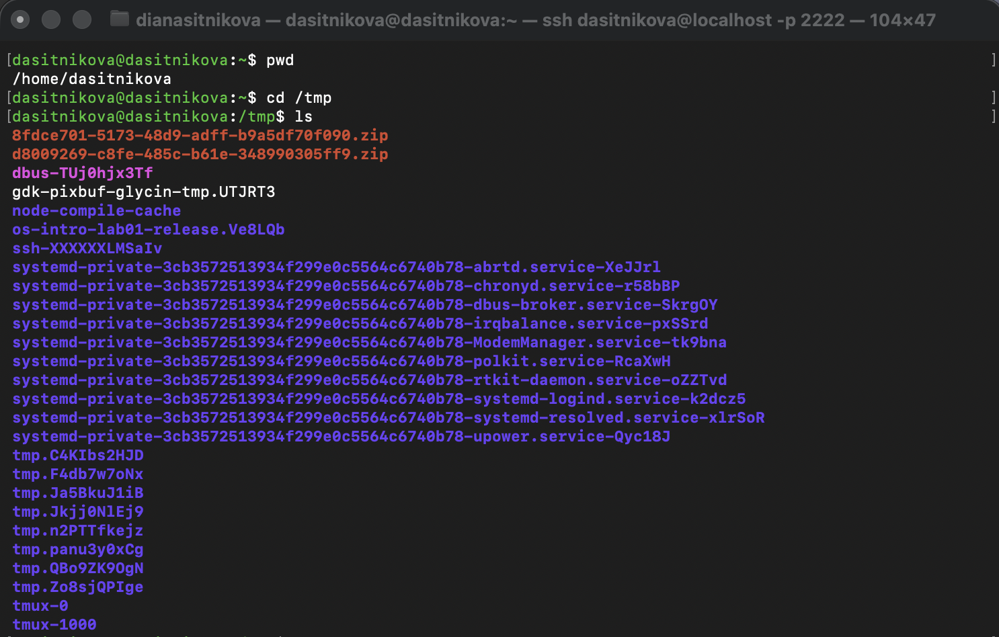
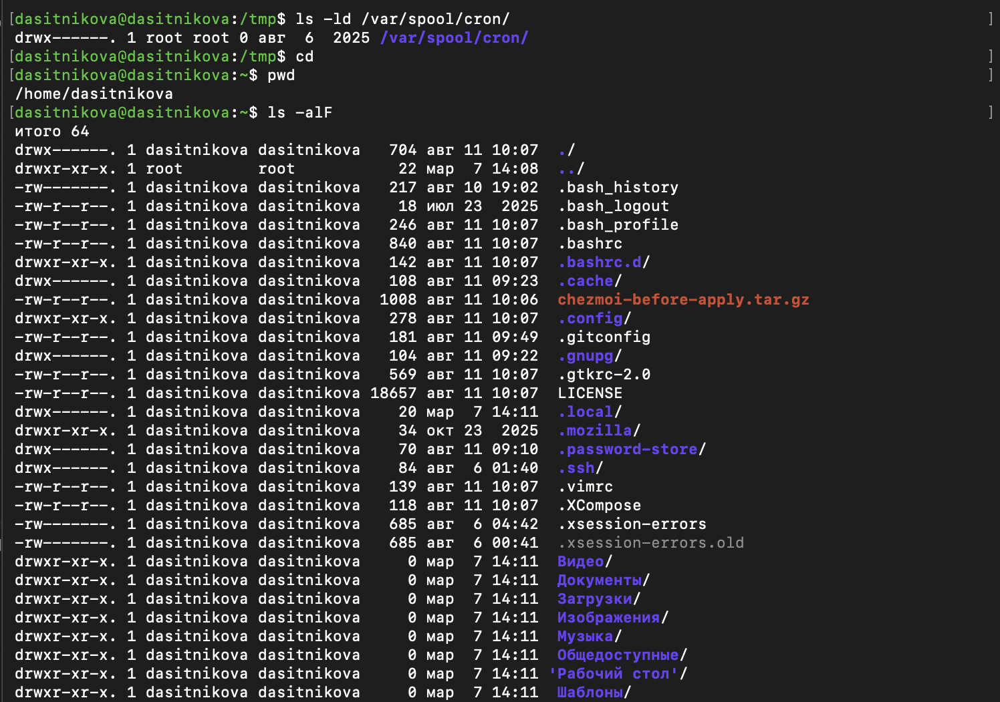
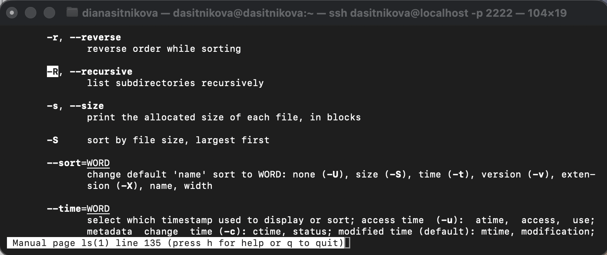
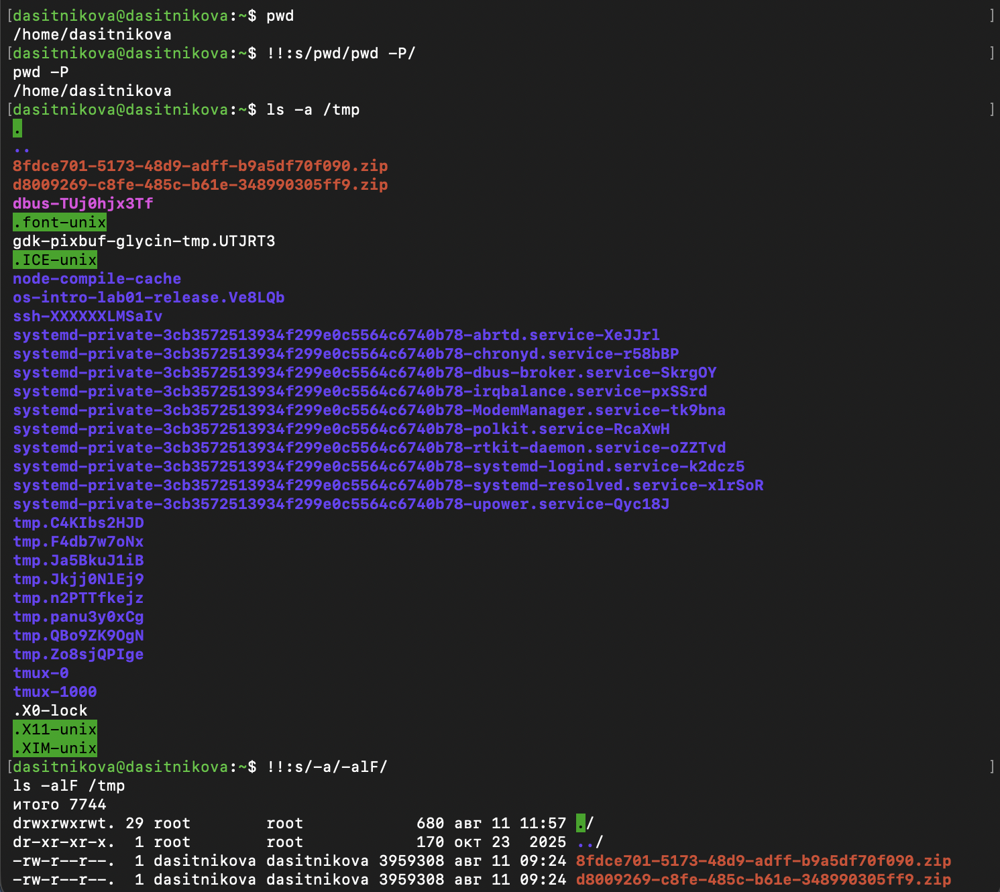

---
## Author
author:
  name: Ситникова Диана Александровна
  degrees: BSc
  email: 1032201746@rudn.ru
  affiliation:
    - name: Российский университет дружбы народов
      country: Российская Федерация
      postal-code: 117198
      city: Москва
      address: ул. Миклухо-Маклая, д. 6
## Title
title: "Лабораторная работа № 6"
subtitle: "Командная строка Unix"
license: CC BY
date: today
date-format: "YYYY-MM-DD"
---

# Введение

## Докладчик

:::::::::::::: {.columns align=center}
::: {.column width="68%"}

- Ситникова Диана Александровна
- направление 09.03.03 «Прикладная информатика»
- Российский университет дружбы народов
- [1032201746@rudn.ru](mailto:1032201746@rudn.ru)

:::
::: {.column width="32%"}

{width=100%}

:::
::::::::::::::

## Цель работы

Приобретение практических навыков взаимодействия пользователя с системой посредством командной строки.

## Последовательность выполнения работы (1/2) {.smaller}

:::::::::::::: {.columns align=top}
::: {.column width="48%"}

1. Определить полное имя домашнего каталога.

2. Выполнить следующие действия:

   - перейти в каталог `/tmp`;
   - вывести его содержимое командой `ls` с различными опциями и пояснить различия;
   - проверить наличие `/var/spool/cron`;
   - вернуться в домашний каталог и определить владельцев объектов.

:::
::: {.column width="52%"}

3. Выполнить следующие действия:

   - создать `newdir` и `~/newdir/morefun`;
   - одной командой создать `letters`, `memos`, `misk`, затем одной командой удалить их;
   - попытаться удалить `~/newdir` командой `rm` и проверить результат;
   - удалить `~/newdir/morefun` и проверить результат.

:::
::::::::::::::

## Последовательность выполнения работы (2/2) {.smaller}

4. С помощью `man` определить опцию `ls` для просмотра содержимого указанного каталога и входящих в него подкаталогов.

5. С помощью `man` определить набор опций `ls` для сортировки по времени последнего изменения с развёрнутым описанием файлов.

6. Просмотреть описания команд `cd`, `pwd`, `mkdir`, `rmdir`, `rm` и пояснить их основные опции.

7. Используя информацию команды `history`, выполнить модификацию и исполнение нескольких команд из буфера команд.

## Оболочка связывает пользователя и систему

```text
пользователь
    ↓ текстовая команда
оболочка Bash
    ↓ разбор, подстановки, запуск
встроенная команда или программа
    ↓
результат в терминале
```

Общий формат:

```text
имя_команды [опции] [аргументы]
```

Пример: `ls -alF /tmp`.

## Путь определяет положение объекта

| Обозначение | Значение |
|---|---|
| `/` | корень файловой системы |
| `~` | домашний каталог |
| `.` | текущий каталог |
| `..` | родительский каталог |

- Абсолютный путь: `/home/dasitnikova/newdir`.
- Относительный путь: `newdir/morefun`.
- `pwd` показывает текущий путь, `cd` изменяет его.

# Выполнение работы

## Домашний каталог определён однозначно

:::::::::::::: {.columns align=center}
::: {.column width="34%"}

- Работа выполнялась пользователем `dasitnikova`.
- Домашний каталог: `/home/dasitnikova`.
- Выполнен переход в `/tmp`.
- Команда `ls` показала временные объекты системы.

:::
::: {.column width="66%"}

{width=100%}

:::
::::::::::::::

## Комбинация `-alF` раскрывает свойства объектов

:::::::::::::: {.columns align=center}
::: {.column width="31%"}

- `-a` --- скрытые имена;
- `-l` --- подробные атрибуты;
- `-F` --- индикаторы типов;
- `/` после имени --- каталог;
- `=` после имени --- сокет.

:::
::: {.column width="69%"}

{width=86%}

:::
::::::::::::::

## Владельцы видны в длинном формате

:::::::::::::: {.columns align=center}
::: {.column width="34%"}

- `/var/spool/cron` существует.
- Каталог принадлежит `root`.
- Домашние файлы преимущественно принадлежат `dasitnikova`.
- Права доступа показаны в первом поле `ls -l`.

:::
::: {.column width="66%"}

{width=90%}

:::
::::::::::::::

## Каталоги созданы и удалены штатными командами

:::::::::::::: {.columns align=center}
::: {.column width="33%"}

```bash
mkdir newdir
mkdir ~/newdir/morefun
mkdir ~/{letters,memos,misk}
rmdir ~/{letters,memos,misk}
```

- `rm` без `-r` не удалил каталог.
- Пустой `morefun` удалён через `rmdir`.

:::
::: {.column width="67%"}

{width=100%}

:::
::::::::::::::

## Руководство позволяет находить нужные опции

:::::::::::::: {.columns align=center}
::: {.column width="34%"}

- `man ls` открыл руководство.
- Поиск выполняется через `/образец`.
- `-R`, `--recursive` обходит подкаталоги.
- `-t` сортирует по времени изменения.
- Комбинация `-lt` даёт подробный временной список.

:::
::: {.column width="66%"}

{width=100%}

:::
::::::::::::::

## История ускоряет повторение команд

:::::::::::::: {.columns align=center}
::: {.column width="34%"}

```bash
!!:s/pwd/pwd -P/
!!:s/-a/-alF/
!72
```

- `!!` выбирает предыдущую команду.
- `:s/old/new/` выполняет замену.
- `!номер` повторяет выбранную запись истории.

:::
::: {.column width="66%"}

{width=88%}

:::
::::::::::::::

# Результаты

## Все этапы задания выполнены

| Этап | Результат |
|---|---|
| Навигация | определён `$HOME`, проверены `pwd` и `cd` |
| Просмотр | сравнены `ls`, `-a`, `-l`, `-alF` |
| Каталоги | проверены `mkdir`, `rmdir`, безопасный отказ `rm` |
| Справка | найдены `-R` и `-t` в `man ls` |
| История | выполнены подстановка и повтор по номеру |

## Выводы

- Командная строка обеспечивает точное управление файловой системой.
- Абсолютные и относительные пути задают положение объектов.
- Опции `ls` позволяют выбирать глубину и подробность представления данных.
- Разделение `rm` и `rmdir` помогает безопаснее управлять каталогами.
- `man` позволяет самостоятельно уточнять синтаксис и опции.
- История Bash сокращает повторный ввод и поддерживает модификацию команд.

## Основные источники

- Методические указания к лабораторной работе № 6.
- [Bash Reference Manual](https://www.gnu.org/software/bash/manual/bash.html)
- [GNU Coreutils Manual](https://www.gnu.org/software/coreutils/manual/coreutils.html)
- Robbins A. *Bash Pocket Reference*. O'Reilly Media, 2016.
