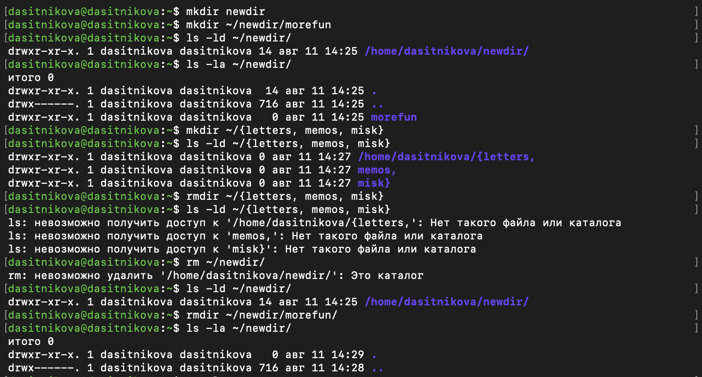

---
## Author
author:
  name: Ситникова Диана Александровна
  degrees: BSc
  email: 1032201746@rudn.ru
  affiliation:
    - name: Российский университет дружбы народов
      country: Российская Федерация
      postal-code: 117198
      city: Москва
      address: ул. Миклухо-Маклая, д. 6
## Title
title: "Лабораторная работа № 6"
subtitle: "Основы интерфейса взаимодействия пользователя с системой Unix на уровне командной строки"
license: CC BY
date: today
date-format: "YYYY-MM-DD"
header-includes:
  - \usepackage{tikz}
---

# Информация

## Докладчик

:::::::::::::: {.columns align=center}
::: {.column width="68%"}

- Ситникова Диана Александровна
- направление 09.03.03 «Прикладная информатика»
- Российский университет дружбы народов
- [1032201746@rudn.ru](mailto:1032201746@rudn.ru)

:::
::: {.column width="32%"}

{width=100%}

:::
::::::::::::::

# Вводная часть

## Актуальность

- Графическая оболочка скрывает от пользователя структуру системы.
- Серверы и виртуальные машины чаще всего доступны только в текстовом режиме.
- Команда воспроизводима и записывается в отчёт, а последовательность щелчков --- нет.
- Командная строка --- основа всех последующих работ курса.

## Объект и предмет исследования

**Объект** --- командный интерпретатор Bash как интерфейс взаимодействия пользователя с системой Unix.

**Предмет** --- структура команды, абсолютные и относительные пути, команды навигации и работы с каталогами, справочная система `man` и механизм истории.

## Цели и задачи

**Цель** --- приобретение практических навыков взаимодействия пользователя с системой посредством командной строки.

**Задачи:**

- освоить навигацию и определение путей;
- сравнить режимы вывода команды `ls`;
- освоить создание и удаление каталогов;
- научиться находить нужные опции в `man` и повторять команды из истории.

## Материалы и методы

| Компонент | Значение |
|---|---|
| Система | Fedora Linux, пользователь `dasitnikova` |
| Оболочка | GNU Bash |
| Команды | `pwd`, `cd`, `ls`, `mkdir`, `rmdir`, `rm`, `man`, `history` |
| Метод | выполнение заданных операций с фиксацией вывода терминала |

# Содержание исследования

## Оболочка разбирает команду и запускает программу

\begin{center}
\resizebox{\linewidth}{!}{%
\begin{tikzpicture}[font=\scriptsize]
  \draw[thick] (0,0) rectangle (2.6,1.1);
  \node at (1.3,0.55) {Пользователь};
  \draw[thick] (3.5,0) rectangle (6.5,1.1);
  \node[align=center] at (5.0,0.55) {Оболочка Bash\\разбор, подстановки};
  \draw[thick] (7.4,0) rectangle (10.4,1.1);
  \node[align=center] at (8.9,0.55) {Команда\\или программа};

  \draw[->,thick] (2.65,0.55) -- (3.45,0.55) node[midway,above,font=\tiny] {текст};
  \draw[->,thick] (6.55,0.55) -- (7.35,0.55) node[midway,above,font=\tiny] {запуск};
  \draw[->,thick] (8.9,-0.05) -- (8.9,-0.95) -- (1.3,-0.95) -- (1.3,-0.05);
  \node[font=\tiny,fill=white,inner sep=3pt] at (5.1,-0.95) {результат в терминале};
\end{tikzpicture}%
}
\end{center}

Общий формат: `имя_команды [опции] [аргументы]`, например `ls -alF /tmp`.

## Путь задаёт положение объекта в дереве

| Обозначение | Значение |
|---|---|
| `/` | корень файловой системы |
| `~` | домашний каталог |
| `.` | текущий каталог |
| `..` | родительский каталог |

Абсолютный путь `/home/dasitnikova/newdir` не зависит от текущего каталога, относительный `newdir/morefun` --- зависит.

## Опции `ls` управляют полнотой представления

:::::::::::::: {.columns align=center}
::: {.column width="42%"}

`-a` показывает скрытые имена, `-l` --- подробные атрибуты, `-F` добавляет индикатор типа: `/` для каталога, `=` для сокета.

Одни и те же объекты можно увидеть с разной степенью детализации.

:::
::: {.column width="58%"}

{width=100%}

:::
::::::::::::::

## Разделение `rm` и `rmdir` защищает от потери данных

~~~bash
mkdir ~/{letters,memos,misk}
rmdir ~/{letters,memos,misk}
rm ~/newdir          # отказ: это каталог
rmdir ~/newdir/morefun
~~~

:::::::::::::: {.columns align=center}
::: {.column width="42%"}

`rm` без `-r` отказывается удалять каталог, `rmdir` удаляет только пустой.

Отказ здесь --- не ошибка, а страховка.

:::
::: {.column width="58%"}

{width=100%}

:::
::::::::::::::

## История позволяет исправить и повторить команду

~~~bash
!!:s/pwd/pwd -P/
!!:s/-a/-alF/
!72
~~~

`!!` подставляет предыдущую команду, `:s/старое/новое/` выполняет замену, `!номер` повторяет запись истории по её номеру.

# Результаты

## Все этапы задания выполнены

| Этап | Результат |
|---|---|
| Навигация | определён `$HOME`, проверены `pwd` и `cd` |
| Просмотр | сравнены `ls`, `-a`, `-l`, `-alF` |
| Каталоги | проверены `mkdir`, `rmdir` и безопасный отказ `rm` |
| Справка | найдены опции `-R` и `-t` в `man ls` |
| История | выполнены подстановка и повтор по номеру |

## Командная строка требует точности и возвращает воспроизводимость

Оболочка не угадывает намерение: `rm` и `rmdir` различаются не удобством, а последствиями.

Зато любая выполненная последовательность записывается, повторяется и переносится на другую машину без изменений --- это то, чего не даёт графический интерфейс.
