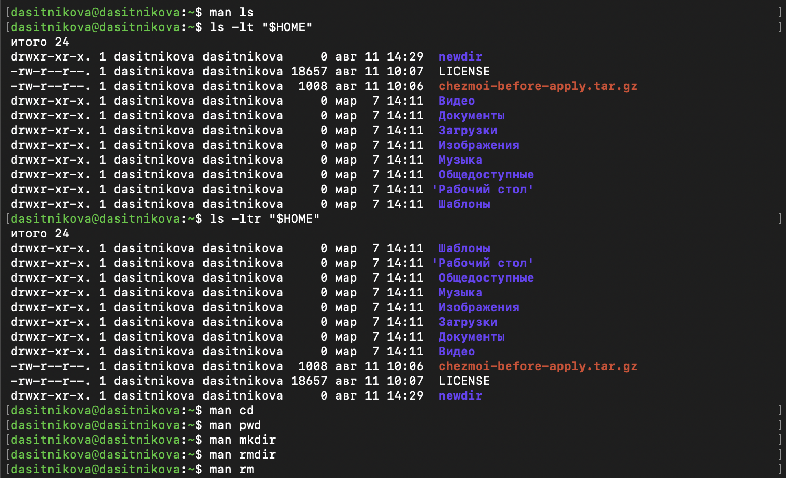
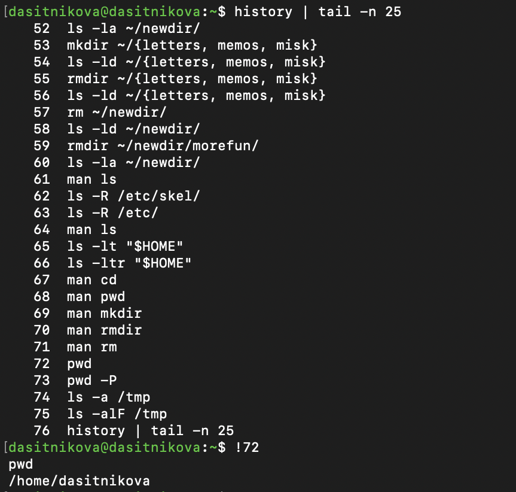

---
## Author
author:
  name: Ситникова Диана Александровна
  degrees: BSc
  email: 1032201746@rudn.ru
  affiliation:
    - name: Российский университет дружбы народов
      country: Российская Федерация
      postal-code: 117198
      city: Москва
      address: ул. Миклухо-Маклая, д. 6

## Title
title: "Отчёт по лабораторной работе № 6"
subtitle: "Основы интерфейса взаимодействия пользователя с системой Unix на уровне командной строки"
license: "CC BY"
bibliography: bib/cite.bib
---

# Цель работы

Приобретение практических навыков взаимодействия пользователя с системой посредством командной строки.

# Задание

В соответствии с методическими указаниями необходимо выполнить следующую последовательность действий [@rudn_lab06_shell]:

1. Определить полное имя домашнего каталога. Далее относительно этого каталога выполнять последующие упражнения.

2. Выполнить следующие действия:

   **2.1.** Перейти в каталог `/tmp`.

   **2.2.** Вывести на экран содержимое каталога `/tmp`. Для этого использовать команду `ls` с различными опциями. Пояснить разницу в выводимой на экран информации.

   **2.3.** Определить, есть ли в каталоге `/var/spool` подкаталог с именем `cron`.

   **2.4.** Перейти в домашний каталог и вывести на экран его содержимое. Определить, кто является владельцем файлов и подкаталогов.

3. Выполнить следующие действия:

   **3.1.** В домашнем каталоге создать новый каталог с именем `newdir`.

   **3.2.** В каталоге `~/newdir` создать новый каталог с именем `morefun`.

   **3.3.** В домашнем каталоге создать одной командой три новых каталога с именами `letters`, `memos`, `misk`. Затем удалить эти каталоги одной командой.

   **3.4.** Попробовать удалить ранее созданный каталог `~/newdir` командой `rm`. Проверить, был ли каталог удалён.

   **3.5.** Удалить каталог `~/newdir/morefun` из домашнего каталога. Проверить, был ли каталог удалён.

4. С помощью команды `man` определить, какую опцию команды `ls` нужно использовать для просмотра содержимого не только указанного каталога, но и подкаталогов, входящих в него.

5. С помощью команды `man` определить набор опций команды `ls`, позволяющий отсортировать по времени последнего изменения выводимый список содержимого каталога с развёрнутым описанием файлов.

6. Использовать команду `man` для просмотра описания следующих команд: `cd`, `pwd`, `mkdir`, `rmdir`, `rm`. Пояснить основные опции этих команд.

7. Используя информацию, полученную при помощи команды `history`, выполнить модификацию и исполнение нескольких команд из буфера команд.

# Краткие теоретические сведения

## Командная строка и командный интерпретатор

Командная строка представляет собой текстовый интерфейс взаимодействия с операционной системой. Пользователь вводит команду, а командный интерпретатор --- оболочка --- разбирает введённый текст, выполняет подстановки и запускает требуемое действие. В Fedora стандартной интерактивной оболочкой обычно является GNU Bash [@bash_manual; @robbins_book_bash_en].

Общий формат команды имеет вид:

~~~text
имя_команды [опции] [аргументы]
~~~

Например, в команде

~~~bash
ls -alF /tmp
~~~

`ls` является именем команды, `-alF` --- объединением трёх кратких опций, а `/tmp` --- аргументом, задающим каталог. Пробелы разделяют элементы командной строки. Если пробел должен быть частью аргумента, его экранируют обратной косой чертой либо заключают весь аргумент в кавычки.

Команды оболочки делятся на несколько групп:

- встроенные команды Bash, изменяющие состояние самой оболочки, например `cd`, `history`, `help`;
- внешние исполняемые программы, найденные в каталогах переменной `PATH`, например `/usr/bin/ls`, `/usr/bin/mkdir`, `/usr/bin/rm`;
- функции, псевдонимы и ключевые слова оболочки.

Команда `type` позволяет определить происхождение имени:

~~~bash
type cd
type ls
~~~

Команда `cd` должна быть встроенной, поскольку внешний процесс не смог бы изменить рабочий каталог родительской оболочки. Это объясняет, почему в отдельных системах для неё используется `help cd` или раздел `bash-builtins`, а не самостоятельная страница `man cd`.

## Иерархическая файловая система и пути

Файловая система Unix организована как единое дерево. Его вершиной является корневой каталог `/`. Остальные каталоги и файлы доступны через пути, начинающиеся от корня либо от текущего рабочего каталога [@tanenbaum_book_modern-os_ru].

Абсолютный путь начинается с `/` и не зависит от текущего положения пользователя:

~~~text
/home/dasitnikova/newdir
~~~

Относительный путь интерпретируется относительно текущего рабочего каталога:

~~~text
newdir/morefun
../tmp
~~~

Основные обозначения путей приведены в @tbl-path-symbols.

| Обозначение | Значение |
|---|---|
| `/` | корневой каталог файловой системы |
| `~` | домашний каталог текущего пользователя |
| `.` | текущий каталог |
| `..` | родительский каталог |
| `-` в `cd -` | предыдущий рабочий каталог |

: Обозначения, используемые в путях {#tbl-path-symbols}

Команда `pwd` выводит абсолютный путь текущего каталога. Опция `-L` сохраняет логическое представление с символическими ссылками, а `-P` вычисляет физический путь. Команда `cd` меняет рабочий каталог текущей оболочки. Вызов `cd` без аргументов и `cd ~` переводят пользователя в домашний каталог.

## Просмотр содержимого каталогов

Команда `ls` выводит имена объектов, находящихся в каталоге. Её поведение регулируется большим числом опций, документированных в GNU Coreutils [@coreutils_ls]. Основные использованные опции приведены в @tbl-ls-options.

| Опция | Назначение |
|---|---|
| `-a`, `--all` | показывать все объекты, включая имена, начинающиеся с точки |
| `-l` | выводить подробное описание в длинном формате |
| `-F`, `--classify` | добавлять к имени индикатор типа объекта |
| `-R`, `--recursive` | рекурсивно перечислять содержимое подкаталогов |
| `-t` | сортировать по времени изменения, начиная с новых объектов |
| `-r`, `--reverse` | обратить порядок сортировки |

: Основные опции команды `ls` {#tbl-ls-options}

В Unix имя, начинающееся с точки, считается скрытым при обычном выводе `ls`. Это не отдельный атрибут файла, а соглашение об именовании. Опция `-a` отменяет фильтрацию и дополнительно показывает специальные записи `.` и `..`.

Опция `-F` добавляет индикаторы типа (@tbl-file-indicators):

| Индикатор | Тип объекта |
|---|---|
| `/` | каталог |
| `*` | исполняемый файл |
| `@` | символическая ссылка |
| `=` | сокет |
| `\|` | именованный канал |

: Индикаторы типов объектов в выводе `ls -F` {#tbl-file-indicators}

Длинный формат `ls -l` содержит тип и права доступа, число жёстких ссылок, владельца, группу, размер, время последнего изменения и имя. Например:

~~~text
drwxr-xr-x 1 dasitnikova dasitnikova 14 авг 11 14:25 newdir
~~~

Первый символ `d` обозначает каталог. Следующие девять символов описывают права чтения (`r`), записи (`w`) и выполнения (`x`) для владельца, группы и остальных пользователей. Для каталога право выполнения означает возможность прохода внутрь него.

## Создание и удаление каталогов

Команда `mkdir` создаёт один или несколько каталогов. Базовый синтаксис:

~~~bash
mkdir каталог
~~~

Опция `-p` создаёт отсутствующие родительские каталоги и не сообщает об ошибке, если каталог уже существует. Опция `-m` позволяет задать режим доступа, а `-v` выводит сообщение о каждом созданном каталоге [@coreutils_mkdir].

Фигурные скобки Bash позволяют сформировать несколько аргументов одной командой:

~~~bash
mkdir ~/{letters,memos,misk}
~~~

Оболочка разворачивает выражение в три пути до запуска `mkdir`. Пробелы внутри такого перечня не ставятся, поскольку иначе они разделят командную строку до выполнения расширения.

Пустой каталог удаляется командой `rmdir`. Команда `rm` предназначена прежде всего для файлов. Для рекурсивного удаления каталога ей необходима опция `-r`. В работе намеренно проверяется вызов `rm` без `-r`: команда должна отказаться удалять каталог. Такое поведение снижает риск случайного удаления дерева файлов.

Ключевые опции команд управления каталогами приведены в @tbl-directory-commands.

| Команда или опция | Назначение |
|---|---|
| `mkdir -p путь` | создать всю недостающую цепочку каталогов |
| `mkdir -m режим путь` | создать каталог с заданными правами |
| `rmdir путь` | удалить пустой каталог |
| `rmdir -p путь` | удалить пустой каталог и ставшие пустыми родительские каталоги |
| `rm -i файл` | запросить подтверждение перед удалением |
| `rm -r каталог` | рекурсивно удалить каталог и содержимое |
| `rm -v объект` | вывести информацию о выполняемом удалении |

: Команды создания и удаления каталогов {#tbl-directory-commands}

## Справочная система man

Программа `man` отображает страницы системного руководства. Вызов имеет вид:

~~~bash
man команда
~~~

Страница содержит имя, назначение, синтаксис, описание, опции, сведения об авторах и связанные руководства. По умолчанию текст открывается в пейджере `less`. Основные клавиши:

- `Space` --- перейти на экран вперёд;
- `Enter` --- перейти на строку вперёд;
- `/образец` --- найти текст;
- `n` --- перейти к следующему совпадению;
- `q` --- завершить просмотр.

Руководства разделены на секции. Например, секция 1 содержит пользовательские команды, а секция 2 --- системные вызовы. Если команда встроена в Bash, полезны `help имя` и `man bash-builtins`.

## История команд Bash

Интерактивная оболочка сохраняет введённые команды в истории. Встроенная команда `history` показывает пронумерованный список. История позволяет повторять команды и применять к ним подстановки [@bash_history] (@tbl-history).

| Конструкция | Действие |
|---|---|
| `history` | показать список команд |
| `!!` | повторить последнюю команду |
| `!72` | повторить команду с номером 72 |
| `!!:s/old/new/` | заменить первое вхождение `old` на `new` в предыдущей команде и выполнить результат |
| `!72:s/old/new/` | изменить и выполнить команду с номером 72 |

: Основные конструкции истории Bash {#tbl-history}

Несколько команд можно записать в одной строке через `;`. В этом случае оболочка выполняет их последовательно независимо от кода завершения:

~~~bash
cd; pwd; ls -alF
~~~

Оператор `&&` запускает следующую команду только после успешной предыдущей, а `||` --- только после ошибки. Для автоматического дополнения имени команды, файла или каталога используется клавиша `Tab`.

## Кавычки и экранирование

Специальные символы Bash могут изменять смысл командной строки. Обратная косая черта `\` экранирует следующий символ:

~~~bash
cd Операционные\ системы
echo \*
~~~

Одинарные кавычки сохраняют все символы буквально:

~~~bash
echo '$HOME * ?'
~~~

Двойные кавычки сохраняют пробелы, но допускают подстановку переменных и команд:

~~~bash
echo "$HOME"
~~~

Корректное применение кавычек особенно важно для путей с пробелами и переменных, значения которых могут содержать несколько слов.

# Выполнение лабораторной работы

## Определение домашнего каталога и переход в `/tmp`

Работа выполнялась в Fedora 43 для архитектуры `aarch64`, запущенной в Oracle VirtualBox на macOS. Команды выполнялись от имени обычного пользователя `dasitnikova`, поэтому домашним каталогом являлся `/home/dasitnikova`.

Абсолютный путь был определён командой `pwd`. Затем выполнен переход в `/tmp` и обычный просмотр содержимого:

~~~bash
pwd
cd /tmp
ls
~~~

Результат показан на @fig-001. Приглашение оболочки после `cd /tmp` также фиксирует изменение текущего каталога.

{#fig-001 width=96%}

Каталог `/tmp` содержит временные файлы и каталоги пользовательских и системных процессов. Его содержимое меняется динамически и зависит от запущенных служб.

## Сравнение режимов команды `ls`

Сначала была использована опция `-a`:

~~~bash
ls -a
~~~

На @fig-002 кроме обычных элементов отображаются скрытые имена `.font-unix`, `.ICE-unix`, `.X11-unix`, `.XIM-unix`, а также специальные записи `.` и `..`.

{#fig-002 width=94%}

Затем выполнен подробный вывод:

~~~bash
ls -l
~~~

На @fig-003 видны типы объектов, права доступа, владельцы, группы, размеры и времена изменения. В каталоге присутствуют объекты как пользователя `dasitnikova`, так и системного пользователя `root`.

{#fig-003 width=96%}

Комбинация `-alF` объединяет три режима:

~~~bash
ls -alF
~~~

Результат на @fig-004 включает скрытые объекты, подробные атрибуты и индикаторы типов. Символ `/` после имени обозначает каталог, а `=` после `dbus-...` --- сокет.

{#fig-004 width=92%}

## Проверка `/var/spool/cron` и владельцев домашних файлов

Наличие подкаталога `cron` в `/var/spool` проверено командой:

~~~bash
ls -ld /var/spool/cron
~~~

Вывод на @fig-005 подтверждает, что каталог существует и принадлежит пользователю и группе `root`. После возврата в домашний каталог команда `ls -alF` показала его полное содержимое. Большинство пользовательских файлов и каталогов принадлежит `dasitnikova`, тогда как запись `..` соответствует родительскому каталогу `/home` и принадлежит `root`.

{#fig-005 width=94%}

## Создание и удаление каталогов

В домашнем каталоге созданы `newdir` и вложенный `morefun`:

~~~bash
mkdir newdir
mkdir ~/newdir/morefun
ls -la ~/newdir
~~~

Одной командой созданы три дополнительных каталога, затем той же групповой записью они удалены:

~~~bash
mkdir ~/{letters,memos,misk}
ls -ld ~/{letters,memos,misk}
rmdir ~/{letters,memos,misk}
~~~

Попытка удалить `newdir` командой `rm` без рекурсивной опции завершилась отказом, после чего `ls -ld` подтвердил сохранность каталога. Пустой `morefun` был успешно удалён командой `rmdir`:

~~~bash
rm ~/newdir
ls -ld ~/newdir
rmdir ~/newdir/morefun
ls -la ~/newdir
~~~

Вся последовательность и результаты проверок представлены на @fig-006.

{#fig-006 width=96%}

## Поиск опций команды `ls` в руководстве

Для просмотра каталогов вместе со всеми вложенными подкаталогами в странице `man ls` найдена опция `-R`, `--recursive`. Её описание показано на @fig-007.

{#fig-007 width=93%}

Для подробной сортировки по времени изменения необходима комбинация `-l` и `-t`. В руководстве опция `-t` описана как сортировка по времени от новых объектов к старым (@fig-008).

{#fig-008 width=93%}

Команды были проверены на домашнем каталоге:

~~~bash
ls -lt "$HOME"
ls -ltr "$HOME"
~~~

Первый вариант выводит новые объекты первыми, а добавление `-r` обращает порядок. На @fig-009 также зафиксированы обращения к руководствам `cd`, `pwd`, `mkdir`, `rmdir` и `rm`.

{#fig-009 width=95%}

Отдельно изучена страница `man mkdir`. На @fig-010 показаны синтаксис команды и опции `-m`, `-p`, `-v`.

{#fig-010 width=94%}

## Модификация и повторное выполнение команд из истории

Для модификации предыдущей команды применена конструкция `!!:s/старое/новое/`. Сначала `pwd` преобразована в `pwd -P`, затем `ls -a /tmp` --- в `ls -alF /tmp`:

~~~bash
pwd
!!:s/pwd/pwd -P/

ls -a /tmp
!!:s/-a/-alF/
~~~

На @fig-011 оболочка печатает сформированную команду перед её выполнением, что позволяет проверить результат подстановки.

{#fig-011 width=90%}

Команда `history | tail -n 25` вывела последние записи истории. Команда с номером 72 была повторена конструкцией `!72`; Bash показал исходное имя `pwd` и повторно вывел домашний каталог (@fig-012).

{#fig-012 width=84%}

Таким образом, проверены оба требуемых механизма: подстановка в предыдущей команде и повтор ранее выполненной команды по номеру.

# Результаты

В ходе работы получены следующие результаты:

1. Абсолютный путь домашнего каталога определён как `/home/dasitnikova`.
2. Выполнено сравнение обычного, полного, подробного и классифицирующего режимов `ls`.
3. Установлено, что `/var/spool/cron` существует и принадлежит `root`.
4. Проверено создание нескольких каталогов, безопасный отказ `rm` без опции `-r` и удаление пустого каталога через `rmdir`.
5. В руководстве найдены опции `ls -R` и `ls -t`; проверены комбинации `ls -lt` и `ls -ltr`.
6. Изучены справочные материалы по `cd`, `pwd`, `mkdir`, `rmdir`, `rm`.
7. Проверены просмотр истории, подстановка `:s/old/new/` и повтор команды через `!номер`.

# Выводы

В результате лабораторной работы приобретены практические навыки взаимодействия с GNU/Linux через командную строку. Освоены абсолютные и относительные пути, навигация при помощи `cd` и `pwd`, режимы просмотра каталогов командой `ls`, а также безопасное создание и удаление каталогов. Работа со страницами `man` позволила самостоятельно найти требуемые опции, а использование истории Bash продемонстрировало повторное и модифицированное выполнение команд. Поставленная цель достигнута.

# Ответы на контрольные вопросы

1. **Что такое командная строка?**

   Командная строка --- это текстовый интерфейс взаимодействия пользователя с операционной системой. Пользователь вводит команды в командный интерпретатор, например Bash, который анализирует их и запускает соответствующие программы или выполняет встроенные операции оболочки.

   Общий формат команды имеет следующий вид:

   ~~~text
   имя_команды [опции] [аргументы]
   ~~~

   Например, в команде

   ~~~bash
   ls -la /tmp
   ~~~

   `ls` является именем команды, `-la` --- набором опций, а `/tmp` --- аргументом, указывающим каталог, содержимое которого требуется вывести.

2. **При помощи какой команды можно определить абсолютный путь текущего каталога? Приведите пример.**

   Абсолютный путь текущего каталога выводит команда `pwd` (от англ. *print working directory*). Например:

   ~~~bash
   pwd
   /home/dasitnikova
   ~~~

   Команда `pwd -P` выводит физический путь, разрешая встречающиеся в нём символические ссылки.

3. **При помощи какой команды и каких опций можно определить только тип файлов и их имена в текущем каталоге? Приведите примеры.**

   Для вывода имён объектов с индикаторами их типов используется команда `ls` с опцией `-F` или её длинной формой `--classify`:

   ~~~bash
   ls -F
   ~~~

   При таком выводе к имени объекта добавляется специальный символ:

   - `/` --- каталог;
   - `*` --- исполняемый файл;
   - `@` --- символическая ссылка;
   - `=` --- сокет;
   - `|` --- именованный канал.

   Например, результат может иметь следующий вид:

   ~~~text
   Documents/
   script.sh*
   current@
   ~~~

   Для одновременного вывода скрытых объектов и индикаторов типов можно использовать команду `ls -aF`.

4. **Каким образом отобразить информацию о скрытых файлах? Приведите примеры.**

   В GNU/Linux скрытыми считаются файлы и каталоги, имена которых начинаются с точки. Для их отображения используется опция `-a` команды `ls`:

   ~~~bash
   ls -a
   ls -la
   ~~~

   Например, в домашнем каталоге при таком выводе можно увидеть `.bashrc`, `.config`, `.ssh` и другие скрытые объекты. Опция `-A` также показывает скрытые объекты, но не выводит специальные записи `.` и `..`:

   ~~~bash
   ls -A
   ls -lA
   ~~~

5. **При помощи каких команд можно удалить файл и каталог? Можно ли это сделать одной и той же командой? Приведите примеры.**

   Файл удаляется командой `rm`, а пустой каталог --- командой `rmdir`. Команда `rm` также может удалить каталог вместе с его содержимым при использовании рекурсивной опции `-r`:

   ~~~bash
   rm файл
   rmdir пустой_каталог
   rm -r каталог
   ~~~

   Следовательно, одной командой `rm` можно удалять и файлы, и каталоги, однако для каталога требуется рекурсивный режим. Для запроса подтверждения перед удалением применяется опция `-i`:

   ~~~bash
   rm -i файл.txt
   ~~~

   Команду `rm -rf` следует использовать особенно осторожно: опция `-r` включает рекурсивное удаление, а `-f` отменяет запросы подтверждения и подавляет часть диагностических сообщений.

6. **Каким образом можно вывести информацию о последних выполненных пользователем командах?**

   Историю введённых команд выводит встроенная команда Bash `history`. Для просмотра только последних записей её результат можно передать команде `tail`:

   ~~~bash
   history
   history | tail -n 20
   ~~~

   Перемещаться по ранее введённым командам также можно клавишами со стрелками вверх и вниз. Между сеансами Bash история обычно сохраняется в файле `~/.bash_history`.

7. **Как воспользоваться историей команд для их модифицированного выполнения? Приведите примеры.**

   Конструкция `!номер` повторяет команду с указанным номером из вывода `history`, а `!!` повторяет последнюю выполненную команду. Для модификации исторической команды применяется подстановка `:s/старый_текст/новый_текст/`.

   Например, после команды

   ~~~bash
   ls -a /tmp
   ~~~

   выражение

   ~~~bash
   !!:s/-a/-alF/
   ~~~

   сформирует и выполнит изменённую команду `ls -alF /tmp`. Аналогично можно изменить конкретную запись истории:

   ~~~bash
   !125:s/-a/-l/
   ~~~

8. **Приведите примеры запуска нескольких команд в одной строке.**

   Несколько команд можно записать в одной строке, разделив их точкой с запятой. В этом случае они выполняются последовательно независимо от результата предыдущей команды:

   ~~~bash
   cd; pwd; ls -alF
   ~~~

   Оператор `&&` запускает следующую команду только после успешного завершения предыдущей:

   ~~~bash
   mkdir test && cd test
   ~~~

   Оператор `||`, напротив, запускает следующую команду только в случае ошибки предыдущей:

   ~~~bash
   cd missing_directory || echo "Каталог не найден"
   ~~~

9. **Дайте определение и приведите примеры символов экранирования.**

   Экранирование --- это способ отменить специальное значение символа для командной оболочки и заставить её интерпретировать этот символ буквально. Основным символом экранирования в Bash является обратная косая черта `\`, которая экранирует следующий за ней символ:

   ~~~bash
   cd Операционные\ системы
   echo \*
   ~~~

   Одинарные кавычки полностью запрещают специальную обработку заключённых в них символов:

   ~~~bash
   echo '$HOME * ?'
   ~~~

   В этом случае строка будет выведена буквально. Двойные кавычки сохраняют пробелы и защищают большинство специальных символов, но допускают подстановку переменных и некоторые другие преобразования:

   ~~~bash
   echo "$HOME"
   ~~~

10. **Охарактеризуйте вывод информации на экран после выполнения команды `ls` с опцией `-l`.**

    Команда `ls -l` выводит подробную информацию о каждом объекте. Например:

    ~~~text
    -rw-r--r-- 1 dasitnikova dasitnikova 1250 Aug 22 10:30 file.txt
    ~~~

    Поля этой строки обозначают:

    - тип объекта и права доступа;
    - количество жёстких ссылок;
    - имя владельца;
    - имя группы;
    - размер в байтах;
    - дату и время последнего изменения;
    - имя файла или каталога.

    Первый символ описывает тип объекта: `-` обозначает обычный файл, `d` --- каталог, `l` --- символическую ссылку, `c` --- символьное устройство, `b` --- блочное устройство. Следующие девять символов задают права чтения, записи и выполнения для владельца, группы и остальных пользователей.

11. **Что такое относительный путь к файлу? Приведите примеры использования относительного и абсолютного пути при выполнении какой-либо команды.**

    Относительный путь задаётся относительно текущего рабочего каталога и не начинается с символа `/`. Например, если текущим каталогом является `/home/dasitnikova`, перейти в подкаталог `Documents` можно командой:

    ~~~bash
    cd Documents
    ~~~

    В относительных путях также применяются обозначения `.` для текущего каталога и `..` для родительского:

    ~~~bash
    cd ..
    cd ./newdir
    ls ../Downloads
    ~~~

    Абсолютный путь начинается от корневого каталога `/` и не зависит от текущего положения пользователя:

    ~~~bash
    cd /home/dasitnikova/Documents
    ~~~

    Например, команды `ls newdir` и `ls /home/dasitnikova/newdir`, выполненные из домашнего каталога пользователя, обращаются к одному и тому же объекту, но первая использует относительный путь, а вторая --- абсолютный.

12. **Как получить информацию об интересующей вас команде?**

    Подробную справочную страницу команды можно открыть с помощью `man`:

    ~~~bash
    man ls
    ~~~

    Для выхода из программы просмотра `man` используется клавиша `q`. Краткое описание команды можно получить через `whatis`, а встроенную справку программы --- с помощью опции `--help`:

    ~~~bash
    whatis ls
    ls --help
    ~~~

    Для встроенных команд Bash, например `cd`, используется команда `help`; общая документация по ним доступна также на странице `bash-builtins`:

    ~~~bash
    help cd
    man bash-builtins
    ~~~

13. **Какая клавиша или комбинация клавиш служит для автоматического дополнения вводимых команд?**

    Для автоматического дополнения используется клавиша `Tab`. Например, если в текущем каталоге имеется каталог `Documents`, после ввода `cd Doc` и нажатия `Tab` оболочка может дополнить команду до `cd Documents/`. Если однозначного продолжения нет, двойное нажатие `Tab` выводит список подходящих вариантов. Автодополнение применяется к именам команд, файлов, каталогов и некоторым аргументам программ.

# Список литературы{.unnumbered}

::: {#refs}
:::
