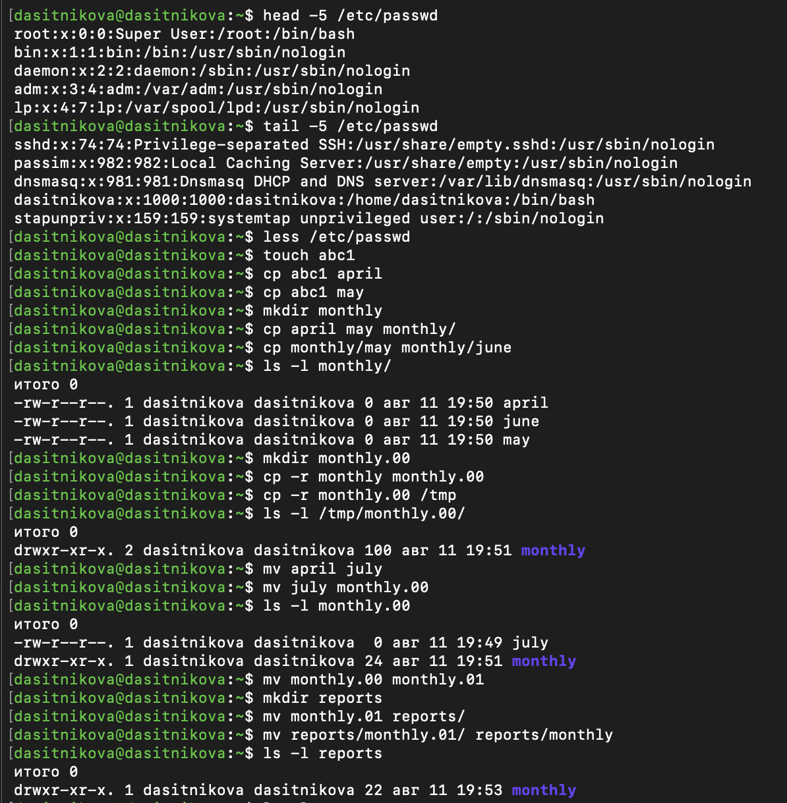
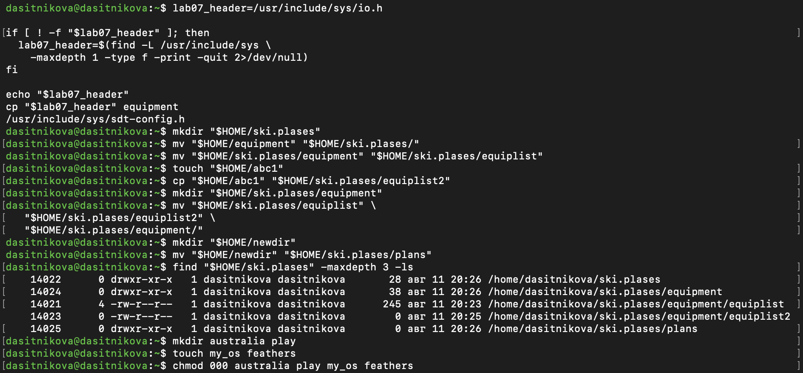
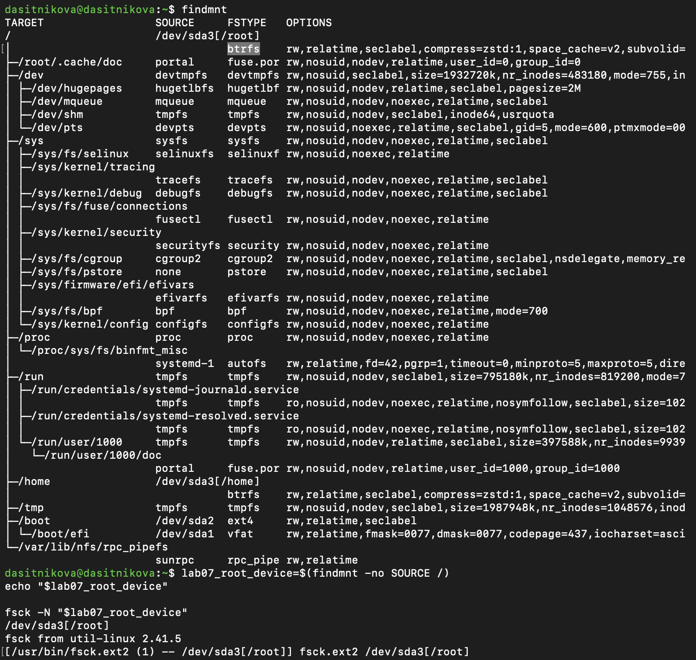

---
## Author
author:
  name: Ситникова Диана Александровна
  degrees: BSc
  email: 1032201746@rudn.ru
  affiliation:
    - name: Российский университет дружбы народов
      country: Российская Федерация
      postal-code: 117198
      city: Москва
      address: ул. Миклухо-Маклая, д. 6
## Title
title: "Лабораторная работа № 7"
subtitle: "Анализ файловой системы Linux. Команды для работы с файлами и каталогами"
license: CC BY
date: today
date-format: "YYYY-MM-DD"
---

# Введение

## Докладчик

:::::::::::::: {.columns align=center}
::: {.column width="68%"}

- Ситникова Диана Александровна
- направление 09.03.03 «Прикладная информатика»
- Российский университет дружбы народов
- [1032201746@rudn.ru](mailto:1032201746@rudn.ru)

:::
::: {.column width="32%"}

{width=100%}

:::
::::::::::::::

## Цель работы

Ознакомление с файловой системой Linux, её структурой, именами и содержанием каталогов.

Приобретение практических навыков по применению команд:

- для работы с файлами и каталогами;
- для управления процессами и работами;
- для проверки использования диска;
- для обслуживания файловой системы.

## Последовательность работы (1/2) {.smaller}

1. Выполнить примеры просмотра, копирования, перемещения и изменения прав.

2. Создать структуру `~/ski.plases`:

   - подготовить файл `equipment`;
   - переименовать его в `equiplist`;
   - создать `equiplist2`;
   - поместить файлы в `equipment`;
   - переместить `newdir` под именем `plans`.

3. Назначить объектам `australia`, `play`, `my_os`, `feathers` заданные режимы доступа.

## Последовательность работы (2/2) {.smaller}

4. Проверить влияние прав доступа:

   - чтение и копирование файла без права `r`;
   - переход в каталог без права `x`;
   - восстановление необходимых разрешений.

5. Исследовать файловые системы при помощи:

   - `mount`, `findmnt`, `/etc/fstab`;
   - `df` и безопасного режима `fsck -N`;
   - справочных страниц `mount`, `fsck`, `mkfs`, `kill`.

## Linux объединяет файловые системы в единое дерево

```text
/
├── boot      загрузочные файлы
├── dev       файлы устройств
├── etc       системная конфигурация
├── home      данные пользователей
├── proc      процессы и параметры ядра
├── sys       устройства и драйверы
├── tmp       временные объекты
├── usr       программы и библиотеки
└── var       журналы и изменяемые данные
```

Отдельная файловая система становится доступной после монтирования в выбранный каталог.

## `cp` создаёт копию, `mv` меняет положение или имя

| Команда | Основное назначение | Важные опции |
|---|---|---|
| `cp` | копирование файлов | `-i`, `-p`, `-v` |
| `cp -r` | копирование каталогов | `-R`, `-a` |
| `mv` | перенос и переименование | `-i`, `-n`, `-v` |

```bash
cp source.txt copy.txt
cp -r source_dir destination_dir
mv old_name new_name
mv file.txt directory/
```

## Права задаются для владельца, группы и остальных

| Право | Файл | Каталог |
|---|---|---|
| `r` | чтение содержимого | просмотр имён |
| `w` | изменение | создание и удаление записей |
| `x` | выполнение | вход и доступ по имени |

```text
drwxr--r--  = 744
drwx--x--x  = 711
-r-xr--r--  = 544
-rw-rw-r--  = 664
```

# Выполнение работы

## Команды просмотра и управления файлами проверены

:::::::::::::: {.columns align=center}
::: {.column width="31%"}

- `head`, `tail`, `less` просмотрели `/etc/passwd`;
- `cp` создала копии файлов;
- `cp -r` скопировала каталоги;
- `mv` выполнила перенос и переименование.

:::
::: {.column width="69%"}

{width=100%}

:::
::::::::::::::

## Структура `ski.plases` соответствует заданию

:::::::::::::: {.columns align=center}
::: {.column width="32%"}

```text
ski.plases/
├── equipment/
│   ├── equiplist
│   └── equiplist2
└── plans/
```

Вместо отсутствующего `io.h` использован разрешённый заданием файл `sdt-config.h`.

:::
::: {.column width="68%"}

{width=100%}

:::
::::::::::::::

## Заданные режимы подтверждены командой `stat`

:::::::::::::: {.columns align=center}
::: {.column width="29%"}

| Объект | Режим |
|---|---:|
| `australia` | 744 |
| `play` | 711 |
| `my_os` | 544 |
| `feathers` | 664 |

Символьная и восьмеричная формы описывают одни и те же права.

:::
::: {.column width="71%"}

{width=100%}

:::
::::::::::::::

## Отсутствующее право блокирует соответствующую операцию

:::::::::::::: {.columns align=center}
::: {.column width="31%"}

- без `u+r` файл нельзя прочитать и скопировать;
- без `u+x` невозможно перейти в каталог;
- `chmod u+r` и `chmod u+x` восстанавливают доступ.

Проверка выполнена от имени владельца объектов.

:::
::: {.column width="69%"}

{width=100%}

:::
::::::::::::::

## Fedora использует три дисковые файловые системы

:::::::::::::: {.columns align=center}
::: {.column width="34%"}

| Точка | Устройство | Тип |
|---|---|---|
| `/` | `/dev/sda3` | Btrfs |
| `/home` | `/dev/sda3` | Btrfs |
| `/boot` | `/dev/sda2` | ext4 |
| `/boot/efi` | `/dev/sda1` | VFAT |

`df -h` показала использование пространства на каждом смонтированном разделе.

:::
::: {.column width="66%"}

{width=100%}

:::
::::::::::::::

## `findmnt` отделяет дисковые системы от виртуальных

:::::::::::::: {.columns align=center}
::: {.column width="33%"}

- Btrfs содержит отдельные подтома `/root` и `/home`;
- ext4 обслуживает загрузочный раздел;
- VFAT предоставляет раздел EFI;
- `proc`, `sysfs`, `tmpfs` и `cgroup2` создаются ядром;
- `fsck -N` не изменяет файловую систему.

:::
::: {.column width="67%"}

{width=100%}

:::
::::::::::::::

# Результаты

## Все этапы задания выполнены

| Этап | Полученный результат |
|---|---|
| Текстовые файлы | проверены `cat`, `less`, `head`, `tail` |
| Файлы и каталоги | освоены `cp`, `cp -r`, `mv` |
| Права доступа | назначены и проверены режимы 744, 711, 544, 664 |
| Ограничения | получены ожидаемые отказы без `r` и `x` |
| Файловые системы | исследованы Btrfs, ext4, VFAT и виртуальные системы |
| Обслуживание | изучены `mount`, `df`, `fsck`, `mkfs`, `kill` |

## Выводы

- Файловые системы Linux образуют единое дерево каталогов.
- `cp` и `mv` обеспечивают основные операции копирования, переноса и переименования.
- Права `r`, `w`, `x` имеют разный смысл для файлов и каталогов.
- `mount`, `findmnt`, `/etc/fstab` и `df` дают взаимодополняющее описание хранилища.
- Проверка и восстановление должны учитывать тип файловой системы и состояние монтирования.
- Цель лабораторной работы достигнута.

## Основные источники

- Методические указания к лабораторной работе.
- GNU Coreutils Manual: <https://www.gnu.org/software/coreutils/manual/coreutils.html>.
- `mount(8)`, `fsck(8)`, `mkfs(8)`: <https://man7.org/linux/man-pages/>.
- Filesystem Hierarchy Standard 3.0: <https://refspecs.linuxfoundation.org/FHS_3.0/>.
