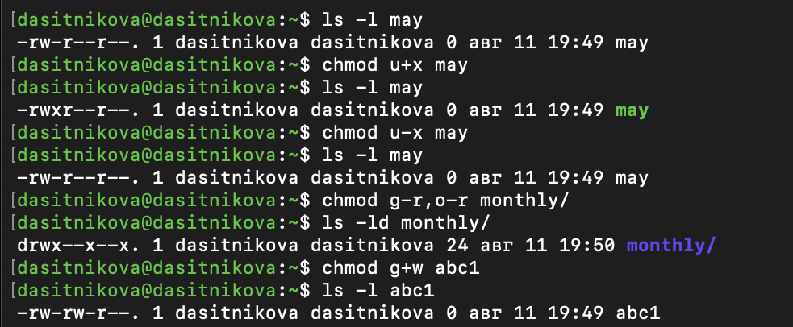
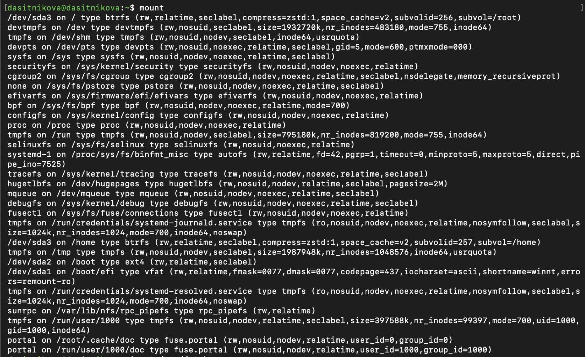
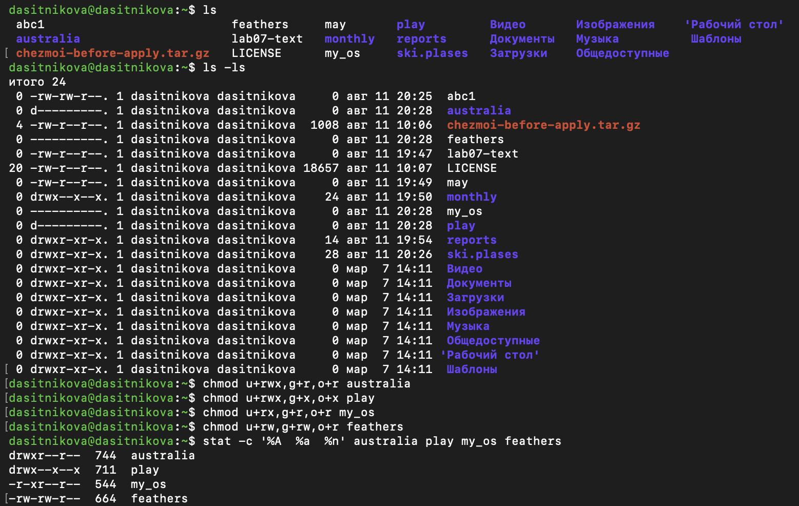
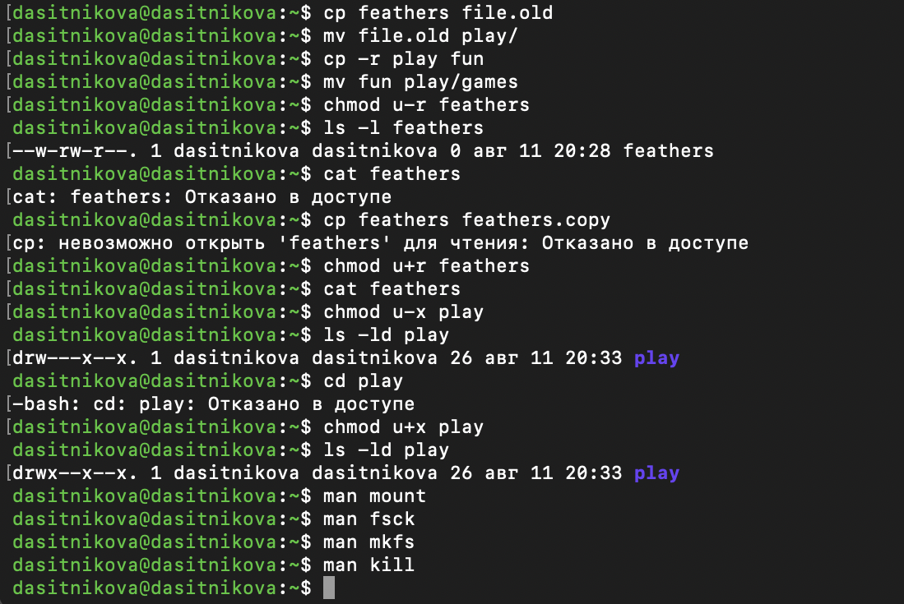

---
## Author
author:
  name: Ситникова Диана Александровна
  degrees: BSc
  email: 1032201746@rudn.ru
  affiliation:
    - name: Российский университет дружбы народов
      country: Российская Федерация
      postal-code: 117198
      city: Москва
      address: ул. Миклухо-Маклая, д. 6

## Title
title: "Отчёт по лабораторной работе № 7"
subtitle: "Анализ файловой системы Linux. Команды для работы с файлами и каталогами"
license: "CC BY"
bibliography: bib/cite.bib
---

# Цель работы

Ознакомление с файловой системой Linux, её структурой, именами и содержанием каталогов. Приобретение практических навыков по применению команд для работы с файлами и каталогами, по управлению процессами (и работами), по проверке использования диска и обслуживанию файловой системы.

# Задание

В соответствии с методическими указаниями необходимо выполнить следующую последовательность действий [@rudn_lab07_files]:

1. Выполнить все примеры, приведённые в первой части описания лабораторной работы.

2. Выполнить следующие действия, зафиксировав используемые команды и результаты:

   2.1\. Скопировать файл `/usr/include/sys/io.h` в домашний каталог и назвать его `equipment`. Если файла `io.h` нет, использовать другой файл из каталога `/usr/include/sys/`.

   2.2\. Создать в домашнем каталоге директорию `~/ski.plases`.

   2.3\. Переместить файл `equipment` в каталог `~/ski.plases`.

   2.4\. Переименовать `~/ski.plases/equipment` в `~/ski.plases/equiplist`.

   2.5\. Создать в домашнем каталоге файл `abc1` и скопировать его в `~/ski.plases` под именем `equiplist2`.

   2.6\. Создать каталог `~/ski.plases/equipment`.

   2.7\. Переместить файлы `equiplist` и `equiplist2` в каталог `~/ski.plases/equipment`.

   2.8\. Создать каталог `~/newdir`, переместить его в `~/ski.plases` и назвать `plans`.

3. Определить опции команды `chmod`, необходимые для назначения следующих прав доступа при исходном отсутствии прав:

   3.1\. `drwxr--r--` для каталога `australia`.

   3.2\. `drwx--x--x` для каталога `play`.

   3.3\. `-r-xr--r--` для файла `my_os`.

   3.4\. `-rw-rw-r--` для файла `feathers`.

4. Выполнить упражнения с файлами и правами доступа:

   4.1\. Просмотреть содержимое системного файла учётных записей `/etc/passwd`.

   4.2\. Скопировать `~/feathers` в `~/file.old`.

   4.3\. Переместить `~/file.old` в каталог `~/play`.

   4.4\. Скопировать каталог `~/play` в каталог `~/fun`.

   4.5\. Переместить каталог `~/fun` в `~/play` под именем `games`.

   4.6\. Лишить владельца файла `~/feathers` права на чтение.

   4.7\. Проверить возможность просмотра `~/feathers` командой `cat`.

   4.8\. Проверить возможность копирования `~/feathers`.

   4.9\. Вернуть владельцу файла `~/feathers` право на чтение.

   4.10\. Лишить владельца каталога `~/play` права на выполнение.

   4.11\. Проверить возможность перехода в каталог `~/play`.

   4.12\. Вернуть владельцу каталога `~/play` право на выполнение.

5. Прочитать справочные руководства по командам `mount`, `fsck`, `mkfs`, `kill`, кратко охарактеризовать команды и привести примеры.

# Краткие теоретические сведения

## Назначение файловой системы и уровень VFS

Файловая система задаёт правила организации, именования, хранения и поиска данных. Она связывает логические объекты, с которыми работает пользователь, с блоками данных и служебными структурами на носителе. Операционная система должна уметь определить местоположение объекта, проверить права доступа, прочитать его метаданные и передать данные процессу. Поэтому файловая система включает не только содержимое файлов, но и каталоги, сведения о владельцах, режимы доступа, временные метки и информацию о размещении данных [@rudn_lab07_files; @tanenbaum_modern_os].

Linux поддерживает одновременно множество реализаций файловых систем. Прикладные программы обращаются к ним через единый слой виртуальной файловой системы VFS. Благодаря этому одинаковые системные вызовы `open`, `read`, `write`, `stat` и `close` применяются к объектам Btrfs, ext4, VFAT, сетевых и виртуальных файловых систем. Различия конкретного формата скрываются за общим интерфейсом, а все подключённые файловые системы включаются в одно дерево каталогов с корнем `/`.

Физический раздел и файловая система не являются одним и тем же понятием. Раздел представляет диапазон блоков на устройстве, а файловая система является размещённой на нём структурой данных. Кроме раздела диска источником файловой системы может быть логический том, образ, сетевой ресурс, область оперативной памяти или интерфейс ядра. До монтирования содержимое самостоятельной файловой системы не включено в основное дерево имён Linux.

## Файлы, каталоги, индексные дескрипторы и ссылки

В Unix-подобной системе понятие файла применяется к различным объектам ввода-вывода. Основные типы объектов и их обозначения в первом символе вывода `ls -l` приведены в @tbl-file-types [@linux_inode].

| Обозначение | Тип объекта | Назначение |
|:---:|---|---|
| `-` | обычный файл | текст, двоичные данные, программа или иной поток байтов |
| `d` | каталог | таблица соответствий между именами и объектами файловой системы |
| `l` | символическая ссылка | отдельный объект, содержащий путь к другому объекту |
| `c` | символьное устройство | последовательный обмен данными с устройством |
| `b` | блочное устройство | обмен блоками данных с накопителем или виртуальным устройством |
| `p` | именованный канал FIFO | односторонний межпроцессный обмен данными |
| `s` | сокет | локальное или сетевое взаимодействие процессов |

: Основные типы объектов файловой системы {#tbl-file-types}

В файловых системах Unix метаданные объекта связаны с индексным дескриптором, или inode. Он содержит тип и режим объекта, UID владельца, GID группы, размер, число жёстких ссылок, временные метки и сведения о размещении данных. Имя файла хранится не в inode, а в записи каталога, которая связывает имя с номером inode. Поэтому один объект может иметь несколько жёстких ссылок, то есть несколько имён, указывающих на один inode. Жёсткая ссылка не может пересекать границу файловой системы, поскольку номер inode уникален только внутри неё [@linux_inode].

Символическая ссылка устроена иначе: это самостоятельный файл, содержимым которого является путь к целевому объекту. Она может ссылаться на каталог и пересекать границы файловых систем, но становится недействительной, если цель перемещена или удалена. Количество жёстких ссылок, размер, права, владельца и временные метки можно исследовать командами `ls -li` и `stat`.

Каталог содержит специальные записи `.` и `..`. Первая обозначает текущий каталог, вторая --- родительский. Корневой каталог является вершиной дерева, поэтому для него `..` не ведёт выше корня. Удаление имени обычного файла уменьшает счётчик его жёстких ссылок; данные освобождаются, когда не остаётся ни одной ссылки и ни один процесс не держит файл открытым.

## Иерархия каталогов и пути

Расположение системных объектов стандартизуется Filesystem Hierarchy Standard. Это упрощает перенос программ, работу административных средств и интерпретацию путей в документации [@fhs30]. Назначение основных каталогов приведено в @tbl-root-dirs.

| Каталог | Назначение |
|---|---|
| `/bin` | основные пользовательские команды; в современных системах часто ссылка на `/usr/bin` |
| `/boot` | ядро, `initramfs`, файлы загрузчика и данные, необходимые до монтирования корня |
| `/dev` | специальные файлы устройств, создаваемые и обслуживаемые подсистемами ядра и `udev` |
| `/etc` | конфигурационные файлы конкретной системы |
| `/home` | домашние каталоги обычных пользователей |
| `/lib`, `/lib64` | основные библиотеки и модули; часто ссылки на каталоги внутри `/usr` |
| `/media` | точки автоматического монтирования сменных носителей |
| `/mnt` | временные точки ручного монтирования |
| `/opt` | дополнительные автономные программные пакеты |
| `/proc` | виртуальное представление процессов и параметров ядра |
| `/root` | домашний каталог суперпользователя |
| `/run` | изменяемые данные текущего сеанса: PID-файлы, сокеты и состояние служб |
| `/sbin` | системные административные команды; часто ссылка на `/usr/sbin` |
| `/srv` | данные, предоставляемые системными службами |
| `/sys` | виртуальное представление устройств, драйверов и подсистем ядра |
| `/tmp` | временные файлы, которые могут удаляться автоматически |
| `/usr` | основная часть программ, библиотек, заголовков, документации и общих ресурсов |
| `/var` | изменяемые данные: журналы, очереди, кэш, базы состояния и данные служб |

: Основные каталоги верхнего уровня {#tbl-root-dirs}

Путь к объекту бывает абсолютным и относительным. Абсолютный путь начинается с `/` и не зависит от текущего каталога. Относительный путь интерпретируется от рабочего каталога процесса, который можно вывести командой `pwd` и изменить командой `cd`. Обозначение `~` разворачивается командной оболочкой в домашний каталог пользователя. Начальная точка пути важна: `tmp/file`, `/tmp/file` и `~/tmp/file` обозначают разные объекты.

Имена в Linux чувствительны к регистру. Почти любой байт, кроме нулевого, допустим внутри имени, а символ `/` используется как разделитель компонентов пути. Поэтому имена с пробелами необходимо заключать в кавычки или экранировать. Опция `--` завершает список опций команды и позволяет безопаснее работать с именем, начинающимся с дефиса, например `rm -- -file`.

## Создание и просмотр текстовых файлов

Команда `touch` создаёт пустой обычный файл, если указанного имени ещё нет. Если объект существует, команда по умолчанию обновляет время доступа и время изменения, не меняя содержимое. Это отличает `touch` от текстового редактора: команда создаёт объект или изменяет его метаданные, но не вводит текст [@gnu_coreutils].

Для просмотра применяются `cat`, `less`, `head` и `tail`, рассмотренные в методических указаниях [@rudn_lab07_files]. Их назначение различается:

| Команда | Основное применение | Характерные возможности |
|---|---|---|
| `cat` | вывод короткого файла или объединение потоков | нумерация непустых строк `-b`, всех строк `-n` |
| `less` | интерактивный постраничный просмотр | поиск `/образец`, переход вперёд `Space`, назад `b`, выход `q` |
| `head` | просмотр начала файла | `-n N` задаёт число строк, `-c N` --- число байтов |
| `tail` | просмотр конца файла и журналов | `-n N`, `-c N`, наблюдение за дополнением `-f` |

: Команды просмотра текстовых файлов {#tbl-text-viewers}

Команда `cat` последовательно читает указанные файлы и выводит данные в стандартный поток вывода. Она удобна в конвейере или для небольшого файла, но большой файл быстро прокрутит экран. `less` не загружает весь текст в окно терминала и предоставляет навигацию. `head` и `tail` извлекают ограниченную часть входа, поэтому полезны для первичного анализа конфигураций и журналов.

~~~bash
cat /etc/passwd
less /etc/passwd
head -5 /etc/passwd
tail -5 /etc/passwd
~~~

Системный файл `/etc/passwd` содержит по одной записи на локальную учётную запись. Поля разделяются двоеточиями: имя, поле пароля, UID, GID, описание, домашний каталог и оболочка входа. Символ `x` в поле пароля означает, что защищённый хеш находится в `/etc/shadow`, доступ к которому ограничен. Для системных учётных записей часто указывается оболочка `nologin`, запрещающая интерактивный вход.

## Копирование файлов и каталогов

Команда `cp` создаёт новый объект назначения на основе источника. Основные формы синтаксиса имеют вид [@gnu_coreutils]:

~~~text
cp [опции] источник назначение
cp [опции] источник... каталог
~~~

Если последний аргумент является существующим каталогом, копии получают исходные имена и помещаются внутрь него. Если указаны два пути к файлам, второй путь задаёт имя копии. При обычном копировании содержимое переносится в другой inode, поэтому последующее изменение копии не меняет исходный файл. Исключением являются оптимизированные CoW-копии, которые сначала могут совместно использовать физические блоки, но логически остаются независимыми.

Без специальных опций `cp` не копирует непустой каталог. Опция `-R` или `-r` включает рекурсивный обход. Режим `-a` предназначен для архивного копирования: он рекурсивно воспроизводит дерево и стремится сохранить ссылки и основные атрибуты. Опция `-p` сохраняет режим, владельца и временные метки в пределах прав пользователя. Поведение при существующем назначении управляется опциями `-i`, `-n`, `-f` и `-u`; опция `-v` выводит выполняемые операции.

| Опция `cp` | Назначение |
|:---:|---|
| `-R`, `-r` | рекурсивно копировать каталоги |
| `-a` | архивный режим с сохранением структуры и атрибутов |
| `-p` | сохранить режим, владельца и временные метки |
| `-i` | запросить подтверждение перед заменой |
| `-n` | не перезаписывать существующий объект |
| `-u` | копировать, если источник новее назначения или назначения нет |
| `-v` | показывать копируемые объекты |
| `-L`, `-P` | следовать или не следовать символическим ссылкам |

: Основные опции команды `cp` {#tbl-cp-options}

Перед рекурсивным копированием важно определить ожидаемую структуру. Если каталог назначения уже существует, источник обычно помещается внутрь него; если не существует, создаётся каталог с указанным именем. По этой причине команды `cp -r monthly monthly.00` и `cp -r monthly.00 /tmp` следует интерпретировать с учётом предварительного состояния назначения.

## Перемещение и переименование

Команда `mv` изменяет положение или имя файла, каталога либо ссылки. В пределах одной файловой системы операция обычно сводится к изменению записей каталогов, поэтому выполняется быстро и не дублирует данные. При переносе на другую файловую систему требуется копирование содержимого с последующим удалением исходного объекта после успешного завершения [@gnu_coreutils].

~~~bash
mv old_name new_name
mv file.txt destination_directory/
mv directory new_directory_name
~~~

Интерпретация второго аргумента зависит от того, существует ли он и является ли каталогом. Существующий каталог становится местом назначения, а иной путь --- новым именем объекта. Опции `-i`, `-n`, `-f` и `-u` управляют заменой существующего назначения, а `-v` позволяет зафиксировать выполняемые действия. При переносе каталога требуется право записи и выполнения на каталог-источник и каталог-назначение; право записи на содержимое перемещаемого файла для самого переименования не обязательно.

Копирование и перемещение необходимо различать. После `cp` существуют исходный объект и копия. После успешного `mv` исходное имя исчезает, а объект доступен по новому пути. Переименование также не следует путать с изменением содержимого: путь меняется, но данные файла остаются прежними.

## Модель прав доступа

Режим доступа содержит три тройки прав: для владельца `u`, членов группы `g` и остальных пользователей `o`. В каждой тройке используются чтение `r`, запись `w` и выполнение `x`. Перед ними `ls -l` выводит тип объекта. Например, `-rw-r--r--` обозначает обычный файл, доступный владельцу для чтения и записи, а группе и остальным --- только для чтения.

Смысл одного и того же бита зависит от типа объекта, что показано в @tbl-permission-semantics.

| Право | Для обычного файла | Для каталога |
|:---:|---|---|
| `r` | читать и копировать содержимое | получать список имён каталога |
| `w` | изменять или сокращать содержимое | создавать, удалять и переименовывать записи каталога |
| `x` | запускать файл как программу или сценарий | проходить каталог и обращаться к объектам по известному имени |

: Смысл прав для файла и каталога {#tbl-permission-semantics}

Права каталога действуют совместно. Наличие `r` без `x` позволяет получить имена, но обычно не позволяет прочитать метаданные объектов. Наличие `x` без `r` запрещает перечисление имён, однако допускает обращение к заранее известному пути, если права на последующих компонентах это позволяют. Удаление файла определяется прежде всего правами на содержащий его каталог, поскольку операция изменяет запись каталога.

Проверка выполняется относительно эффективных идентификаторов процесса. Сначала ядро рассматривает права владельца, если UID процесса совпадает с UID объекта; иначе права группы, если совпадает GID или одна из дополнительных групп; иначе права остальных. Эти категории не суммируются: применяется одна подходящая тройка.

## Изменение прав командой `chmod`

Команда `chmod` задаёт режим в символьной или восьмеричной форме. Изменить режим может владелец объекта или процесс с соответствующими административными полномочиями. В символьной форме категория `u`, `g`, `o` или `a` сочетается с операцией `+`, `-` или `=` и набором прав [@rudn_lab07_files; @gnu_coreutils]:

~~~text
chmod [ugoa][+-=][rwx] объект
~~~

Оператор `+` добавляет выбранные биты, `-` удаляет, а `=` устанавливает ровно указанный набор для выбранной категории. Несколько изменений можно записать через запятую: `chmod u+rw,g+r,o-r file`.

В числовой форме каждому праву соответствует бит: `r = 4`, `w = 2`, `x = 1`. Сумма задаётся отдельно для владельца, группы и остальных.

| Восьмеричное значение | Двоичная форма | Символьная запись | Права |
|---:|:---:|:---:|---|
| 7 | `111` | `rwx` | чтение, запись и выполнение |
| 6 | `110` | `rw-` | чтение и запись |
| 5 | `101` | `r-x` | чтение и выполнение |
| 4 | `100` | `r--` | только чтение |
| 3 | `011` | `-wx` | запись и выполнение |
| 2 | `010` | `-w-` | только запись |
| 1 | `001` | `--x` | только выполнение |
| 0 | `000` | `---` | права отсутствуют |

: Формы записи прав доступа {#tbl-permissions}

Команды `chmod 744 australia` и `chmod u+rwx,g+r,o+r australia` задают одинаковые биты. Для каталога этот режим предоставляет владельцу полный доступ, а группе и остальным позволяет читать список имён, но не проходить каталог из-за отсутствия `x`. Режим `711` для каталога разрешает владельцу полный доступ, а остальным --- проход по известному пути без просмотра списка.

Начальный режим нового объекта ограничивается маской `umask`. Для обычного файла исходной основой обычно служит `666`, для каталога --- `777`; биты, установленные в `umask`, исключаются. Например, `umask 022` обычно приводит к режимам `644` для файла и `755` для каталога. Владелец и группа изменяются командами `chown` и `chgrp`. Дополнительные биты `setuid`, `setgid` и `sticky` решают специальные задачи, но не заменяют основные права `r`, `w`, `x`.

## Типы файловых систем в исследуемой системе

В виртуальной машине обнаружены дисковые файловые системы Btrfs, ext4 и VFAT. Их назначение различается.

| Файловая система | Точка монтирования | Характеристика |
|---|---|---|
| Btrfs на `/dev/sda3` | `/`, `/home` | CoW-файловая система с подтомами, контрольными суммами, снимками и сжатием |
| ext4 на `/dev/sda2` | `/boot` | журналируемая Linux-файловая система для ядра, `initramfs` и загрузочных данных |
| VFAT на `/dev/sda1` | `/boot/efi` | совместимая с UEFI файловая система системного раздела EFI |

: Дисковые файловые системы виртуальной машины {#tbl-disk-filesystems}

Btrfs использует Copy-on-Write: изменённые блоки записываются отдельно, а затем обновляются ссылки в метаданных. Эта модель позволяет создавать снимки без полного копирования файлов. Btrfs поддерживает подтома, контрольные суммы данных и метаданных, сжатие и reflink-копии [@btrfs_docs]. В Fedora подтома `root` и `home` одной файловой системы Btrfs смонтированы в разные точки, поэтому вывод `df` показывает один и тот же раздел `/dev/sda3` для `/` и `/home`.

Ext4 применяет журналирование метаданных, экстенты и стандартную модель Unix-прав. Отдельный `/boot` обеспечивает загрузчику прямой доступ к ядрам и образам ранней загрузки. VFAT используется для раздела EFI из-за требований совместимости UEFI. VFAT не хранит владельца и традиционные Unix-права для каждого объекта, поэтому видимые права формируются опциями монтирования, например `umask`, `fmask` и `dmask`.

Кроме дисковых, в Linux подключены виртуальные файловые системы. `proc` представляет процессы и параметры ядра; `sysfs` --- устройства и драйверы; `devtmpfs` содержит узлы устройств; `tmpfs` хранит данные преимущественно в оперативной памяти; `devpts` обслуживает псевдотерминалы; `cgroup2` предоставляет иерархию управления ресурсами процессов; `efivarfs` открывает доступ к переменным UEFI. Они занимают места в общем дереве, но не соответствуют отдельным разделам виртуального диска.

## Монтирование и файл `/etc/fstab`

Монтирование присоединяет корень выбранной файловой системы к каталогу, называемому точкой монтирования. После этого прежнее содержимое каталога временно скрывается, а обращение к пути направляется в подключённую файловую систему. Размонтирование командой `umount` прекращает такое соответствие. Размонтировать занятую файловую систему нельзя, пока процессы используют её файлы или имеют внутри неё рабочие каталоги [@util_linux_mount].

Команда `mount` без аргументов показывает текущие подключения строками вида «источник on точка type тип (опции)». `findmnt` отображает те же сведения в табличной или древовидной форме и удобна для анализа вложенных монтирований.

~~~bash
mount
findmnt
findmnt -no SOURCE,FSTYPE,OPTIONS /
~~~

Постоянная конфигурация хранится в `/etc/fstab`. Каждая рабочая строка содержит шесть полей.

| Поле | Содержание |
|---:|---|
| 1 | источник: устройство, `UUID=...`, `LABEL=...` или другой идентификатор |
| 2 | точка монтирования либо `swap` |
| 3 | тип файловой системы или `auto` |
| 4 | список опций монтирования через запятую |
| 5 | флаг для исторической утилиты `dump` |
| 6 | порядок проверки `fsck` при загрузке; `0` отключает проверку |

: Поля записи `/etc/fstab` {#tbl-fstab-fields}

UUID предпочтительнее имени `/dev/sdXN`, потому что имя устройства может измениться при другом порядке обнаружения. Частые опции включают `rw` и `ro`, `relatime`, `noexec`, `nosuid`, `nodev`, `noauto` и `user`. Специфические опции Btrfs `subvol` и `compress` выбирают подтом и алгоритм прозрачного сжатия. Неправильная запись в `/etc/fstab` может помешать штатному монтированию при загрузке, поэтому конфигурацию проверяют до перезапуска системы.

## Использование дискового пространства

Команда `df` получает сведения о смонтированных файловых системах и выводит общий объём, занятое и доступное пространство, процент использования и точку монтирования. Опция `-h` выбирает удобные двоичные единицы, а `-T` добавляет тип файловой системы [@gnu_coreutils].

~~~bash
df -h
df -Th
~~~

`df` описывает файловую систему целиком, а не сумму видимых размеров отдельных файлов. Для оценки пространства, занятого деревом каталогов, используется `du`. Значения `df` и `du` могут различаться из-за служебных структур, зарезервированных блоков, разреженных файлов, снимков, CoW-экстентов и удалённых, но ещё открытых процессами файлов.

Заполненность влияет не только на возможность записать пользовательские данные. Файловой системе требуется пространство для метаданных, журналирования или CoW-операций. Поэтому длительная работа при почти полном разделе повышает риск ошибок приложений и затрудняет обслуживание.

## Проверка, восстановление и создание файловых систем

Нарушения целостности могут быть вызваны аварийным отключением питания, принудительным завершением работы, отсоединением носителя без размонтирования, аппаратными ошибками накопителя или памяти, ошибками драйверов и некорректными административными действиями. Журналируемые и CoW-файловые системы уменьшают последствия незавершённых операций, но не заменяют резервное копирование.

Команда `fsck` является диспетчером специализированных средств, например `fsck.ext4`. Она определяет тип файловой системы и запускает подходящую проверку [@util_linux_fsck]. Опция `-N` показывает предполагаемый вызов без выполнения, а `-M` позволяет пропустить смонтированные файловые системы.

~~~bash
fsck -N /dev/sda2
~~~

Проверка с исправлением обычно выполняется на размонтированном разделе. Изменение служебных структур активной файловой системы может конфликтовать с действиями ядра и усугубить повреждение. До ремонта следует определить устройство через `findmnt` или `lsblk`, сохранить доступные данные, прочитать руководство конкретной файловой системы и использовать её штатное средство.

Для Btrfs применяются специализированные команды. `btrfs scrub` последовательно читает данные и метаданные, сверяет контрольные суммы и при наличии избыточной копии может восстановить повреждённый блок. `btrfs check` проверяет внутренние структуры в автономном режиме. Опция `--repair` изменяет метаданные и используется только в исключительной ситуации после резервного копирования и квалифицированной диагностики [@btrfs_docs].

Команда `mkfs` создаёт новую файловую систему на блочном устройстве и обычно вызывает специализированную программу `mkfs.<тип>` [@util_linux_mkfs]. Например, `mkfs.ext4`, `mkfs.btrfs` и `mkfs.vfat` формируют разные структуры метаданных. Форматирование уничтожает прежнюю логическую организацию данных, поэтому перед запуском необходимо проверить устройство, размонтировать его и убедиться в наличии резервной копии. В данной работе `mkfs` изучалась только по справочному руководству и не запускалась на разделах виртуальной машины.

## Процессы, задания и сигналы

Процесс является выполняющимся экземпляром программы и имеет уникальный идентификатор PID. Командная оболочка дополнительно ведёт понятие задания: запущенная из неё команда или конвейер могут выполняться на переднем либо заднем плане. Встроенная команда `jobs` показывает задания текущей оболочки, `fg` переводит выбранное задание на передний план, а `bg` продолжает остановленное задание в фоне.

Команда `kill` не обязана «уничтожать» процесс: она отправляет ему сигнал. По умолчанию используется `SIGTERM`, запрашивающий корректное завершение и допускающий освобождение ресурсов. Номер или имя сигнала задаётся опцией, а доступные обозначения выводятся командой `kill -l` [@linux_signal].

| Сигнал | Номер в Linux | Назначение |
|---|---:|---|
| `SIGHUP` | 1 | уведомление о разрыве терминала; многие службы трактуют его как запрос перечитать конфигурацию |
| `SIGINT` | 2 | интерактивное прерывание, обычно передаваемое сочетанием `Ctrl+C` |
| `SIGTERM` | 15 | штатный запрос завершения процесса |
| `SIGKILL` | 9 | безусловное завершение ядром без обработки процессом |
| `SIGSTOP` | 19 | безусловная остановка процесса |
| `SIGCONT` | 18 | продолжение остановленного процесса |

: Некоторые сигналы Linux {#tbl-signals}

~~~bash
kill PID
kill -TERM PID
kill -KILL PID
kill -l
~~~

`SIGKILL` и `SIGSTOP` не могут быть перехвачены, заблокированы или проигнорированы процессом. Поэтому `SIGKILL` применяют только после неудачи штатного `SIGTERM`: процесс не получает возможности сохранить данные и выполнить обработчики завершения. Отправлять сигнал чужому процессу может владелец с подходящими правами или администратор.

## Справочная система `man`

Команда `man` открывает локальное справочное руководство. Страницы распределены по разделам: пользовательские команды обычно находятся в разделе 1, системные вызовы --- в разделе 2, библиотечные функции --- в разделе 3, форматы файлов --- в разделе 5, административные команды --- в разделе 8. Если одинаковое имя встречается в нескольких разделах, нужный раздел указывается явно, например `man 5 fstab` или `man 8 mount`.

Внутри просмотрщика можно искать текст командой `/образец`, переходить между совпадениями клавишами `n` и `N`, прокручивать страницы и завершать просмотр клавишей `q`. В лабораторной работе страницы `mount(8)`, `fsck(8)`, `mkfs(8)` и `kill(1)` использовались для уточнения синтаксиса, опций и ограничений команд.

# Выполнение лабораторной работы

Работа выполнялась в Fedora 43 для архитектуры `aarch64`, запущенной в Oracle VirtualBox на macOS. Команды выполнялись от имени обычного пользователя `dasitnikova`, домашним каталогом которого являлся `/home/dasitnikova`.

## 1. Выполнение примеров из первой части описания работы {.unnumbered}
Выполнить все примеры, приведённые в первой части описания лабораторной работы.

Для просмотра системного файла учётных записей использованы команды `head`, `tail` и `less`. Затем созданы учебные файлы и каталоги, выполнены копирование, рекурсивное копирование, перемещение и переименование объектов:

~~~bash
head -5 /etc/passwd
tail -5 /etc/passwd
less /etc/passwd
touch abc1
cp abc1 april
cp abc1 may
mkdir monthly
cp april may monthly/
cp monthly/may monthly/june
mkdir monthly.00
cp -r monthly monthly.00
cp -r monthly.00 /tmp
mv april july
mv july monthly.00
mv monthly.00 monthly.01
mkdir reports
mv monthly.01 reports/
mv reports/monthly.01 reports/monthly
~~~

На @fig-001 зафиксированы результаты выполнения примеров. Команды `head` и `tail` вывели начальные и конечные записи `/etc/passwd`. Команды `cp` и `mv` сформировали копии и выполнили последовательное переименование и перемещение объектов.

{#fig-001 width=96%}

В примерах изменения прав файлу `may` было добавлено, а затем удалено право выполнения владельца. Для каталога `monthly` удалено право чтения у группы и остальных пользователей, а файлу `abc1` предоставлено право записи для группы:

~~~bash
chmod u+x may
chmod u-x may
chmod g-r,o-r monthly
chmod g+w abc1
~~~

Вывод `ls -l` на @fig-002 подтверждает соответствующие изменения битов режима.

{#fig-002 width=92%}

Для исследования подключённых файловых систем и использования дискового пространства выполнены команды:

~~~bash
mount
cat /etc/fstab
df -h
~~~

На @fig-003 видно, что `/dev/sda3` смонтирован в `/` как Btrfs с подтомом `/root`; этот же раздел содержит подтом `/home`. Раздел `/dev/sda2` использует ext4 и подключён в `/boot`, а `/dev/sda1` использует VFAT и подключён в `/boot/efi`.

{#fig-003 width=98%}

Файл `/etc/fstab` на @fig-004 содержит записи для `/`, `/home`, `/boot` и `/boot/efi`. Команда `df -h` показала 78 ГиБ для `/dev/sda3`, из которых занято 12 ГиБ и доступно 65 ГиБ.

{#fig-004 width=96%}

## 2. Выполнение действий с файлами и каталогами {.unnumbered}
2.1\. Скопировать файл `/usr/include/sys/io.h` в домашний каталог и назвать его `equipment`. Если файла `io.h` нет, использовать другой файл из каталога `/usr/include/sys/`.

2.2\. Создать в домашнем каталоге директорию `~/ski.plases`.

2.3\. Переместить файл `equipment` в каталог `~/ski.plases`.

2.4\. Переименовать `~/ski.plases/equipment` в `~/ski.plases/equiplist`.

2.5\. Создать в домашнем каталоге файл `abc1` и скопировать его в `~/ski.plases` под именем `equiplist2`.

2.6\. Создать каталог `~/ski.plases/equipment`.

2.7\. Переместить файлы `equiplist` и `equiplist2` в каталог `~/ski.plases/equipment`.

2.8\. Создать каталог `~/newdir`, переместить его в `~/ski.plases` и назвать `plans`.

В Fedora для архитектуры `aarch64` файл `/usr/include/sys/io.h` отсутствовал. В соответствии с заданием был использован существующий файл `/usr/include/sys/sdt-config.h`. Перечисленные действия выполнены следующими командами:

~~~bash
lab07_header=/usr/include/sys/io.h
if [ ! -f "$lab07_header" ]; then
  lab07_header=$(find -L /usr/include/sys -maxdepth 1 -type f -print -quit)
fi
cp "$lab07_header" equipment
mkdir "$HOME/ski.plases"
mv "$HOME/equipment" "$HOME/ski.plases/"
mv "$HOME/ski.plases/equipment" "$HOME/ski.plases/equiplist"
touch "$HOME/abc1"
cp "$HOME/abc1" "$HOME/ski.plases/equiplist2"
mkdir "$HOME/ski.plases/equipment"
mv "$HOME/ski.plases/equiplist" \
   "$HOME/ski.plases/equiplist2" \
   "$HOME/ski.plases/equipment/"
mkdir "$HOME/newdir"
mv "$HOME/newdir" "$HOME/ski.plases/plans"
~~~

Итоговая структура проверена командой `find`. На @fig-005 каталог `ski.plases` содержит подкаталоги `equipment` и `plans`, а в `equipment` расположены файлы `equiplist` и `equiplist2`.

{#fig-005 width=97%}

## 3. Назначение заданных прав доступа {.unnumbered}
3.1\. Назначить права `drwxr--r--` каталогу `australia`.

3.2\. Назначить права `drwx--x--x` каталогу `play`.

3.3\. Назначить права `-r-xr--r--` файлу `my_os`.

3.4\. Назначить права `-rw-rw-r--` файлу `feathers`.

Объекты были созданы и переведены в исходный режим `000`, после чего требуемые права назначены символьной формой команды `chmod`:

~~~bash
mkdir australia play
touch my_os feathers
chmod 000 australia play my_os feathers
chmod u+rwx,g+r,o+r australia
chmod u+rwx,g+x,o+x play
chmod u+rx,g+r,o+r my_os
chmod u+rw,g+rw,o+r feathers
stat -c '%A  %a  %n' australia play my_os feathers
~~~

Команда `stat` на @fig-006 подтвердила совпадение требуемых символьных и восьмеричных режимов: `744`, `711`, `544`, `664`.

{#fig-006 width=98%}

## 4. Выполнение упражнений с файлами и правами доступа {.unnumbered}
4.1\. Просмотреть содержимое системного файла учётных записей `/etc/passwd`.

4.2\. Скопировать `~/feathers` в `~/file.old`.

4.3\. Переместить `~/file.old` в каталог `~/play`.

4.4\. Скопировать каталог `~/play` в каталог `~/fun`.

4.5\. Переместить каталог `~/fun` в `~/play` под именем `games`.

4.6\. Лишить владельца файла `~/feathers` права на чтение.

4.7\. Проверить возможность просмотра `~/feathers` командой `cat`.

4.8\. Проверить возможность копирования `~/feathers`.

4.9\. Вернуть владельцу файла `~/feathers` право на чтение.

4.10\. Лишить владельца каталога `~/play` права на выполнение.

4.11\. Проверить возможность перехода в каталог `~/play`.

4.12\. Вернуть владельцу каталога `~/play` право на выполнение.

Содержимое `/etc/passwd` было выведено командой `cat`. На @fig-007 представлены записи системных и пользовательских учётных записей с именами, идентификаторами, домашними каталогами и оболочками входа.

{#fig-007 width=94%}

Операции копирования и перемещения выполнены командами:

~~~bash
cp feathers file.old
mv file.old play/
cp -r play fun
mv fun play/games
~~~

Затем у владельца `feathers` удалено право чтения. Команды `cat feathers` и `cp feathers feathers.copy` завершились сообщением «Отказано в доступе». После выполнения `chmod u+r feathers` доступ был восстановлен. У владельца каталога `play` было удалено право выполнения; попытка `cd play` также завершилась отказом в доступе. Команда `chmod u+x play` восстановила возможность перехода в каталог. Результаты представлены на @fig-008.

{#fig-008 width=94%}

## 5. Работа со справочными руководствами {.unnumbered}
Прочитать справочные руководства по командам `mount`, `fsck`, `mkfs`, `kill`, кратко охарактеризовать команды и привести примеры.

Страницы руководства открыты следующими командами:

~~~bash
man mount
man fsck
man mkfs
man kill
~~~

Команда `mount` подключает файловые системы и выводит список активных подключений. Команда `fsck` запускает проверку файловой системы специализированной программой. Команда `mkfs` создаёт файловую систему на блочном устройстве. Команда `kill` передаёт выбранному процессу сигнал.

Для представления иерархии монтирования дополнительно выполнена команда `findmnt`. На @fig-009 отображены источник, тип и параметры каждой файловой системы. Корень и `/home` являются подтомами Btrfs на `/dev/sda3`, `/boot` использует ext4, `/boot/efi` --- VFAT.

Корневая файловая система была смонтирована, поэтому реальная проверка или восстановление не запускались. Опция `fsck -N` использована для демонстрации планируемого вызова без чтения и изменения данных.

{#fig-009 width=98%}

# Выводы

В результате лабораторной работы изучены структура файловой системы Linux, назначение основных каталогов и принципы монтирования. Получены практические навыки просмотра текстовых файлов, копирования, перемещения и переименования файлов и каталогов. Освоено назначение прав доступа в символьной и восьмеричной формах, экспериментально подтверждено влияние прав чтения и выполнения. Исследованы дисковые и виртуальные файловые системы Fedora, конфигурация `/etc/fstab`, использование пространства и безопасные способы диагностики. Поставленная цель достигнута.

# Ответы на контрольные вопросы

1. **Дайте характеристику каждой файловой системе, существующей на жёстком диске компьютера, на котором вы выполняли лабораторную работу.**

   На виртуальном диске исследуемой Fedora используются Btrfs, ext4 и VFAT. Основная файловая система Btrfs расположена на `/dev/sda3`. Её подтом `root` смонтирован в `/`, а подтом `home` --- в `/home`. Btrfs основана на механизме Copy-on-Write: изменённые блоки записываются в новое место, после чего обновляются ссылки в метаданных. Файловая система поддерживает подтома, снимки состояния, контрольные суммы данных и метаданных, прозрачное сжатие и объединение устройств.

   Раздел `/dev/sda2`, смонтированный в `/boot`, использует ext4. В нём хранятся ядра Linux, образы `initramfs` и файлы загрузчика. Ext4 является журналируемой файловой системой, поддерживает стандартные права Linux, расширенные атрибуты и эффективную работу с большими файлами и томами.

   Системный раздел EFI `/dev/sda1`, смонтированный в `/boot/efi`, отформатирован в VFAT. Он хранит загрузочные файлы UEFI и выбран благодаря совместимости с прошивкой. Права доступа для VFAT определяются параметрами монтирования, поскольку эта файловая система не хранит традиционные Unix-права в собственных метаданных.

   В выводе `mount` и `findmnt` также присутствуют `proc`, `sysfs`, `devtmpfs`, `tmpfs`, `devpts`, `cgroup2`, `securityfs`, `efivarfs` и другие виртуальные файловые системы. Они предоставляют интерфейсы к процессам, устройствам, оперативной памяти и подсистемам ядра, но не являются отдельными файловыми системами на виртуальном жёстком диске.

2. **Приведите общую структуру файловой системы и дайте характеристику каждой директории первого уровня этой структуры.**

   Файловая система Linux представляет единое иерархическое дерево, вершиной которого является корневой каталог `/`. Каталог `/boot` содержит ядро, `initramfs` и файлы загрузчика; `/dev` --- специальные файлы устройств; `/etc` --- общесистемную конфигурацию; `/home` --- домашние каталоги пользователей; `/media` --- точки автоматического подключения сменных носителей; `/mnt` --- временные точки ручного монтирования; `/opt` --- дополнительное программное обеспечение.

   Каталог `/proc` предоставляет виртуальные сведения о процессах и ядре; `/root` является домашним каталогом суперпользователя; `/run` хранит оперативные данные текущего сеанса; `/srv` предназначен для данных сетевых служб; `/sys` отражает устройства, драйверы и параметры ядра; `/tmp` содержит временные объекты; `/usr` включает основную часть программ, библиотек, документации и общих ресурсов; `/var` содержит изменяемые данные, включая журналы, очереди, кэш и данные служб. Каталоги `/bin`, `/sbin`, `/lib` и `/lib64` в современных дистрибутивах часто являются символическими ссылками на соответствующие каталоги в `/usr` [@fhs30].

3. **Какая операция должна быть выполнена, чтобы содержимое некоторой файловой системы было доступно операционной системе?**

   Файловая система должна быть смонтирована. При монтировании устройство, раздел, сетевой ресурс или виртуальный источник присоединяется к выбранному каталогу общего дерева, называемому точкой монтирования. Например, команда `mount /dev/sdb1 /mnt/data` делает содержимое `/dev/sdb1` доступным через `/mnt/data`. Для отключения используется `umount`. Постоянные правила обычно записываются в `/etc/fstab` [@util_linux_mount].

4. **Назовите основные причины нарушения целостности файловой системы. Как устранить повреждения файловой системы?**

   Целостность может быть нарушена из-за аварийного отключения питания, принудительного завершения работы системы, отключения носителя без размонтирования, аппаратной неисправности накопителя или оперативной памяти, ошибок драйверов и ядра, некорректных административных действий, нехватки свободного пространства либо вредоносного воздействия.

   Перед исправлением необходимо сохранить доступные данные и определить устройство и тип файловой системы. Для ext2, ext3 и ext4 применяется специализированная проверка через `fsck` или `e2fsck`, обычно после размонтирования раздела. Опция `fsck -M` позволяет пропустить смонтированные системы, а `-N` только показывает планируемые действия [@util_linux_fsck]. Для Btrfs применяются `btrfs scrub` и `btrfs check`; режим `btrfs check --repair` допустим лишь в крайнем случае после резервного копирования. Если причиной является физическая неисправность, данные переносятся на исправный носитель.

5. **Как создаётся файловая система?**

   Файловая система создаётся форматированием раздела или другого блочного устройства. Сначала формируется таблица разделов и выбирается устройство, затем запускается специализированная команда, например `mkfs.ext4 /dev/sdb1`, `mkfs.btrfs /dev/sdb2` или `mkfs.vfat /dev/sdb3`. Во время форматирования создаются корневой каталог и служебные структуры, необходимые для хранения данных и метаданных. После этого файловая система монтируется, а при необходимости её UUID, точка монтирования, тип и опции добавляются в `/etc/fstab`. Форматирование изменяет прежнюю структуру носителя, поэтому перед `mkfs` необходимо проверить имя устройства и наличие резервной копии [@util_linux_mkfs].

6. **Дайте характеристику командам для просмотра текстовых файлов.**

   `cat` выводит целый файл или последовательно объединяет несколько файлов. `less` обеспечивает постраничную навигацию, поиск и движение в обоих направлениях. `more` также выполняет постраничный просмотр, но имеет более ограниченные возможности. `head` показывает начало файла, по умолчанию десять строк, а `tail` --- последние десять строк. Опция `tail -f` позволяет наблюдать за добавлением новых строк в журнал. Команда `nl` выводит текст с нумерацией строк, `tac` отображает строки в обратном порядке, а `grep` выбирает строки, соответствующие заданному образцу [@gnu_coreutils].

7. **Приведите основные возможности команды `cp` в Linux.**

   Команда `cp` копирует один файл в другой, помещает несколько файлов в каталог и рекурсивно копирует деревья каталогов. Опции `-R` и `-r` включают рекурсивный обход, `-a` сохраняет структуру и атрибуты, `-p` сохраняет режим, владельца и временные метки, `-i` запрашивает подтверждение, `-n` не перезаписывает существующее назначение, `-u` копирует только отсутствующие или более новые файлы, `-v` выводит выполняемые операции. Опции `-L` и `-P` управляют обработкой символических ссылок. В файловых системах с Copy-on-Write опция `--reflink` может создать логическую копию без немедленного дублирования всех блоков [@gnu_coreutils].

8. **Приведите основные возможности команды `mv` в Linux.**

   Команда `mv` переименовывает и перемещает файлы, символические ссылки и каталоги. При работе в пределах одной файловой системы обычно изменяются только записи каталогов. При переносе между файловыми системами объект копируется, а после успешного копирования исходная версия удаляется. Опция `-i` запрашивает подтверждение перед заменой, `-n` запрещает перезапись, `-f` выполняет замену без запроса, `-u` переносит только более новые объекты, `-v` показывает выполняемые действия. Опция `-t` явно задаёт каталог назначения, а `-T` требует воспринимать назначение как обычный путь, а не как каталог [@gnu_coreutils].

9. **Что такое права доступа? Как они могут быть изменены?**

   Права доступа определяют разрешённые действия над файлом или каталогом для владельца, группы и остальных пользователей. Для обычного файла `r` означает чтение, `w` --- изменение, `x` --- выполнение. Для каталога `r` разрешает просматривать имена, `w` --- изменять состав каталога, `x` --- входить и обращаться к объектам по имени.

   Права изменяются командой `chmod` в символьной форме, например `chmod u+rw file`, либо в восьмеричной форме, например `chmod 664 file`. Владелец изменяется командой `chown`, группа --- `chgrp`, а исходные права новых объектов ограничиваются маской `umask`. Дополнительно Linux поддерживает биты `setuid`, `setgid`, `sticky` и расширенные списки доступа ACL [@gnu_coreutils].

# Список литературы{.unnumbered}

::: {#refs}
:::
