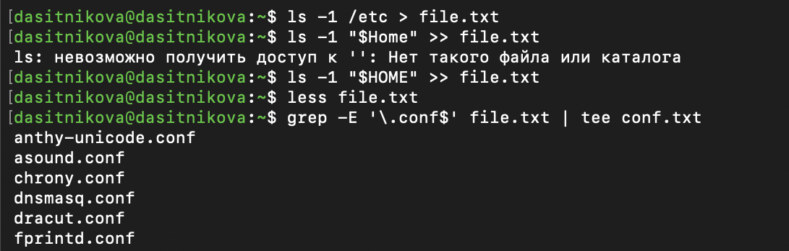
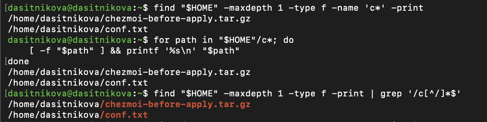
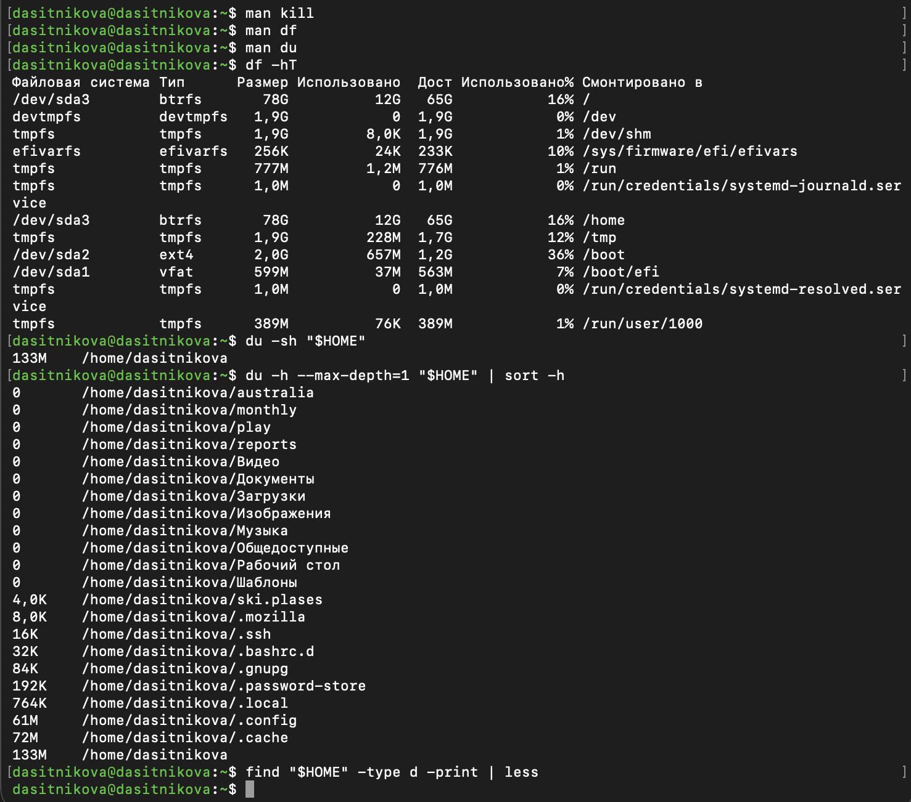

---
## Author
author:
  name: Ситникова Диана Александровна
  degrees: BSc
  email: 1032201746@rudn.ru
  affiliation:
    - name: Российский университет дружбы народов
      country: Российская Федерация
      postal-code: 117198
      city: Москва
      address: ул. Миклухо-Маклая, д. 6
## Title
title: "Лабораторная работа № 8"
subtitle: "Поиск файлов. Перенаправление ввода-вывода. Просмотр запущенных процессов"
license: CC BY
date: today
date-format: "YYYY-MM-DD"
---

# Введение

## Докладчик

:::::::::::::: {.columns align=center}
::: {.column width="68%"}

- Ситникова Диана Александровна
- направление 09.03.03 «Прикладная информатика»
- Российский университет дружбы народов
- [1032201746@rudn.ru](mailto:1032201746@rudn.ru)

:::
::: {.column width="32%"}

{width=100%}

:::
::::::::::::::

## Цель работы

Ознакомление с инструментами поиска файлов и фильтрации текстовых данных.

Приобретение практических навыков:

- управления процессами и заданиями;
- проверки использования диска;
- обслуживания файловых систем.

## Последовательность работы (1/2) {.smaller}

1. Выполнить вход в систему под пользовательской учётной записью.

2. Сформировать `file.txt` из списков `/etc` и домашнего каталога.

3. Отобрать имена с расширением `.conf` в `conf.txt`.

4. Найти домашние файлы, начинающиеся с `c`, несколькими способами.

5. Постранично вывести файлы `/etc`, начинающиеся с `h`.

6. Запустить фоновый поиск файлов, начинающихся с `log`.

## Последовательность работы (2/2) {.smaller}

7. Удалить сформированный `logfile`.

8. Запустить `gedit` как фоновое задание.

9. Определить PID редактора средствами `ps`, `grep`, `pgrep` и `pidof`.

10. Изучить `kill` и завершить процесс.

11. Исследовать дисковое пространство командами `df` и `du`.

12. Найти все каталоги домашнего дерева.

## Три стандартных потока процесса

| Дескриптор | Поток | Назначение |
|:---:|---|---|
| 0 | `stdin` | входные данные |
| 1 | `stdout` | обычный результат |
| 2 | `stderr` | диагностические сообщения |

~~~bash
command > output.txt
command 2> errors.txt
command < input.txt
~~~

Разделение `stdout` и `stderr` позволяет независимо обрабатывать результат и ошибки.

## Перенаправление управляет назначением потоков

| Конструкция | Действие |
|---|---|
| `> file` | записать с заменой содержимого |
| `>> file` | дописать в конец |
| `2> file` | перенаправить ошибки |
| `2>/dev/null` | отбросить ошибки |
| `2>&1` | объединить `stderr` со `stdout` |

~~~bash
ls -1 /etc > file.txt
ls -1 "$HOME" >> file.txt
~~~

## Конвейер соединяет небольшие команды

~~~bash
producer | filter | consumer
~~~

- `|` передаёт `stdout` слева в `stdin` справа;
- `grep` отбирает строки по шаблону;
- `tee` сохраняет поток и оставляет его видимым;
- `less` обеспечивает постраничный просмотр;
- `stderr` перенаправляется отдельно.

~~~bash
grep -E '\.conf$' file.txt | tee conf.txt
~~~

## `find` и `grep` решают разные задачи

| Команда | Объект поиска | Примеры критериев |
|---|---|---|
| `find` | файлы и каталоги | `-name`, `-type`, `-maxdepth` |
| `grep` | строки текста | регулярное выражение, `-E`, `-i` |

~~~bash
find "$HOME" -maxdepth 1 -type f -name 'c*'
find "$HOME" -type d -print
grep -E '\.conf$' file.txt
~~~

Шаблон `-name` заключён в кавычки, чтобы его не раскрыла оболочка.

# Выполнение работы

## Списки объединены, конфигурационные файлы отобраны

:::::::::::::: {.columns align=center}
::: {.column width="30%"}

~~~bash
ls -1 /etc > file.txt
ls -1 "$HOME" >> file.txt
grep -E '\.conf$' file.txt |
  tee conf.txt
~~~

`file.txt` содержит два последовательных списка, `conf.txt` --- только имена с расширением `.conf`.

:::
::: {.column width="70%"}

{width=100%}

:::
::::::::::::::

## Файлы на `c` найдены тремя способами

:::::::::::::: {.columns align=center}
::: {.column width="31%"}

1. Условие `-name` команды `find`.
2. Шаблон Bash и проверка `-f`.
3. Конвейер `find | grep`.

Все варианты обнаружили:

- `chezmoi-before-apply.tar.gz`;
- `conf.txt`.

:::
::: {.column width="69%"}

{width=100%}

:::
::::::::::::::

## Длительный поиск выполнен в фоне

:::::::::::::: {.columns align=center}
::: {.column width="31%"}

~~~bash
find / -type f -name 'log*' \
  > "$HOME/logfile" \
  2>/dev/null &
search_pid=$!
jobs -l
wait "$search_pid"
~~~

Терминал оставался доступным, а результат накапливался в `logfile`.

:::
::: {.column width="69%"}

{width=100%}

:::
::::::::::::::

## PID `gedit` определён и процесс завершён

:::::::::::::: {.columns align=center}
::: {.column width="31%"}

~~~bash
gedit &
ps aux | grep '[g]edit'
pgrep -a gedit
pidof gedit
kill "$gedit_pid"
~~~

Без явного параметра `kill` отправляет `SIGTERM` --- запрос корректного завершения.

:::
::: {.column width="69%"}

{width=100%}

:::
::::::::::::::

## `df` и `du` измеряют разные уровни

:::::::::::::: {.columns align=center}
::: {.column width="40%"}

| Команда | Назначение |
|---|---|
| `df -hT` | заполнение файловых систем |
| `du -sh` | размер выбранного дерева |
| `find -type d` | поиск каталогов |

Корень Fedora размещён на Btrfs; заполнение составляло около 16 %.

:::
::: {.column width="60%"}

{height=54mm}

:::
::::::::::::::

# Итоги

## Практические навыки

| Область | Освоенные средства |
|---|---|
| Потоки | `>`, `>>`, `2>`, `2>&1` |
| Фильтрация | `grep`, `tee`, `less` |
| Поиск | `find`, шаблоны, тип и глубина |
| Задания | `&`, `jobs`, `$!`, `wait` |
| Процессы | `ps`, `pgrep`, `pidof`, `kill` |
| Диск | `df`, `du` |

Все двенадцать пунктов задания выполнены в Fedora Linux.

## Выводы

- Изучены стандартные потоки и способы их перенаправления.
- Освоены конвейеры для фильтрации и сохранения текстовых данных.
- Выполнен поиск файлов и каталогов по имени и типу.
- Получены навыки фонового запуска и контроля заданий.
- PID процесса определён несколькими средствами, процесс завершён сигналом.
- Исследованы заполнение файловых систем и объём домашнего каталога.

## Основные источники

1. Методические материалы РУДН к лабораторной работе «Поиск файлов. Перенаправление ввода-вывода. Просмотр запущенных процессов».
2. GNU Bash Reference Manual.
3. GNU Findutils Manual.
4. GNU Grep Manual.
5. GNU Coreutils Manual.
6. `ps(1)` и `signal(7)` --- Linux manual pages.
