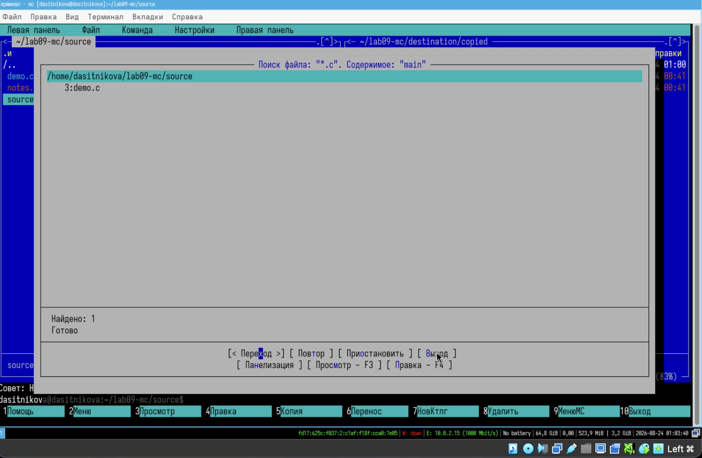
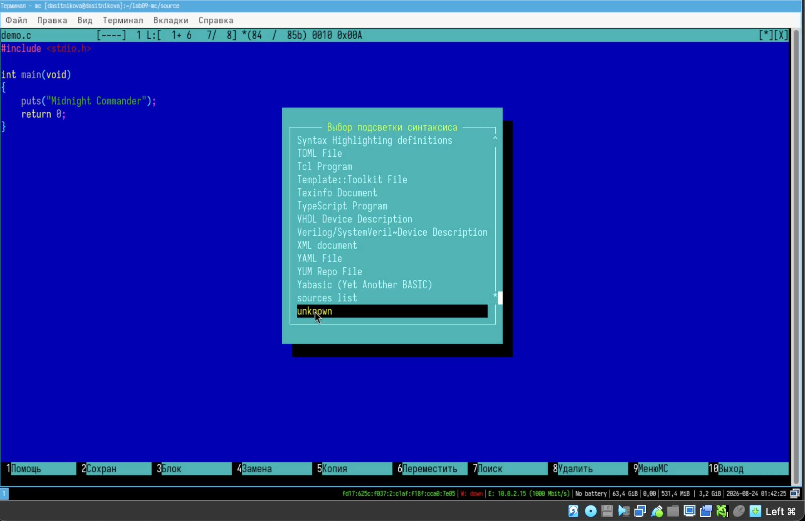

---
## Author
author:
  name: Ситникова Диана Александровна
  degrees: BSc
  email: 1032201746@rudn.ru
  affiliation:
    - name: Российский университет дружбы народов
      country: Российская Федерация
      postal-code: 117198
      city: Москва
      address: ул. Миклухо-Маклая, д. 6
## Title
title: "Лабораторная работа № 9"
subtitle: "Командная оболочка Midnight Commander"
institute:
  - "Российский университет дружбы народов им. П. Лумумбы"
  - "Преподаватель: д.ф.-м.н., профессор Кулябов Дмитрий Сергеевич"
license: CC BY
date: today
date-format: "YYYY-MM-DD"
header-includes:
  - \usepackage{tikz}
---

# Информация

## Докладчик

:::::::::::::: {.columns align=center}
::: {.column width="68%"}

- Ситникова Диана Александровна
- направление 09.03.03 «Прикладная информатика»
- Российский университет дружбы народов
- [1032201746@rudn.ru](mailto:1032201746@rudn.ru)

:::
::: {.column width="32%"}

{width=100%}

:::
::::::::::::::

# Вводная часть

## Актуальность

- Управление файлами в терминале требует точного ввода путей и ключей.
- Ошибка в пути при `cp`, `mv` или `rm` необратима и не видна до выполнения.
- Серверы и удалённые машины часто доступны только в текстовом режиме.
- Midnight Commander даёт те же операции в наглядном виде, не покидая консоль.

## Объект и предмет исследования

**Объект** --- командная оболочка Midnight Commander.

**Предмет** --- режимы работы панелей, структура меню, функциональные клавиши и встроенный текстовый редактор `mcedit`.

## Научная новизна и практическая значимость

**Научная новизна** --- каждая операция `mc` сопоставлена с эквивалентной командой оболочки.

**Практическая значимость** --- `mc` применим там, где графической среды нет: на серверах и в аварийном режиме.

## Цель, гипотеза и задачи

**Цель** --- освоить основные возможности командной оболочки Midnight Commander.

**Гипотеза** --- псевдографическая оболочка снижает цену ошибки при файловых операциях, не заменяя командную строку.

**Задачи:**

- изучить интерфейс, режимы панелей и структуру меню;
- выполнить операции просмотра и манипуляций над каталогами и файлами;
- освоить встроенный редактор.

## Материалы и методы

| Компонент | Значение |
|---|---|
| Операционная система | Fedora Linux в виртуальной машине |
| Программа | GNU Midnight Commander 4.8.33 |
| Источник задания | методические указания РУДН |
| Метод | выполнение операций через меню и клавиши `F1`--`F10` |

# Содержание исследования

## Экран `mc` разделён на пять функциональных зон

\begin{center}
\begin{tikzpicture}[font=\scriptsize]
  \draw[thick] (0,4.0) rectangle (10,4.7);
  \node at (5,4.35) {Строка меню --- \texttt{F9}};

  \draw[thick] (0,1.4) rectangle (4.9,3.9);
  \node[align=center] at (2.45,2.65) {\textbf{Левая панель}\\активная\\источник операции};

  \draw[thick] (5.1,1.4) rectangle (10,3.9);
  \node[align=center] at (7.55,2.65) {\textbf{Правая панель}\\пассивная\\каталог назначения};

  \draw[thick] (0,0.7) rectangle (10,1.3);
  \node at (5,1.0) {Командная строка --- команды shell без выхода из \texttt{mc}};

  \draw[thick] (0,0) rectangle (10,0.6);
  \node at (5,0.3) {Строка функциональных клавиш \texttt{F1}--\texttt{F10}};
\end{tikzpicture}
\end{center}

`Tab` переключает панели, `Ctrl+U` меняет их местами, `Ctrl+O` скрывает.

## Одна операция --- два способа записи

| Операция | Команда shell | Клавиша `mc` |
|---|---|---|
| просмотр | `less file` | `F3` |
| копирование | `cp source target` | `F5` |
| перемещение | `mv source target` | `F6` |
| создание каталога | `mkdir directory` | `F7` |
| изменение прав | `chmod mode file` | «Файл» → «Права доступа» |

Результат в файловой системе одинаков: `mc` лишь берёт аргументы из панелей.

## Поиск объединяет условие по имени и по содержимому

:::::::::::::: {.columns align=center}
::: {.column width="42%"}

Шаблон имени `*.c` отбирает файлы, строка `main` --- проверяет содержимое.

В оболочке та же задача потребовала бы связки `find` и `grep`.

:::
::: {.column width="58%"}

{width=100%}

:::
::::::::::::::

## Редактор `mcedit` работает теми же клавишами

:::::::::::::: {.columns align=center}
::: {.column width="42%"}

`F3` выделяет блок, `F5` копирует, `F6` переносит, `Ctrl+Y` удаляет строку, `Ctrl+U` отменяет действие.

Подсветка синтаксиса распознала язык C.

:::
::: {.column width="58%"}

{width=100%}

:::
::::::::::::::

# Результаты

## Оба задания выполнены полностью

- Изучены режимы панелей, структура пяти меню и функциональные клавиши.
- Выполнены просмотр, копирование, перемещение, создание каталогов и смена прав.
- Проведён поиск одновременно по имени файла и по его содержимому.
- Освоены пользовательское меню, файл расширений и параметры конфигурации.
- Во встроенном редакторе выполнены все манипуляции с текстом.

## Анализ результатов и их применимость

- Источник и назначение операции видны одновременно.
- Поиск объединяет условие по имени и по содержимому.
- Встроенный редактор избавляет от переключения программ.

Навыки применимы при работе на сервере, где графическая среда отсутствует.

## `mc` --- визуальный интерфейс к оболочке, а не её замена

Midnight Commander не вводит новых операций над файловой системой.

Он выполняет те же `cp`, `mv`, `mkdir`, `chmod`, но берёт аргументы из панелей: каталог назначения **виден**, а не набирается вслепую.

Это снижает цену ошибки там, где графической оболочки нет.
