---
## Author
author:
  name: Ситникова Диана Александровна
  degrees: BSc
  email: 1032201746@rudn.ru
  affiliation:
    - name: Российский университет дружбы народов
      country: Российская Федерация
      postal-code: 117198
      city: Москва
      address: ул. Миклухо-Маклая, д. 6

## Title
title: "Отчёт по лабораторной работе № 9"
subtitle: "Командная оболочка Midnight Commander"
license: "CC BY"
bibliography: bib/cite.bib
---

# Цель работы

Освоение основных возможностей командной оболочки Midnight Commander. Приобретение навыков практической работы по просмотру каталогов и файлов; манипуляций с ними.

# Задание

В соответствии с методическими указаниями необходимо выполнить следующую последовательность действий [@rudn_lab09_mc].

Задание по `mc`:

1. Изучить информацию о `mc`, вызвав в командной строке `man mc`.

2. Запустить из командной строки `mc`, изучить его структуру и меню.

3. Выполнить несколько операций в `mc`, используя управляющие клавиши: операции с панелями; выделение и отмену выделения файлов; копирование и перемещение файлов; получение информации о размере и правах доступа на файлы и каталоги.

4. Выполнить основные команды меню левой (или правой) панели. Оценить степень подробности вывода информации о файлах.

5. Используя возможности подменю «Файл», выполнить:

   - просмотр содержимого текстового файла;
   - редактирование содержимого текстового файла (без сохранения результатов редактирования);
   - создание каталога;
   - копирование файлов в созданный каталог.

6. С помощью соответствующих средств подменю «Команда» осуществить:

   - поиск в файловой системе файла с заданными условиями (например, файла с расширением `.c` или `.cpp`, содержащего строку `main`);
   - выбор и повторение одной из предыдущих команд;
   - переход в домашний каталог;
   - анализ файла меню и файла расширений.

7. Вызвать подменю «Настройки». Освоить операции, определяющие структуру экрана `mc` (Full screen, Double Width, Show Hidden Files и т. д.).

Задание по встроенному редактору `mc`:

1. Создать текстовый файл `text.txt`.

2. Открыть этот файл с помощью встроенного в `mc` редактора.

3. Вставить в открытый файл небольшой фрагмент текста, скопированный из любого другого файла или Интернета.

4. Проделать с текстом следующие манипуляции, используя горячие клавиши:

   - удалить строку текста;
   - выделить фрагмент текста и скопировать его на новую строку;
   - выделить фрагмент текста и перенести его на новую строку;
   - сохранить файл;
   - отменить последнее действие;
   - перейти в конец файла (нажав комбинацию клавиш) и написать некоторый текст;
   - перейти в начало файла (нажав комбинацию клавиш) и написать некоторый текст;
   - сохранить и закрыть файл.

5. Открыть файл с исходным текстом на некотором языке программирования (например C или Java).

6. Используя меню редактора, включить подсветку синтаксиса, если она не включена, или выключить, если она включена.

# Краткие теоретические сведения

## Назначение Midnight Commander

Командная оболочка --- интерфейс взаимодействия пользователя с операционной системой и программным обеспечением посредством команд [@tanenbaum_book_modern-os_ru]. GNU Midnight Commander, или `mc`, представляет собой полноэкранную текстовую оболочку и двухпанельный файловый менеджер для Unix-подобных операционных систем. Программа объединяет навигацию по файловой системе, управление файлами, просмотр и редактирование текста, поиск, работу с архивами и удалёнными ресурсами. Управление возможно как с клавиатуры, так и с помощью мыши, однако основным способом работы остаются функциональные клавиши и меню [@mc_manual].

Интерфейс `mc` построен вокруг двух независимых панелей. На каждой панели может отображаться содержимое каталога, краткая информация о выбранном объекте, дерево каталогов или результат быстрого просмотра. Такая организация позволяет одновременно видеть источник и назначение операции, что особенно удобно при копировании и перемещении файлов.

## Панели и режимы их работы

Панель в `mc` отображает список файлов текущего каталога, а абсолютный путь к этому каталогу выводится в заголовке панели. Активная панель содержит курсор и принимает команды пользователя, а неактивная часто используется как каталог назначения. Переключение между панелями выполняется клавишей `Tab`. Для каждой панели независимо задаются каталог, формат списка, порядок сортировки, фильтр и режим отображения [@mc_manpage].

Основными режимами панели являются список файлов, быстрый просмотр, информационная панель и дерево каталогов. В режиме списка показываются имена и выбранные атрибуты файлов. Быстрый просмотр отображает содержимое объекта, на который указывает курсор соседней панели. Информационная панель выводит права доступа, владельца, группу, размер, временные метки и сведения о файловой системе. Дерево каталогов предназначено для навигации по иерархии файловой системы.

Панели можно поменять местами сочетанием `Ctrl+U`, а сочетание `Ctrl+O` временно отключает их отображение. Последовательное применение `Ctrl+X d` сравнивает каталоги, открытые на двух панелях.

## Меню и функциональные клавиши

Верхнее меню открывается клавишей `F9` и содержит пять разделов: «Левая панель», «Файл», «Команда», «Настройки» и «Правая панель». Нижняя строка интерфейса показывает назначение функциональных клавиш в текущем режиме (@tbl-mc-keys).

| Клавиша | Назначение |
|---|---|
| `F1` | вызов контекстно-зависимой подсказки |
| `F2` | вызов пользовательского меню |
| `F3` | просмотр содержимого файла без возможности редактирования |
| `F4` | вызов встроенного редактора для изменения файла |
| `F5` | копирование отмеченных файлов в каталог второй панели |
| `F6` | перенос отмеченных файлов в каталог второй панели |
| `F7` | создание подкаталога в каталоге активной панели |
| `F8` | удаление отмеченных файлов или каталогов |
| `F9` | вызов меню `mc` |
| `F10` | выход из `mc` |

: Функциональные клавиши `mc` {#tbl-mc-keys}

Клавиша `Insert` устанавливает или снимает отметку с файла. Операция над группой отмеченных объектов выполняется теми же клавишами `F5`, `F6` и `F8`. Это позволяет формировать набор файлов без использования мыши.

## Файловые операции и права доступа

Midnight Commander предоставляет диалоги для стандартных операций командной оболочки. Копирование соответствует команде `cp`, перемещение --- `mv`, создание каталога --- `mkdir`, удаление --- `rm` или `rmdir`, а изменение прав доступа --- `chmod` [@gnu_coreutils]. Перед выполнением операции программа показывает диалог, в котором можно проверить путь назначения и дополнительные параметры.

Права доступа в Unix разделены на три группы: владелец, группа и остальные пользователи. Для каждой группы задаются чтение (`r`), запись (`w`) и выполнение или поиск (`x`). В `mc` права можно просмотреть и изменить через меню «Файл» → «Права доступа», не формируя числовую маску вручную. Информационная панель дополнительно показывает владельца, группу и текущее восьмеричное значение режима.

## Командная строка и подоболочка

Под панелями расположена командная строка. В неё можно вводить обычные команды оболочки, не покидая файловый менеджер. Текущий каталог командной строки синхронизирован с активной панелью. Сочетание `Ctrl+O` временно скрывает панели и показывает вывод подоболочки, а повторное нажатие возвращает интерфейс `mc`.

Команда `cd` меняет каталог активной панели. История команд позволяет повторять ранее введённые команды без повторного набора [@bash_manual]. Таким образом, `mc` не заменяет оболочку, а дополняет её визуальным представлением файловой системы [@robbins_book_bash_en].

## Поиск файлов и содержимого

Диалог поиска позволяет задать начальный каталог, шаблон имени и строку, которую требуется найти внутри файлов. Поиск может выполняться рекурсивно, с учётом или без учёта регистра, по метасимволам оболочки либо по регулярному выражению. Найденный файл можно сразу открыть для просмотра клавишей `F3` или для редактирования клавишей `F4`.

В лабораторной работе используется поиск файлов `*.c`, содержащих строку `main`. Такое сочетание условий отделяет выбор по имени от анализа содержимого и демонстрирует, что поиск `mc` выполняет обе операции в одном интерфейсе.

## Встроенные просмотрщик и редактор

Встроенный просмотрщик вызывается клавишей `F3` и предназначен для безопасного чтения файла без изменения содержимого. Редактор `mcedit` вызывается клавишей `F4`. Он поддерживает выделение блоков, копирование и перенос фрагментов, поиск и замену, отмену действий, переход к строке, сохранение и подсветку синтаксиса [@mcedit_manpage]. Основные сочетания клавиш редактора приведены ниже (@tbl-mcedit-keys).

| Клавиша | Назначение |
|---|---|
| `Ctrl+Y` | удалить строку |
| `Ctrl+U` | отмена последней операции |
| `Ins` | вставка или замена |
| `F7` | поиск, в том числе по регулярному выражению |
| `F4` | замена |
| `F3` | первое нажатие --- начало выделения, второе --- окончание |
| `F5` | копировать выделенный фрагмент |
| `F6` | переместить выделенный фрагмент |
| `F8` | удалить выделенный фрагмент |
| `F2` | записать изменения в файл |
| `F10` | выйти из редактора |

: Клавиши для редактирования файла {#tbl-mcedit-keys}

Дополнительно сочетания `Ctrl+Home` и `Ctrl+End` переходят в начало и конец документа.

## Конфигурация, пользовательское меню и ассоциации

Параметры интерфейса сохраняются в пользовательском каталоге конфигурации `~/.config/mc`. Через меню «Настройки» можно изменить компоновку панелей, формат списка, отображение скрытых и резервных файлов, подтверждение опасных операций, оформление и параметры виртуальных файловых систем.

Пользовательское меню описывает собственные команды, запускаемые для текущего или отмеченных файлов. В правилах могут использоваться макроподстановки, например `%f` для имени текущего файла, `%p` для полного пути, `%s` для отмеченных файлов и `%d` для текущего каталога. Файл `mc.ext.ini` задаёт ассоциации расширений и команды просмотра, редактирования или открытия файлов. Виртуальная файловая система позволяет работать с архивами и удалёнными ресурсами в том же двухпанельном интерфейсе.

# Выполнение лабораторной работы

Пункты 1--7 соответствуют заданию по `mc`, пункты 8--13 --- заданию по встроенному редактору `mc`.

## 1. Изучение справочной информации о `mc` {.unnumbered}
Сначала была открыта справочная страница Midnight Commander.

~~~bash
man mc
~~~

Для прокрутки использовались клавиши `Page Down` и `Page Up`, для поиска по справке --- `/`, для выхода --- `q`. В справке были изучены назначение программы, параметры запуска и доступные режимы (@fig-001).

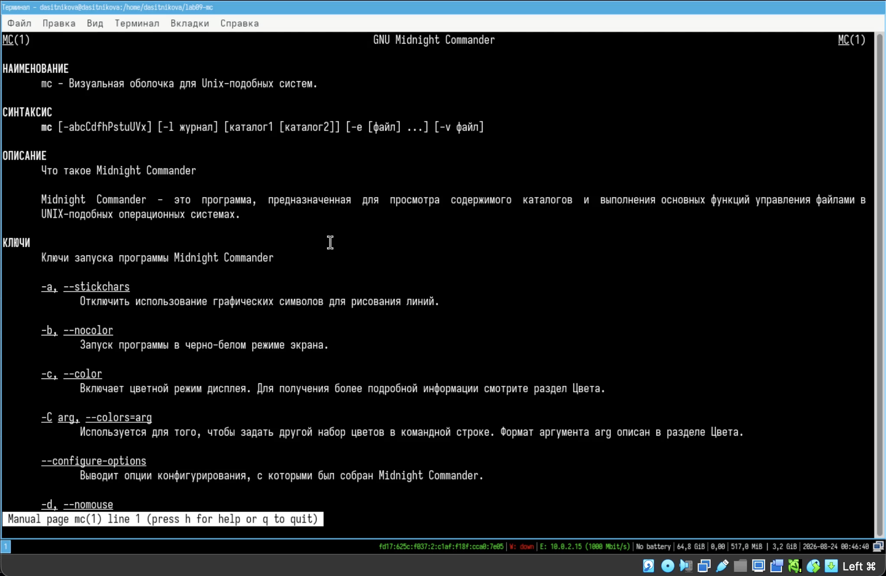{#fig-001 width=78% fig-align="center"}

## 2. Запуск `mc` и изучение структуры интерфейса {.unnumbered}
Для практической работы были подготовлены каталоги и демонстрационные файлы.

~~~bash
mkdir -p "$HOME/lab09-mc/source" "$HOME/lab09-mc/destination"
printf '%s\n' \
  'Midnight Commander — файловый менеджер с двумя панелями.' \
  'Он позволяет просматривать, копировать и перемещать файлы.' \
  'В состав программы входит встроенный текстовый редактор.' \
  > "$HOME/lab09-mc/source/source.txt"
printf '%s\n' \
  'Первый демонстрационный файл.' \
  'Он будет использован для просмотра и копирования.' \
  > "$HOME/lab09-mc/source/notes.txt"
printf '%s\n' \
  '#include <stdio.h>' '' \
  'int main(void)' '{' \
  '    puts("Midnight Commander");' \
  '    return 0;' '}' \
  > "$HOME/lab09-mc/source/demo.c"
~~~

Программа была запущена сразу с каталогами для левой и правой панелей:

~~~bash
mc "$HOME/lab09-mc/source" "$HOME/lab09-mc/destination"
~~~

В интерфейсе были определены строка меню, две файловые панели, командная строка, строка подсказки и строка функциональных клавиш. Переключение между панелями выполнялось клавишей `Tab`, перемещение курсора --- клавишами со стрелками (@fig-002).

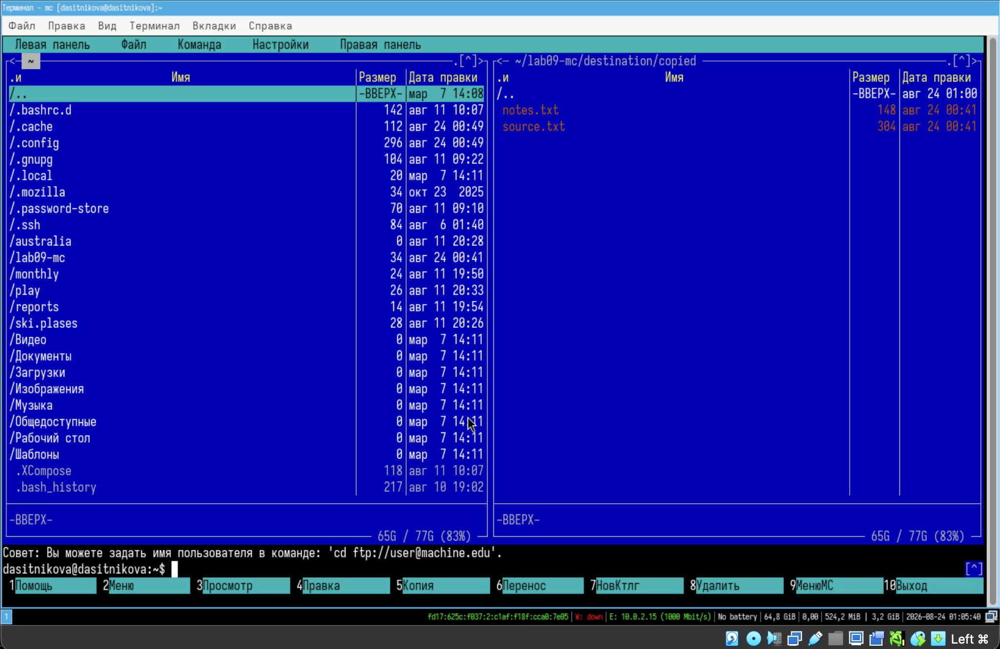{#fig-002 width=78% fig-align="center"}

## 3. Операции с панелями и файлами {.unnumbered}
Были опробованы операции управления файлами и просмотра их атрибутов. Файлы отмечались и снимались с отметки клавишей `Insert`. Для просмотра использовалась `F3`, для копирования --- `F5`, для перемещения --- `F6`, для создания каталога --- `F7`, для удаления --- `F8`.

Права доступа к выбранному файлу открывались последовательностью `F9` → «Файл» → «Права доступа». В диалоге отображались биты чтения, записи и выполнения для владельца, группы и остальных пользователей. На информационной панели были проверены имя файла, права, владелец и группа (@fig-003).

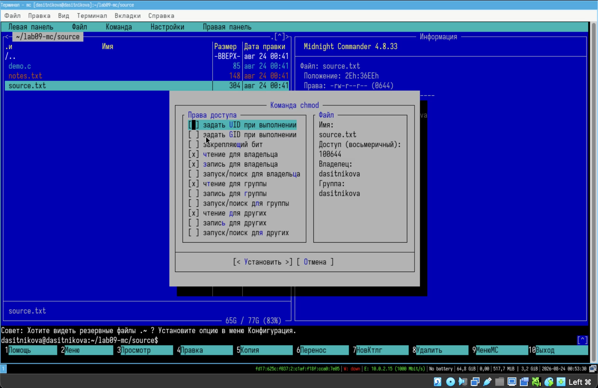{#fig-003 width=76% fig-align="center"}

Сортировка по размеру была установлена последовательностью `F9` → «Левая панель» → «Порядок сортировки» → «Размер» → `Enter` (@fig-004).

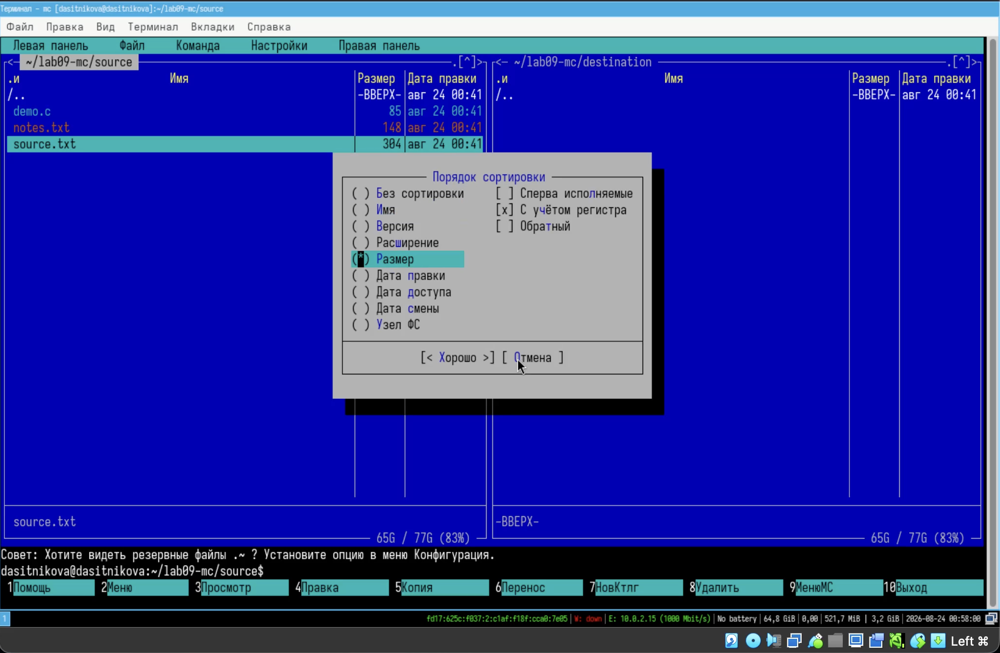{#fig-004 width=76% fig-align="center"}

## 4. Команды меню панели и подробность вывода {.unnumbered}
Расширенный формат списка был выбран через `F9` → «Левая панель» → «Формат списка» → «Расширенный» → `Enter`. После этого панель стала показывать права, владельца, группу, размер и дату изменения (@fig-005).

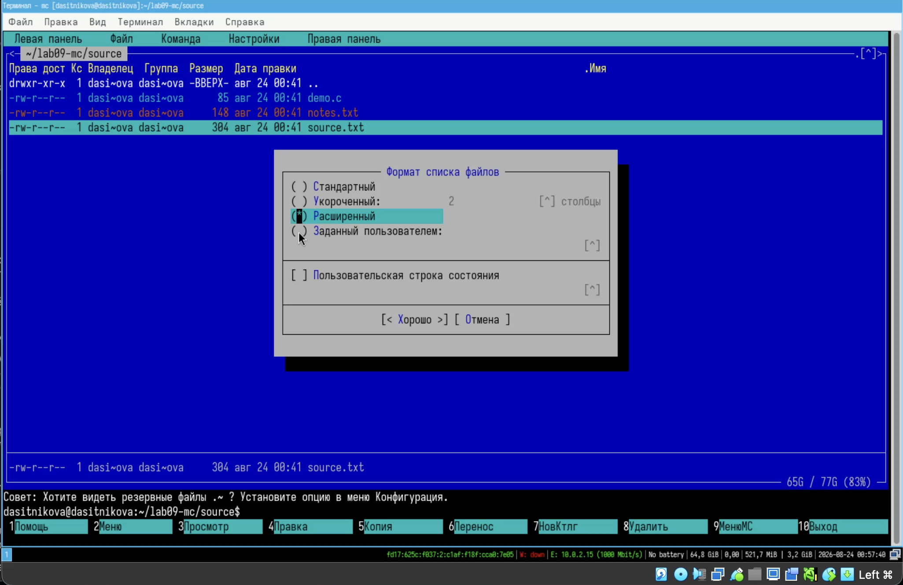{#fig-005 width=78% fig-align="center"}

Стандартный формат списка был выбран через `F9` → «Левая панель» → «Формат списка» → «Стандартный». Он содержит основные столбцы и оставляет больше пространства для имени файла. Таким образом, расширенный формат даёт наиболее подробные сведения о файлах, а стандартный --- наиболее компактное представление (@fig-006).

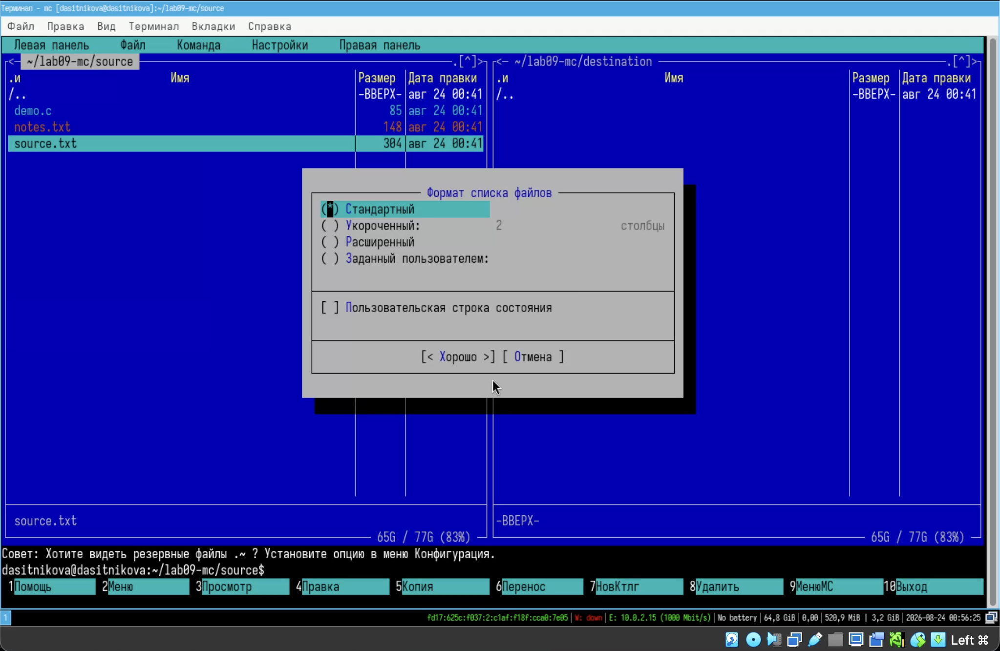{#fig-006 width=76% fig-align="center"}

Для сравнения компоновки панелей была открыта последовательность `F9` → «Настройки» → «Внешний вид». Переключатель «Горизонтальное» устанавливался клавишей `Space`, подтверждение выполнялось клавишей `Enter` (@fig-007).

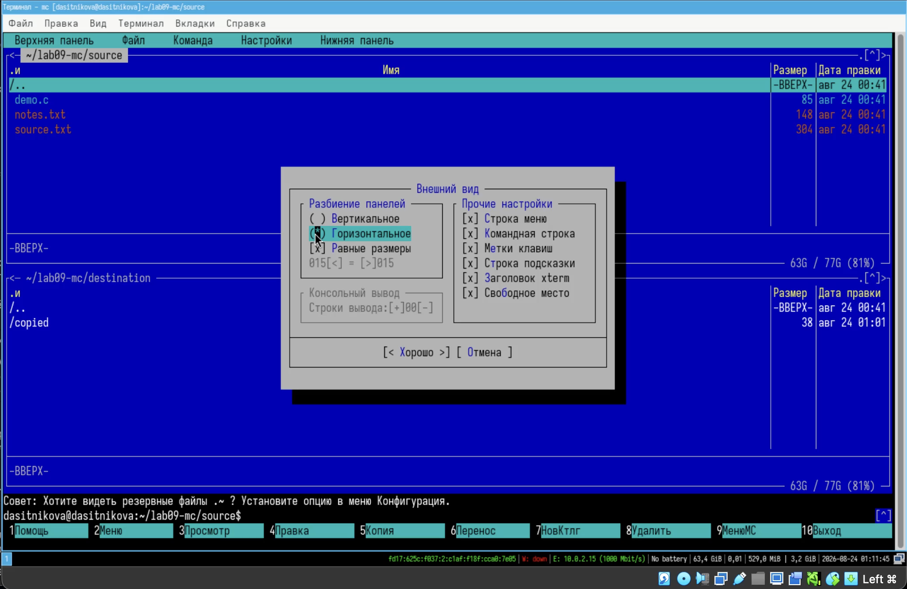{#fig-007 width=78% fig-align="center"}

## 5. Подменю «Файл» {.unnumbered}
В подменю «Файл» были выполнены базовые операции. Файл `source.txt` был открыт для просмотра клавишей `F3`. Затем файл открывался клавишей `F4`, после чего редактор закрывался клавишей `F10` без сохранения изменений. Каталог `copied` создавался клавишей `F7`, а файлы `source.txt` и `notes.txt` отмечались клавишей `Insert` и копировались клавишей `F5` в `$HOME/lab09-mc/destination/copied`.

Те же действия можно выразить командами оболочки:

~~~bash
mkdir -p "$HOME/lab09-mc/destination/copied"
cp "$HOME/lab09-mc/source/source.txt" \
   "$HOME/lab09-mc/source/notes.txt" \
   "$HOME/lab09-mc/destination/copied/"
~~~

## 6. Подменю «Команда» {.unnumbered}
В подменю «Команда» был выполнен поиск. Диалог открывался последовательностью `F9` → «Команда» → «Поиск файла». В поле «От каталога» указывался `$HOME/lab09-mc`, в поле «Шаблон имени» --- `*.c`, в поле «Содержимое» --- `main`. Параметр рекурсивного поиска был включён клавишей `Space`, запуск выполнялся клавишей `Enter` (@fig-008).

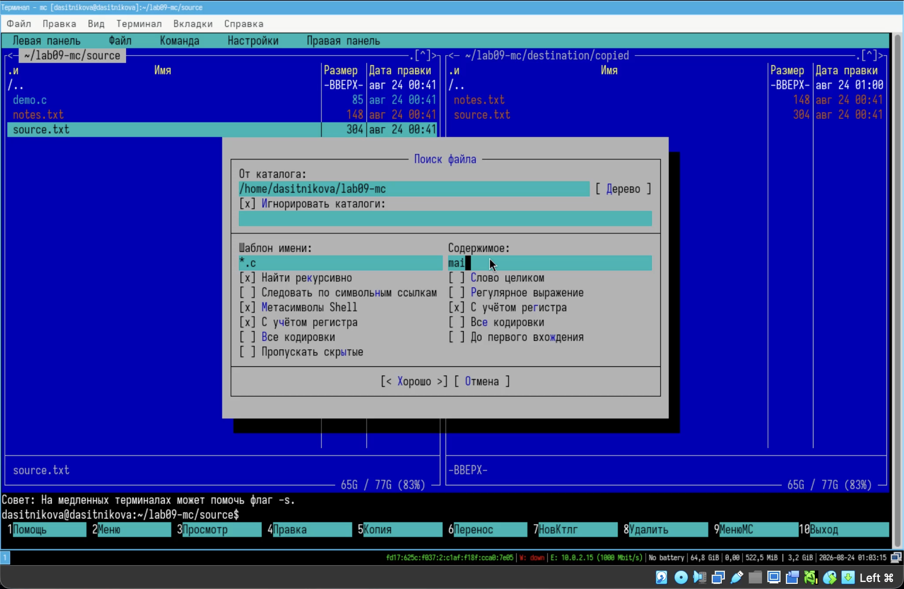{#fig-008 width=76% fig-align="center"}

В результате был найден файл `demo.c`, содержащий функцию `main`. Найденный файл можно было открыть клавишей `F3` или перейти к нему клавишей `Enter` (@fig-009).

{#fig-009 width=78% fig-align="center"}

История команд открывалась через `F9` → «Команда» → «История командной строки». Команда выбиралась стрелками и повторно запускалась клавишей `Enter`. Переход в домашний каталог выполнялся через `F9` → «Команда» → «Домашний каталог».

Пользовательское меню открывалось через `F9` → «Команда» → «Редактировать файл меню». В нём были изучены макроподстановки для текущего и отмеченных файлов (@fig-010).

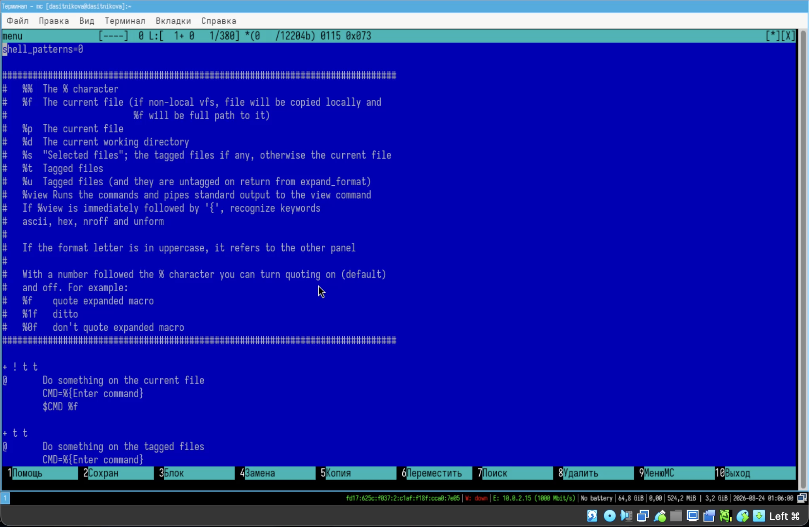{#fig-010 width=78% fig-align="center"}

Файл ассоциаций открывался через `F9` → «Команда» → «Редактировать файл расширений». Он содержит правила выбора действий для различных типов файлов (@fig-011).

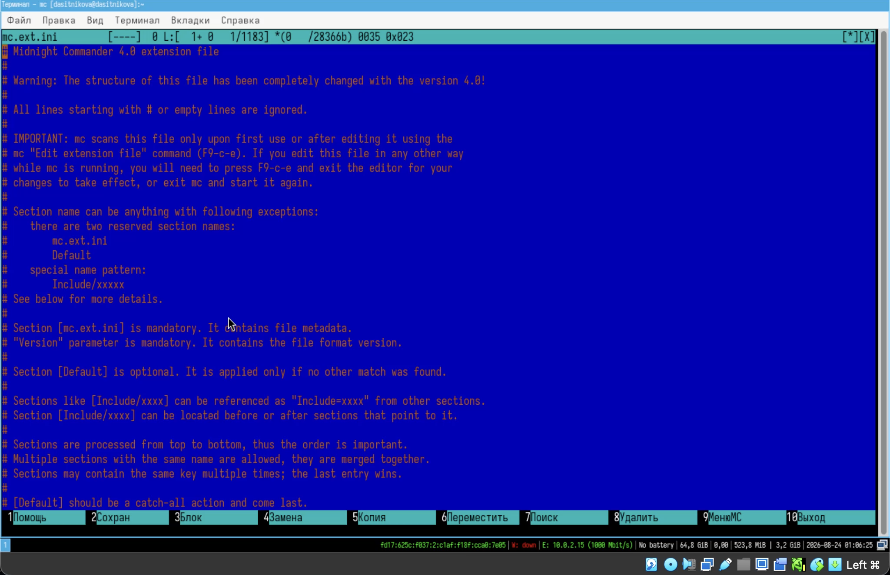{#fig-011 width=78% fig-align="center"}

## 7. Подменю «Настройки» {.unnumbered}
В подменю «Настройки» были последовательно изучены основные диалоги. Главное меню открывалось клавишей `F9`, затем стрелками выбирался пункт «Настройки» (@fig-012).

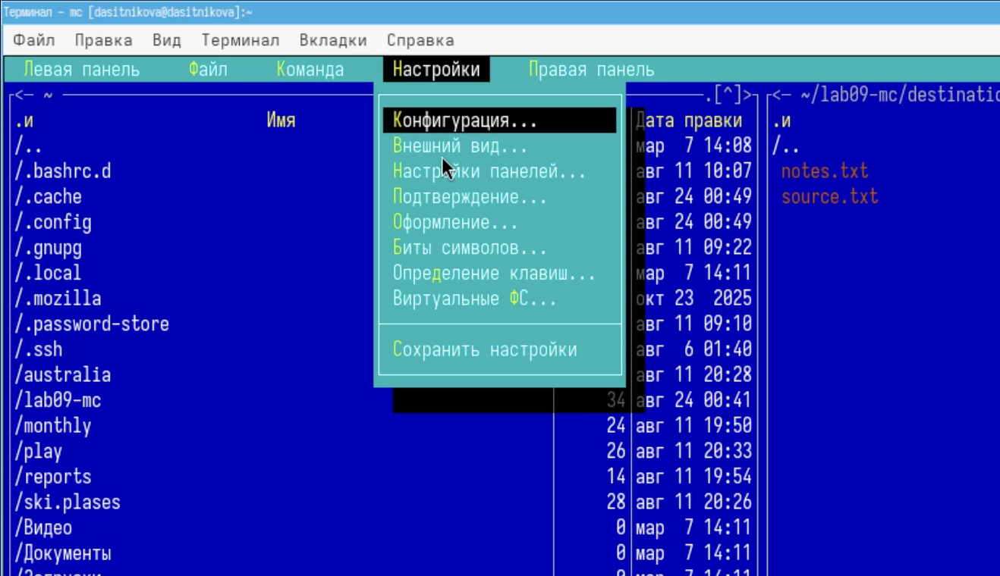{#fig-012 width=72% fig-align="center"}

В «Настройках панелей» были включены отображение резервных и скрытых файлов. Переключатели изменялись клавишей `Space`, подтверждение выполнялось клавишей `Enter` (@fig-013).

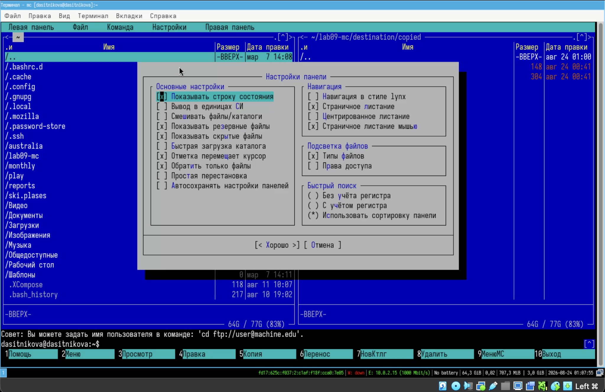{#fig-013 width=76% fig-align="center"}

В диалоге «Подтверждение» были проверены запросы перед удалением, перезаписью и выходом (@fig-014).

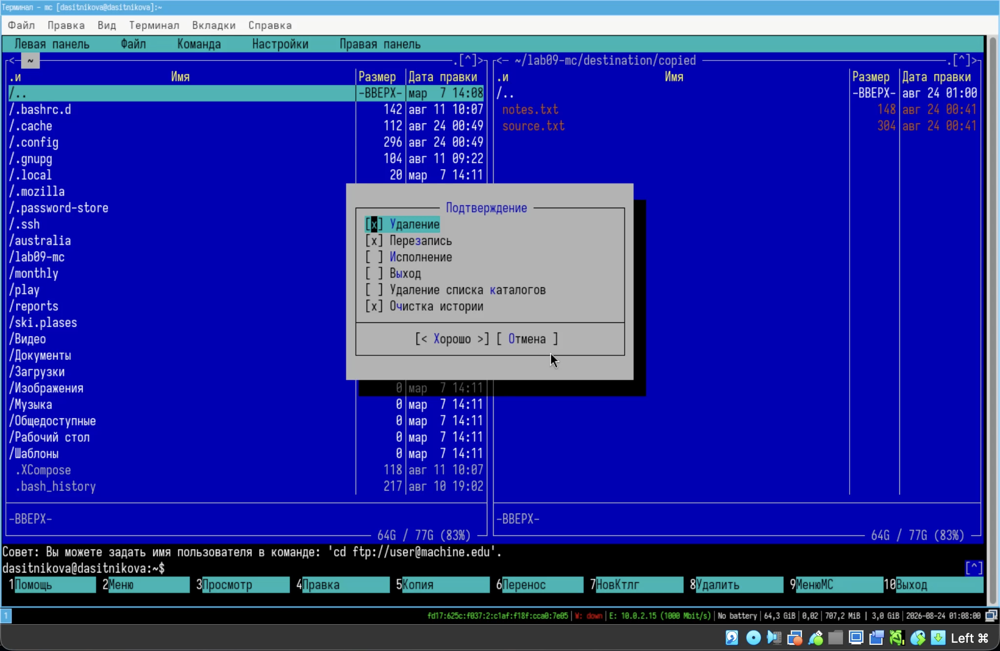{#fig-014 width=72% fig-align="center"}

В диалоге «Оформление» были проверены выбор скина и использование теней (@fig-015).

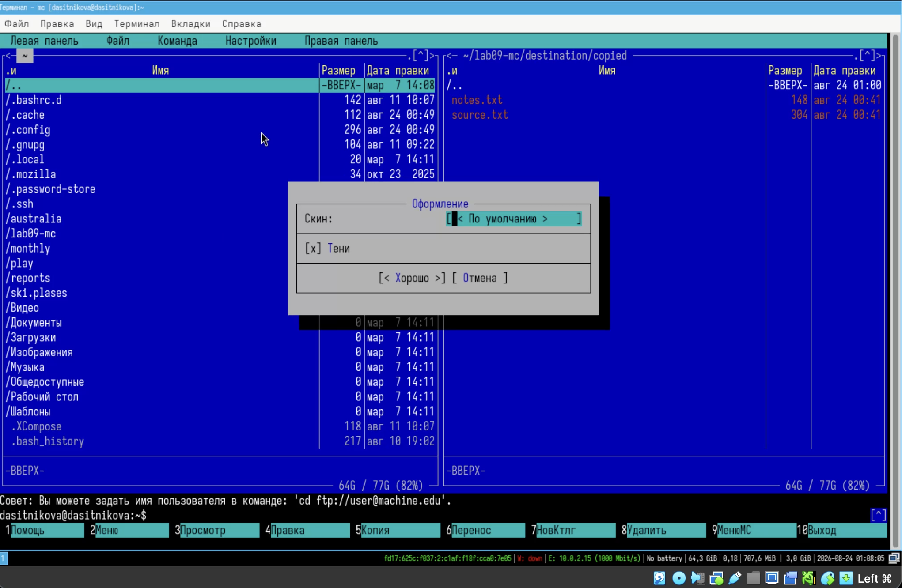{#fig-015 width=72% fig-align="center"}

В параметрах виртуальной файловой системы были просмотрены тайм-ауты и настройки FTP (@fig-016).

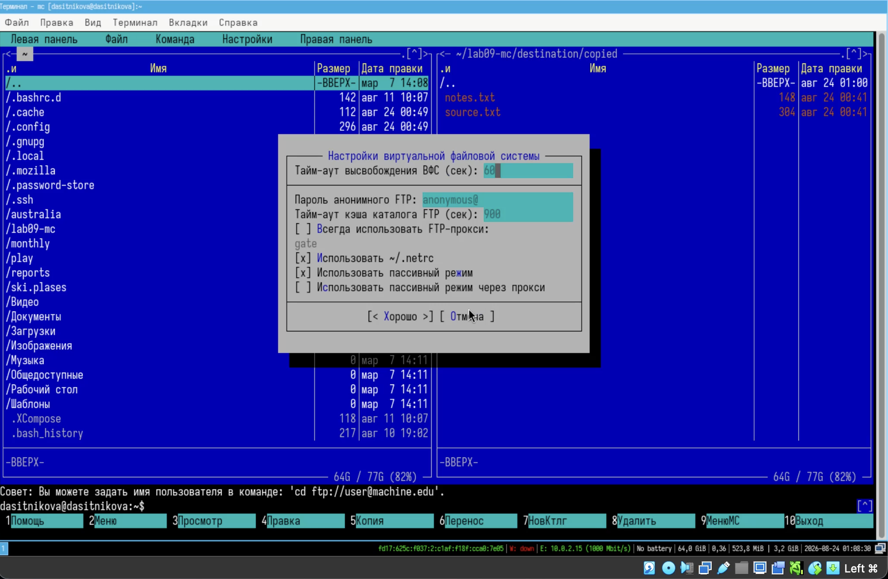{#fig-016 width=72% fig-align="center"}

## 8. Создание текстового файла `text.txt` {.unnumbered}
Файл для редактирования был создан командой:

~~~bash
touch "$HOME/lab09-mc/source/text.txt"
~~~

## 9. Открытие файла во встроенном редакторе {.unnumbered}
В левой панели был выбран `text.txt`, после чего редактор запущен клавишей `F4`.

## 10. Вставка фрагмента текста {.unnumbered}
В файл был вставлен небольшой фрагмент текста, скопированный из ранее подготовленного файла `source.txt`.

## 11. Операции редактирования горячими клавишами {.unnumbered}
Операции редактирования выполнялись последовательно. Строка удалялась сочетанием `Ctrl+Y`. Начало и конец блока отмечались клавишей `F3`; копирование блока выполнялось `F5`, перенос --- `F6`. Файл сохранялся клавишей `F2`, последнее действие отменялось сочетанием `Ctrl+U`. Переход в конец выполнялся `Ctrl+End`, в начало --- `Ctrl+Home`. После добавления текста файл был сохранён клавишей `F2`, редактор закрыт клавишей `F10` (@fig-017).

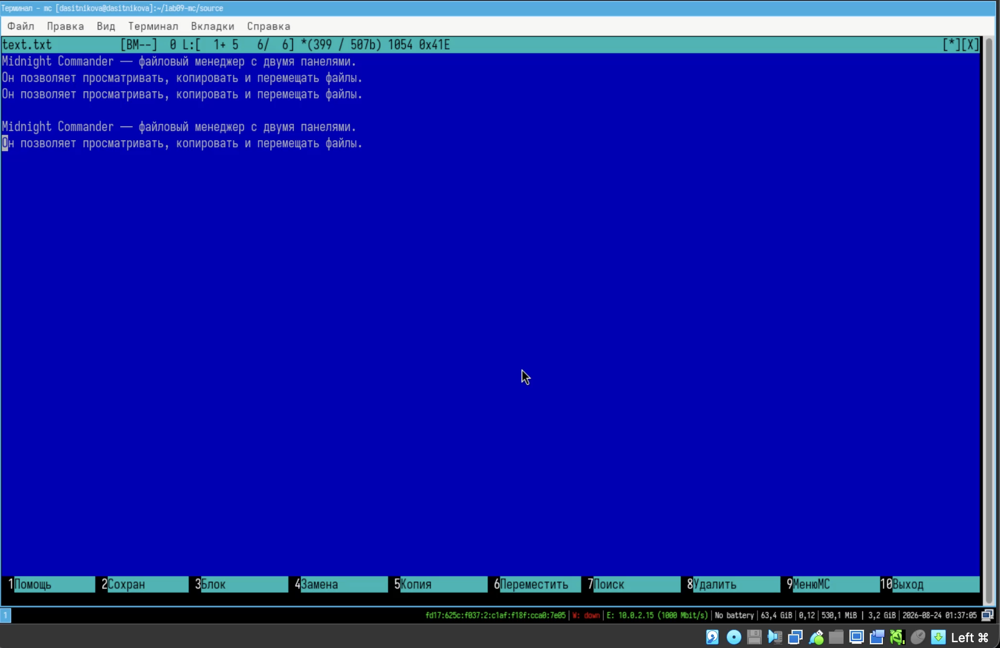{#fig-017 width=78% fig-align="center"}

## 12. Открытие исходного файла на языке C {.unnumbered}
Затем в панели был выбран файл `demo.c` и открыт клавишей `F4`.

## 13. Подсветка синтаксиса {.unnumbered}
Подсветка синтаксиса проверялась через меню редактора `F9` → «Настройки» → «Подсветка синтаксиса». В открывшемся списке определений видно, что для файла применяется подсветка языка C: ключевые слова, директивы препроцессора, строки и числа отображаются разными цветами (@fig-018).

{#fig-018 width=78% fig-align="center"}

# Выводы

В ходе работы были изучены двухпанельный интерфейс Midnight Commander, режимы панелей, меню и функциональные клавиши. Выполнены просмотр, копирование, перемещение, создание каталогов, поиск файлов по имени и содержимому, просмотр прав доступа и настройка представления панелей. Освоены пользовательское меню, ассоциации расширений и основные параметры конфигурации.

Во встроенном редакторе были выполнены удаление, копирование и перенос фрагментов, сохранение, отмена действий, переход к началу и концу файла, а также включение подсветки синтаксиса. Цель лабораторной работы достигнута: приобретены практические навыки по просмотру каталогов и файлов и манипуляций с ними средствами Midnight Commander.

# Ответы на контрольные вопросы

1. **Какие режимы работы есть в `mc`? Охарактеризуйте их.**

   Midnight Commander поддерживает несколько режимов отображения панели: список файлов, быстрый просмотр, информационную панель и дерево каталогов. В режиме списка пользователь выполняет навигацию и файловые операции. Быстрый просмотр показывает содержимое объекта с соседней панели, информационный режим выводит метаданные выбранного файла и файловой системы, а дерево каталогов представляет иерархию каталогов для быстрого перехода.

   Кроме режимов панелей, `mc` включает командную строку и подоболочку, встроенные просмотрщик и редактор, а также работу с виртуальными файловыми системами. Поэтому программу можно использовать как файловый менеджер, текстовую оболочку, средство просмотра и редактирования, а также единый интерфейс к архивам и удалённым ресурсам.

2. **Какие операции с файлами можно выполнить как с помощью команд shell, так и с помощью меню или комбинаций клавиш `mc`? Приведите несколько примеров.**

   Большинство основных файловых операций имеет прямой аналог в командной оболочке и в интерфейсе `mc`:

   | Операция | Команда shell | Midnight Commander |
   |---|---|---|
   | просмотр файла | `less file` | `F3` |
   | редактирование | `mcedit file` | `F4` |
   | копирование | `cp source target` | `F5` |
   | перемещение | `mv source target` | `F6` |
   | создание каталога | `mkdir directory` | `F7` |
   | удаление | `rm file` или `rmdir directory` | `F8` |
   | изменение прав | `chmod mode file` | «Файл» → «Права доступа» |

   Различие состоит главным образом в способе задания аргументов. В shell пользователь вводит пути и ключи вручную, а `mc` берёт текущий или отмеченные файлы из панели и показывает диалог назначения. При этом результат операции в файловой системе одинаков.

3. **Опишите структуру меню левой или правой панели `mc`, дайте характеристику командам.**

   Меню левой и правой панелей симметричны и управляют представлением соответствующей панели. С их помощью выбираются режим панели, формат списка, порядок сортировки, фильтр, кодировка и способ отображения объектов. Панель может показывать список, дерево, краткую информацию или быстрый просмотр.

   Команда «Формат списка» переключает стандартный, укороченный, расширенный или пользовательский набор столбцов. «Порядок сортировки» задаёт сортировку по имени, расширению, размеру, времени или без сортировки. Фильтр ограничивает список по шаблону, а внешняя панелизация позволяет сформировать содержимое панели из вывода команды.

4. **Опишите структуру меню «Файл» `mc`, дайте характеристику командам.**

   Меню «Файл» объединяет операции над текущим или отмеченными объектами. Оно содержит просмотр (`F3`), просмотр вывода команды, правку (`F4`), копирование (`F5`), права доступа (`Ctrl+X c`), создание жёсткой (`Ctrl+X l`) и символической (`Ctrl+X s`) ссылки, смену владельца и группы (`Ctrl+X o`), расширенные права, переименование и перемещение (`F6`), создание каталога (`F7`), удаление (`F8`) и выход (`F10`).

   Перед потенциально опасными действиями `mc` открывает диалог подтверждения. Для копирования и перемещения в диалоге задаются путь назначения и параметры обработки подкаталогов. Команды прав доступа и владельца позволяют менять атрибуты в форме с понятными переключателями.

5. **Опишите структуру меню «Команда» `mc`, дайте характеристику командам.**

   Меню «Команда» содержит более общие команды для работы с программой: дерево каталогов, поиск файла, переставить панели, сравнить каталоги (`Ctrl+X d`), размеры каталогов, история командной строки, каталоги быстрого доступа (`Ctrl+\`) и восстановление файлов на файловых системах ext2 и ext3.

   В этом же меню доступны редактирование файла расширений, файла пользовательского меню и файла расцветки имён. Эти команды связывают интерфейс `mc` с командной оболочкой: пользователь может повторять команды, запускать собственные сценарии и определять действия для типов файлов.

6. **Опишите структуру меню «Настройки» `mc`, дайте характеристику командам.**

   Меню «Настройки» включает конфигурацию, внешний вид, настройки панелей, биты символов, подтверждение, распознавание клавиш и настройки виртуальных файловых систем. Конфигурация корректирует поведение работы с панелями, а «Внешний вид» и «Настройки панелей» определяют отображаемые элементы --- строку меню, командную строку, подсказки --- а также геометрию расположения панелей и цветовыделение.

   «Биты символов» задают формат обработки информации локальным терминалом. «Подтверждение» позволяет установить или убрать запрос подтверждения при удалении, перезаписи и выходе из программы. «Распознавание клавиш» используется для тестирования функциональных клавиш и клавиш управления курсором, а параметры виртуальной файловой системы регулируют тайм-ауты, пароль анонимного FTP и кэширование.

7. **Назовите и дайте характеристику встроенным командам `mc`.**

   Основные встроенные действия доступны через функциональные клавиши: `F1` открывает справку, `F2` --- пользовательское меню, `F3` --- просмотр, `F4` --- редактирование, `F5` --- копирование, `F6` --- перенос, `F7` --- создание каталога, `F8` --- удаление, `F9` --- меню, `F10` --- выход. `Tab` переключает панели, `Insert` отмечает файлы, `Ctrl+U` переставляет панели местами, `Ctrl+O` скрывает и возвращает панели.

   Командная строка принимает команды оболочки. Команда `cd` меняет каталог активной панели, а введённая команда выполняется в текущем каталоге. История позволяет повторить ранее использованные команды, а автодополнение сокращает набор путей и имён файлов.

8. **Назовите и дайте характеристику командам встроенного редактора `mc`.**

   Во встроенном редакторе `F2` сохраняет документ, `F3` отмечает границы блока, `F4` открывает диалог замены, `F5` копирует блок, `F6` переносит его, `F7` запускает поиск, `F8` удаляет блок, `F10` завершает работу. `Ctrl+Y` удаляет текущую строку, `Ctrl+U` отменяет последнее действие, а `Ins` переключает режимы вставки и замены.

   Сочетания `Ctrl+Home` и `Ctrl+End` переходят в начало и конец файла. Редактор поддерживает поиск и замену, переход к строке, сохранение под другим именем, выбор кодировки и подсветку синтаксиса. Команды доступны и из меню, открываемого клавишей `F9`.

9. **Дайте характеристику средствам `mc`, которые позволяют создавать меню, определяемые пользователем.**

   Пользовательское меню хранится в конфигурационном файле, обычно `~/.config/mc/menu`, и открывается клавишей `F2` или через меню «Команда» → «Редактировать файл меню». В файле задаются названия пунктов, условия их видимости и команды оболочки, выполняемые при выборе. Это позволяет добавить операции, специфичные для конкретного проекта или типа файла.

   В командах применяются макроподстановки: `%f` обозначает имя текущего файла, `%p` --- его полный путь, `%s` --- список отмеченных файлов, `%t` --- отмеченные файлы другой панели, `%d` --- текущий каталог. Благодаря этим параметрам один пункт меню может корректно работать с текущим контекстом панелей.

10. **Дайте характеристику средствам `mc`, которые позволяют выполнять действия, определяемые пользователем, над текущим файлом.**

    Действия над текущим файлом задаются правилами ассоциаций в `mc.ext.ini`, который открывается через меню «Команда» → «Редактировать файл расширений». Правило сопоставляет имя, расширение или тип файла с командами открытия, просмотра и редактирования. При выборе файла `mc` находит подходящее правило, подставляет путь к объекту и запускает указанную программу.

    Формат поддерживает секции, условия и включаемые фрагменты. Правила обрабатываются последовательно, поэтому их порядок имеет значение, а секция по умолчанию применяется при отсутствии более точного совпадения. После изменения файла ассоциаций конфигурацию следует перечитать через соответствующую команду меню либо перезапустить `mc`.

# Список литературы {.unnumbered}

::: {#refs}
:::
