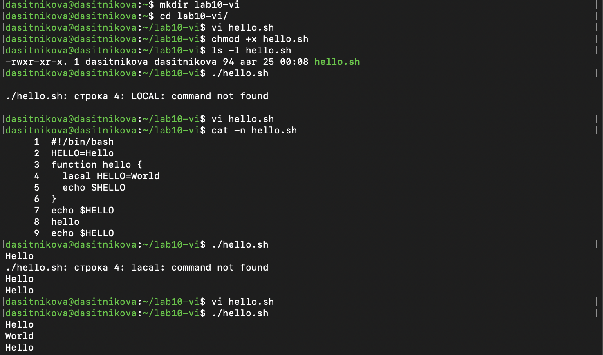

---
## Author
author:
  name: Ситникова Диана Александровна
  degrees: BSc
  email: 1032201746@rudn.ru
  affiliation:
    - name: Российский университет дружбы народов
      country: Российская Федерация
      postal-code: 117198
      city: Москва
      address: ул. Миклухо-Маклая, д. 6
## Title
title: "Лабораторная работа № 10"
subtitle: "Текстовой редактор vi"
institute:
  - "Российский университет дружбы народов им. П. Лумумбы"
  - "Преподаватель: д.ф.-м.н., профессор Кулябов Дмитрий Сергеевич"
license: CC BY
date: today
date-format: "YYYY-MM-DD"
header-includes:
  - \usepackage{tikz}
---

# Информация

## Докладчик

:::::::::::::: {.columns align=center}
::: {.column width="68%"}

- Ситникова Диана Александровна
- направление 09.03.03 «Прикладная информатика»
- Российский университет дружбы народов
- [1032201746@rudn.ru](mailto:1032201746@rudn.ru)

:::
::: {.column width="32%"}

{width=100%}

:::
::::::::::::::

# Вводная часть

## Актуальность

- `vi` установлен по умолчанию практически в любом дистрибутиве Linux.
- Он не требует графической оболочки и работает на голой консоли.
- На удалённом сервере или при сбое системы часто доступен только он.
- Редактор входит в POSIX, поэтому базовые команды одинаковы везде.

## Объект и предмет исследования

**Объект** --- операционная система Linux и её штатный текстовый редактор `vi`.

**Предмет** --- три режима работы редактора, переходы между ними и команды навигации, вставки, удаления и замены текста.

## Научная новизна и практическая значимость

**Научная новизна** --- каждая правка выполнена минимальным набором нажатий с обоснованием выбора команды.

**Практическая значимость** --- `vi` присутствует в любой Unix-системе, включая аварийный режим без графики.

## Цель, гипотеза и задачи

**Цель** --- получить практические навыки работы с редактором `vi`.

**Гипотеза** --- модальность редактора --- не помеха, а способ обойтись без клавиш-модификаторов.

**Задачи:**

- изучить режимы редактора и способы перехода между ними;
- создать средствами `vi` сценарий командной оболочки;
- отредактировать готовый файл, применяя команды правки.

## Материалы и методы

| Компонент | Значение |
|---|---|
| Операционная система | Fedora Linux в виртуальной машине |
| Редактор | `vi` (реализация Vim) |
| Объект правки | сценарий `hello.sh` на языке Bash |
| Источник задания | методические указания РУДН |
| Метод | ввод команд редактора с клавиатуры |

# Содержание исследования

## Три режима связаны через командный

\begin{center}
\resizebox{\linewidth}{!}{%
\begin{tikzpicture}[font=\scriptsize, >=latex]
  \draw[thick] (0,1.0) rectangle (2.6,2.3);
  \node[align=center] at (1.3,1.65) {\textbf{Режим}\\\textbf{вставки}};

  \draw[very thick] (4.2,1.0) rectangle (6.8,2.3);
  \node[align=center] at (5.5,1.65) {\textbf{Командный}\\\textbf{режим}};

  \draw[thick] (8.4,1.0) rectangle (11.0,2.3);
  \node[align=center] at (9.7,1.65) {\textbf{Режим последней}\\\textbf{строки}};

  \draw[->,thick] (4.2,2.05) -- (2.6,2.05) node[midway,above] {\texttt{i a o}};
  \draw[->,thick] (2.6,1.25) -- (4.2,1.25) node[midway,below] {\texttt{Esc}};

  \draw[->,thick] (6.8,2.05) -- (8.4,2.05) node[midway,above] {\texttt{:}};
  \draw[->,thick] (8.4,1.25) -- (6.8,1.25) node[midway,below] {\texttt{Enter}};

  \draw[->,thick] (5.5,3.1) -- (5.5,2.3) node[midway,right] {\ \texttt{vi файл}};
  \draw[->,thick] (9.7,1.0) -- (9.7,0.2) node[midway,right] {\ \texttt{:wq} \texttt{:q!}};
\end{tikzpicture}}
\end{center}

Прямого перехода между вставкой и последней строкой нет --- только через командный.

## Команда и текст разделены режимом

| Действие | Команда | Режим |
|---|---|---|
| перейти на строку `n` | `nG` | командный |
| в начало / конец строки | `0` / `$` | командный |
| вставить перед / после курсора | `i` / `a` | → вставки |
| открыть строку под курсором | `o` | → вставки |
| удалить слово / строку | `dw` / `dd` | командный |
| заменить один символ | `r` | командный |
| отменить изменение | `u` | командный |

Одна и та же клавиша в разных режимах означает разное.

## Файл создан и отредактирован в `vi`

:::::::::::::: {.columns align=center}
::: {.column width="42%"}

Сценарий набран в режиме вставки, сохранён командой `:wq`.

Правки внесены точечно: `2G0e` `a` `O` для имени переменной, `4G0w` `dw` для ключевого слова.

:::
::: {.column width="58%"}

{width=100%}

:::
::::::::::::::

## Ошибка найдена по сообщению оболочки {.smaller}

Вместо `local` набралось `lacal`; оболочка сообщила `command not found`. Исправлено командой `r` --- заменой одного символа.

{height=52mm fig-align="center"}

## Вывод сценария подтверждает правку

| Строка вывода | Откуда | Почему |
|---|---|---|
| `Hello` | `echo` вне функции | глобальная переменная |
| `World` | `echo` внутри функции | `local` перекрыл значение |
| `Hello` | `echo` вне функции | глобальная не изменилась |

До правки вместо этого выводилось `command not found`: `LOCAL` прописными оболочка приняла за внешнюю команду.

# Результаты

## Оба задания выполнены полностью

- Создан каталог, вызван `vi`, набран и сохранён сценарий `hello.sh`.
- Файл сделан исполняемым, права проверены командой `ls -l`.
- Исправлены имя переменной и ключевое слово, добавлена строка в конец.
- Строка удалена командой `dd` и возвращена командой `u`.
- Изменения записаны, работа сценария проверена запуском.

## Анализ результатов и их применимость

- Файл создан, отредактирован и сохранён без выхода из редактора.
- Ошибка ввода найдена по сообщению оболочки и исправлена одной командой.
- Сценарий после правок работает корректно.

Редактор доступен на любой машине без установки и предварительной настройки.

## `Esc` возвращает контроль из любого режима

Главная сложность `vi` не в количестве команд, а в том, что одна клавиша значит разное в разных режимах.

Пока неизвестно, где находишься, любое нажатие опасно.

`Esc` всегда приводит редактор в командный режим --- отсюда доступны все остальные переходы.
