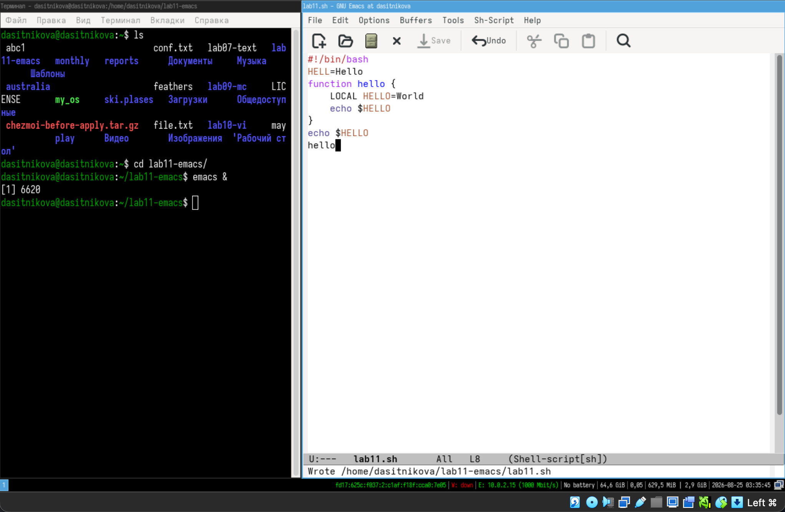

---
## Author
author:
  name: Ситникова Диана Александровна
  degrees: BSc
  email: 1032201746@rudn.ru
  affiliation:
    - name: Российский университет дружбы народов
      country: Российская Федерация
      postal-code: 117198
      city: Москва
      address: ул. Миклухо-Маклая, д. 6
## Title
title: "Лабораторная работа № 11"
subtitle: "Текстовой редактор emacs"
license: CC BY
date: today
date-format: "YYYY-MM-DD"
header-includes:
  - \usepackage{tikz}
---

# Информация

## Докладчик

:::::::::::::: {.columns align=center}
::: {.column width="68%"}

- Ситникова Диана Александровна
- направление 09.03.03 «Прикладная информатика»
- Российский университет дружбы народов
- [1032201746@rudn.ru](mailto:1032201746@rudn.ru)

:::
::: {.column width="32%"}

{width=100%}

:::
::::::::::::::

# Вводная часть

## Актуальность

- Emacs --- не программа с готовым набором функций, а расширяемая среда.
- Вся логика верхнего уровня написана на Elisp и доступна для правки.
- Один инструмент закрывает правку кода, почту, оболочку и документацию.
- Освоение окупается там, где работа с текстом идёт часами каждый день.

## Объект и предмет исследования

**Объект** --- операционная система Linux и текстовый редактор GNU Emacs.

**Предмет** --- модель буферов, окон и фреймов, префиксные сочетания клавиш и команды правки, навигации, поиска и замены.

## Цели и задачи

**Цель** --- получить практические навыки работы с редактором Emacs.

**Задачи:**

- разобрать понятия буфера, окна и фрейма;
- создать и отредактировать файл сочетаниями клавиш;
- освоить управление буферами, окнами, поиск и замену.

## Материалы и методы

| Компонент | Значение |
|---|---|
| Операционная система | Fedora Linux в виртуальной машине |
| Редактор | GNU Emacs 30.2, сборка `aarch64` |
| Установка | `sudo dnf install -y emacs` |
| Объект правки | сценарий `lab11.sh` и четыре файла заметок |
| Источник задания | методические указания РУДН |

# Содержание исследования

## Фрейм, окно и буфер --- три разных сущности

\begin{center}
\resizebox{0.92\linewidth}{!}{%
\begin{tikzpicture}[font=\scriptsize, >=latex]
  \draw[very thick] (0,0) rectangle (7.4,4.6);
  \node[anchor=north west] at (0.1,4.5) {\textbf{Фрейм} --- окно в обычном смысле};

  \draw[thick] (0.4,2.9) rectangle (7.0,4.0);
  \node[align=center] at (3.7,3.45) {\textbf{Окно 1}};
  \draw[thick] (0.4,1.5) rectangle (7.0,2.7);
  \node[align=center] at (3.7,2.1) {\textbf{Окно 2}};

  \draw[thick] (0.4,0.4) rectangle (7.0,1.0);
  \node at (3.7,0.7) {Область вывода и минибуфер};

  \draw[thick,dashed] (8.6,3.3) rectangle (12.4,4.1);
  \node at (10.5,3.7) {\texttt{lab11.sh}};
  \draw[thick,dashed] (8.6,2.3) rectangle (12.4,3.1);
  \node at (10.5,2.7) {\texttt{*scratch*}};
  \draw[thick,dashed] (8.6,1.3) rectangle (12.4,2.1);
  \node at (10.5,1.7) {\texttt{*Messages*}};
  \node[align=center] at (10.5,0.7) {\textbf{Буферы} --- существуют\\независимо от окон};

  \draw[->,thick] (7.0,3.45) -- (8.6,3.7);
  \draw[->,thick] (7.0,2.1) -- (8.6,2.7);
\end{tikzpicture}}
\end{center}

Окно --- лишь способ посмотреть на буфер. Закрыли окно --- буфер остался.

## Команда собирается из префиксов

| Префикс | Назначение | Пример |
|---|---|---|
| `C-x` | основные команды редактора | `C-x C-f` открыть файл |
| `C-c` | функции текущего режима | `C-c C-c` выполнить |
| `C-h` | справочная система | `C-h k` что делает клавиша |
| `M-x` | вызов команды по имени | `M-x occur` |

`Meta` на PC-клавиатуре нет --- её роль играют `Alt` или `Esc`.

## Файл создан и сохранён сочетаниями клавиш

:::::::::::::: {.columns align=center}
::: {.column width="40%"}

`C-x C-f` открывает файл, `C-x C-s` сохраняет.

Отдельного режима вставки нет: текст набирается сразу.

Режим `Shell-script[bash]` определился по расширению.

:::
::: {.column width="60%"}

{width=100%}

:::
::::::::::::::

## Фрейм делится на четыре окна двумя командами

:::::::::::::: {.columns align=center}
::: {.column width="40%"}

`C-x 3` делит по вертикали, `C-x 2` --- по горизонтали.

`C-x o` переходит между окнами, `C-x 1` возвращает одно.

В каждом окне открыт свой буфер со своей строкой состояния.

:::
::: {.column width="60%"}

{width=100%}

:::
::::::::::::::

## Замена в Emacs направленная

:::::::::::::: {.columns align=center}
::: {.column width="40%"}

`M-%` заменяет **от курсора до конца буфера**, а не по всему тексту.

Курсор в конце файла --- и редактор честно отвечает `Replaced 0 occurrences`.

После `M-<` замена прошла.

:::
::: {.column width="60%"}

{width=100%}

:::
::::::::::::::

## Два поиска решают разные задачи

| | `C-s` | `M-s o` |
|---|---|---|
| что делает | инкрементальный поиск | команда `occur` |
| результат | по одному совпадению | все строки списком |
| курсор | перемещается | остаётся на месте |
| вывод | подсветка в тексте | отдельный буфер `*Occur*` |

Первый режим --- навигация, второй --- обзор всех вхождений сразу.

# Результаты

## Все упражнения выполнены

- Редактор установлен из репозитория и запущен в фоновом режиме.
- Сценарий создан, набран и сохранён сочетаниями `C-x C-f` и `C-x C-s`.
- Выполнены правка (`C-k`, `C-y`, `C-w`, `M-w`) и отмена (`C-/`).
- Освоены навигация `C-a`, `C-e`, `M-<`, `M->` и управление буферами.
- Фрейм разделён на четыре окна, в каждом открыт свой буфер.
- Опробованы поиск `C-s`, замена `M-%` и команда `occur`.

## Буфер живёт дольше окна

Главное, что меняет привычки при переходе в Emacs, --- разделение содержимого и его отображения.

Буфер существует сам по себе: `*Messages*` и `*scratch*` не связаны ни с одним файлом, а закрытие окна по `C-x 0` ничего не теряет.

Поэтому «закрыть» в Emacs почти всегда значит «убрать с глаз», а не «уничтожить».
