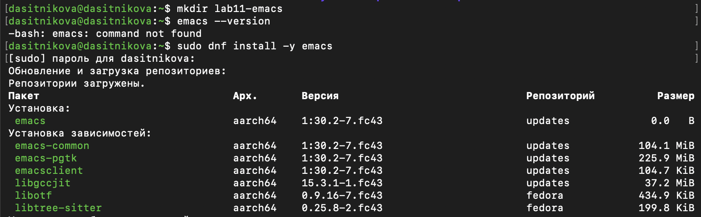
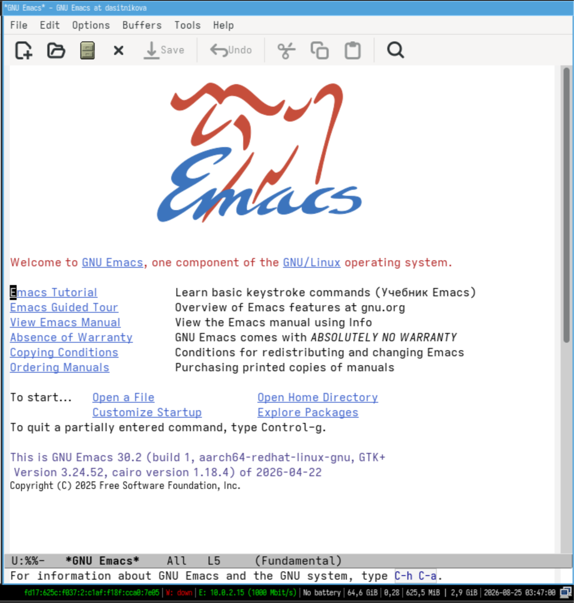
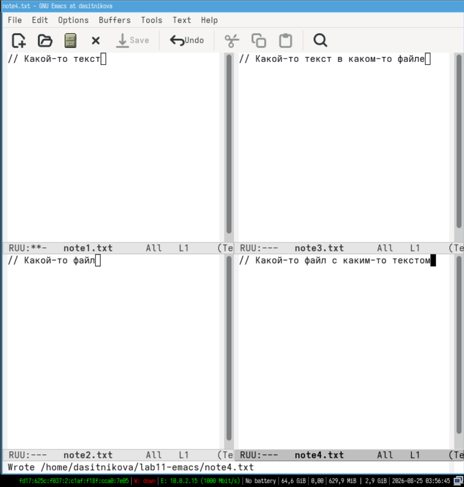
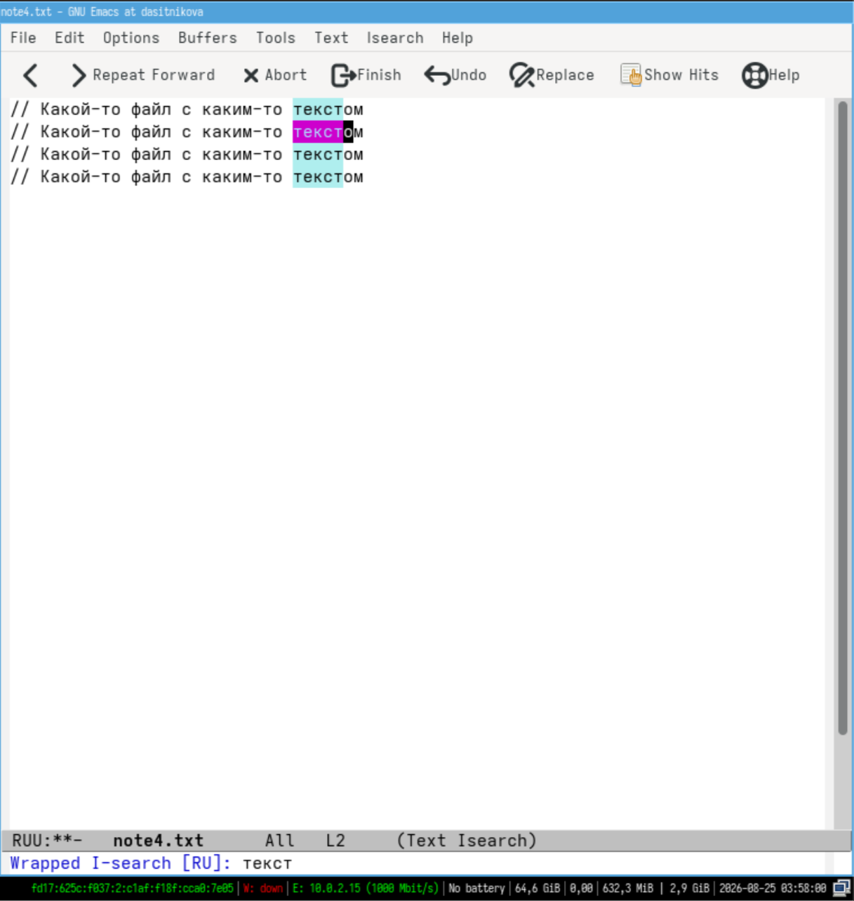
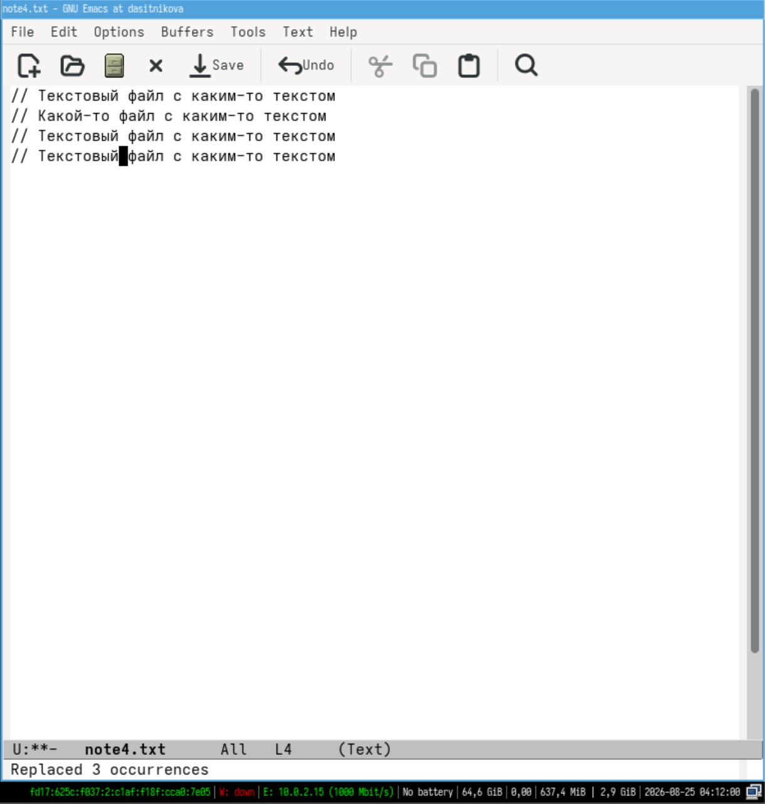

---
## Author
author:
  name: Ситникова Диана Александровна
  degrees: BSc
  email: 1032201746@rudn.ru
  affiliation:
    - name: Российский университет дружбы народов
      country: Российская Федерация
      postal-code: 117198
      city: Москва
      address: ул. Миклухо-Маклая, д. 6

## Title
title: "Отчёт по лабораторной работе № 11"
subtitle: "Текстовой редактор emacs"
license: "CC BY"
bibliography: bib/cite.bib
---

# Цель работы

Познакомиться с операционной системой Linux. Получить практические навыки работы с редактором Emacs.

# Задание

В соответствии с методическими указаниями необходимо выполнить следующую последовательность действий [@rudn_lab11_emacs].

1. Ознакомиться с теоретическим материалом.

2. Ознакомиться с редактором emacs.

3. Выполнить упражнения.

4. Ответить на контрольные вопросы.

Упражнения по основным командам emacs:

1. Открыть emacs.

2. Создать файл сценария с помощью комбинации `C-x C-f`.

3. Набрать заданный текст сценария.

4. Сохранить файл с помощью комбинации `C-x C-s`.

5. Проделать с текстом стандартные процедуры редактирования, выполняя каждое действие комбинацией клавиш: вырезать одной командой целую строку (`C-k`); вставить эту строку в конец файла (`C-y`); выделить область текста (`C-space`); скопировать область в буфер обмена (`M-w`); вставить область в конец файла; вновь выделить эту область и вырезать её (`C-w`); отменить последнее действие (`C-/`).

6. Освоить команды перемещения курсора: в начало строки (`C-a`), в конец строки (`C-e`), в начало буфера (`M-<`), в конец буфера (`M->`).

7. Управление буферами: вывести список активных буферов (`C-x C-b`); переместиться во вновь открытое окно (`C-x o`) и переключиться на другой буфер; закрыть это окно (`C-x 0`); переключаться между буферами без вывода их списка (`C-x b`).

8. Управление окнами: поделить фрейм на четыре части, разделив его на два окна по вертикали (`C-x 3`), а затем каждое из них на две части по горизонтали (`C-x 2`); в каждом из четырёх окон открыть новый буфер и ввести несколько строк текста.

9. Режим поиска: переключиться в режим поиска (`C-s`) и найти несколько слов; переключаться между результатами, нажимая `C-s`; выйти из режима поиска (`C-g`); перейти в режим поиска и замены (`M-%`), ввести искомый текст и текст для замены, подтвердить замену клавишей `!`; испробовать другой режим поиска (`M-s o`) и объяснить, чем он отличается от обычного.

# Краткие теоретические сведения

## Назначение редактора

Текстовый редактор входит в число базовых утилит операционной системы и служит основным средством правки конфигурационных файлов и сценариев [@tanenbaum_book_modern-os_ru]. Emacs представляет собой мощный экранный редактор текста, ядро которого написано на языке C, а функциональность верхнего уровня --- на встроенном диалекте Лиспа Elisp [@rudn_lab11_emacs]. Благодаря этому редактор является не законченной программой с фиксированным набором возможностей, а средой, поведение которой пользователь может изменять и расширять собственными функциями [@emacs_manual]. Язык расширений и доступный из него интерфейс редактора описаны отдельным руководством [@elisp_manual].

Такая архитектура выводит Emacs за рамки редактирования текста: в нём работают файловый менеджер, клиент электронной почты, командная оболочка, интерфейс к системам контроля версий и система чтения документации. Редактор является одним из старейших свободных проектов и входит в состав проекта GNU [@gnu_emacs_site].

## Основные термины

Работа в Emacs описывается несколькими понятиями, значение которых отличается от общепринятого (@tbl-terms).

| Термин | Определение |
|---|---|
| Буфер | объект, представляющий какой-либо текст |
| Фрейм | окно в обычном понимании этого слова |
| Окно | прямоугольная область фрейма, отображающая один из буферов |
| Область вывода | одна или несколько строк внизу фрейма для сообщений и запросов |
| Минибуфер | место ввода дополнительной информации, всегда в области вывода |
| Точка вставки | место вставки или удаления данных в буфере |

: Основные термины Emacs {#tbl-terms}

Буфер может содержать что угодно: содержимое файла, результаты компиляции программы, встроенные подсказки. Практически всё взаимодействие с пользователем, в том числе интерактивное, происходит посредством буферов. Каждое окно имеет свою строку состояния, где выводятся название буфера, его основной режим, признак изменения текста и положение курсора относительно буфера.

Каждый буфер находится только в одном из возможных основных режимов. Существующие основные режимы включают Fundamental --- наименее специализированный, а также Text, Lisp, C, Texinfo и другие. Под второстепенными режимами понимается список режимов, включённых в данный момент в буфере выбранного окна. Режим представляет собой пакет расширений, изменяющий поведение буфера при редактировании и просмотре текста.

## Префиксные клавиши

Для запуска редактора достаточно набрать в командной строке `emacs`, а для работы в фоновом режиме относительно консоли --- `emacs &`; полный перечень параметров запуска приведён в справочной странице [@emacs_manpage]. Работать можно как через элементы меню, так и сочетаниями клавиш: например, выйти из редактора позволяет как пункт `Quit` меню `File`, так и последовательность `C-x C-c`.

Наиболее часто в командах используются сочетания с клавишами `Ctrl` и `Meta`, обозначаемые как `C-` и `M-`; клавиша `Shift` обозначается как `S-`. Поскольку на клавиатуре IBM PC клавиши `Meta` нет, вместо неё используются `Alt` или `Esc`. Для доступа к системе меню служит клавиша `F10`.

Эти клавиши принято называть префиксными. Запись `M-x` означает, что нужно, удерживая `Meta`, нажать `x`. Запись `C-x C-f` означает, что следует, удерживая `Ctrl`, нажать `x`, отпустить обе клавиши и снова, удерживая `Ctrl`, нажать `f`. По назначению префиксы различаются так: `C-x` --- префикс ввода основных команд редактора, `C-c` --- префикс вызова функций, зависящих от используемого режима.

## Перемещение курсора

Основные сочетания для перемещения курсора в буфере приведены в @tbl-move; наряду с ними работают и обычные навигационные клавиши.

| Сочетание | Действие |
|---|---|
| `C-p` | переместиться вверх на одну строку |
| `C-n` | переместиться вниз на одну строку |
| `C-f` | переместиться вперёд на один символ |
| `C-b` | переместиться назад на один символ |
| `C-a` | переместиться в начало строки |
| `C-e` | переместиться в конец строки |
| `C-v` | переместиться вниз на одну страницу |
| `M-v` | переместиться вверх на одну страницу |
| `M-f` | переместиться вперёд на одно слово |
| `M-b` | переместиться назад на одно слово |
| `M-<` | переместиться в начало буфера |
| `M->` | переместиться в конец буфера |
| `C-g` | закончить текущую операцию |

: Основные комбинации клавиш для перемещения курсора {#tbl-move}

## Работа с текстом

Команды правки текста и работы с выделенной областью приведены в @tbl-text и @tbl-region.

| Сочетание | Действие |
|---|---|
| `C-d` | удалить символ у текущего положения курсора |
| `M-d` | удалить следующее за курсором слово |
| `C-k` | удалить текст от курсора до конца строки |
| `M-k` | удалить текст от курсора до конца предложения |
| `M-\` | удалить все пробелы и знаки табуляции вокруг курсора |
| `C-q` | вставить символ, соответствующий нажатой клавише |
| `M-q` | выровнять текст в текущем параграфе буфера |

: Основные комбинации клавиш для работы с текстом {#tbl-text}

| Сочетание | Действие |
|---|---|
| `C-space` | начать выделение текста с текущего положения курсора |
| `C-w` | удалить выделенную область текста в список удалений |
| `M-w` | скопировать выделенную область текста в список удалений |
| `C-y` | вставить текст из списка удалений в позицию курсора |
| `M-y` | последовательно вставить текст из списка удалений |
| `M-\` | выровнять строки выделенной области текста |

: Основные комбинации клавиш для работы с выделенной областью {#tbl-region}

Удалённый и скопированный текст попадает в общий список удалений, поэтому вырезание командой `C-w` и копирование командой `M-w` используют один и тот же механизм вставки `C-y`.

## Поиск, файлы, буферы и окна

Команды поиска и замены приведены в @tbl-search, а команды работы с файлами, буферами и окнами --- в @tbl-files.

| Сочетание | Действие |
|---|---|
| `C-s текст` | поиск текста в прямом направлении |
| `C-r текст` | поиск текста в обратном направлении |
| `M-%` | поиск текста и его замена с запросом |

: Основные комбинации клавиш для поиска и замены {#tbl-search}

| Сочетание | Действие |
|---|---|
| `C-x C-f` | открыть файл |
| `C-x C-s` | сохранить текст в буфер |
| `C-x C-b` | отобразить список открытых буферов в новом окне |
| `C-x b` | переключиться в другой буфер в текущем окне |
| `C-x i` | вставить содержимое файла в буфер в позицию курсора |
| `C-x 0` | закрыть текущее окно, не удаляя буфер |
| `C-x 1` | закрыть все окна кроме текущего |
| `C-x 2` | разделить окно по горизонтали |
| `C-x o` | перейти в другое окно |

: Комбинации клавиш для работы с файлами, буферами и окнами {#tbl-files}

Дополнительно применяются сочетания общего назначения: `C-\` переключает язык ввода, `M-x command` выполняет команду Emacs по её имени, а `C-x u` отменяет последнюю операцию. Обширная справочная система вызывается префиксом `C-h`: `C-h k` показывает, какая команда закреплена за сочетанием клавиш, `C-h f` описывает функцию, `C-h t` открывает интерактивный учебник.

## Регулярные выражения

При работе с командами Emacs можно использовать регулярные выражения. Их синтаксис отличается от библиотеки PCRE: `\s` не задаёт пробел, `\t` не задаёт табуляцию, а операция «или» и скобки группировки экранируются обратной косой чертой --- `\|` и `\(…\)` соответственно. Метасимволы `.`, `*`, `+`, `?`, `^`, `$` и наборы символов в квадратных скобках работают привычным образом, а ленивые варианты повторителей записываются как `*?`, `+?` и `??`.

# Выполнение лабораторной работы

Работа выполнялась в Fedora Linux под учётной записью `dasitnikova`. Нумерация пунктов соответствует упражнениям методических указаний.

## 1. Установка редактора и подготовка каталога {.unnumbered}
Для файлов лабораторной работы был создан отдельный каталог. Проверка показала, что Emacs в системе отсутствует, поэтому он был установлен из репозитория (@fig-001):

~~~bash
mkdir lab11-emacs
emacs --version
sudo dnf install -y emacs
~~~

{#fig-001 width=100%}

Установка выполнена штатным пакетным менеджером Fedora [@dnf_docs]. Была установлена версия 1:30.2-7.fc43 для архитектуры `aarch64` вместе с зависимостями `emacs-common`, `emacs-pgtk`, `emacsclient`, `libgccjit`, `libotf` и `libtree-sitter`.

## 2. Запуск редактора {.unnumbered}
Редактор был запущен в фоновом режиме относительно консоли, что оставило терминал доступным для дальнейшей работы:

~~~bash
cd lab11-emacs/
emacs &
~~~

Оболочка сообщила номер задания и идентификатор процесса. При запуске без указания файла открылся стартовый буфер `*GNU Emacs*` со ссылками на учебник, руководство и условия распространения (@fig-002). В строке состояния указаны имя буфера и основной режим `Fundamental`, а в области вывода --- подсказка о вызове справки сочетанием `C-h C-a`.

{#fig-002 width=100%}

## 3. Создание файла и ввод текста {.unnumbered}
Файл сценария был создан сочетанием `C-x C-f`, после чего в минибуфере было указано его имя. Поскольку файла с таким именем не существовало, Emacs открыл пустой буфер, связанный с этим путём.

Отдельного режима вставки в Emacs нет, поэтому текст набирался сразу:

~~~bash
#!/bin/bash
HELL=Hello
function hello {
  LOCAL HELLO=World
  echo $HELLO
}
echo $HELLO
hello
~~~

Редактор автоматически определил тип файла по расширению и включил основной режим `Shell-script[bash]` [@bash_manual], что видно в строке состояния и по подсветке синтаксиса: ключевые слова, имена переменных и подстановки отображаются разными цветами.

## 4. Сохранение файла {.unnumbered}
Сохранение выполнено сочетанием `C-x C-s`. В области вывода появилось подтверждение `Wrote /home/dasitnikova/lab11-emacs/lab11.sh` (@fig-003). Слева на снимке виден терминал, из которого редактор был запущен.

{#fig-003 width=100%}

## 5. Стандартные процедуры редактирования {.unnumbered}
Все действия выполнялись сочетаниями клавиш без использования меню:

- строка целиком вырезалась командой `C-k`, поданной после перехода в начало строки командой `C-a`;
- вырезанный фрагмент вставлялся в конец файла: `M->` для перехода в конец буфера и `C-y` для вставки из списка удалений;
- область текста выделялась сочетанием `C-space`, после чего в области вывода появлялось сообщение `Mark set`;
- выделенная область копировалась командой `M-w` и вставлялась в конец файла командой `C-y`;
- та же область выделялась повторно и вырезалась командой `C-w`;
- последнее действие отменялось командой `C-/`.

Разница между `M-w` и `C-w` состоит только в судьбе исходного фрагмента: обе команды помещают текст в общий список удалений, но `C-w` дополнительно удаляет его из буфера.

## 6. Команды перемещения курсора {.unnumbered}
Были опробованы команды позиционирования: `C-a` переводит курсор в начало строки, `C-e` --- в конец строки, `M-<` --- в начало буфера, `M->` --- в конец буфера. Номер текущей строки отображается в строке состояния, что позволяет контролировать результат каждой команды.

## 7. Управление буферами {.unnumbered}
Список активных буферов был выведен сочетанием `C-x C-b`. Emacs разделил фрейм и показал в нижнем окне буфер `*Buffer List*` с именами, размерами, режимами и связанными файлами (@fig-004).

{#fig-004 width=100%}

Помимо буфера `lab11.sh`, связанного с файлом, в списке присутствуют служебные буферы: `*GNU Emacs*` со стартовым экраном, `*scratch*` в режиме `Lisp Interaction`, `*Messages*` с журналом сообщений и `*Quail Completions*`, созданный подсистемой ввода кириллицы.

Переход в новое окно выполнялся сочетанием `C-x o`, выбор буфера --- клавишей `Enter`, закрытие окна --- сочетанием `C-x 0`; при этом сам буфер продолжал существовать. Затем переключение между буферами выполнялось без вывода списка, сочетанием `C-x b` с указанием имени в минибуфере.

Содержимое буфера `*Messages*` показывает журнал работы редактора: загрузку файлов инициализации, включение режима `bash`, настройку отступов и сообщения об автосохранении (@fig-005). Этот буфер не связан ни с каким файлом на диске и наглядно подтверждает, что буфер не обязан соответствовать файлу.

{#fig-005 width=100%}

## 8. Управление окнами {.unnumbered}
Фрейм был разделён на четыре окна: сначала сочетанием `C-x 3` он был поделён на два окна по вертикали, затем каждое из них сочетанием `C-x 2` --- на две части по горизонтали, с переходом между окнами по `C-x o`.

В каждом из четырёх окон был открыт новый файл сочетанием `C-x C-f` и введено по строке текста, после чего файлы сохранялись сочетанием `C-x C-s` (@fig-006). В области вывода видно подтверждение `Wrote /home/dasitnikova/lab11-emacs/note4.txt`.

{#fig-006 width=100%}

Каждое окно имеет собственную строку состояния с именем своего буфера --- `note1.txt`, `note2.txt`, `note3.txt` и `note4.txt`. Активным является одно окно; звёздочки в его строке состояния отмечают несохранённые изменения.

## 9. Поиск и замена {.unnumbered}
Инкрементальный поиск запускался сочетанием `C-s` с последующим вводом искомой строки. Совпадения подсвечиваются по мере набора: текущее выделено одним цветом, остальные --- другим (@fig-007). Повторное нажатие `C-s` переводит курсор к следующему совпадению, а по достижении конца буфера поиск продолжается с начала, о чём сообщает надпись `Wrapped I-search`. Выход из режима поиска выполнялся клавишей `C-g`.

{#fig-007 width=100%}

Режим поиска с заменой вызывался сочетанием `M-%`. В минибуфере последовательно запрашиваются искомая строка и строка замены (@fig-008), после чего редактор останавливается на каждом совпадении и ожидает решения: `y` заменить, `n` пропустить, `!` заменить все оставшиеся, `q` прекратить.

{#fig-008 width=100%}

Замена выполняется от текущего положения точки вставки до конца буфера, а не по всему тексту. При первой попытке курсор находился в конце буфера, и редактор сообщил `Replaced 0 occurrences`, не найдя совпадений впереди. После перевода курсора ближе к началу буфера замена прошла успешно и была подтверждена сообщением `Replaced 3 occurrences` (@fig-009).

{#fig-009 width=100%}

Дополнительно был опробован режим поиска `M-s o`, вызывающий команду `occur`. В отличие от инкрементального поиска `C-s`, который перемещает курсор по буферу от одного совпадения к другому и показывает их по одному, команда `occur` собирает все строки с совпадениями в отдельный буфер `*Occur*` с указанием их номеров. Курсор в исходном буфере при этом не смещается, а по полученному списку можно перейти к любой строке. Таким образом, `C-s` предназначен для навигации, а `M-s o` --- для обзора всех вхождений сразу.

# Выводы

В ходе работы было продолжено знакомство с операционной системой Linux и получены практические навыки работы с редактором Emacs. Освоены базовые понятия редактора --- буфер, фрейм, окно, минибуфер и точка вставки --- и усвоено, что буфер существует независимо от окна и не обязан соответствовать файлу на диске.

Практически применены команды всех основных групп: создание и сохранение файла сочетаниями `C-x C-f` и `C-x C-s`, правка текста командами `C-k`, `C-y`, `C-w`, `M-w` и `C-/`, перемещение курсора командами `C-a`, `C-e`, `M-<` и `M->`, управление буферами через `C-x C-b`, `C-x b` и `C-x 0`, разделение фрейма на четыре окна сочетаниями `C-x 3` и `C-x 2`, а также поиск и замена командами `C-s`, `M-%` и `M-s o`. Выяснено, что замена в Emacs является направленной и выполняется от точки вставки вперёд. Цель лабораторной работы достигнута.

# Ответы на контрольные вопросы

1. **Кратко охарактеризуйте редактор emacs.**

   Emacs --- свободный расширяемый экранный редактор текста, ядро которого написано на C, а вся функциональность верхнего уровня реализована на встроенном диалекте Лиспа Elisp. Поведение буфера определяется режимом, а каждый режим является программой на Elisp, которую пользователь может изменить или написать заново, поэтому редактор представляет собой не законченную программу, а среду.

   За счёт этого Emacs выходит далеко за рамки правки текста: в нём работают файловый менеджер, почтовый клиент, командная оболочка, интерфейс к системам контроля версий и чтение документации. Всё взаимодействие идёт через буферы, окна и фреймы, а управление построено на префиксных сочетаниях с `Ctrl` и `Meta`, что позволяет работать не отрывая рук от клавиатуры.

2. **Какие особенности данного редактора могут сделать его сложным для освоения новичком?**

   Основная сложность --- объём и непривычность системы сочетаний клавиш. Команды строятся из префиксов `C-` и `M-` и часто состоят из двух последовательных нажатий вроде `C-x C-f` или `C-h k`. Клавиши `Meta` на клавиатуре IBM PC нет, её роль играют `Alt` или `Esc`. Привычные сочетания работают иначе, чем в других программах: `C-c` служит префиксом, а не копированием, `C-v` перемещает на страницу вниз, а не вставляет.

   Добавляет трудностей собственная терминология, где слово «окно» означает не то, что в графических системах, а фреймом называется то, что обычно и считают окном. Настройка требует знакомства с Elisp, а сочетания могут конфликтовать с системными: например, `C-space` часто перехватывается переключателем раскладки. Наконец, поведение команд не всегда очевидно: как показала работа, замена по `M-%` действует только вперёд от курсора, из-за чего при курсоре в конце буфера редактор сообщает `Replaced 0 occurrences`.

3. **Своими словами опишите, что такое буфер и окно в терминологии emacs'а.**

   Буфер --- это область памяти, хранящая некоторый текст вместе с его состоянием: именем, основным режимом, признаком изменённости и положением точки вставки. Буфер не обязан соответствовать файлу на диске: в ходе работы наблюдались буферы `*Messages*` с журналом сообщений, `*scratch*` для заметок и `*GNU Emacs*` со стартовым экраном, ни один из которых не связан с файлом.

   Окно --- прямоугольная область фрейма, в которой отображается один из буферов. Окно является лишь способом посмотреть на буфер: один буфер может быть открыт сразу в нескольких окнах, а буфер, не показанный ни в одном окне, продолжает существовать, что подтвердилось при закрытии окна сочетанием `C-x 0`. Фреймом же называется то, что в графических системах принято называть окном.

4. **Можно ли открыть больше 10 буферов в одном окне?**

   Число буферов ограничено только объёмом доступной памяти, и открыть больше десяти можно без каких-либо затруднений. Однако формулировка содержит подмену понятий: буферы не открываются «в окне», они существуют независимо от окон.

   Одно окно в каждый момент времени отображает ровно один буфер. Переключение выполняется командой `C-x b` по имени либо через список `C-x C-b`, и при этом предыдущий буфер сохраняет своё содержимое и позицию курсора. Корректная формулировка такова: буферов может быть сколько угодно, а видимым в одном окне является один из них.

5. **Какие буферы создаются по умолчанию при запуске emacs?**

   При запуске без указания файла создаются буфер `*scratch*` --- черновик в режиме `Lisp Interaction` для заметок и вычисления выражений на Elisp, буфер `*Messages*` с журналом всех служебных сообщений и приветственный буфер `*GNU Emacs*` со стартовым экраном.

   Список, полученный в ходе работы командой `C-x C-b`, подтверждает это и содержит дополнительно буфер `*Quail Completions*`, созданный подсистемой ввода кириллицы. По мере работы служебные буферы появляются автоматически: `*Buffer List*` при выводе списка, `*Occur*` после `M-s o`, `*Help*` при обращении к справке.

6. **Какие клавиши вы нажмёте, чтобы ввести следующую комбинацию `C-c |` и `C-c C-|`?**

   Для `C-c |` следует, удерживая `Ctrl`, нажать `c`, затем отпустить обе клавиши и ввести символ вертикальной черты, то есть нажать `Shift` и клавишу с обратной косой чертой. Управляющая клавиша при вводе самого символа уже не удерживается.

   Для `C-c C-|` первая часть та же, а во второй символ вводится при удерживаемой `Ctrl`: одновременно нажимаются `Ctrl`, `Shift` и клавиша с обратной косой чертой. Такое сочетание передаётся не всяким терминалом, поэтому в текстовом режиме оно может не дойти до редактора, тогда как в графическом фрейме работает.

7. **Как поделить текущее окно на две части?**

   Сочетание `C-x 2` делит текущее окно по горизонтали, размещая новое окно снизу. Сочетание `C-x 3` делит его по вертикали, размещая новое окно справа. В обоих случаях оба окна сначала показывают один и тот же буфер, а в новом можно открыть другой командой `C-x b` или `C-x C-f`.

   Переход между окнами выполняется командой `C-x o`, закрытие текущего --- `C-x 0`, а возврат к единственному окну --- `C-x 1`; буферы при этом не удаляются. Последовательным применением `C-x 3` и `C-x 2` фрейм был разделён на четыре окна, в каждом из которых открыт свой файл.

8. **В каком файле хранятся настройки редактора emacs?**

   Пользовательские настройки хранятся в файле инициализации на языке Elisp. Исторически это `~/.emacs`, современный и предпочтительный вариант --- `~/.emacs.d/init.el`; поддерживается также размещение `~/.config/emacs/init.el` по стандарту XDG. Файл читается при запуске, и записанные в нём выражения выполняются как программа.

   В нём задаются переменные через `setq`, переназначаются клавиши через `global-set-key`, включаются режимы и подключаются пакеты. Настройки, сделанные через интерфейс `M-x customize`, записываются туда же в блок `custom-set-variables`. Общесистемные умолчания находятся в `/etc/emacs/site-start.el` и в файлах каталога `site-lisp`, загрузка которых видна в буфере `*Messages*`.

9. **Какую функцию выполняет клавиша `Backspace` и можно ли её переназначить?**

   Клавиша `Backspace` удаляет один символ слева от точки вставки, за что отвечает команда `delete-backward-char`. Её следует отличать от `C-d`, удаляющей символ справа от курсора. Если область выделена и включён режим `delete-selection-mode`, клавиша удаляет всё выделение целиком.

   Переназначить её можно, как и любую другую клавишу. С ней связана известная особенность: в текстовом терминале она нередко посылает код `C-h`, за которым закреплён префикс справки, и вместо удаления открывается окно помощи. Лечится это в файле инициализации, например выражением `(keyboard-translate ?\C-h ?\C-?)` либо привязкой `(global-set-key (kbd "C-h") 'delete-backward-char)` с переносом справки на другое сочетание.

10. **Какой редактор вам показался удобнее в работе `vi` или `emacs`? Поясните почему.**

    В работе оказался удобнее `vi`. Его модель проще: три режима с чёткими границами, а команды короткие и состоят из одной-двух клавиш --- `dd`, `u`, `G`, `x`. Достаточно помнить, что `Esc` всегда возвращает в командный режим. Редактор гарантированно присутствует в любой системе, включая аварийный режим и минимальный образ, и не требует установки, тогда как Emacs пришлось доустанавливать из репозитория.

    Emacs при этом объективно мощнее: он не делит работу на режимы, позволяет держать несколько файлов в окнах одного фрейма, даёт встроенную справку по любому сочетанию через `C-h k` и расширяется на Elisp под свои задачи. Его команды выразительнее --- `occur` по `M-s o` собирает все вхождения сразу, чего в `vi` штатными средствами нет. Платой за это служат длинные аккорды вроде `C-x C-f`, конфликты сочетаний с оболочкой рабочего стола и неочевидное поведение отдельных команд. Для быстрой правки конфигурационного файла на сервере удобнее `vi`, для длительной работы над проектом --- Emacs.

# Список литературы {.unnumbered}

::: {#refs}
:::
