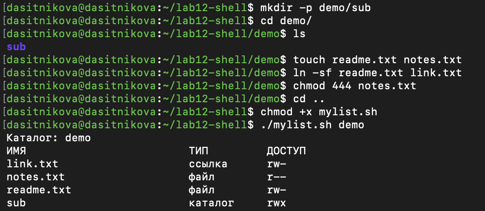
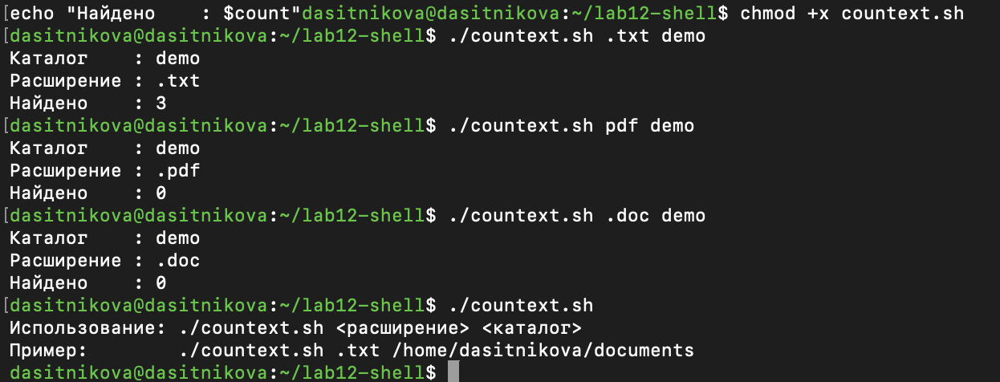

---
## Author
author:
  name: Ситникова Диана Александровна
  degrees: BSc
  email: 1032201746@rudn.ru
  affiliation:
    - name: Российский университет дружбы народов
      country: Российская Федерация
      postal-code: 117198
      city: Москва
      address: ул. Миклухо-Маклая, д. 6
## Title
title: "Лабораторная работа № 12"
subtitle: "Программирование в командном процессоре ОС UNIX. Командные файлы"
license: CC BY
date: today
date-format: "YYYY-MM-DD"
header-includes:
  - \usepackage{tikz}
---

# Информация

## Докладчик

:::::::::::::: {.columns align=center}
::: {.column width="68%"}

- Ситникова Диана Александровна
- направление 09.03.03 «Прикладная информатика»
- Российский университет дружбы народов
- [1032201746@rudn.ru](mailto:1032201746@rudn.ru)

:::
::: {.column width="32%"}

{width=100%}

:::
::::::::::::::

# Вводная часть

## Актуальность

- Рутинные операции в системе повторяются десятки раз в день.
- Командный файл превращает последовательность команд в одну команду.
- Оболочка есть в любой Unix-системе и не требует установки среды разработки.
- Администрирование, резервное копирование и обработка файлов держатся на скриптах.

## Объект и предмет исследования

**Объект** --- командный процессор `bash` операционной системы Linux.

**Предмет** --- переменные и подстановки, позиционные параметры, управляющие конструкции и средства проверки свойств файлов.

## Цели и задачи

**Цель** --- изучить основы программирования в оболочке и научиться писать небольшие командные файлы.

**Задачи:**

- освоить переменные, подстановки и специальные переменные оболочки;
- научиться передавать и обрабатывать параметры командной строки;
- написать четыре командных файла по заданию.

## Материалы и методы

| Компонент | Значение |
|---|---|
| Операционная система | Fedora Linux в виртуальной машине |
| Оболочка | GNU `bash` |
| Редактор | `nano` |
| Архиватор | `tar` с ключами `-czf` |
| Источник задания | методические указания РУДН |

# Содержание исследования

## Девять параметров доступны напрямую, остальные --- перебором

\begin{center}
\resizebox{\linewidth}{!}{%
\begin{tikzpicture}[font=\scriptsize, >=latex]
  \draw[thick] (0,3.0) rectangle (11,3.7);
  \node at (5.5,3.35) {\texttt{./args.sh a b c d e f g h i j k l m}};

  \draw[->,thick] (5.5,3.0) -- (5.5,2.5);

  \draw[thick] (0,1.6) rectangle (3.4,2.5);
  \node[align=center] at (1.7,2.05) {\texttt{\$0}\\имя файла};

  \draw[very thick] (3.8,1.6) rectangle (7.2,2.5);
  \node[align=center] at (5.5,2.05) {\texttt{\$1} … \texttt{\$9}\\доступны прямо};

  \draw[thick,dashed] (7.6,1.6) rectangle (11,2.5);
  \node[align=center] at (9.3,2.05) {\texttt{\$10} не работает\\только \texttt{\$\{10\}}};

  \draw[->,thick] (5.5,1.6) -- (5.5,1.2) -- (2.8,1.2) -- (2.8,0.9);
  \draw[->,thick] (5.5,1.2) -- (8.2,1.2) -- (8.2,0.9);

  \draw[thick] (0.6,0.0) rectangle (5.0,0.9);
  \node[align=center] at (2.8,0.45) {\texttt{for arg in "\$@"}\\перебор списка};

  \draw[thick] (6.0,0.0) rectangle (10.4,0.9);
  \node[align=center] at (8.2,0.45) {\texttt{while … shift}\\сдвиг параметров};
\end{tikzpicture}}
\end{center}

Оба способа не зависят от числа аргументов --- проверено на тринадцати.

## Проверки `test` заменяют разбор прав вручную

| Проверка | Истинна, если |
|---|---|
| `-L` | символическая ссылка |
| `-d` | каталог |
| `-f` | обычный файл |
| `-r` `-w` `-x` | доступен по чтению, записи, выполнению |

Порядок важен: `-d` и `-f` идут **по ссылке**, поэтому `-L` проверяется первой.

## Скрипт находит сам себя и уходит в архив

:::::::::::::: {.columns align=center}
::: {.column width="42%"}

`$0` даёт имя запущенного файла, `realpath` приводит его к абсолютному виду.

`tar -czf` создаёт архив, ключ `-C` убирает из него абсолютный путь.

:::
::: {.column width="58%"}

{width=100%}

:::
::::::::::::::

## Тринадцать аргументов обработаны двумя способами

{height=52mm fig-align="center"}

Цикл `for` и команда `shift` дали одинаковый результат, включая десятый аргумент и далее.

## Аналог `ls` собран из шаблона и проверок

:::::::::::::: {.columns align=center}
::: {.column width="42%"}

Содержимое перечисляет раскрытие `"$dir"/*` --- средствами самой оболочки.

Ссылка, файл, каталог и права `r--` у `notes.txt` определены верно.

:::
::: {.column width="58%"}

{width=100%}

:::
::::::::::::::

## Подсчёт по расширению устойчив к вводу

:::::::::::::: {.columns align=center}
::: {.column width="42%"}

`${extension#.}` снимает точку, поэтому `.txt` и `txt` равнозначны.

`nullglob` даёт честный ноль вместо нераскрытого шаблона.

Без аргументов --- подсказка и код возврата 1.

:::
::: {.column width="58%"}

{width=100%}

:::
::::::::::::::

# Результаты

## Все четыре командных файла работают

- `backup.sh` --- архивирует собственный исходный код в `~/backup`.
- `args.sh` --- обрабатывает произвольное число аргументов.
- `mylist.sh` --- выводит тип и права объектов каталога без `ls`.
- `countext.sh` --- считает файлы заданного формата.
- Применены `if`, `for`, `while`, функция с `local` и проверки `test`.

## Оболочка — это язык программирования, а не только приглашение

Те же команды, что набираются вручную, складываются в программу с переменными, ветвлениями и циклами.

Скрипт из пятнадцати строк заменяет последовательность действий, которую иначе пришлось бы повторять каждый раз заново.
