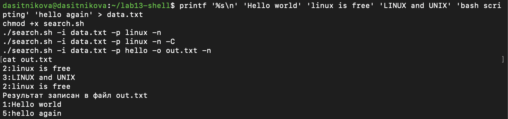
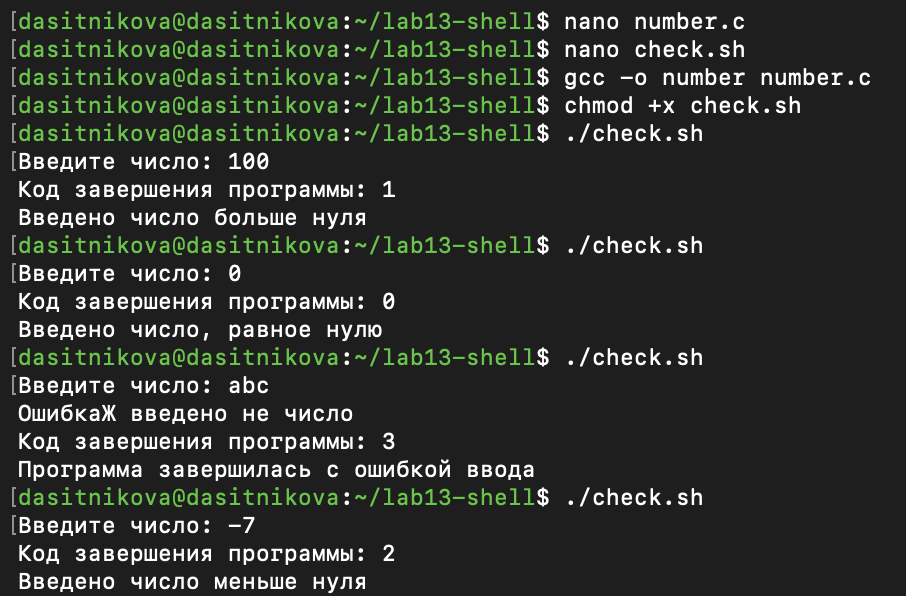
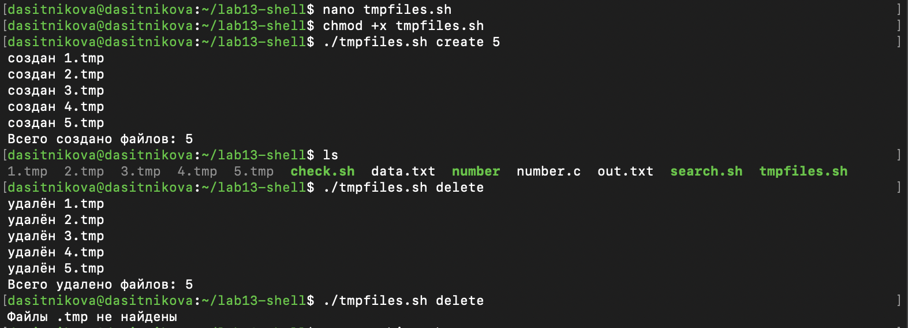
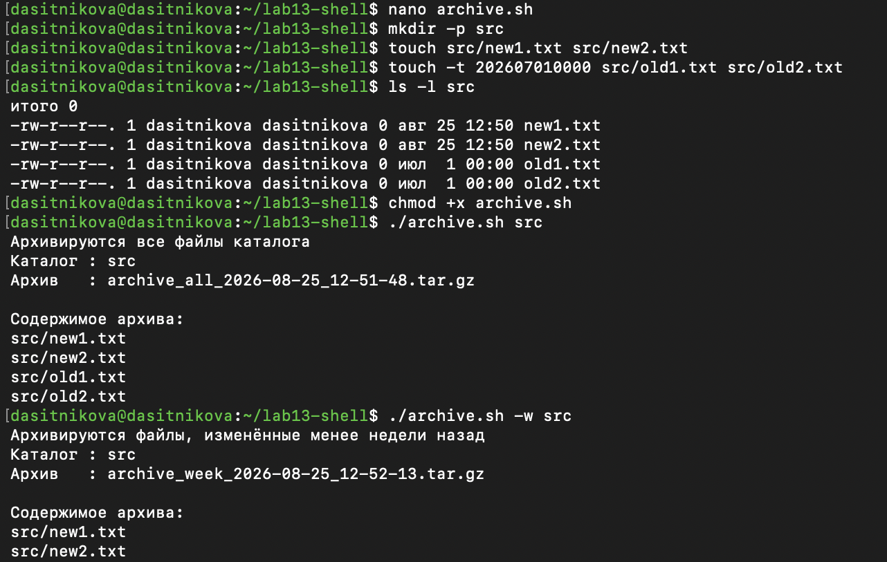

---
## Author
author:
  name: Ситникова Диана Александровна
  degrees: BSc
  email: 1032201746@rudn.ru
  affiliation:
    - name: Российский университет дружбы народов
      country: Российская Федерация
      postal-code: 117198
      city: Москва
      address: ул. Миклухо-Маклая, д. 6
## Title
title: "Лабораторная работа № 13"
subtitle: "Программирование в командном процессоре ОС UNIX. Ветвления и циклы"
institute:
  - "Российский университет дружбы народов им. П. Лумумбы"
  - "Преподаватель: д.ф.-м.н., профессор Кулябов Дмитрий Сергеевич"
license: CC BY
date: today
date-format: "YYYY-MM-DD"
header-includes:
  - \usepackage{tikz}
---

# Информация

## Докладчик

:::::::::::::: {.columns align=center}
::: {.column width="68%"}

- Ситникова Диана Александровна
- направление 09.03.03 «Прикладная информатика»
- Российский университет дружбы народов
- [1032201746@rudn.ru](mailto:1032201746@rudn.ru)

:::
::: {.column width="32%"}

{width=100%}

:::
::::::::::::::

# Вводная часть

## Актуальность

- Реальный скрипт редко выполняется линейно: нужны проверки и повторы.
- Утилиты принимают ключи, и разбирать их вручную --- источник ошибок.
- Программы сообщают результат кодом завершения, а не только выводом.
- На этих механизмах держится автоматизация: резервные копии, обслуживание, отбор файлов.

## Объект и предмет исследования

**Объект** --- командный процессор `bash` операционной системы Linux.

**Предмет** --- разбор командной строки командой `getopts`, коды завершения, ветвления `if` и `case`, циклы `while` и `for`.

## Научная новизна и практическая значимость

**Научная новизна** --- разбор ключей передан команде `getopts` вместо ручной проверки позиционных параметров.

**Практическая значимость** --- именно так устроены настоящие утилиты командной строки.

## Цель, гипотеза и задачи

**Цель** --- научиться писать более сложные командные файлы с использованием логических управляющих конструкций и циклов.

**Гипотеза** --- кода завершения достаточно как канала связи между программой и оболочкой.

**Задачи:**

- освоить разбор ключей командой `getopts`;
- научиться анализировать код завершения программы;
- написать четыре командных файла и программу на языке Си.

## Материалы и методы

| Компонент | Значение |
|---|---|
| Операционная система | Fedora Linux в виртуальной машине |
| Оболочка | GNU `bash` |
| Компилятор | `gcc` |
| Утилиты | `grep`, `find`, `tar` |
| Источник задания | методические указания РУДН |

# Содержание исследования

## `getopts` разбирает ключи, `OPTARG` хранит их аргументы

\begin{center}
\resizebox{\linewidth}{!}{%
\begin{tikzpicture}[font=\scriptsize, >=latex]
  \draw[thick] (0,3.2) rectangle (11,3.9);
  \node at (5.5,3.55) {\texttt{./search.sh -i data.txt -p linux -n -C}};

  \draw[->,thick] (5.5,3.2) -- (5.5,2.8);

  \draw[very thick] (3.0,1.9) rectangle (8.0,2.8);
  \node[align=center] at (5.5,2.35) {\texttt{while getopts i:o:p:Cn optletter}\\строка опций: двоеточие = нужен аргумент};

  \draw[->,thick] (3.0,2.35) -- (1.4,2.35) -- (1.4,1.5);
  \draw[->,thick] (8.0,2.35) -- (9.6,2.35) -- (9.6,1.5);

  \draw[thick] (0,0.6) rectangle (2.8,1.5);
  \node[align=center] at (1.4,1.05) {\texttt{optletter}\\буква ключа};

  \draw[thick] (8.2,0.6) rectangle (11,1.5);
  \node[align=center] at (9.6,1.05) {\texttt{OPTARG}\\аргумент ключа};

  \draw[->,thick] (1.4,0.6) -- (1.4,0.3) -- (5.5,0.3);
  \draw[->,thick] (9.6,0.6) -- (9.6,0.3) -- (5.5,0.3);
  \draw[->,thick] (5.5,0.3) -- (5.5,0.0);

  \node at (5.5,-0.25) {\texttt{case \$optletter in … esac} --- ветвление по каждому ключу};
\end{tikzpicture}}
\end{center}

После разбора `shift $((OPTIND - 1))` оставляет в параметрах только не-ключи.

## Код завершения --- канал связи программы с оболочкой

| Код | Значение в программе | Сообщение командного файла |
|---|---|---|
| `0` | число равно нулю | «Введено число, равное нулю» |
| `1` | число больше нуля | «Введено число больше нуля» |
| `2` | число меньше нуля | «Введено число меньше нуля» |
| `3` | ошибка ввода | «Программа завершилась с ошибкой ввода» |

Ноль отдан «равно нулю» не случайно: для оболочки нулевой код означает успех.

## Ключ `-C` включает различение регистра

:::::::::::::: {.columns align=center}
::: {.column width="42%"}

Без `-C` шаблон `linux` находит две строки, включая `LINUX`.

С `-C` остаётся одна.

Ключ `-o` перенаправляет результат в файл, `-n` добавляет номера строк.

:::
::: {.column width="58%"}

{width=100%}

:::
::::::::::::::

## `$?` превращает код в осмысленное сообщение

{height=52mm fig-align="center"}

Четыре запуска: `100`, `0`, `abc`, `-7` — коды 1, 0, 3 и 2 соответственно.

## Один файл работает в двух режимах

:::::::::::::: {.columns align=center}
::: {.column width="42%"}

Режим выбирает `case` по первому аргументу.

Создание --- цикл `while` со счётчиком, удаление --- цикл `for` по шаблону `*.tmp`.

Повторный запуск сообщает, что файлов нет, и не падает.

:::
::: {.column width="58%"}

{width=100%}

:::
::::::::::::::

## Одно условие `find` меняет содержимое архива

:::::::::::::: {.columns align=center}
::: {.column width="42%"}

Без ключа в архив идут все четыре файла.

С ключом `-w` добавляется `-mtime -7`, и остаются только два свежих.

`-print0` и `--null` защищают от пробелов в именах.

:::
::: {.column width="58%"}

{width=100%}

:::
::::::::::::::

# Результаты

## Четыре командных файла и программа на Си работают

- `search.sh` --- разбирает пять ключей и ищет строки командой `grep`.
- `number.c` и `check.sh` --- передают знак числа через код завершения.
- `tmpfiles.sh` --- создаёт и удаляет пронумерованный набор файлов.
- `archive.sh` --- архивирует каталог, с ключом `-w` --- только за неделю.
- Применены `if`, `case`, `while`, `for` и разбор `getopts`.

## Анализ результатов и их применимость

- Пять ключей разбираются в произвольном порядке.
- Знак числа передаётся из программы на Си одним байтом.
- Отбор файлов по времени изменения меняется одним условием.

Такой разбор ключей соответствует устройству стандартных утилит системы.

## Ветвление и цикл превращают набор команд в программу

Линейный список команд умеет ровно одно. Проверка условия и повтор дают скрипту способность реагировать на данные.

Один и тот же файл обрабатывает любое число аргументов, работает в двух режимах и меняет поведение от одного ключа.
