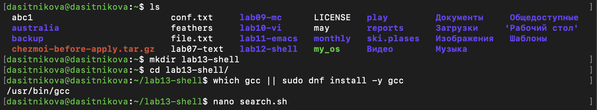

---
## Author
author:
  name: Ситникова Диана Александровна
  degrees: BSc
  email: 1032201746@rudn.ru
  affiliation:
    - name: Российский университет дружбы народов
      country: Российская Федерация
      postal-code: 117198
      city: Москва
      address: ул. Миклухо-Маклая, д. 6

## Title
title: "Отчёт по лабораторной работе № 13"
subtitle: "Программирование в командном процессоре ОС UNIX. Ветвления и циклы"
license: "CC BY"
bibliography: bib/cite.bib
---

# Цель работы

Изучить основы программирования в оболочке ОС UNIX. Научиться писать более сложные командные файлы с использованием логических управляющих конструкций и циклов.

# Задание

В соответствии с методическими указаниями необходимо выполнить следующую последовательность действий [@rudn_lab13_shell].

1. Используя команды `getopts` и `grep`, написать командный файл, который анализирует командную строку с ключами:

   - `-iinputfile` --- прочитать данные из указанного файла;
   - `-ooutputfile` --- вывести данные в указанный файл;
   - `-pшаблон` --- указать шаблон для поиска;
   - `-C` --- различать большие и малые буквы;
   - `-n` --- выдавать номера строк,

   а затем ищет в указанном файле нужные строки, определяемые ключом `-p`.

2. Написать на языке Си программу, которая вводит число и определяет, является ли оно больше нуля, меньше нуля или равно нулю. Затем программа завершается с помощью функции `exit(n)`, передавая информацию о коде завершения в оболочку. Командный файл должен вызывать эту программу и, проанализировав с помощью команды `$?`, выдать сообщение о том, какое число было введено.

3. Написать командный файл, создающий указанное число файлов, пронумерованных последовательно от 1 до `N` (например `1.tmp`, `2.tmp`, `3.tmp`, `4.tmp` и т. д.). Число файлов, которые необходимо создать, передаётся в аргументы командной строки. Этот же командный файл должен уметь удалять все созданные им файлы, если они существуют.

4. Написать командный файл, который с помощью команды `tar` запаковывает в архив все файлы в указанной директории. Модифицировать его так, чтобы запаковывались только те файлы, которые были изменены менее недели тому назад, используя команду `find`.

# Краткие теоретические сведения

## Разбор командной строки командой `getopts`

Командный файл на языке оболочки является полноценной программой с переменными, ветвлениями и циклами, а сама оболочка --- интерфейсом между пользователем и ядром операционной системы [@tanenbaum_book_modern-os_ru]. Команда `getopts` осуществляет синтаксический анализ командной строки, выделяя ключи --- опции, обычно помеченные знаком минус. Синтаксис имеет вид `getopts option-string variable`, где строка опций перечисляет допустимые буквы ключей. Двоеточие после буквы означает, что этот ключ сопровождается аргументом [@bash_manual].

Команда возвращает истину, пока способна распознать очередной ключ, поэтому её принято включать в цикл `while` и анализировать результат оператором `case`. Разобранная буква ключа присваивается указанной переменной, а сопутствующие значения помещаются в специальные переменные (@tbl-getopts).

| Переменная | Назначение |
|---|---|
| `OPTARG` | аргумент текущего ключа, если ключ его требует |
| `OPTIND` | числовой индекс очередного разбираемого аргумента |

: Специальные переменные команды `getopts` {#tbl-getopts}

Такой разбор избавляет от ручной проверки позиционных параметров, позволяет задавать ключи в произвольном порядке и объединять флаги без аргументов. После цикла разбора применяют `shift $((OPTIND - 1))`, чтобы в позиционных параметрах остались только аргументы, не являющиеся ключами [@robbins_book_bash_en].

## Коды завершения и переменная `$?`

Каждая завершившаяся команда возвращает оболочке код завершения --- целое число от 0 до 255. Нулевое значение означает успешное выполнение и трактуется управляющими конструкциями как «истина», ненулевое --- как «ложь». Код последней выполненной команды доступен в специальной переменной `$?` [@posix_shell].

В программе на языке Си код завершения задаётся функцией `exit(n)` из заголовочного файла `stdlib.h` либо значением, возвращаемым функцией `main` [@c_exit]. Поскольку под код отведён один байт, отрицательные значения передавать нельзя: вызов `exit(-1)` будет воспринят оболочкой как код 255. Это делает код завершения удобным каналом передачи небольшого признака результата из программы в вызвавший её командный файл.

## Команда `test` и управляющие конструкции

Команда `test`, имеющая равнозначную форму записи в квадратных скобках, создана специально для использования в командных файлах, и её единственная функция --- выработка кода завершения. Основные проверки приведены в @tbl-test.

| Проверка | Истинна, если |
|---|---|
| `-e file` | объект существует |
| `-f file` | это обычный файл |
| `-d file` | это каталог |
| `-x file` | доступен по выполнению |
| `-z строка` | строка пуста |
| `-n строка` | строка непуста |
| `число1 -le число2` | первое число не больше второго |

: Основные проверки команды `test` {#tbl-test}

Для организации ветвлений и циклов язык `bash` предоставляет конструкции, приведённые в @tbl-control. С точки зрения командного процессора все они являются обычными командами и могут применяться как в командных файлах, так и в интерактивном режиме.

| Конструкция | Назначение |
|---|---|
| `if … then … elif … else … fi` | ветвление по коду завершения команды |
| `case … in … esac` | выбор по совпадению с образцом |
| `for имя [in список] … done` | перебор элементов списка |
| `while условие … done` | цикл, пока условие истинно |
| `until условие … done` | цикл, пока условие ложно |

: Управляющие конструкции языка `bash` {#tbl-control}

Оператор `for` без списка значений перебирает позиционные параметры, то есть `for i` равносильно `for i in $*`. Замена служебного слова `while` на `until` меняет условие выхода из цикла на противоположное, в остальном конструкции идентичны.

## Прерывание циклов и команды `true` и `false`

Прервать цикл позволяют две команды. Команда `break` завершает выполнение цикла целиком и передаёт управление на команду, следующую за `done`. Команда `continue` завершает только текущую итерацию и переходит к следующей, не покидая цикл. Обе принимают необязательный числовой аргумент, указывающий, на сколько уровней вложенных циклов подействовать.

Команды `true` и `false` используются только совместно с управляющими конструкциями и не делают ничего, кроме выработки кода завершения: `true` всегда возвращает ноль, то есть истину, а `false` --- ненулевое значение, то есть ложь. Их основное назначение --- организация заведомо бесконечных циклов вида `while true` и `until false`, выполняющихся до срабатывания `break` или внешнего прерывания [@gnu_coreutils].

## Поиск строк командой `grep`

Команда `grep` производит контекстный поиск в тексте, выводя строки, содержащие заданный образец. Она способна работать как с файлами, так и в качестве фильтра, читая стандартный ввод [@gnu_grep]. Часто используемые ключи приведены в @tbl-grep.

| Ключ | Действие |
|---|---|
| `-i` | не различать прописные и строчные буквы |
| `-n` | выводить номера найденных строк |
| `-v` | выводить строки, не содержащие образец |
| `-c` | вывести только количество совпадений |
| `-E` | трактовать образец как расширенное регулярное выражение |
| `--` | признак конца ключей, далее идёт образец |

: Часто используемые ключи команды `grep` {#tbl-grep}

## Отбор файлов командой `find` и архивация

Команда `find` обходит дерево каталогов и отбирает объекты по заданным условиям. Ключ `-maxdepth` ограничивает глубину обхода, `-type f` оставляет только обычные файлы, а `-mtime` отбирает по времени последнего изменения: запись `-mtime -7` означает «изменён менее семи суток назад», `+7` --- «более семи суток назад» [@gnu_findutils].

Результат работы `find` можно передать архиватору. Ключ `-print0` разделяет имена нулевым байтом, а парный ему ключ `--null` команды `tar` вместе с `-T -` читает такой список со стандартного ввода. Такое сочетание корректно обрабатывает имена файлов с пробелами, тогда как передача через обычный перевод строки на них ломается [@gnu_tar].

# Выполнение лабораторной работы

Работа выполнялась в Fedora Linux в каталоге `~/lab13-shell`. Наличие компилятора проверялось командой `which gcc` (@fig-001).

~~~bash
mkdir lab13-shell
cd lab13-shell/
which gcc || sudo dnf install -y gcc
~~~

{#fig-001 width=100%}

## 1. Разбор ключей командой `getopts` и поиск командой `grep` {.unnumbered}

Командный файл разбирает пять ключей и передаёт собранные параметры команде `grep` (@fig-002):

~~~bash
#!/bin/bash
# Анализ командной строки командой getopts и поиск строк командой grep

inputfile=""
outputfile=""
pattern=""
case_flag="-i"
number_flag=""

while getopts i:o:p:Cn optletter; do
    case $optletter in
        i) inputfile="$OPTARG" ;;
        o) outputfile="$OPTARG" ;;
        p) pattern="$OPTARG" ;;
        C) case_flag="" ;;
        n) number_flag="-n" ;;
        *) echo "Недопустимый ключ" >&2; exit 1 ;;
    esac
done

if [ -z "$pattern" ]; then
    echo "Не задан шаблон поиска (ключ -p)" >&2
    exit 1
fi

if [ -z "$inputfile" ]; then
    echo "Не задан входной файл (ключ -i)" >&2
    exit 1
fi

if [ ! -f "$inputfile" ]; then
    echo "Файл '$inputfile' не существует" >&2
    exit 1
fi

if [ -n "$outputfile" ]; then
    grep $case_flag $number_flag -- "$pattern" "$inputfile" > "$outputfile"
    echo "Результат записан в файл $outputfile"
else
    grep $case_flag $number_flag -- "$pattern" "$inputfile"
fi
~~~

{#fig-002 width=100%}

В строке `getopts i:o:p:Cn` двоеточие после букв `i`, `o` и `p` означает, что эти ключи требуют аргумента, который попадает в переменную `OPTARG`. Ключи `C` и `n` двоеточия не имеют и являются простыми флагами. Ветвь `*` оператора `case` перехватывает недопустимый ключ и завершает работу с ненулевым кодом.

По заданию ключ `-C` включает различение регистра. Поскольку `grep` по умолчанию регистр различает, логика построена обратным образом: переменная `case_flag` изначально содержит `-i`, отключающий чувствительность к регистру, а ключ `-C` очищает её. Ключ `-n` добавляет к вызову `grep` вывод номеров строк. Разделитель `--` перед шаблоном не позволяет `grep` принять образец, начинающийся с минуса, за собственный ключ.

Три проверки контролируют полноту и корректность входных данных: задан ли шаблон, задан ли входной файл и существует ли он. Диагностические сообщения направляются в стандартный поток ошибок конструкцией `>&2`.

Для проверки был подготовлен файл с текстом в разном регистре (@fig-003):

~~~bash
printf '%s\n' 'Hello world' 'linux is free' 'LINUX and UNIX' \
    'bash scripting' 'hello again' > data.txt
chmod +x search.sh
./search.sh -i data.txt -p linux -n
./search.sh -i data.txt -p linux -n -C
./search.sh -i data.txt -p hello -o out.txt -n
cat out.txt
~~~

{#fig-003 width=100%}

Первый запуск без ключа `-C` нашёл две строки --- `linux is free` и `LINUX and UNIX`, поскольку регистр не различался. Второй запуск с ключом `-C` оставил только строку `linux is free`. Третий записал результат поиска слова `hello` в файл `out.txt`, содержимое которого подтвердило наличие двух строк с номерами 1 и 5.

## 2. Программа на языке Си и анализ кода завершения {.unnumbered}

Программа вводит целое число и завершается кодом, соответствующим его знаку (@fig-004):

~~~c
#include <stdio.h>
#include <stdlib.h>

int main(void) {
    int number;
    printf("Введите число: ");

    if (scanf("%d", &number) != 1) {
        fprintf(stderr, "Ошибка введено не число\n");
        exit(3);
    }
    if (number > 0) exit(1);
    else if (number < 0) exit(2);
    else exit(0);
}
~~~

{#fig-004 width=100%}

Коды распределены так, что нулю соответствует код 0. Это согласуется с соглашением оболочки, где нулевой код означает успешное завершение. Значение 1 обозначает положительное число, 2 --- отрицательное, а 3 отведено под ошибку ввода: проверка `scanf("%d", &number) != 1` срабатывает, если введено не число, поскольку `scanf` возвращает количество успешно прочитанных значений.

Командный файл вызывает программу, сохраняет её код завершения и разбирает его оператором `case` (@fig-005):

~~~bash
#!/bin/bash
# Вызов программы на Си и анализ её кода завершения переменной $?

if [ ! -x ./number ]; then
    echo "Программа ./number не собрана. Выполните: gcc -o number number.c" >&2
    exit 1
fi

./number
code=$?

echo "Код завершения программы: $code"

case $code in
    0) echo "Введено число, равное нулю" ;;
    1) echo "Введено число больше нуля" ;;
    2) echo "Введено число меньше нуля" ;;
    *) echo "Программа завершилась с ошибкой ввода" ;;
esac
~~~

{#fig-005 width=100%}

Значение `$?` сохраняется в переменную `code` сразу после вызова программы, поскольку любая следующая команда перезапишет его собственным кодом завершения. Предварительная проверка `[ ! -x ./number ]` не позволяет запустить командный файл до компиляции программы (@fig-006).

~~~bash
gcc -o number number.c
chmod +x check.sh
./check.sh
~~~

{#fig-006 width=100%}

Командный файл запускался четыре раза. Ввод `100` дал код 1 и сообщение о положительном числе, ввод `0` --- код 0 и сообщение о нуле, ввод `abc` --- код 3 и сообщение об ошибке ввода, ввод `-7` --- код 2 и сообщение об отрицательном числе.

## 3. Создание и удаление пронумерованных файлов {.unnumbered}

Командный файл принимает действие первым аргументом и работает в двух режимах (@fig-007):

~~~bash
#!/bin/bash
# Создание и удаление пронумерованных файлов вида N.tmp

action="$1"
count="$2"

if [ -z "$action" ]; then
    echo "Использование:" >&2
    echo "  $0 create <количество>  — создать файлы 1.tmp … N.tmp" >&2
    echo "  $0 delete               — удалить все созданные файлы" >&2
    exit 1
fi

case "$action" in
    create)
        if [ -z "$count" ]; then
            echo "Не указано количество файлов" >&2
            exit 1
        fi
        number=1
        while [ "$number" -le "$count" ]; do
            touch "$number.tmp"
            echo "создан $number.tmp"
            number=$((number + 1))
        done
        echo "Всего создано файлов: $count"
        ;;
    delete)
        shopt -s nullglob
        removed=0
        for file in *.tmp; do
            if [ -f "$file" ]; then
                rm "$file"
                echo "удалён $file"
                removed=$((removed + 1))
            fi
        done
        if [ "$removed" -eq 0 ]; then
            echo "Файлы .tmp не найдены"
        else
            echo "Всего удалено файлов: $removed"
        fi
        ;;
    *)
        echo "Неизвестное действие '$action'" >&2
        exit 1
        ;;
esac
~~~

{#fig-007 width=100%}

Выбор режима выполняет оператор `case` с тремя ветвями, последняя из которых перехватывает неизвестное действие. Создание построено на цикле `while` со счётчиком и числовой проверкой `-le`; удаление --- на цикле `for` по раскрытию шаблона `*.tmp`, причём настройка `shopt -s nullglob` заставляет неудачный шаблон раскрываться в пустой список. Проверка `-f` внутри цикла отсеивает каталоги, а счётчик `removed` позволяет отличить фактическое удаление от ситуации, когда файлов не оказалось --- это и есть требуемое заданием условие «если они существуют» (@fig-008).

~~~bash
chmod +x tmpfiles.sh
./tmpfiles.sh create 5
ls
./tmpfiles.sh delete
./tmpfiles.sh delete
~~~

{#fig-008 width=100%}

Первый запуск создал файлы с `1.tmp` по `5.tmp`, что подтвердил вывод команды `ls`. Второй удалил все пять. Третий, выполненный повторно, вывел сообщение «Файлы .tmp не найдены» и не завершился ошибкой.

## 4. Архивирование каталога с отбором по времени изменения {.unnumbered}

Командный файл имеет два режима, переключаемых ключом `-w` (@fig-009):

~~~bash
#!/bin/bash
# Архивирование файлов каталога командой tar
# Ключ -w — паковать только файлы, изменённые менее недели назад

week_only=0

while getopts w optletter; do
    case $optletter in
        w) week_only=1 ;;
        *) echo "Недопустимый ключ" >&2; exit 1 ;;
    esac
done
shift $((OPTIND - 1))

directory="$1"

if [ -z "$directory" ]; then
    echo "Использование: $0 [-w] <каталог>" >&2
    echo "  -w  — только файлы, изменённые менее недели назад" >&2
    exit 1
fi

if [ ! -d "$directory" ]; then
    echo "Ошибка: '$directory' не является каталогом" >&2
    exit 1
fi

stamp="$(date +%Y-%m-%d_%H-%M-%S)"

if [ "$week_only" -eq 1 ]; then
    archive="archive_week_${stamp}.tar.gz"
    echo "Архивируются файлы, изменённые менее недели назад"
    find "$directory" -maxdepth 1 -type f -mtime -7 -print0 |
        tar -czf "$archive" --null -T -
else
    archive="archive_all_${stamp}.tar.gz"
    echo "Архивируются все файлы каталога"
    find "$directory" -maxdepth 1 -type f -print0 |
        tar -czf "$archive" --null -T -
fi

echo "Каталог : $directory"
echo "Архив   : $archive"
echo
echo "Содержимое архива:"
tar -tzf "$archive"
~~~

{#fig-009 width=100%}

Разбор ключа выполняет `getopts` со строкой опций `w`. Команда `shift $((OPTIND - 1))` сдвигает разобранные ключи, благодаря чему путь к каталогу оказывается в `$1` независимо от того, указан ключ или нет. Имя архива содержит отметку времени, полученную командой `date`, что позволяет запускать файл многократно, не перезаписывая прежние архивы.

Отличие двух ветвей состоит в одном условии команды `find`. В режиме с ключом `-w` добавляется `-mtime -7`, отбирающее файлы, изменённые менее семи суток назад. Связка `-print0` и `--null -T -` передаёт имена, разделённые нулевым байтом, что делает передачу устойчивой к пробелам в именах.

Для проверки был подготовлен каталог, часть файлов в котором получила заведомо старую дату изменения (@fig-010):

~~~bash
mkdir -p src
touch src/new1.txt src/new2.txt
touch -t 202607010000 src/old1.txt src/old2.txt
ls -l src
chmod +x archive.sh
./archive.sh src
./archive.sh -w src
~~~

{#fig-010 width=100%}

Команда `touch -t 202607010000` установила файлам `old1.txt` и `old2.txt` дату 1 июля, что подтвердил вывод `ls -l`. Первый запуск без ключа поместил в архив все четыре файла. Второй запуск с ключом `-w` включил в архив только `new1.txt` и `new2.txt`, то есть отбор по времени изменения отработал верно.

# Выводы

В ходе работы изучены основы программирования в оболочке ОС UNIX и приобретены навыки написания более сложных командных файлов с использованием логических управляющих конструкций и циклов. Освоены разбор командной строки командой `getopts` с переменными `OPTARG` и `OPTIND`, анализ кодов завершения через переменную `$?`, проверки команды `test` и организация ветвлений и циклов.

Написаны и проверены четыре командных файла и одна программа на языке Си. Первый файл разбирает пять ключей и выполняет поиск командой `grep` с настраиваемым учётом регистра и нумерацией строк. Второй вызывает программу на Си и по её коду завершения определяет знак введённого числа. Третий в двух режимах создаёт и удаляет пронумерованный набор файлов. Четвёртый архивирует каталог командой `tar`, причём с ключом `-w` отбирает только изменённые за последнюю неделю файлы средствами команды `find`. Во всех файлах применены конструкции `if`, `case`, `while` и `for`. Цель лабораторной работы достигнута.

# Ответы на контрольные вопросы

1. **Каково предназначение команды `getopts`?**

   Команда `getopts` осуществляет синтаксический анализ командной строки, выделяя из неё ключи --- опции, обычно помеченные знаком минус. Синтаксис имеет вид `getopts option-string variable`, где строка опций перечисляет допустимые буквы ключей; двоеточие после буквы означает, что этот ключ сопровождается аргументом. Разобранная буква присваивается указанной переменной, аргумент попадает в переменную `OPTARG`, а `OPTIND` содержит числовой индекс очередного разбираемого аргумента.

   Команда возвращает истину, пока способна распознать очередной ключ, поэтому её принято включать в цикл `while` и анализировать результат оператором `case`. Такой разбор избавляет от ручной проверки позиционных параметров, позволяет задавать ключи в произвольном порядке и объединять флаги. В работе `getopts` применялась дважды: со строкой `i:o:p:Cn` в первом задании и со строкой `w` в четвёртом.

2. **Какое отношение метасимволы имеют к генерации имён файлов?**

   Метасимволы --- символы, имеющие для командного процессора специальный смысл. Часть из них служит шаблонами генерации имён файлов: оболочка сама просматривает каталог и подставляет вместо шаблона список подошедших имён ещё до запуска команды. Символ `*` соответствует произвольной, в том числе пустой строке, `?` --- любому одиночному символу, а конструкция `[c1-c2]` --- любому символу в указанном лексикографическом диапазоне.

   Важно, что раскрытие выполняет именно оболочка, а не вызываемая программа: та получает уже готовый список имён. Если совпадений нет, шаблон по умолчанию остаётся нераскрытым, и это поведение меняется настройкой `shopt -s nullglob`. В третьем задании работы раскрытие шаблона `*.tmp` использовалось для перебора и удаления созданных файлов, а `nullglob` обеспечил корректную обработку случая, когда файлов не осталось.

3. **Какие операторы управления действиями вы знаете?**

   Язык `bash` предоставляет конструкции `if`, `case`, `for`, `while` и `until`. Оператор `if` выполняет ветвление по коду завершения проверяемой команды, допускает ветви `elif` и `else` и закрывается словом `fi`. Оператор выбора `case` сравнивает значение с набором образцов, в которых допустимы метасимволы, и закрывается словом `esac`.

   Оператор цикла `for имя [in список-значений]` перебирает элементы списка; при отсутствии списка перебираются позиционные параметры, то есть `for i` равносильно `for i in $*`. Цикл `while` выполняет тело, пока условие возвращает истину, а `until` --- пока условие ложно. С точки зрения командного процессора все эти конструкции являются обычными командами. В работе применены все перечисленные операторы, кроме `until`.

4. **Какие операторы используются для прерывания цикла?**

   Для прерывания циклов служат команды `break` и `continue`. Команда `break` завершает выполнение цикла целиком и передаёт управление на команду, следующую за `done`. Она полезна, когда условие продолжения перестало быть верным, --- например, в бесконечном цикле `while true`, из которого выходят по проверке существования файла.

   Команда `continue` завершает только текущую итерацию блока операторов и переходит к следующей, не покидая цикл. Её применяют, когда очередной элемент нужно пропустить, но остальные продолжить проверять. Обе команды принимают необязательный числовой аргумент, указывающий, на сколько уровней вложенных циклов подействовать.

5. **Для чего нужны команды `false` и `true`?**

   Эти команды используются только совместно с управляющими конструкциями и не делают ничего, кроме выработки кода завершения. Команда `true` всегда возвращает код, равный нулю, то есть «истину», а команда `false` --- код, не равный нулю, то есть «ложь».

   Их основное назначение --- организация заведомо бесконечных циклов, выполняющихся до внешнего прерывания или до срабатывания `break`. Конструкции `while true do … done` и `until false do … done` равносильны и работают, пока пользователь не нажмёт сочетание, посылающее сигнал прерывания. Кроме того, `true` удобна как команда-заглушка там, где синтаксис требует команду, а делать ничего не нужно.

6. **Что означает строка `if test -f man$s/$i.$s`, встреченная в командном файле?**

   Это условный оператор, проверяющий, существует ли обычный файл с указанным именем. Команда `test` с ключом `-f` возвращает нулевой код завершения, то есть истину, если объект существует и является обычным файлом, а не каталогом или устройством. Оператор `if` выполняет свою ветвь именно по этому коду.

   Само имя файла собирается подстановкой значений двух переменных. Если, например, `s` равно `1`, а `i` равно `ls`, то строка `man$s/$i.$s` превратится в `man1/ls.1` --- путь к странице справочного руководства. Такая конструкция типична для сценариев обработки страниц `man`, перебирающих номера разделов и имена команд, чтобы убедиться в наличии файла перед его обработкой. Фигурные скобки здесь не нужны, поскольку символы `/` и `.` не могут входить в имя переменной и потому сами его завершают. Однако кавычек в записи нет, и при значениях с пробелами она сломалась бы: правильнее было бы написать `if test -f "man$s/$i.$s"`.

7. **Объясните различия между конструкциями `while` и `until`.**

   Обе конструкции организуют цикл с предусловием и имеют одинаковую форму записи: за служебным словом следует список команд условия, затем `do`, тело цикла и `done`. Различие только в том, при каком коде завершения условия цикл продолжается. Цикл `while` выполняет тело, пока условие возвращает истину, то есть нулевой код, и прекращается, как только оно станет ложным.

   Цикл `until` работает противоположным образом: тело выполняется, пока условие ложно, и цикл завершается, как только условие станет истинным. Иначе говоря, замена слова `while` на `until` меняет условие выхода на противоположное, а во всём остальном конструкции идентичны, поэтому `while true` и `until false` дают одинаковый бесконечный цикл. На практике `while` удобнее, когда естественно сформулировать условие продолжения, а `until` --- когда проще описать условие достижения цели, например ожидание появления файла.

# Список литературы {.unnumbered}

::: {#refs}
:::
