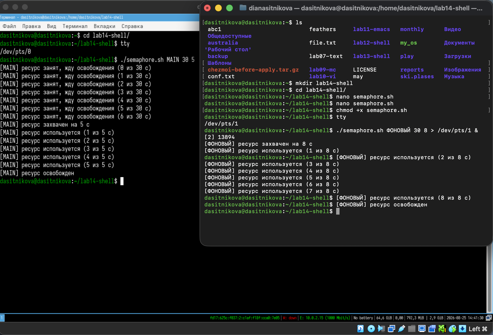
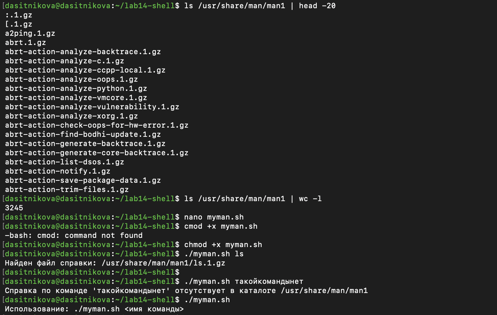

---
## Author
author:
  name: Ситникова Диана Александровна
  degrees: BSc
  email: 1032201746@rudn.ru
  affiliation:
    - name: Российский университет дружбы народов
      country: Российская Федерация
      postal-code: 117198
      city: Москва
      address: ул. Миклухо-Маклая, д. 6
## Title
title: "Лабораторная работа № 14"
subtitle: "Программирование в командном процессоре ОС UNIX. Расширенное программирование"
institute:
  - "Российский университет дружбы народов им. П. Лумумбы"
  - "Преподаватель: д.ф.-м.н., профессор Кулябов Дмитрий Сергеевич"
license: CC BY
date: today
date-format: "YYYY-MM-DD"
header-includes:
  - \usepackage{tikz}
---

# Информация

## Докладчик

:::::::::::::: {.columns align=center}
::: {.column width="68%"}

- Ситникова Диана Александровна
- направление 09.03.03 «Прикладная информатика»
- Российский университет дружбы народов
- [1032201746@rudn.ru](mailto:1032201746@rudn.ru)

:::
::: {.column width="32%"}

{width=100%}

:::
::::::::::::::

# Вводная часть

## Актуальность

- Процессы в системе работают одновременно и делят общие ресурсы.
- Без упорядочивания доступа два процесса испортят данные друг друга.
- Оболочка позволяет построить механизм взаимного исключения штатными средствами.
- Те же приёмы лежат в основе блокировок в сценариях резервного копирования и обслуживания.

## Объект и предмет исследования

**Объект** --- командный процессор `bash` операционной системы Linux.

**Предмет** --- взаимное исключение процессов, перенаправление вывода между терминалами, организация справочной подсистемы и генерация псевдослучайных значений.

## Научная новизна и практическая значимость

**Научная новизна** --- вместо файла-флага применена неделимая операция `mkdir`, исключающая состояние гонки.

**Практическая значимость** --- тот же приём применяется в реальных сценариях резервного копирования и обслуживания.

## Цель, гипотеза и задачи

**Цель** --- научиться писать более сложные командные файлы с использованием логических управляющих конструкций и циклов.

**Гипотеза** --- взаимное исключение процессов достижимо штатными средствами файловой системы.

**Задачи:**

- реализовать упрощённый механизм семафоров;
- воспроизвести функциональность команды `man`;
- построить генератор случайной последовательности букв.

## Материалы и методы

| Компонент | Значение |
|---|---|
| Операционная система | Fedora Linux в виртуальной машине |
| Оболочка | GNU `bash` |
| Редактор | `nano` |
| Средство блокировки | неделимая команда `mkdir` |
| Источник задания | методические указания РУДН |

# Содержание исследования

## Захват ресурса держится на неделимости `mkdir`

\begin{center}
\resizebox{0.92\linewidth}{!}{%
\begin{tikzpicture}[font=\scriptsize, >=latex]
  \draw[thick] (0,3.3) rectangle (3.4,4.1);
  \node[align=center] at (1.7,3.7) {\textbf{Процесс}\\пытается захватить};

  \draw[->,thick] (3.4,3.7) -- (4.6,3.7);

  \draw[very thick] (4.6,3.1) rectangle (8.6,4.3);
  \node[align=center] at (6.6,3.7) {\texttt{mkdir "\$lockdir"}\\неделимая операция};

  \draw[->,thick] (8.6,3.7) -- (9.8,3.7) node[midway,above] {успех};
  \draw[thick] (9.8,3.1) rectangle (13.0,4.3);
  \node[align=center] at (11.4,3.7) {\textbf{ресурс захвачен}\\удержание \texttt{t2} с};

  \draw[->,thick] (6.6,3.1) -- (6.6,2.0) node[midway,right] {\ ошибка --- каталог есть};
  \draw[thick] (4.4,1.1) rectangle (8.8,2.0);
  \node[align=center] at (6.6,1.55) {ожидание \texttt{sleep 1}\\счётчик до \texttt{t1} с};

  \draw[->,thick] (4.4,1.55) -- (2.6,1.55) -- (2.6,3.3);
  \node[align=center] at (1.5,2.4) {повтор\\попытки};

  \draw[->,thick] (11.4,3.1) -- (11.4,1.55) -- (8.8,1.55);
  \node[align=center] at (12.3,2.3) {\texttt{rm -rf}\\освобождение};
\end{tikzpicture}}
\end{center}

Проверка и захват — одна операция, поэтому гонки между процессами не возникает.

## Разные времена ожидания и удержания

| Параметр | Назначение | В примере |
|---|---|---|
| `t1` | предел ожидания освобождения | 30 с |
| `t2` | время удержания ресурса | 5 и 8 с |
| `$$` | идентификатор процесса в имени по умолчанию | --- |

Если ресурс не освободился за `t1`, процесс завершается с кодом 1, а не ждёт вечно.

## Вывод фонового процесса уходит в соседний терминал

:::::::::::::: {.columns align=center}
::: {.column width="42%"}

Команда `tty` даёт имя устройства окна: `/dev/pts/0` и `/dev/pts/1`.

Фоновый процесс захватил ресурс первым, второй отсчитывал ожидание и получил ресурс после освобождения.

:::
::: {.column width="58%"}

{width=100%}

:::
::::::::::::::

## Три процесса выстраиваются в очередь без изменений в коде

{height=52mm fig-align="center"}

Ресурс достался `A`, затем `B`, затем `C` — в каждый момент им владел ровно один процесс.

## Справка ищется шаблоном, распаковка выбирается по расширению

:::::::::::::: {.columns align=center}
::: {.column width="42%"}

В каталоге `man1` — 3245 файлов вида `имя.1.gz`.

Шаблон `"$command_name".1*` находит и сжатые, и открытые файлы, а `case` подбирает распаковщик.

Отсутствие справки и пустой аргумент обработаны отдельно.

:::
::: {.column width="58%"}

{width=100%}

:::
::::::::::::::

## `$RANDOM` приводится к индексу алфавита остатком от деления

:::::::::::::: {.columns align=center}
::: {.column width="42%"}

`$RANDOM` даёт число от 0 до 32767.

Остаток от деления на 52 попадает точно в диапазон индексов алфавита.

Символ извлекается срезом `${letters:index:1}`.

:::
::: {.column width="58%"}

{width=100%}

:::
::::::::::::::

# Результаты

## Все три командных файла работают

- `semaphore.sh` --- взаимное исключение на неделимой операции `mkdir`.
- Проверено в двух терминалах с перенаправлением и на трёх процессах.
- `myman.sh` --- поиск и просмотр страницы справки по имени команды.
- `randstr.sh` --- случайная последовательность букв заданной длины.
- Применены `if`, `case`, `while`, `until` и подстановки со срезами строк.

## Анализ результатов и их применимость

- Ресурс в каждый момент занят ровно одним процессом.
- Механизм работает для произвольного числа участников.
- Вывод фонового процесса направляется в соседний терминал.

Приём применим в сценариях, где несколько заданий делят один ресурс.

## Файловая система заменяет примитив синхронизации

В оболочке нет семафоров как таковых, но нужное свойство — неделимость — нашлось у обычной команды создания каталога.

Правильно выбранная операция важнее сложности механизма: одна строка `until mkdir` даёт корректное взаимное исключение для любого числа процессов.
