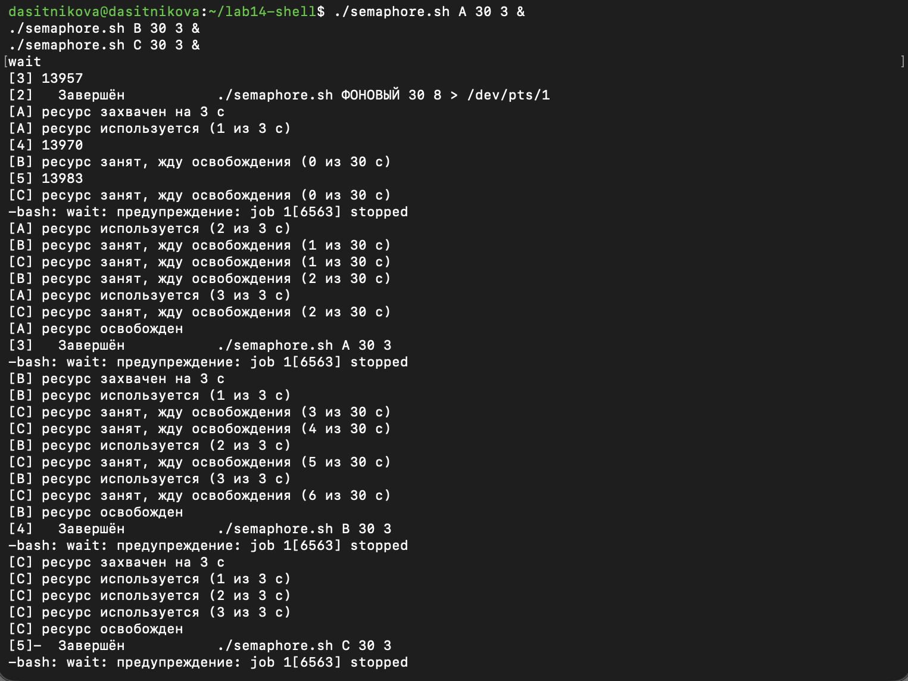

---
## Author
author:
  name: Ситникова Диана Александровна
  degrees: BSc
  email: 1032201746@rudn.ru
  affiliation:
    - name: Российский университет дружбы народов
      country: Российская Федерация
      postal-code: 117198
      city: Москва
      address: ул. Миклухо-Маклая, д. 6

## Title
title: "Отчёт по лабораторной работе № 14"
subtitle: "Программирование в командном процессоре ОС UNIX. Расширенное программирование"
license: "CC BY"
bibliography: bib/cite.bib
---

# Цель работы

Изучить основы программирования в оболочке ОС UNIX. Научиться писать более сложные командные файлы с использованием логических управляющих конструкций и циклов.

# Задание

В соответствии с методическими указаниями необходимо выполнить следующую последовательность действий [@rudn_lab14_shell].

1. Написать командный файл, реализующий упрощённый механизм семафоров. Командный файл должен в течение некоторого времени `t1` дожидаться освобождения ресурса, выдавая об этом сообщение, а дождавшись его освобождения, использовать его в течение некоторого времени `t2`, отличного от `t1`, также выдавая информацию о том, что ресурс используется соответствующим командным файлом. Запустить командный файл в одном виртуальном терминале в фоновом режиме, перенаправив его вывод в другой терминал, в котором также запущен этот файл, но не в фоновом режиме. Доработать программу так, чтобы имелась возможность взаимодействия трёх и более процессов.

2. Реализовать команду `man` с помощью командного файла. Изучить содержимое каталога `/usr/share/man/man1`. В нём находятся архивы текстовых файлов, содержащих справку по большинству установленных в системе программ и команд. Каждый архив можно открыть командой `less`, сразу же просмотрев содержимое справки. Командный файл должен получать в виде аргумента командной строки название команды и в виде результата выдавать справку об этой команде или сообщение об отсутствии справки, если соответствующего файла нет в каталоге `man1`.

3. Используя встроенную переменную `$RANDOM`, написать командный файл, генерирующий случайную последовательность букв латинского алфавита. Учесть, что `$RANDOM` выдаёт псевдослучайные числа в диапазоне от 0 до 32767.

# Краткие теоретические сведения

## Взаимное исключение и семафоры

При одновременной работе нескольких процессов с общим ресурсом возникает необходимость упорядочить доступ к нему: пока один процесс использует ресурс, остальные должны ожидать. Участок программы, работающий с разделяемым ресурсом, называется критической секцией, а механизм, допускающий в неё лишь один процесс, --- взаимным исключением [@tanenbaum_book_modern-os_ru].

Простейшим средством взаимного исключения является двоичный семафор, принимающий два состояния: ресурс свободен или занят. Процесс, желающий войти в критическую секцию, проверяет семафор и, если ресурс занят, ожидает; заняв ресурс, он выставляет семафор и снимает его по завершении работы.

В командной оболочке роль семафора играет объект файловой системы, существование которого означает занятость ресурса. Принципиальное требование --- неделимость проверки и захвата: если проверить отсутствие объекта и создать его двумя отдельными командами, между ними успевает вклиниться другой процесс, и оба сочтут ресурс свободным. Команда `mkdir` этим свойством обладает: она либо создаёт каталог, либо возвращает ненулевой код завершения, если он уже существует, и промежуточного состояния не имеет [@posix_shell; @posix_mkdir].

## Терминалы и перенаправление вывода между ними

Каждому терминалу в системе соответствует файл устройства. Текстовые консоли, переключаемые сочетаниями `Ctrl+Alt+F1`–`F6`, представлены файлами `/dev/tty1`–`/dev/tty6`, а окна графических эмуляторов терминала --- псевдотерминалами `/dev/pts/0`, `/dev/pts/1` и так далее. Узнать имя устройства текущего терминала позволяет команда `tty` [@gnu_coreutils].

Поскольку терминал представлен обычным файлом устройства, стандартный вывод процесса можно перенаправить в него оператором `>`. Запись вида `команда > /dev/pts/1 &` запускает процесс в фоновом режиме, направляя его сообщения в другое окно. Это позволяет наблюдать работу нескольких процессов одновременно и наглядно демонстрирует их конкуренцию за ресурс.

## Организация справочной подсистемы

Страницы справочного руководства хранятся в каталоге `/usr/share/man`, разделённом на подкаталоги по разделам. Раздел `man1` содержит описания пользовательских команд, `man5` --- форматов файлов, `man8` --- команд системного администрирования [@man_hier] (@tbl-man-sections).

| Раздел | Содержимое |
|---|---|
| `man1` | пользовательские команды |
| `man2` | системные вызовы |
| `man3` | библиотечные функции |
| `man5` | форматы файлов и соглашения |
| `man8` | команды системного администрирования |

: Основные разделы справочного руководства {#tbl-man-sections}

Файлы страниц хранятся в сжатом виде, поэтому имя складывается из названия команды, номера раздела и расширения архиватора, например `ls.1.gz`. Для распаковки применяются команды, соответствующие использованному алгоритму сжатия (@tbl-decompress).

| Расширение | Команда просмотра |
|---|---|
| `.gz` | `zcat` |
| `.bz2` | `bzcat` |
| `.xz` | `xzcat` |
| `.zst` | `zstdcat` |

: Команды распаковки страниц справки {#tbl-decompress}

Содержимое страницы представляет собой размеченный текст в формате `troff` с директивами вида `.TH`, `.SH` и `.TP`. Настоящая команда `man` дополнительно пропускает его через форматтер `groff`, тогда как непосредственный просмотр командой `less` показывает исходный текст вместе с разметкой [@man_manpage].

## Псевдослучайные числа и работа со строками

Оболочка `bash` предоставляет встроенную переменную `RANDOM`: при каждом обращении к ней возвращается псевдослучайное целое число в диапазоне от 0 до 32767. Приведение к нужному диапазону выполняется взятием остатка от деления, поэтому выражение `$((RANDOM % n))` даёт число от 0 до `n-1` [@bash_manual].

Для построения строки из случайных символов применяются подстановки, работающие с длиной и срезами (@tbl-string-ops).

| Подстановка | Результат |
|---|---|
| `${#строка}` | длина строки в символах |
| `${строка:позиция:1}` | один символ, начиная с указанной позиции |
| `${переменная:-значение}` | значение по умолчанию, если переменная не задана |

: Подстановки для работы со строками {#tbl-string-ops}

Такие подстановки составляют основу обработки текста средствами самой оболочки [@robbins_book_bash_en]. Отбор допустимых значений аргумента удобно выполнять оператором `case` с образцами: шаблон `*[!0-9]*` соответствует строке, содержащей хотя бы один символ, отличный от цифры, что позволяет отсеять нечисловой ввод.

# Выполнение лабораторной работы

Работа выполнялась в Fedora Linux в каталоге `~/lab14-shell`. Командные файлы создавались в редакторе `nano`, после чего им назначалось право на выполнение командой `chmod +x`.

## 1. Упрощённый механизм семафоров {.unnumbered}

Командный файл принимает три аргумента: имя процесса, предельное время ожидания `t1` и время удержания ресурса `t2` (@fig-001).

~~~bash
#!/bin/bash
# Упрощённый механизм семафоров на основе каталога-блокировки

lockdir="/tmp/lab14-resource.lock"
name="${1:-процесс-$$}"
t1="${2:-15}"
t2="${3:-5}"

waited=0
until mkdir "$lockdir" 2>/dev/null; do
    if [ "$waited" -ge "$t1" ]; then
        echo "[$name] ресурс не освободился за $t1 с. Завершение..."
        exit 1
    fi
    echo "[$name] ресурс занят, жду освобождения ($waited из $t1 с)"
    sleep 1
    waited=$((waited + 1))
done

echo "$name" > "$lockdir/owner"
echo "[$name] ресурс захвачен на $t2 с"

held=0
while [ "$held" -lt "$t2" ]; do
    held=$((held + 1))
    echo "[$name] ресурс используется ($held из $t2 с)"
    sleep 1
done

rm -rf "$lockdir"
echo "[$name] ресурс освобождён"
~~~

{#fig-001 width=100%}

Захват ресурса построен на цикле `until mkdir "$lockdir"`. Тело цикла выполняется, пока команда возвращает ненулевой код, то есть пока каталог существует и принадлежит другому процессу. Как только владелец удаляет каталог, очередная попытка `mkdir` завершается успешно, цикл прекращается, и ресурс оказывается захвачен. Неделимость `mkdir` гарантирует, что при одновременной попытке двух процессов каталог создаст ровно один из них.

Отсчёт ожидания ведёт переменная `waited`: по достижении предела `t1` файл сообщает о неудаче и завершается с кодом 1. Ошибка `mkdir` подавляется перенаправлением `2>/dev/null`, поскольку занятость ресурса является штатной ситуацией. Удержание ресурса реализовано вторым циклом `while` с независимым счётчиком, что позволяет задать `t2` отличным от `t1`. По завершении работы каталог удаляется, освобождая ресурс.

Подстановки `${1:-процесс-$$}`, `${2:-15}` и `${3:-5}` задают значения по умолчанию, поэтому файл работает и без аргументов; в имени по умолчанию используется `$$` --- идентификатор текущего процесса.

Для проверки взаимодействия двух процессов открыты два окна терминала, в каждом из которых команда `tty` показала имя устройства: `/dev/pts/0` и `/dev/pts/1`. В первом окне запущен фоновый процесс с перенаправлением вывода во второе окно, а во втором --- обычный процесс (@fig-002):

~~~bash
tty
./semaphore.sh ФОНОВЫЙ 30 8 > /dev/pts/1 &
~~~

~~~bash
./semaphore.sh MAIN 30 5
~~~

{#fig-002 width=100%}

Фоновый процесс захватил ресурс первым и удерживал его восемь секунд, выводя сообщения во второе окно. Процесс `MAIN` в это время отсчитывал ожидание, сообщая о занятости ресурса, а после его освобождения захватил ресурс на пять секунд. Различие времён `t1` и `t2` видно по счётчикам: ожидание велось до тридцати секунд, а удержание составило пять и восемь секунд соответственно.

Взаимодействие трёх процессов обеспечивается тем же файлом без изменений --- достаточно передать разные имена (@fig-003):

~~~bash
./semaphore.sh A 30 3 &
./semaphore.sh B 30 3 &
./semaphore.sh C 30 3 &
wait
~~~

{#fig-003 width=100%}

Процессы выстроились в очередь: ресурс захватил `A`, тогда как `B` и `C` перешли к ожиданию. После освобождения ресурс достался `B`, затем `C`. В каждый момент времени сообщение о захвате выводил ровно один процесс, что подтверждает работоспособность взаимного исключения при произвольном числе участников.

## 2. Реализация команды `man` {.unnumbered}

Предварительно изучено содержимое каталога справочных страниц:

~~~bash
ls /usr/share/man/man1 | head -20
ls /usr/share/man/man1 | wc -l
~~~

Каталог содержит 3245 файлов, имена которых имеют вид `имя.1.gz`. Командный файл отыскивает нужный файл по имени команды и выводит его содержимое (@fig-004):

~~~bash
#!/bin/bash
# Упрощённый аналог команды man: поиск и просмотр справки из каталога man1

mandir="/usr/share/man/man1"
command_name="$1"

if [ -z "$command_name" ]; then
    echo "Использование: $0 <имя команды>" >&2
    exit 1
fi

if [ ! -d "$mandir" ]; then
    echo "Каталог $mandir не найден" >&2
    exit 1
fi

shopt -s nullglob
pages=("$mandir/$command_name".1*)

if [ ${#pages[@]} -eq 0 ]; then
    echo "Справка по команде '$command_name' отсутствует в каталоге $mandir"
    exit 1
fi

page="${pages[0]}"
echo "Найден файл справки: $page"

case "$page" in
    *.gz)  zcat  "$page" | less ;;
    *.bz2) bzcat "$page" | less ;;
    *.xz)  xzcat "$page" | less ;;
    *.zst) zstdcat "$page" | less ;;
    *)     less "$page" ;;
esac
~~~

{#fig-004 width=100%}

Поиск файла выполняется раскрытием шаблона `"$mandir/$command_name".1*`, результат которого собирается в массив `pages`. Шаблон намеренно допускает произвольное окончание после номера раздела, поэтому находятся как сжатые файлы `ls.1.gz`, так и несжатые `ls.1`. Настройка `shopt -s nullglob` превращает неудачный шаблон в пустой список, а проверка `${#pages[@]} -eq 0` определяет по числу элементов массива, найдена ли справка. Без этой настройки нераскрытый шаблон попал бы в массив как строка, и проверка дала бы ложный положительный результат.

Оператор `case` подбирает команду распаковки по расширению файла, что делает командный файл переносимым между дистрибутивами, использующими разные архиваторы. Просмотр выполняется командой `less`, как указано в задании (@fig-005).

~~~bash
chmod +x myman.sh
./myman.sh ls
./myman.sh такойкомандынет
./myman.sh
~~~

{#fig-005 width=100%}

Для команды `ls` найден файл `/usr/share/man/man1/ls.1.gz`, для несуществующего имени выведено сообщение об отсутствии справки, а запуск без аргумента вывел подсказку об использовании. Все три случая завершились предусмотренными кодами возврата (@fig-006).

{#fig-006 width=100%}

Содержимое страницы выводится в исходном виде, с директивами разметки `troff`: заголовок `.TH`, разделы `.SH NAME` и `.SH SYNOPSIS`, форматирующие последовательности `\fB` и `\fR`. Такой результат соответствует заданию, предписывающему просмотр архива командой `less`. Настоящая команда `man` отличается тем, что дополнительно пропускает текст через форматтер `groff`, преобразующий разметку в оформленный текст.

## 3. Генерация случайной последовательности букв {.unnumbered}

Командный файл принимает необязательный аргумент --- длину последовательности (@fig-007):

~~~bash
#!/bin/bash
# Генерация случайной последовательности букв латинского алфавита
# с использованием встроенной переменной $RANDOM

length="${1:-16}"

case "$length" in
    ''|*[!0-9]*)
        echo "Использование: $0 [длина последовательности]" >&2
        exit 1
        ;;
esac

letters="abcdefghijklmnopqrstuvwxyzABCDEFGHIJKLMNOPQRSTUVWXYZ"
count=${#letters}

result=""
position=0
while [ "$position" -lt "$length" ]; do
    index=$((RANDOM % count))
    result="$result${letters:index:1}"
    position=$((position + 1))
done

echo "Длина последовательности: $length"
echo "Результат: $result"
~~~

{#fig-007 width=100%}

Алфавит задан строкой из 52 символов --- строчных и прописных букв латиницы, а его длина получена подстановкой `${#letters}`, что избавляет от необходимости указывать число вручную. Ключевая строка `index=$((RANDOM % count))` приводит значение из диапазона `$RANDOM` к индексу внутри алфавита: остаток от деления на 52 всегда лежит в пределах от 0 до 51. Символ извлекается срезом `${letters:index:1}` и дописывается к накапливаемой строке.

Проверка аргумента выполнена оператором `case` с двумя образцами: пустая строка и шаблон `*[!0-9]*`, соответствующий строке хотя бы с одним нецифровым символом. Подстановка `${1:-16}` задаёт длину по умолчанию (@fig-008).

~~~bash
chmod +x randstr.sh
./randstr.sh
./randstr.sh 30
./randstr.sh abc
~~~

{#fig-008 width=100%}

Запуск без аргумента дал последовательность из шестнадцати символов. Три последовательных запуска с длиной 30 вернули три различные строки, что подтверждает изменение значения `$RANDOM` при каждом обращении. Запуск с нечисловым аргументом отклонён с выводом подсказки.

# Выводы

В ходе работы изучены основы программирования в оболочке ОС UNIX и приобретены навыки написания более сложных командных файлов с использованием логических управляющих конструкций и циклов. Освоены организация взаимного исключения средствами файловой системы, перенаправление вывода процесса в другой терминал, работа со справочной подсистемой и генерация псевдослучайных значений.

Написаны и проверены три командных файла. Первый реализует упрощённый механизм семафоров на основе неделимой операции `mkdir`, различает время ожидания и время удержания ресурса и обеспечивает корректное взаимодействие произвольного числа процессов, что подтверждено запуском в двух терминалах и тремя одновременными процессами. Второй воспроизводит функциональность команды `man`, отыскивая страницу справки по имени команды и подбирая команду распаковки по расширению файла. Третий формирует случайную последовательность букв латинского алфавита, приводя значение встроенной переменной `$RANDOM` к индексу алфавита взятием остатка от деления. Во всех файлах применены конструкции `if`, `case`, `while` и `until`. Цель лабораторной работы достигнута.

# Ответы на контрольные вопросы

1. **Найдите синтаксическую ошибку в следующей строке: `while [$1 != "exit"]`**

   Ошибка состоит в отсутствии пробелов внутри квадратных скобок. Открывающая скобка `[` в оболочке не является элементом синтаксиса --- это самостоятельная команда, синоним команды `test`, а закрывающая скобка `]` служит её обязательным последним аргументом. Поэтому обе скобки должны отделяться пробелами от содержимого так же, как имя команды отделяется от аргументов.

   В приведённом виде оболочка читает `[$1` как единое слово и пытается выполнить команду с таким именем, сообщая `command not found`. Правильная запись --- `while [ "$1" != "exit" ]`. Кавычки вокруг `$1` также необходимы: без них пустое или содержащее пробел значение изменит число аргументов команды `test` и приведёт к ошибке.

2. **Как объединить (конкатенация) несколько строк в одну?**

   Простейший способ --- записать подстановки подряд без разделителей: `result="$first$second"`. Оболочка подставит значения и объединит их. Если за именем переменной следуют символы, которые могут быть приняты за продолжение имени, применяется форма в фигурных скобках, например `${first}текст`.

   Дописать к существующей строке позволяет оператор `+=` в записи `result+="$next"`. Именно накопление строки в цикле применялось в третьем задании работы: результат наращивался по одному символу выражением `result="$result${letters:index:1}"`. Для объединения с разделителем удобна команда `printf`, а для склейки строк из потока --- утилиты `paste` и `tr`.

3. **Найдите информацию об утилите `seq`. Какими иными способами можно реализовать её функционал при программировании на bash?**

   Утилита `seq` из набора GNU Coreutils печатает последовательность чисел. Вызов `seq 5` выводит числа от 1 до 5, `seq 2 10` --- от 2 до 10, `seq 1 2 9` --- от 1 до 9 с шагом 2. Ключ `-w` дополняет числа ведущими нулями до одинаковой ширины, а `-s` задаёт разделитель. Подробное описание доступно по команде `man seq`.

   Средствами самой оболочки тот же результат достигается двумя способами. Раскрытие фигурных скобок `{1..5}` порождает ту же последовательность без запуска внешней программы и поддерживает шаг в форме `{1..9..2}`. Арифметический цикл `for ((i=1; i<=5; i++))` даёт полный контроль над счётчиком. Преимущество встроенных средств в том, что они не порождают отдельный процесс; преимущество `seq` --- в поддержке дробного шага и в переносимости на оболочки, где раскрытие фигурных скобок недоступно. В выполненной работе счётчики организованы циклами `while` с явным приращением, что также заменяет `seq`.

4. **Какой результат даст вычисление выражения `$((10/3))`?**

   Результат равен **3**. Арифметическое расширение `$(( ))` выполняет только целочисленные вычисления, поэтому дробная часть отбрасывается, а не округляется: выражение `$((11/3))` также даст 3. Для отрицательных значений отбрасывание происходит в сторону нуля, поэтому `$((-10/3))` даёт −3.

   Остаток от деления получают операцией `%`: выражение `$((10%3))` даёт 1. Для дробных вычислений оболочка не предназначена, и применяют внешние средства --- калькулятор `bc` с ключом `-l` либо `awk`. Именно на целочисленном делении построено выражение `RANDOM % 52` в третьем задании: остаток гарантированно попадает в диапазон индексов алфавита.

5. **Укажите кратко основные отличия командной оболочки zsh от bash.**

   Оболочка `zsh` во многом совместима с `bash`, но заметно богаче в интерактивной работе. Её автодополнение настраивается и подставляет не только имена файлов, но и ключи команд с подсказками; имеются исправление опечаток в путях, общая история между сеансами и развитые средства оформления приглашения. Механизм шаблонов мощнее: поддерживаются рекурсивный шаблон `**/`, отбор файлов по атрибутам и отрицание образцов без дополнительных настроек.

   Существуют и различия, нарушающие переносимость сценариев. В `zsh` индексация массивов по умолчанию начинается с единицы, а не с нуля, и подстановка переменной без кавычек не разбивается на слова автоматически. Конфигурационные файлы называются `.zshrc` и `.zshenv` вместо `.bashrc` и `.bash_profile`. Практическое следствие таково: `bash` установлен практически в любой системе и потому остаётся стандартом для командных файлов, тогда как `zsh` чаще выбирают в качестве интерактивной оболочки.

6. **Проверьте, верен ли синтаксис данной конструкции: `for ((a=1; a <= LIMIT; a++))`**

   Синтаксис **верен**. Это арифметическая форма цикла `for`: в двойных круглых скобках через точку с запятой записываются инициализация счётчика, условие продолжения и приращение. Знак доллара перед именем `LIMIT` не требуется, поскольку внутри двойных скобок действует арифметический контекст, в котором имена переменных распознаются напрямую.

   Приведённая строка является лишь заголовком цикла, поэтому для получения работающей конструкции её необходимо дополнить телом: после заголовка следуют `do`, список команд и `done`. Проверка подтверждает работоспособность: при `LIMIT=3` конструкция `for ((a=1; a <= LIMIT; a++)); do echo "a=$a"; done` последовательно выводит `a=1`, `a=2` и `a=3`. Следует лишь учитывать, что арифметическая форма является расширением `bash` и в строго POSIX-совместимой оболочке недоступна.

7. **Сравните язык bash с какими-либо языками программирования. Какие преимущества у bash по сравнению с ними? Какие недостатки?**

   Сравнение уместно провести с языком Python как типичным интерпретируемым языком общего назначения. Главное преимущество `bash` состоит в том, что он изначально предназначен для управления другими программами: запуск процесса, перенаправление потоков и построение конвейера записываются одним-двумя символами, тогда как в Python для того же требуется модуль `subprocess` и несколько строк кода. Оболочка присутствует в любой Unix-подобной системе без установки дополнительных пакетов, поэтому командный файл работает и на минимальном образе, и в аварийном режиме. Наконец, команды в файле те же, что набираются вручную, поэтому переход от интерактивной работы к автоматизации не требует изучения нового интерфейса.

   Недостатки проявляются, как только задача выходит за рамки связывания готовых утилит. В `bash` фактически единственный тип данных --- строка; арифметика только целочисленная, а массивы одномерные и неудобные в обращении. Синтаксис содержит множество ловушек: пробелы вокруг скобок обязательны, подстановка без кавычек разбивается на слова, а сравнение чисел и строк требует разных операторов. Обработка ошибок сводится к проверке кодов завершения, средства отладки и тестирования развиты слабо, а производительность невысока, поскольку каждая внешняя команда порождает отдельный процесс. Практический вывод таков: `bash` уместен для сценариев в несколько десятков строк, связывающих системные утилиты, а при усложнении логики, необходимости структур данных или работы с сетевыми протоколами и форматами данных разумнее переходить на язык общего назначения.

# Список литературы {.unnumbered}

::: {#refs}
:::
