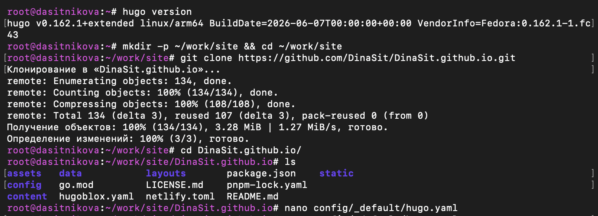

---
## Author
author:
  name: Ситникова Диана Александровна
  degrees: BSc
  email: 1032201746@rudn.ru
  affiliation:
    - name: Российский университет дружбы народов
      country: Российская Федерация
      postal-code: 117198
      city: Москва
      address: ул. Миклухо-Маклая, д. 6
## Title
title: "Индивидуальный проект. Этап 1"
subtitle: "Размещение на GitHub Pages заготовки для персонального сайта"
institute:
  - "Российский университет дружбы народов им. П. Лумумбы"
  - "Преподаватель: д.ф.-м.н., профессор Кулябов Дмитрий Сергеевич"
license: CC BY
date: today
date-format: "YYYY-MM-DD"
header-includes:
  - \usepackage{tikz}
---

# Информация

## Докладчик

:::::::::::::: {.columns align=center}
::: {.column width="68%"}

- Ситникова Диана Александровна
- направление 09.03.03 «Прикладная информатика»
- Российский университет дружбы народов
- [1032201746@rudn.ru](mailto:1032201746@rudn.ru)

:::
::: {.column width="32%"}

{width=100%}

:::
::::::::::::::

# Вводная часть

## Актуальность

- Персональная страница --- основной способ представить результаты научной работы.
- Содержимое такого сайта меняется редко и не зависит от действий посетителя.
- Статический сайт не требует сервера приложений и базы данных.
- Исходные тексты версионируются наравне с кодом, а публикация автоматизируется.

## Объект и предмет исследования

**Объект** --- персональный сайт научного работника на генераторе статических сайтов Hugo.

**Предмет** --- структура шаблона Academic CV, подключение темы модулем Hugo, параметры конфигурации сайта и механизм публикации на GitHub Pages.

## Научная новизна и практическая значимость

**Научная новизна** --- сайт рассматривается как собираемый проект с фиксированными версиями зависимостей, а не как набор готовых страниц.

**Практическая значимость** --- полученная заготовка служит основой для всех последующих этапов проекта.

## Цель, гипотеза и задачи

**Цель** --- развернуть заготовку персонального сайта и опубликовать её на GitHub Pages.

**Гипотеза** --- публикацию сайта можно полностью автоматизировать, храня в репозитории только исходные тексты.

**Задачи:**

- установить необходимое программное обеспечение;
- создать репозиторий из шаблона темы и разместить его на хостинге git;
- установить параметр адреса сайта;
- опубликовать заготовку на GitHub Pages.

## Материалы и методы

| Компонент | Значение |
|---|---|
| Система | Fedora Linux в виртуальной машине |
| Генератор | Hugo `0.162.1+extended` |
| Шаблон | Academic CV, набор Hugo Blox |
| Сборка | Node.js, `pnpm`, Tailwind CSS |
| Публикация | GitHub Pages через GitHub Actions |

# Содержание исследования

## Публикация запускается отправкой изменений

\begin{center}
\resizebox{\linewidth}{!}{%
\begin{tikzpicture}[font=\scriptsize, >=latex]
  \draw[thick] (0,1.0) rectangle (2.6,2.4);
  \node[align=center] at (1.3,1.7) {\textbf{Исходные тексты}\\Markdown + YAML};

  \draw[thick] (3.4,1.0) rectangle (6.0,2.4);
  \node[align=center] at (4.7,1.7) {\textbf{Репозиторий}\\GitHub};

  \draw[very thick] (6.8,1.0) rectangle (9.4,2.4);
  \node[align=center] at (8.1,1.7) {\textbf{Hugo}\\сборка};

  \draw[thick] (10.2,1.0) rectangle (12.8,2.4);
  \node[align=center] at (11.5,1.7) {\textbf{GitHub Pages}\\\texttt{dinasit.github.io}};

  \draw[->,thick] (2.65,1.7) -- (3.35,1.7) node[midway,above,font=\tiny] {commit};
  \draw[->,thick] (6.05,1.7) -- (6.75,1.7) node[midway,above,font=\tiny] {push};
  \draw[->,thick] (9.45,1.7) -- (10.15,1.7) node[midway,above,font=\tiny] {\texttt{public/}};

  \draw[thick,dashed] (6.8,0.0) rectangle (9.4,0.7);
  \node[align=center] at (8.1,0.35) {модуль темы, Tailwind};
  \draw[->,thick] (8.1,0.75) -- (8.1,0.95);
\end{tikzpicture}%
}
\end{center}

Ручных операций после настройки не остаётся: изменение текста приводит к обновлению сайта.

## Тема подключена модулем, а не скопирована

| Что хранится | Где |
|---|---|
| содержимое сайта | `content/` в репозитории |
| параметры сайта | `config/_default/*.yaml` |
| тема оформления | модуль Hugo, кэш сборки |
| версии модулей | `go.mod`, `go.sum` |
| результат сборки | `public/`, вне репозитория |

Обновление темы --- изменение номера версии, а не замена файлов.

## Репозиторий содержит только исходные материалы

:::::::::::::: {.columns align=center}
::: {.column width="42%"}

В корне --- `config`, `content`, `assets`, `data` и описание зависимостей `go.mod`.

Каталога темы среди них нет: она загружается при первой сборке.

:::
::: {.column width="58%"}

{width=100%}

:::
::::::::::::::

## Сборка проверена локально до публикации

:::::::::::::: {.columns align=center}
::: {.column width="42%"}

`hugo server` отслеживает изменения и пересобирает страницы на лету.

Производственная сборка `hugo --minify` дала 79 страниц и 90 обработанных изображений.

:::
::: {.column width="58%"}

{width=100%}

:::
::::::::::::::

## Заготовка опубликована на GitHub Pages

:::::::::::::: {.columns align=center}
::: {.column width="42%"}

Источник публикации --- GitHub Actions: сборка выполняется на стороне службы.

Сайт доступен по адресу, заданному параметром `baseURL`.

:::
::: {.column width="58%"}

{width=100%}

:::
::::::::::::::

# Результаты

## Все пункты задания выполнены

- Установлены Hugo `extended`, Git, Go, Node.js и `pnpm`.
- Из шаблона Academic CV создан репозиторий `DinaSit.github.io`.
- Задан параметр `baseURL`, установлены зависимости сборки.
- Выполнена локальная проверка в производственном режиме.
- Заготовка опубликована на GitHub Pages рабочим процессом GitHub Actions.

## Анализ результатов и их применимость

- В репозитории хранятся только исходные тексты и параметры.
- Версии генератора и модулей зафиксированы, сборка воспроизводима.
- Обновление сайта не требует ручных действий.

Настроенный конвейер используется на всех последующих этапах проекта без изменений.

## Публикация перестаёт быть отдельным действием

Пока сайт собирается вручную, каждое обновление --- это отдельная процедура, которую нужно помнить и повторять без ошибок.

После настройки конвейера публикация совпадает с сохранением изменений: отправка коммита и есть выпуск новой версии сайта.
