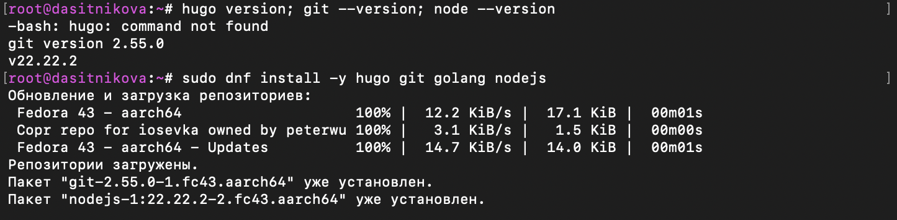
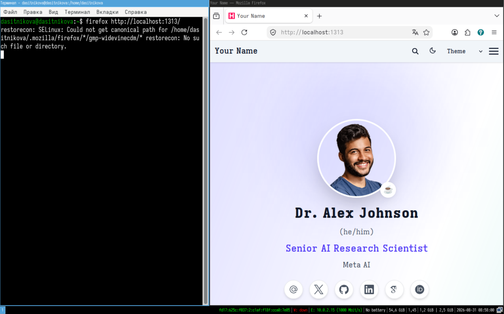
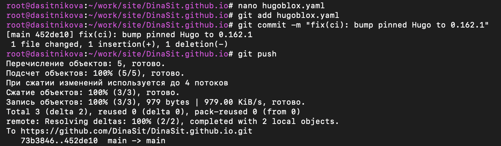
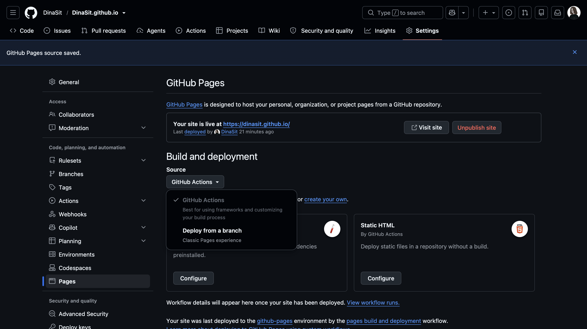

---
## Author
author:
  name: Ситникова Диана Александровна
  degrees: BSc
  email: 1032201746@rudn.ru
  affiliation:
    - name: Российский университет дружбы народов
      country: Российская Федерация
      postal-code: 117198
      city: Москва
      address: ул. Миклухо-Маклая, д. 6

## Title
title: "Отчёт по индивидуальному проекту. Этап 1"
subtitle: "Размещение на GitHub Pages заготовки для персонального сайта"
license: "CC BY"
bibliography: bib/cite.bib
---

# Цель работы

Развернуть заготовку персонального сайта научного работника на основе готового шаблона и опубликовать её на хостинге GitHub Pages.

# Задание

В соответствии с методическими указаниями необходимо выполнить следующую последовательность действий [@rudn_project_stages].

1. Установить необходимое программное обеспечение.
2. Скачать шаблон темы сайта.
3. Разместить его на хостинге git.
4. Установить параметр для URLs сайта.
5. Разместить заготовку сайта на GitHub Pages.

# Краткие теоретические сведения

## Генераторы статических сайтов

Сайт может формироваться двумя принципиально разными способами. В динамическом варианте страница собирается на сервере в момент обращения пользователя: программа обращается к базе данных, подставляет данные в шаблон и отдаёт результат. Такой подход требует постоянно работающего серверного приложения, интерпретатора языка программирования и системы управления базами данных.

Генератор статических сайтов переносит эту работу на этап сборки. Исходные материалы --- размеченные текстовые файлы и изображения --- один раз преобразуются в готовый набор файлов HTML, CSS и JavaScript, который затем раздаётся как обычные файлы. Серверная логика при этом не нужна вовсе [@hugo_docs].

Для персонального сайта научного работника такой подход подходит лучше динамического по нескольким причинам. Содержимое меняется редко и не зависит от действий посетителя. Исходные тексты хранятся в системе контроля версий наравне с программным кодом, поэтому история изменений сайта прослеживается построчно. Готовый сайт можно разместить на бесплатном файловом хостинге, не арендуя сервер.

## Hugo и его модульная система

Hugo --- генератор статических сайтов, написанный на языке Go. Он читает каталог с содержимым, применяет к нему шаблоны оформления и записывает результат в каталог `public`.

Существуют две сборки Hugo: обычная и расширенная. Расширенная сборка, обозначаемая словом `extended` в строке версии, дополнительно умеет компилировать таблицы стилей из препроцессорных форматов и обрабатывать изображения. Современные темы оформления рассчитаны именно на неё [@hugo_docs].

Начиная с версии 0.56 Hugo поддерживает модули --- механизм подключения внешних компонентов, построенный поверх системы модулей языка Go. Тема оформления при таком подключении не копируется в репозиторий сайта, а объявляется зависимостью в файле `go.mod`. При сборке Hugo самостоятельно загружает нужную версию во внутренний кэш, а точные версии всех загруженных модулей фиксируются в файле `go.sum` [@hugo_modules].

Практическое следствие: репозиторий сайта содержит только собственное содержимое автора, а обновление темы сводится к изменению номера версии в описании зависимостей.

## Шаблон Academic CV

В качестве основы использован шаблон Academic CV из набора Hugo Blox --- готовое решение для персональной страницы научного работника [@hugoblox_academic_cv]. Шаблон предоставляет разделы для биографии, списка публикаций, докладов, проектов, учебных курсов и блога, а также механизм построения страниц из готовых блоков.

Проект, ранее известный под названием Wowchemy, переименован в Hugo Blox; репозитории и документация размещены под новым именем [@hugoblox_docs]. Актуальная версия шаблона использует Tailwind CSS для оформления, поэтому в состав зависимостей сборки входит соответствующий инструмент командной строки [@tailwind_docs].

## Структура конфигурации

Настройки сайта разделены по назначению и размещены в каталоге `config/_default` (@tbl-config-files).

| Файл | Назначение |
|---|---|
| `hugo.yaml` | основные параметры Hugo: адрес сайта, язык, режимы вывода |
| `params.yaml` | параметры оформления темы, название сайта, элементы страниц |
| `menus.yaml` | состав и порядок пунктов навигационного меню |
| `languages.yaml` | описание языковых версий сайта |
| `module.yaml` | подключение модулей Hugo |

: Конфигурационные файлы шаблона {#tbl-config-files}

Все они записаны в формате YAML --- текстовом формате представления данных, в котором вложенность выражается отступами [@yaml_spec].

Ключевым параметром этапа является `baseURL` --- полный адрес, по которому сайт будет доступен после публикации. Hugo подставляет его во все абсолютные ссылки: адреса таблиц стилей, изображений, элементов меню и карты сайта. При неверном значении сайт формально соберётся, но оформление и переходы работать не будут.

Содержимое сайта размещается в каталоге `content`, разделённом на тематические подкаталоги (@tbl-content-dirs).

| Подкаталог | Содержимое |
|---|---|
| `authors` | сведения о владельце сайта |
| `blog` | записи блога |
| `publications` | научные публикации |
| `events` | доклады и выступления |
| `projects` | описания проектов |
| `courses` | учебные материалы |

: Разделы каталога содержимого {#tbl-content-dirs}

Каждая страница представляет собой файл Markdown, начинающийся с блока метаданных в формате YAML: заголовок, дата, автор, ключевые слова.

## Публикация на GitHub Pages

GitHub Pages --- служба размещения статических сайтов, входящая в состав GitHub. Сайт пользователя размещается в репозитории, имя которого совпадает с адресом вида `имя-пользователя.github.io`, и становится доступен по этому же адресу [@github_pages_docs].

Источником публикации может служить либо готовый каталог в одной из ветвей репозитория, либо результат работы рабочего процесса GitHub Actions. Второй вариант позволяет хранить в репозитории только исходные тексты: сборка выполняется на стороне службы при каждой отправке изменений [@github_actions_docs].

Рабочий процесс описывается файлом в каталоге `.github/workflows` и состоит из последовательности заданий (@tbl-workflow).

| Этап | Выполняемые действия |
|---|---|
| Подготовка | получение исходных текстов, установка Node.js и Hugo |
| Зависимости | установка пакетов, объявленных в `package.json` |
| Сборка | запуск Hugo с параметрами публикации |
| Публикация | передача каталога `public` службе GitHub Pages |

: Этапы рабочего процесса публикации {#tbl-workflow}

Такая организация представляет собой частный случай непрерывного развёртывания: изменение исходного текста автоматически приводит к обновлению опубликованного сайта, а ручные операции исключаются.

# Выполнение работы

## 1. Установка необходимого программного обеспечения {.unnumbered}

Работа выполнялась в операционной системе Fedora Linux в виртуальной машине. Состав установленного программного обеспечения приведён в таблице (@tbl-software).

| Компонент | Назначение |
|---|---|
| Hugo extended | генератор статических сайтов |
| Git | система контроля версий |
| Go | загрузка модулей Hugo |
| Node.js | среда выполнения инструментов сборки |
| pnpm | менеджер пакетов, объявленный шаблоном |

: Установленное программное обеспечение {#tbl-software}

Наличие компонентов проверено выводом их версий, недостающие установлены штатным пакетным менеджером дистрибутива (@fig-software).

~~~bash
hugo version; git --version; node --version
sudo dnf install -y hugo git golang nodejs
~~~

{#fig-software width=100%}

Установленная версия Hugo --- `0.162.1+extended`. Слово `extended` в строке версии подтверждает, что сборка поддерживает компиляцию таблиц стилей, необходимую выбранному шаблону.

## 2. Создание репозитория из шаблона темы {.unnumbered}

Шаблон Academic CV оформлен как репозиторий-заготовка, поэтому создание собственного сайта выполняется средствами GitHub: в интерфейсе исходного репозитория выбирается создание нового репозитория по образцу.

Репозиторий назван `DinaSit.github.io` --- по правилу именования пользовательских сайтов GitHub Pages имя должно совпадать с будущим адресом сайта [@github_pages_docs]. Тип репозитория --- открытый, что требуется для публикации на бесплатном тарифе.

## 3. Размещение репозитория на локальной машине {.unnumbered}

Созданный репозиторий получен на виртуальную машину командой клонирования, после чего просмотрен состав его каталогов (@fig-clone).

~~~bash
mkdir -p ~/work/site && cd ~/work/site
git clone https://github.com/DinaSit/DinaSit.github.io.git
cd DinaSit.github.io
ls
~~~

{#fig-clone width=100%}

В корне расположены каталоги `config`, `content`, `assets`, `data`, `layouts` и `static`, файл описания зависимостей `go.mod`, файл пакетов `package.json` и параметры шаблона `hugoblox.yaml`. Каталога с темой оформления среди них нет: тема подключена как модуль Hugo и загружается при сборке.

## 4. Установка зависимостей сборки {.unnumbered}

Файл `package.json` объявляет менеджер пакетов `pnpm` и перечисляет необходимые для сборки инструменты, включая интерфейс командной строки Tailwind CSS. Зависимости установлены объявленным менеджером [@pnpm_docs].

~~~bash
corepack enable && pnpm install
~~~

Пакеты размещаются в каталоге `node_modules`, исполняемые файлы --- в `node_modules/.bin`, откуда Hugo получает к ним доступ при сборке таблиц стилей.

## 5. Установка параметра URL сайта {.unnumbered}

В основном конфигурационном файле задан адрес, по которому сайт будет доступен после публикации (@fig-baseurl).

~~~bash
nano config/_default/hugo.yaml
~~~

~~~yaml
baseURL: 'https://dinasit.github.io/'
~~~

{#fig-baseurl width=100%}

Завершающая косая черта в значении обязательна: Hugo присоединяет к нему относительные пути ресурсов, и без разделителя адреса формируются неверно.

## 6. Подготовка содержимого {.unnumbered}

Шаблон поставляется с набором демонстрационных материалов, предназначенных для замены собственными. Записи блога-примера удалены; файл описания раздела сохранён, поскольку блог используется на последующих этапах проекта.

~~~bash
rm -rf content/blog/*
git checkout -- content/blog/_index.md
~~~

## 7. Локальная сборка и проверка {.unnumbered}

Заготовка собрана и проверена встроенным веб-сервером Hugo.

~~~bash
hugo server --bind 0.0.0.0 --baseURL http://localhost
~~~

Сервер отслеживает изменения исходных файлов и пересобирает затронутые страницы автоматически. Результат открыт в браузере по адресу `http://localhost:1313/` (@fig-local).

{#fig-local width=100%}

Дополнительно выполнена сборка в том режиме, в котором сайт собирается при публикации, --- с минификацией выходных файлов и в производственном окружении.

~~~bash
hugo --minify --environment production
~~~

Сборка завершилась успешно: сформировано 79 страниц, обработано 90 изображений, ошибок не зафиксировано.

Версия Hugo, использованная при локальной сборке, указана в файле параметров шаблона, чтобы сборка на стороне GitHub выполнялась той же версией (@fig-version).

~~~bash
nano hugoblox.yaml
~~~

~~~yaml
hugo_version: '0.162.1'
~~~

{#fig-version width=100%}

Внесённые изменения зафиксированы отдельными коммитами в соответствии с соглашением Conventional Commits и отправлены в удалённый репозиторий [@chacon_book_pro-git_en].

~~~bash
git add config/_default/hugo.yaml
git commit -m "chore(config): set baseURL for GitHub Pages"
git add content/blog
git commit -m "chore(content): remove template demo posts"
git add go.sum
git commit -m "chore(deps): pin Hugo module versions"
git push
~~~

Файл `go.sum` включён в состав коммита намеренно: он фиксирует точные версии загруженных модулей темы и обеспечивает совпадение результата локальной и облачной сборки [@hugo_modules]. Каталоги `node_modules`, `public` и `resources` в репозиторий не попадают --- они перечислены в файле `.gitignore` как результаты сборки.

## 8. Публикация на GitHub Pages {.unnumbered}

В параметрах репозитория в разделе Pages источником публикации выбран GitHub Actions (@fig-pages).

{#fig-pages width=100%}

Рабочий процесс, входящий в состав шаблона, запускается при каждой отправке изменений в основную ветвь. Он получает исходные тексты, устанавливает Node.js и Hugo указанной версии, восстанавливает зависимости, выполняет сборку и передаёт полученный каталог `public` службе GitHub Pages.

По завершении рабочего процесса сайт стал доступен по адресу `https://dinasit.github.io/` (@fig-site).

{#fig-site width=100%}

Опубликованная заготовка содержит навигационное меню со всеми разделами шаблона, страницу владельца сайта с демонстрационными данными и переключатель светлого и тёмного оформления. Замена демонстрационных сведений собственными выполняется на последующих этапах проекта.

# Выводы

В ходе выполнения первого этапа индивидуального проекта развёрнута заготовка персонального сайта научного работника и опубликована на хостинге GitHub Pages.

Установлено программное обеспечение, необходимое для сборки статического сайта: генератор Hugo в расширенной сборке, система контроля версий, среда выполнения Node.js и менеджер пакетов. Из шаблона Academic CV создан репозиторий `DinaSit.github.io`, размещённый на хостинге GitHub и полученный на локальную машину.

Задан параметр адреса сайта, установлены зависимости сборки, выполнена локальная проверка результата. Публикация настроена через рабочий процесс GitHub Actions, что обеспечивает автоматическое обновление сайта при каждом изменении исходных текстов.

Полученная конфигурация обладает двумя существенными свойствами. Во-первых, репозиторий содержит только исходные материалы: тема оформления подключена как модуль и загружается при сборке, а результаты сборки в систему контроля версий не попадают. Во-вторых, публикация воспроизводима --- версии генератора и всех модулей зафиксированы, поэтому сборка даёт одинаковый результат на любой машине и на стороне службы.

Заготовка готова к наполнению собственными материалами, что составляет содержание последующих этапов проекта.

# Список литературы {.unnumbered}

::: {#refs}
:::
