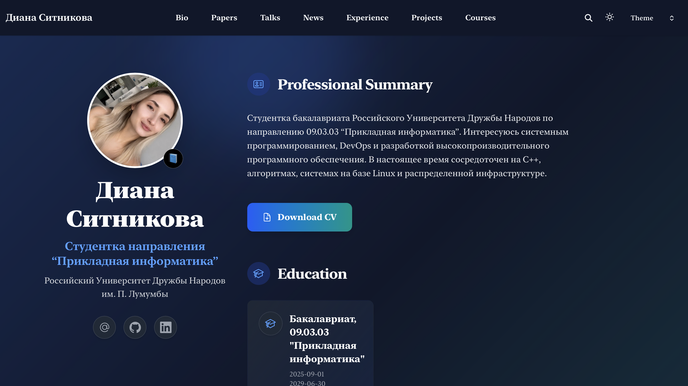
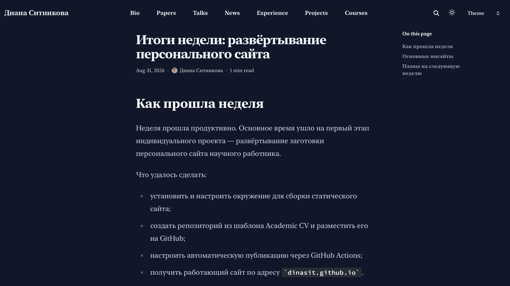

---
## Author
author:
  name: Ситникова Диана Александровна
  degrees: BSc
  email: 1032201746@rudn.ru
  affiliation:
    - name: Российский университет дружбы народов
      country: Российская Федерация
      postal-code: 117198
      city: Москва
      address: ул. Миклухо-Маклая, д. 6
## Title
title: "Индивидуальный проект. Этап 2"
subtitle: "Добавление к сайту данных о себе"
institute:
  - "Российский университет дружбы народов им. П. Лумумбы"
  - "Преподаватель: д.ф.-м.н., профессор Кулябов Дмитрий Сергеевич"
license: CC BY
date: today
date-format: "YYYY-MM-DD"
header-includes:
  - \usepackage{tikz}
---

# Информация

## Докладчик

:::::::::::::: {.columns align=center}
::: {.column width="68%"}

- Ситникова Диана Александровна
- направление 09.03.03 «Прикладная информатика»
- Российский университет дружбы народов
- [1032201746@rudn.ru](mailto:1032201746@rudn.ru)

:::
::: {.column width="32%"}

{width=100%}

:::
::::::::::::::

# Вводная часть

## Актуальность

- Пустая заготовка сайта не решает задачи представления научного работника.
- Сведения о владельце нужны сразу в нескольких местах сайта.
- Дублирование одних и тех же данных приводит к их расхождению.
- Регулярные записи фиксируют ход работы и развивают навык мышления письмом.

## Объект и предмет исследования

**Объект** --- персональный сайт научного работника на генераторе Hugo.

**Предмет** --- модель данных шаблона Academic CV: разделение содержимого, данных и параметров, структура профиля владельца и оформление записей блога.

## Научная новизна и практическая значимость

**Научная новизна** --- сведения о владельце описаны однократно как структурированные данные, а не свёрстаны на странице.

**Практическая значимость** --- заполненный профиль служит источником для всех разделов сайта на последующих этапах.

## Цель, гипотеза и задачи

**Цель** --- наполнить заготовку сайта сведениями о владельце и подготовить первые записи блога.

**Гипотеза** --- однократное описание данных в одном файле избавляет от их дублирования по страницам сайта.

**Задачи:**

- разместить фотографию и заполнить профиль владельца;
- добавить биографию, интересы и сведения об образовании;
- подготовить запись по прошедшей неделе;
- подготовить запись на тему по выбору.

## Материалы и методы

| Компонент | Значение |
|---|---|
| Система | Fedora Linux в виртуальной машине |
| Генератор | Hugo `0.162.1+extended` |
| Профиль владельца | `data/authors/me.yaml` |
| Записи блога | `content/blog/*/index.md` |
| Разметка | YAML и Markdown |

# Содержание исследования

## Данные описаны один раз, выводятся многократно

\begin{center}
\resizebox{\linewidth}{!}{%
\begin{tikzpicture}[font=\scriptsize, >=latex]
  \draw[very thick] (0,1.6) rectangle (3.4,3.0);
  \node[align=center] at (1.7,2.3) {\texttt{data/authors/}\\\texttt{me.yaml}};

  \draw[thick] (0,0.0) rectangle (3.4,1.1);
  \node[align=center] at (1.7,0.55) {\texttt{assets/media/}\\фотография};

  \draw[thick] (6.2,3.2) rectangle (10.0,4.2);
  \node[align=center] at (8.1,3.7) {Главная страница\\био, интересы, образование};

  \draw[thick] (6.2,1.8) rectangle (10.0,2.8);
  \node[align=center] at (8.1,2.3) {Записи блога\\подпись автора};

  \draw[thick] (6.2,0.4) rectangle (10.0,1.4);
  \node[align=center] at (8.1,0.9) {Страница автора\\полный профиль};

  \draw[->,thick] (3.45,2.4) -- (6.15,3.7);
  \draw[->,thick] (3.45,2.3) -- (6.15,2.3);
  \draw[->,thick] (3.45,2.2) -- (6.15,0.9);
  \draw[->,thick] (3.45,0.6) -- (5.0,0.6) -- (5.0,3.5) -- (6.15,3.5);
\end{tikzpicture}%
}
\end{center}

Правка одного файла изменяет все места вывода согласованно.

## Профиль разделён на тематические блоки

| Блок | Что задаёт |
|---|---|
| `name`, `role` | имя и статус владельца |
| `affiliations` | организация и ссылка на неё |
| `bio` | краткое описание |
| `interests` | области интересов |
| `education` | степень, учреждение, даты |
| `links` | почта и внешние профили |

Поле `slug` связывает профиль с записями блога, `is_owner` отмечает владельца сайта.

## Профиль заполнен собственными данными

:::::::::::::: {.columns align=center}
::: {.column width="42%"}

Биография записана блочным литералом --- вертикальная черта сохраняет переносы строк.

Даты образования заданы в формате `ГГГГ-ММ-ДД`.

:::
::: {.column width="58%"}

{width=100%}

:::
::::::::::::::

## Тема собрала главную страницу из данных

:::::::::::::: {.columns align=center}
::: {.column width="42%"}

Фотография, имя, статус и организация выведены в левой колонке.

Биография, интересы и образование --- отдельными разделами справа.

Вёрстка не правилась: страница построена шаблоном.

:::
::: {.column width="58%"}

{width=100%}

:::
::::::::::::::

## Запись блога --- каталог с текстом и вложениями

:::::::::::::: {.columns align=center}
::: {.column width="42%"}

Метаданные задают заголовок, дату, автора и ключевые слова.

Оглавление страницы построено по заголовкам второго уровня автоматически.

:::
::: {.column width="58%"}

{width=100%}

:::
::::::::::::::

# Результаты

## Все пункты задания выполнены

- Размещена фотография владельца сайта.
- Заполнены биография, интересы и сведения об образовании.
- Задано название сайта, отображаемое в шапке и заголовке вкладки.
- Подготовлена запись по прошедшей неделе.
- Подготовлена запись о непрерывной интеграции и развёртывании.

## Анализ результатов и их применимость

- Число страниц выросло с 79 до 89 за счёт записей и ключевых слов.
- Данные о владельце описаны в одном файле и выведены в трёх местах.
- Публикация выполнена отправкой коммита, без дополнительных действий.

Заполненный профиль служит источником данных для всех последующих этапов.

## Содержимое отделено от представления

Ни одна страница сайта не свёрстана вручную: есть данные о владельце и есть тема оформления, которая решает, как их показать.

Поэтому смена темы не потребует переписывать биографию, а исправление опечатки в имени достаточно внести один раз.
