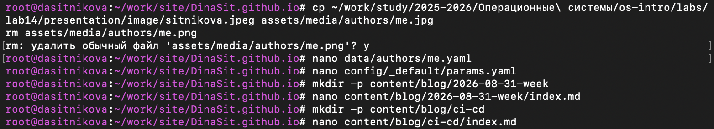
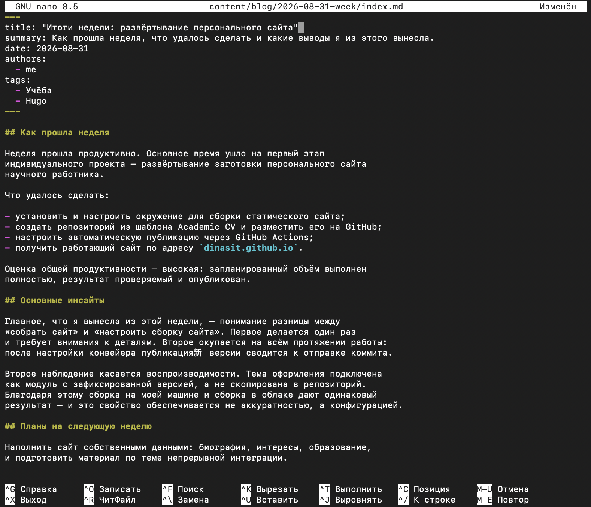
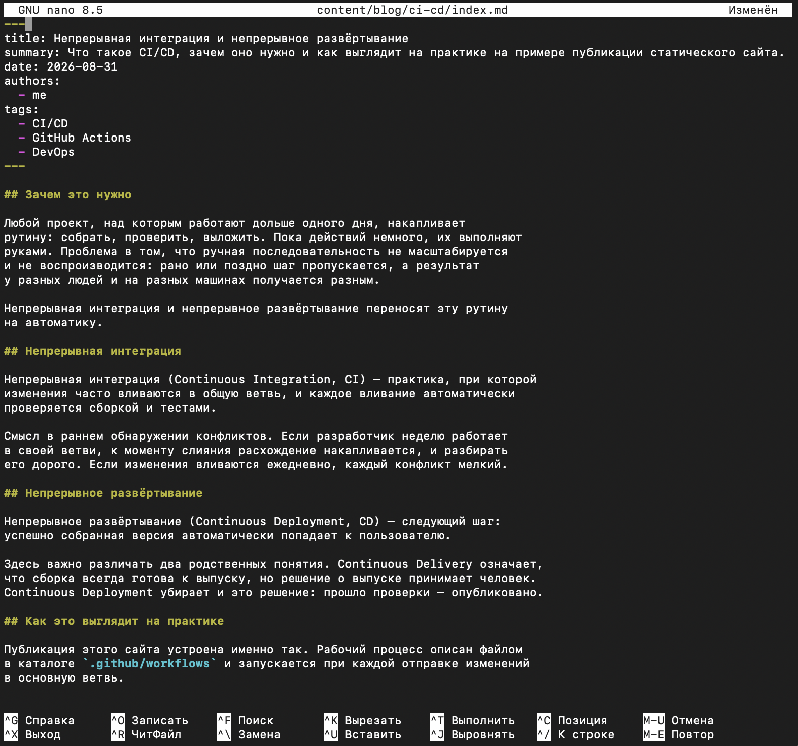
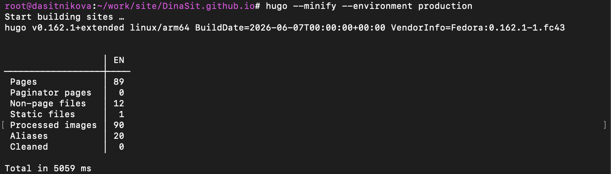
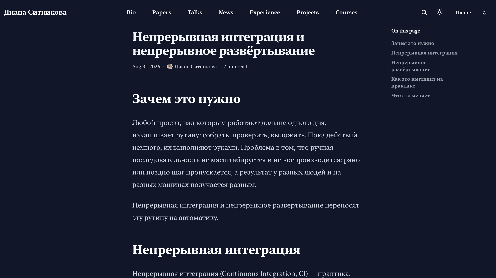
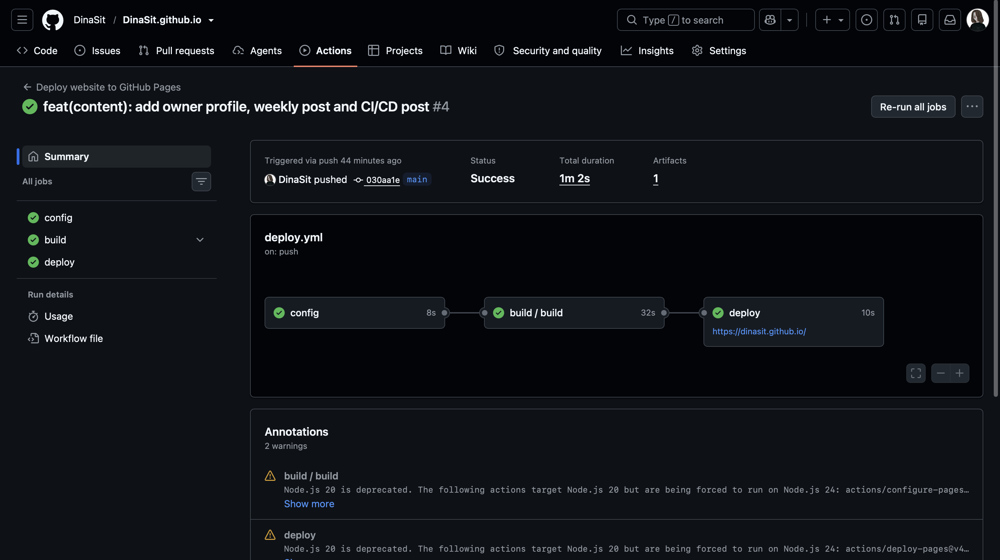

---
## Author
author:
  name: Ситникова Диана Александровна
  degrees: BSc
  email: 1032201746@rudn.ru
  affiliation:
    - name: Российский университет дружбы народов
      country: Российская Федерация
      postal-code: 117198
      city: Москва
      address: ул. Миклухо-Маклая, д. 6

## Title
title: "Отчёт по индивидуальному проекту. Этап 2"
subtitle: "Добавление к сайту данных о себе"
license: "CC BY"
bibliography: bib/cite.bib
---

# Цель работы

Наполнить заготовку персонального сайта научного работника сведениями о владельце и подготовить первые записи блога.

# Задание

В соответствии с методическими указаниями необходимо выполнить следующую последовательность действий [@rudn_project_stages].

1. Разместить фотографию владельца сайта.
2. Разместить краткое описание владельца сайта (Biography).
3. Добавить информацию об интересах (Interests).
4. Добавить информацию об образовании (Education).
5. Сделать пост по прошедшей неделе.
6. Добавить пост на тему по выбору: «Управление версиями. Git» либо «Непрерывная интеграция и непрерывное развёртывание (CI/CD)».

# Краткие теоретические сведения

## Разделение содержимого, данных и параметров

Hugo различает три вида исходных материалов, и понимание этого различия определяет, какой файл следует править для получения нужного результата (@tbl-layers).

| Каталог | Что содержит | Как используется |
|---|---|---|
| `content` | страницы сайта | каждая страница даёт свой адрес |
| `data` | структурированные данные | подставляются в шаблоны, своих адресов не имеют |
| `config` | параметры сборки и оформления | действуют на весь сайт |
| `assets` | исходные изображения и стили | обрабатываются при сборке |

: Разделение исходных материалов сайта {#tbl-layers}

Каталог `content` описывает страницы: файл превращается в адрес, заголовок и текст. Каталог `data` содержит справочные структуры в форматах YAML, JSON или TOML; они не порождают страниц, а читаются шаблонами и подставляются в нужные места [@hugo_data_templates].

Такое разделение позволяет описать сведения о владельце сайта один раз, а выводить их в нескольких местах: на главной странице, в подписи к записи блога, на странице автора.

## Профиль владельца сайта

В шаблоне Academic CV сведения о владельце вынесены в файл `data/authors/me.yaml` [@hugoblox_academic_cv]. Поле `slug` задаёт идентификатор, по которому на автора ссылаются записи блога, а признак `is_owner` отмечает владельца сайта.

Структура файла разделена на тематические блоки (@tbl-author).

| Блок | Назначение |
|---|---|
| `name` | отображаемое имя, имя и фамилия по отдельности |
| `role` | должность или статус |
| `affiliations` | организация и ссылка на неё |
| `bio` | краткое описание владельца |
| `interests` | список областей интересов |
| `education` | образование: степень, учреждение, даты |
| `links` | ссылки на внешние ресурсы и почту |

: Блоки профиля владельца сайта {#tbl-author}

Фотография владельца хранится отдельно, в каталоге `assets/media/authors`, и связывается с профилем по значению `slug`. При сборке Hugo обрабатывает исходное изображение: масштабирует его под нужные размеры и формирует несколько вариантов для разных экранов [@hugo_docs].

## Блочные литералы YAML

Формат YAML представляет данные в виде вложенных отображений и списков, где уровень вложенности задаётся отступом [@yaml_spec]. Значение обычно записывается в одну строку, что неудобно для многострочного текста вроде биографии.

Для таких случаев применяется блочный литерал --- вертикальная черта после имени ключа. Всё, что записано ниже с большим отступом, становится значением ключа с сохранением переносов строк.

~~~yaml
bio: |
  Первая строка описания.
  Вторая строка описания.
~~~

Отдельного внимания требуют значения, содержащие двоеточие с пробелом: такая последовательность разделяет ключ и значение, поэтому строку целиком необходимо заключать в кавычки.

## Записи блога

Каждая запись блога представляет собой каталог с файлом `index.md` внутри. Такая организация называется страничным пакетом: изображения и вложения записи лежат рядом с её текстом и переносятся вместе с ней [@hugo_page_bundles].

Файл начинается с блока метаданных, отделённого строками из трёх дефисов (@tbl-front-matter).

| Поле | Назначение |
|---|---|
| `title` | заголовок записи |
| `summary` | краткое описание для списка записей |
| `date` | дата публикации, определяет порядок вывода |
| `authors` | ссылки на профили авторов по `slug` |
| `tags` | ключевые слова для группировки записей |

: Поля метаданных записи блога {#tbl-front-matter}

Ниже метаданных располагается текст записи в разметке Markdown [@commonmark_spec]. Заголовки второго уровня внутри записи используются темой оформления для построения оглавления страницы.

## Пост по прошедшей неделе

Регулярная запись об итогах недели предлагается как элемент учебной практики. Её назначение --- развитие навыка мышления письмом и навыка саморефлексии [@kulyabov_weekly_post].

Рекомендуемая структура записи включает описание того, как прошла неделя, с оценкой общей продуктивности и перечнем выполненного, а также изложение основных инсайтов --- того, что оказалось наиболее значимым в изученном материале.

# Выполнение работы

## 1. Размещение фотографии владельца {.unnumbered}

Работа велась в каталоге сайта `~/work/site/DinaSit.github.io`. Фотография взята из репозитория курса и помещена в каталог изображений автора под именем, соответствующим идентификатору профиля; демонстрационное изображение шаблона удалено (@fig-prepare).

~~~bash
cp ~/work/study/2025-2026/Операционные\ системы/os-intro/labs/lab14/presentation/image/sitnikova.jpeg assets/media/authors/me.jpg
rm assets/media/authors/me.png
~~~

{#fig-prepare width=100%}

## 2. Заполнение профиля владельца {.unnumbered}

Профиль владельца сайта описан в файле `data/authors/me.yaml` (@fig-author).

~~~bash
nano data/authors/me.yaml
~~~

Заданы отображаемое имя, статус и организация:

~~~yaml
name:
  display: Диана Ситникова
  given: Диана
  family: Ситникова
role: Студентка направления "Прикладная информатика"

affiliations:
  - name: Российский Университет Дружбы Народов им. П. Лумумбы
    url: https://www.rudn.ru/
~~~

В блоке ссылок указаны адрес электронной почты и профили на внешних ресурсах:

~~~yaml
links:
  - icon: at-symbol
    url: mailto:1032201746@rudn.ru
    label: Связаться со мной
  - icon: brands/github
    url: https://github.com/DinaSit
  - icon: brands/linkedin
    url: https://www.linkedin.com/in/dinasit/
~~~

{#fig-author width=100%}

## 3. Краткое описание владельца {.unnumbered}

Биография записана блочным литералом, что позволяет разбить текст на строки без потери смысла.

~~~yaml
bio: |
  Студентка бакалавриата Российского Университета Дружбы Народов
  по направлению 09.03.03 "Прикладная информатика". Интересуюсь
  системным программированием, DevOps и разработкой высокопроизводительного
  программного обеспечения. В настоящее время сосредоточен на C++,
  алгоритмах, системах на базе Linux и распределенной инфраструктуре.
~~~

Тема оформления выводит это описание на главной странице в разделе «Professional Summary».

## 4. Информация об интересах {.unnumbered}

Области интересов заданы списком; каждый элемент выводится отдельным пунктом на главной странице.

~~~yaml
interests:
  - Прикладная информатика
  - Разработка ПО
  - Операционные системы и Linux
  - Научное программирование
  - Алгоритмы и структуры данных
~~~

## 5. Информация об образовании {.unnumbered}

Сведения об образовании описаны списком записей. Каждая запись содержит степень, учреждение, даты начала и окончания обучения, а также необязательное пояснение.

~~~yaml
education:
  - degree: Бакалавриат, 09.03.03 "Прикладная информатика"
    institution: Российский Университет Дружбы Народов им. П. Лумумбы
    start: 2025-09-01
    end: 2029-06-30
    summary: |
      Факультет физико-математических и естественных наук.
~~~

Даты записываются в формате `ГГГГ-ММ-ДД`; тема оформления выводит их в разделе «Education» главной страницы.

## 6. Название сайта {.unnumbered}

Сведения, относящиеся к сайту в целом, а не к его владельцу, задаются отдельно от профиля автора --- в блоке `identity` файла параметров оформления (@fig-params).

~~~bash
nano config/_default/params.yaml
~~~

~~~yaml
hugoblox:
  identity:
    name: "Диана Ситникова"
    tagline: "Студентка направления «Прикладная информатика», РУДН"
    description: "Персональный сайт Дианы Ситниковой — студентки направления
      09.03.03 «Прикладная информатика» Российского университета дружбы народов."
    social:
      twitter: ""
~~~

Поле `name` даёт название, отображаемое в шапке сайта, в подвале и в заголовке вкладки браузера. Краткая подпись `tagline` выводится темой оформления, а `description` попадает в мета-тег описания страницы и используется поисковыми системами и при формировании предварительного просмотра ссылки. Значения, унаследованные от шаблона, заменены собственными.

{#fig-params width=100%}

## 7. Пост по прошедшей неделе {.unnumbered}

Запись создана как страничный пакет: каталог с файлом `index.md` внутри (@fig-week-src).

~~~bash
mkdir -p content/blog/2026-08-31-week
nano content/blog/2026-08-31-week/index.md
~~~

Метаданные записи, помещаемые в начало файла между строками из трёх дефисов:

~~~yaml
title: "Итоги недели: развёртывание персонального сайта"
summary: Как прошла неделя, что удалось сделать и какие выводы я из этого вынесла.
date: 2026-08-31
authors:
  - me
tags:
  - Учёба
  - Hugo
~~~

Заголовок заключён в кавычки, поскольку содержит двоеточие с пробелом. Поле `authors` ссылается на профиль владельца сайта по его идентификатору `me`.

Текст записи построен по рекомендованной структуре [@kulyabov_weekly_post] и разделён на три части: «Как прошла неделя» с оценкой продуктивности и перечнем выполненного, «Основные инсайты» с изложением наиболее значимых наблюдений и «Планы на следующую неделю».

{#fig-week-src width=100%}

## 8. Пост на тему по выбору {.unnumbered}

Из предложенного списка выбрана тема «Непрерывная интеграция и непрерывное развёртывание» --- она непосредственно связана с механизмом публикации, настроенным на первом этапе проекта [@github_actions_docs].

~~~bash
mkdir -p content/blog/ci-cd
nano content/blog/ci-cd/index.md
~~~

~~~yaml
title: Непрерывная интеграция и непрерывное развёртывание
summary: Что такое CI/CD, зачем оно нужно и как выглядит на практике на примере публикации статического сайта.
date: 2026-08-31
authors:
  - me
tags:
  - CI/CD
  - GitHub Actions
  - DevOps
~~~

Запись состоит из четырёх разделов: обоснование необходимости автоматизации, определение непрерывной интеграции, определение непрерывного развёртывания с разграничением понятий Continuous Delivery и Continuous Deployment, и разбор рабочего процесса публикации сайта в качестве практического примера (@fig-cicd-src).

{#fig-cicd-src width=100%}

## 9. Сборка и публикация {.unnumbered}

Внесённые изменения проверены сборкой в том режиме, в котором сайт собирается при публикации (@fig-build).

~~~bash
hugo --minify --environment production
~~~

{#fig-build width=100%}

Сформировано 89 страниц против 79 на предыдущем этапе: добавились страницы записей блога, а также страницы ключевых слов, автоматически создаваемые темой по значениям поля `tags`.

Результат просмотрен встроенным веб-сервером. На главной странице выводятся фотография, имя, статус, организация, биография, интересы и образование (@fig-main).

{#fig-main width=100%}

Обе записи блога отображаются корректно: тема оформления построила оглавление страницы по заголовкам второго уровня и вывела подпись автора со ссылкой на профиль (@fig-week и @fig-cicd).

{#fig-week width=100%}

{#fig-cicd width=100%}

Изменения зафиксированы в репозитории и отправлены на хостинг [@chacon_book_pro-git_en].

~~~bash
git add -u && git add content/blog data assets config
git commit -m "feat(content): add owner profile, weekly post and CI/CD post"
git push
~~~

Отправка изменений запустила рабочий процесс публикации, настроенный на первом этапе. Все три задания --- чтение конфигурации, сборка и развёртывание --- завершились успешно, и обновлённый сайт стал доступен по прежнему адресу (@fig-deploy).

{#fig-deploy width=100%}

# Выводы

В ходе выполнения второго этапа индивидуального проекта заготовка персонального сайта наполнена сведениями о владельце и первыми записями блога.

Размещена фотография владельца, заполнены биография, список областей интересов и сведения об образовании. Задано название сайта, отображаемое в шапке и заголовке вкладки браузера. Подготовлены две записи блога: отчёт о прошедшей неделе, построенный по рекомендованной структуре, и материал по теме непрерывной интеграции и непрерывного развёртывания.

Работа подтвердила практическую ценность разделения исходных материалов, принятого в Hugo. Сведения о владельце описаны один раз в файле данных и выводятся темой оформления в нескольких местах --- на главной странице и в подписях к записям блога. Запись блога, оформленная страничным пакетом, хранит свой текст и вложения в одном каталоге, что делает её самостоятельной единицей содержимого.

Публикация выполнена без единого дополнительного действия: отправка изменений в репозиторий запустила настроенный ранее рабочий процесс, и обновлённый сайт появился по прежнему адресу. Тем самым проверено на практике свойство конвейера, заявленное по итогам первого этапа.

Сайт готов к добавлению сведений о достижениях, что составляет содержание следующего этапа проекта.

# Список литературы {.unnumbered}

::: {#refs}
:::
