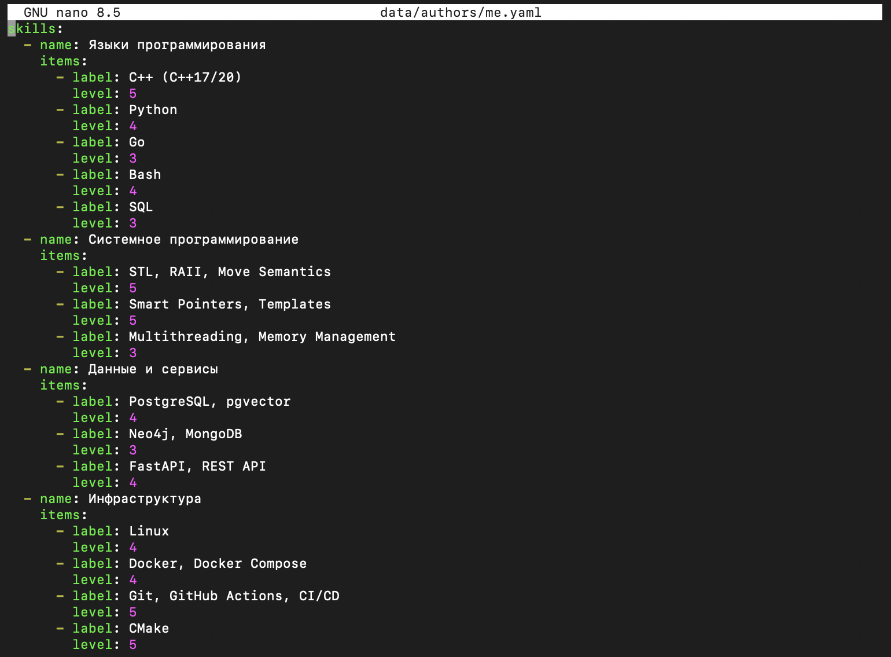
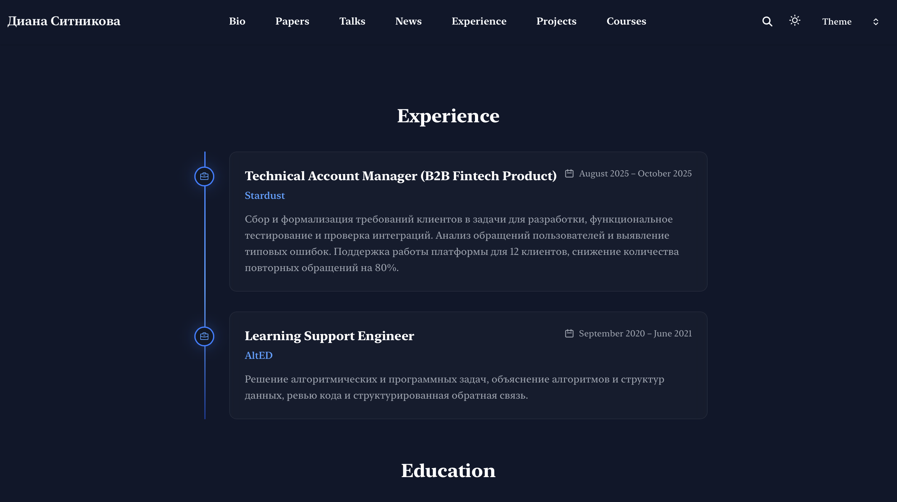

---
## Author
author:
  name: Ситникова Диана Александровна
  degrees: BSc
  email: 1032201746@rudn.ru
  affiliation:
    - name: Российский университет дружбы народов
      country: Российская Федерация
      postal-code: 117198
      city: Москва
      address: ул. Миклухо-Маклая, д. 6
## Title
title: "Индивидуальный проект. Этап 3"
subtitle: "Добавление к сайту достижений"
institute:
  - "Российский университет дружбы народов им. П. Лумумбы"
  - "Преподаватель: д.ф.-м.н., профессор Кулябов Дмитрий Сергеевич"
license: CC BY
date: today
date-format: "YYYY-MM-DD"
header-includes:
  - \usepackage{tikz}
---

# Информация

## Докладчик

:::::::::::::: {.columns align=center}
::: {.column width="68%"}

- Ситникова Диана Александровна
- направление 09.03.03 «Прикладная информатика»
- Российский университет дружбы народов
- [1032201746@rudn.ru](mailto:1032201746@rudn.ru)

:::
::: {.column width="32%"}

{width=100%}

:::
::::::::::::::

# Вводная часть

## Актуальность

- Сайт научного работника должен показывать не только личность, но и квалификацию.
- Опыт, навыки и достижения обновляются чаще остального содержания.
- Свёрстанная страница требует правки вёрстки при каждом изменении.
- Те же сведения нужны в резюме, профилях и заявках --- источник должен быть один.

## Объект и предмет исследования

**Объект** --- персональный сайт научного работника на генераторе Hugo.

**Предмет** --- представление профессиональных сведений структурированными данными: разделы опыта, навыков и достижений в профиле владельца и блочная сборка страницы из них.

## Научная новизна и практическая значимость

**Научная новизна** --- резюме рассматривается как структура данных с фиксированными полями, а не как свёрстанный документ.

**Практическая значимость** --- добавление достижения сводится к дописыванию записи в список и не требует правки страницы.

## Цель, гипотеза и задачи

**Цель** --- дополнить сайт сведениями об опыте, навыках и достижениях и подготовить очередные записи блога.

**Гипотеза** --- страницу профессионального профиля можно целиком собрать из данных, не написав на ней ни строки текста.

**Задачи:**

- заполнить разделы опыта, навыков и достижений;
- указать владение языками;
- подготовить запись по прошедшей неделе;
- подготовить запись на тему по выбору.

## Материалы и методы

| Компонент | Значение |
|---|---|
| Система | Fedora Linux в виртуальной машине |
| Генератор | Hugo `0.162.1+extended` |
| Профиль владельца | `data/authors/me.yaml` |
| Страница профиля | `content/experience.md` |
| Разметка | YAML и Markdown |

# Содержание исследования

## Один файл данных разворачивается в четыре блока

\begin{center}
\resizebox{\linewidth}{!}{%
\begin{tikzpicture}[font=\scriptsize, >=latex]
  \draw[very thick] (0,0.9) rectangle (3.6,3.9);
  \node[align=center] at (1.8,2.4) {\texttt{data/authors/me.yaml}\\[4pt]experience\\skills\\awards\\languages};

  \draw[thick] (5.8,4.0) rectangle (9.2,4.8);
  \node[align=center] at (7.5,4.4) {\texttt{resume-experience}};
  \draw[thick] (5.8,3.0) rectangle (9.2,3.8);
  \node[align=center] at (7.5,3.4) {\texttt{resume-skills}};
  \draw[thick] (5.8,2.0) rectangle (9.2,2.8);
  \node[align=center] at (7.5,2.4) {\texttt{resume-awards}};
  \draw[thick] (5.8,1.0) rectangle (9.2,1.8);
  \node[align=center] at (7.5,1.4) {\texttt{resume-languages}};

  \draw[thick] (11.0,2.0) rectangle (13.8,3.4);
  \node[align=center] at (12.4,2.7) {Страница\\«Experience»};

  \draw[->,thick] (3.65,2.7) -- (5.75,4.4);
  \draw[->,thick] (3.65,2.55) -- (5.75,3.4);
  \draw[->,thick] (3.65,2.25) -- (5.75,2.4);
  \draw[->,thick] (3.65,2.1) -- (5.75,1.4);

  \draw[->,thick] (9.25,4.4) -- (10.95,3.0);
  \draw[->,thick] (9.25,3.4) -- (10.95,2.9);
  \draw[->,thick] (9.25,2.4) -- (10.95,2.6);
  \draw[->,thick] (9.25,1.4) -- (10.95,2.4);
\end{tikzpicture}%
}
\end{center}

Страница перечисляет блоки и указывает профиль; собственного текста в ней нет.

## Достижение --- набор полей, а не абзац

| Поле | Назначение |
|---|---|
| `title` | название и результат |
| `awarder` | кто присудил |
| `date` | дата строкой `ГГГГ-ММ-ДД` |
| `summary` | краткое пояснение |
| `icon` | значок из набора темы |

Дата берётся в кавычки: иначе YAML распознает её как значение типа «дата» и передаст теме объект вместо строки.

## Навыки заданы группами с уровнями

:::::::::::::: {.columns align=center}
::: {.column width="42%"}

Двухуровневая структура: список групп, внутри каждой --- подписи и уровень от 1 до 5.

Группировка по областям, а не по инструментам: видно распределение по направлениям работы.

:::
::: {.column width="58%"}

{width=100%}

:::
::::::::::::::

## Опыт выведен лентой с отметками времени

:::::::::::::: {.columns align=center}
::: {.column width="42%"}

Тема сама расставила периоды и порядок записей.

Отсутствие поля `end` означает продолжающуюся занятость --- выводится «настоящее время».

:::
::: {.column width="58%"}

{width=100%}

:::
::::::::::::::

## Достижения собраны карточками

:::::::::::::: {.columns align=center}
::: {.column width="42%"}

Порядок --- по убыванию даты, задавать вручную не требуется.

Каждой записи назначен свой значок: кубок, колба, скобки кода, микросхема, щит.

:::
::: {.column width="58%"}

{width=100%}

:::
::::::::::::::

# Результаты

## Все пункты задания выполнены

- Заполнен раздел опыта: две записи с должностями, организациями и периодами.
- Заполнены навыки: четыре группы с указанием уровня владения.
- Заполнены достижения: шесть результатов в отраслевых соревнованиях.
- Указано владение языками.
- Подготовлены записи по прошедшей неделе и о легковесных языках разметки.

## Анализ результатов и их применимость

- Страница профиля не содержит собственного текста --- только перечень блоков.
- Новое достижение добавляется записью в список, без правки страницы.
- Вид записей определяет тема, а не автор содержания.

Заполненный профиль служит источником данных для оставшихся этапов проекта.

## Резюме удобнее хранить данными, чем документом

Свёрстанное резюме нужно править в каждом месте, где оно опубликовано, и при любой смене оформления.

Описанное данными, оно правится один раз: перечень достижений остаётся списком записей, а решение о том, как их показать, принимает шаблон.
