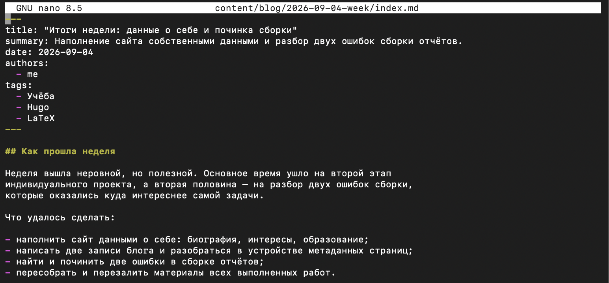
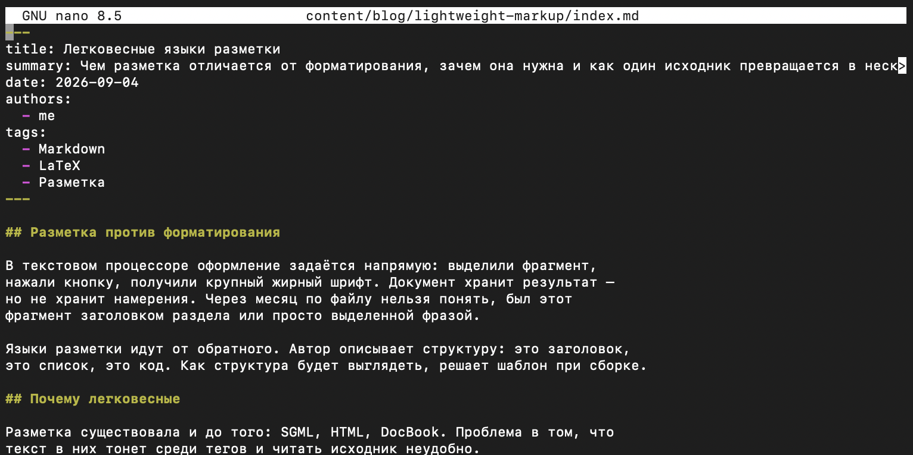
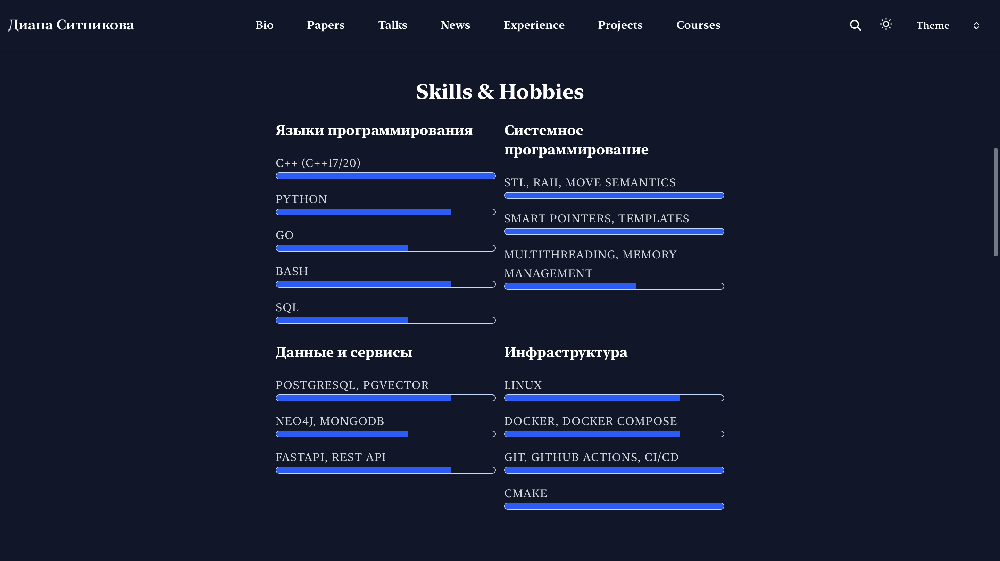
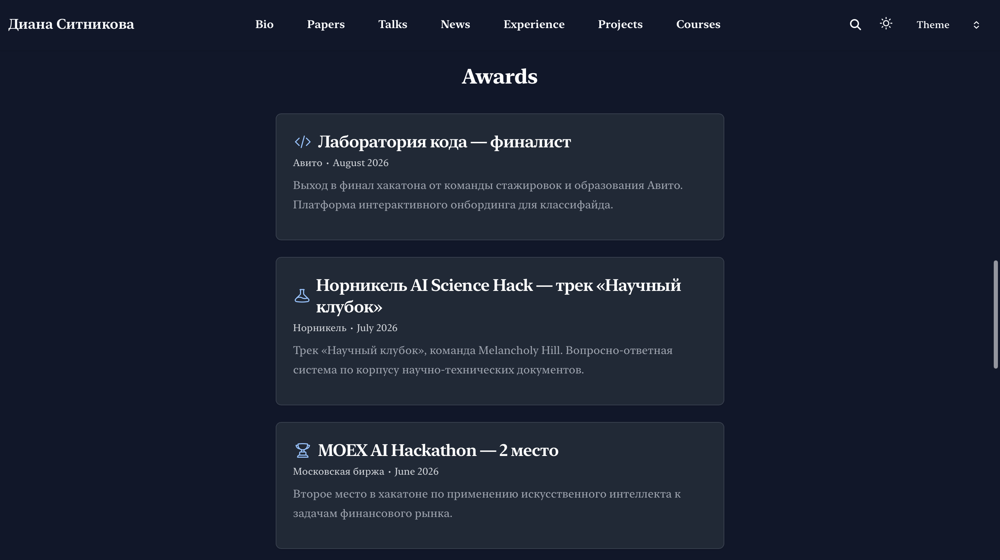

---
## Author
author:
  name: Ситникова Диана Александровна
  degrees: BSc
  email: 1032201746@rudn.ru
  affiliation:
    - name: Российский университет дружбы народов
      country: Российская Федерация
      postal-code: 117198
      city: Москва
      address: ул. Миклухо-Маклая, д. 6

## Title
title: "Отчёт по индивидуальному проекту. Этап 3"
subtitle: "Добавление к сайту достижений"
license: "CC BY"
bibliography: bib/cite.bib
---

# Цель работы

Дополнить персональный сайт научного работника сведениями о профессиональном опыте, навыках и достижениях, а также подготовить очередные записи блога.

# Задание

В соответствии с методическими указаниями необходимо выполнить следующую последовательность действий [@rudn_project_stages].

1. Добавить информацию о навыках (Skills).
2. Добавить информацию об опыте (Experience).
3. Добавить информацию о достижениях (Accomplishments).
4. Сделать пост по прошедшей неделе.
5. Добавить пост на тему по выбору: «Легковесные языки разметки», «Языки разметки. LaTeX» либо «Язык разметки Markdown».

# Краткие теоретические сведения

## Резюме как структурированные данные

На предыдущем этапе на сайте были размещены сведения, описывающие владельца как личность: биография, интересы, образование. Настоящий этап добавляет к ним сведения, описывающие его как специалиста: опыт, навыки и достижения.

Принципиально важно, что все эти данные размещаются не как свёрстанная страница, а как структура в файле данных. Тема оформления получает список записей с известными полями и сама решает, как их показать: опыт --- лентой с датами, навыки --- полосами уровня, достижения --- карточками со значками [@hugoblox_academic_cv].

Такое разделение даёт три следствия. Одни и те же сведения можно вывести в разных местах сайта без копирования. Смена темы оформления не требует переписывать содержание. Наконец, данные остаются пригодными для машинной обработки: список достижений --- это список записей, а не абзац текста.

## Блоки страницы и их источник

Страница «Experience» описана файлом `content/experience.md` и представляет собой не текст, а перечень блоков (@tbl-blocks). Каждый блок указывает, какой профиль он отображает, а содержимое берёт из файла данных [@hugo_data_templates].

| Блок | Что выводит | Источник данных |
|---|---|---|
| `resume-experience` | места работы с датами | `experience` |
| `resume-skills` | группы навыков с уровнями | `skills` |
| `resume-awards` | достижения с датами и значками | `awards` |
| `resume-languages` | владение языками | `languages` |

: Блоки страницы «Experience» и их источники {#tbl-blocks}

Порядок блоков на странице задаётся порядком их перечисления в файле, а параметр `is_education_first` определяет, что выводится первым --- образование или опыт. Поскольку все четыре блока уже объявлены в шаблоне, добавление сведений сводится к заполнению соответствующих разделов профиля.

## Структура записей профиля

Каждый раздел профиля --- список однотипных записей со своим набором полей.

Запись об опыте содержит должность `role`, организацию `org`, даты `start` и `end`, а также необязательное описание `summary`. Отсутствие поля `end` означает, что занятость продолжается: тема выводит в этом случае «настоящее время».

Навыки организованы двухуровнево: список групп, у каждой из которых есть название `name` и вложенный список `items`. Элемент списка состоит из подписи `label` и числового уровня `level` от единицы до пяти, который тема отображает полосой заполнения.

Запись о достижении устроена подробнее (@tbl-award).

| Поле | Назначение |
|---|---|
| `title` | название достижения и результат |
| `awarder` | организация, присудившая награду |
| `date` | дата в виде строки `ГГГГ-ММ-ДД` |
| `summary` | краткое пояснение |
| `icon` | значок из набора темы |

: Поля записи о достижении {#tbl-award}

Значение поля `date` записывается в кавычках. Без них разборщик YAML распознает последовательность вида `2026-06-30` как значение типа «дата» и передаст теме объект вместо строки [@yaml_spec].

## Записи блога и регулярная рефлексия

Записи блога оформляются страничными пакетами: каталог с файлом `index.md`, метаданные которого задают заголовок, дату, автора и ключевые слова [@hugo_page_bundles; @hugo_front_matter].

Существенная особенность генератора: страницы с датой в будущем в сборку не включаются. Параметр `buildFuture` по умолчанию отключён, поэтому дата записи должна соответствовать моменту публикации либо предшествовать ему [@hugo_docs].

Регулярная запись об итогах недели предусмотрена как элемент учебной практики. Её назначение --- развитие навыка мышления письмом и навыка саморефлексии; рекомендованная структура включает описание прошедшей недели с оценкой продуктивности и перечнем выполненного, а также изложение основных инсайтов [@kulyabov_weekly_post].

## Легковесные языки разметки

Второй записью подготовлен материал по теме, выбранной из предложенного списка.

Языки разметки описывают структуру документа, а не его оформление: автор указывает, что фрагмент является заголовком или списком, а внешний вид определяется шаблоном при сборке. Ранние языки этого семейства --- SGML, HTML, DocBook --- используют теговую нотацию, из-за которой исходный текст трудно читать без обработки.

Легковесные языки разметки строят нотацию из символов, интуитивно соответствующих смыслу: решётка перед строкой обозначает заголовок, дефис --- пункт списка [@gruber_markdown]. Исходный текст при этом остаётся читаемым сам по себе.

Базовый Markdown не описывает таблицы, сноски, формулы и перекрёстные ссылки, поэтому существуют расширения: Pandoc Markdown добавляет цитирование и сноски, формат QMD --- блок метаданных и исполняемые фрагменты кода [@commonmark_spec]. Для задач, требующих точного контроля вёрстки и сложных формул, применяется LaTeX [@lamport_book_latex_en]; на практике подходы сочетаются --- текст пишется лёгкой разметкой, а LaTeX выступает движком вёрстки при сборке PDF.

# Выполнение работы

Работа велась в каталоге сайта `~/work/site/DinaSit.github.io`. Все сведения о владельце размещаются в файле `data/authors/me.yaml`, поэтому редактировался преимущественно он.

~~~bash
cd ~/work/site/DinaSit.github.io
nano data/authors/me.yaml
~~~

## 1. Сведения об опыте работы {.unnumbered}

Раздел `experience` заполнен двумя записями (@fig-exp).

~~~yaml
experience:
  - role: Technical Account Manager (B2B Fintech Product)
    org: Stardust
    start: 2025-08-01
    end: 2025-10-31
    summary: |
      Сбор и формализация требований клиентов в задачи для разработки,
      функциональное тестирование и проверка интеграций. Анализ обращений
      пользователей и выявление типовых ошибок. Поддержка работы платформы
      для 12 клиентов, снижение количества повторных обращений на 80%.
  - role: Learning Support Engineer
    org: AltED
    start: 2020-09-01
    end: 2021-06-30
    summary: |
      Решение алгоритмических и программных задач, объяснение алгоритмов
      и структур данных, ревью кода и структурированная обратная связь.
~~~

{#fig-exp width=100%}

Описание записано блочным литералом: вертикальная черта после имени поля позволяет разбить текст на строки, сохранив их при выводе.

## 2. Сведения о навыках {.unnumbered}

Навыки разделены на четыре группы: языки программирования, системное программирование, данные и сервисы, инфраструктура (@fig-skills).

~~~yaml
skills:
  - name: Языки программирования
    items:
      - label: C++ (C++17/20)
        level: 5
      - label: Python
        level: 4
      - label: Go
        level: 3
      - label: Bash
        level: 4
      - label: SQL
        level: 3
  - name: Системное программирование
    items:
      - label: STL, RAII, Move Semantics
        level: 5
      - label: Smart Pointers, Templates
        level: 5
      - label: Multithreading, Memory Management
        level: 3
~~~

{#fig-skills width=100%}

Группировка выбрана по областям, а не по инструментам: так читателю видно не только перечисление технологий, но и распределение по направлениям работы.

## 3. Сведения о достижениях {.unnumbered}

Раздел `awards` заполнен шестью записями о результатах в отраслевых соревнованиях (@fig-awards).

~~~yaml
awards:
  - title: MOEX AI Hackathon --- 2 место
    awarder: Московская биржа
    date: "2026-06-30"
    summary: |
      Второе место в хакатоне по применению искусственного интеллекта
      к задачам финансового рынка.
    icon: hero/trophy
  - title: Норникель AI Science Hack --- трек «Научный клубок»
    awarder: Норникель
    date: "2026-07-05"
    summary: |
      Трек «Научный клубок», команда Melancholy Hill. Вопросно-ответная
      система по корпусу научно-технических документов.
    icon: hero/beaker
~~~

{#fig-awards width=100%}

Каждой записи назначен собственный значок из набора темы: кубок для призового места, колба для научного трека, скобки кода для хакатона по разработке, микросхема для алгоритмического соревнования, щит для состязания по информационной безопасности.

Дополнительно заполнен раздел `languages`, отображаемый четвёртым блоком страницы.

~~~yaml
languages:
  - name: Русский
    level: 5
    label: Родной
  - name: Английский
    level: 4
    label: B2
~~~

## 4. Запись по прошедшей неделе {.unnumbered}

Запись создана страничным пакетом (@fig-week).

~~~bash
mkdir -p content/blog/2026-09-04-week
nano content/blog/2026-09-04-week/index.md
~~~

Метаданные записи:

~~~yaml
title: "Итоги недели: данные о себе и починка сборки"
summary: Наполнение сайта собственными данными и разбор двух ошибок сборки отчётов.
date: 2026-09-04
authors:
  - me
tags:
  - Учёба
  - Hugo
  - LaTeX
~~~

{#fig-week width=100%}

Текст построен по рекомендованной структуре [@kulyabov_weekly_post] и разделён на три части: «Как прошла неделя» с оценкой продуктивности и перечнем выполненного, «Основные инсайты» с изложением наблюдений и «Планы на следующую неделю».

## 5. Запись на тему по выбору {.unnumbered}

Из предложенного списка выбрана тема «Легковесные языки разметки» --- она охватывает и Markdown, и сопоставление с LaTeX, то есть оба инструмента, применяемые при подготовке материалов курса (@fig-markup).

~~~bash
mkdir -p content/blog/lightweight-markup
nano content/blog/lightweight-markup/index.md
~~~

~~~yaml
title: Легковесные языки разметки
summary: Чем разметка отличается от форматирования, зачем она нужна и как один исходник превращается в несколько форматов.
date: 2026-09-04
authors:
  - me
tags:
  - Markdown
  - LaTeX
  - Разметка
~~~

{#fig-markup width=100%}

Запись состоит из пяти разделов: различение разметки и форматирования, обоснование термина «легковесные», Markdown и его расширения, область применения LaTeX и практические следствия подхода.

## 6. Сборка и просмотр результата {.unnumbered}

Внесённые изменения проверены сборкой и просмотром сайта встроенным веб-сервером.

~~~bash
hugo --minify --environment production
hugo server --bind 0.0.0.0 --baseURL http://localhost
~~~

На странице «Experience» сведения об опыте выведены лентой с отметками времени: должность, организация, период работы и описание (@fig-page-exp).

{#fig-page-exp width=100%}

Навыки отображены четырьмя группами в две колонки; уровень владения показан полосой заполнения (@fig-page-skills).

{#fig-page-skills width=100%}

Достижения выведены карточками, упорядоченными по убыванию даты, --- каждая со значком, названием организации, месяцем и пояснением (@fig-page-awards).

{#fig-page-awards width=100%}

## 7. Публикация {.unnumbered}

Изменения зафиксированы в репозитории и отправлены на хостинг [@chacon_book_pro-git_en].

~~~bash
git add -u && git add content data config
git commit -m "feat(content): add experience, skills, awards and two posts"
git push
~~~

Отправка запустила рабочий процесс, настроенный на первом этапе: сборка выполняется на стороне службы и передаёт результат GitHub Pages [@github_actions_docs]. Обновлённый сайт стал доступен по прежнему адресу.

# Выводы

В ходе выполнения третьего этапа индивидуального проекта персональный сайт дополнен сведениями о профессиональной деятельности владельца.

Заполнены три раздела профиля: опыт работы с указанием должностей, организаций и периодов; навыки, разделённые на четыре группы с указанием уровня владения; достижения --- результаты в шести отраслевых соревнованиях. Дополнительно указано владение языками. Подготовлены две записи блога: отчёт о прошедшей неделе, построенный по рекомендованной структуре, и материал о легковесных языках разметки.

Работа подтвердила устройство, заложенное в шаблоне. Страница «Experience» не содержит ни одной строки собственного текста --- она объявляет четыре блока и указывает, чей профиль отображать. Всё содержание страницы получено из файла данных, а вид записей --- лента опыта, полосы уровней, карточки достижений --- определён темой оформления. Добавление нового достижения не требует правки страницы: достаточно дописать запись в список.

Отдельно отмечено ограничение генератора, существенное для ведения блога: записи с датой в будущем в сборку не включаются, поскольку параметр `buildFuture` по умолчанию отключён. Это накладывает требование на дату записи --- она не должна опережать момент публикации.

Сайт содержит полный набор сведений о владельце и готов к добавлению ссылок на научные и библиометрические ресурсы, что составляет содержание следующего этапа.

# Список литературы {.unnumbered}

::: {#refs}
:::
