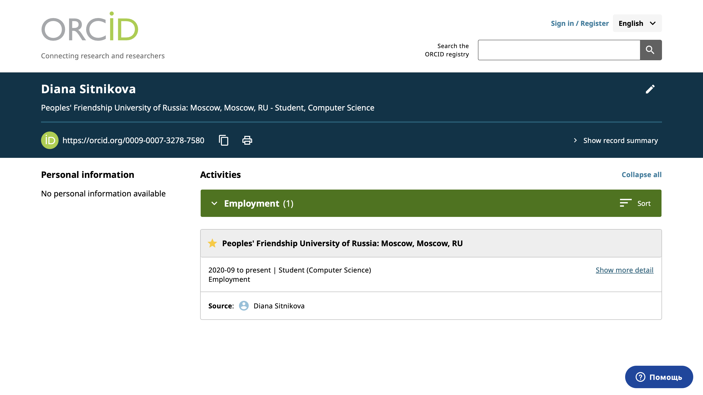

---
## Author
author:
  name: Ситникова Диана Александровна
  degrees: BSc
  email: 1032201746@rudn.ru
  affiliation:
    - name: Российский университет дружбы народов
      country: Российская Федерация
      postal-code: 117198
      city: Москва
      address: ул. Миклухо-Маклая, д. 6
## Title
title: "Индивидуальный проект. Этап 4"
subtitle: "Добавление ссылок на научные и библиометрические ресурсы"
institute:
  - "Российский университет дружбы народов им. П. Лумумбы"
  - "Преподаватель: д.ф.-м.н., профессор Кулябов Дмитрий Сергеевич"
license: CC BY
date: today
date-format: "YYYY-MM-DD"
header-includes:
  - \usepackage{tikz}
---

# Информация

## Докладчик

:::::::::::::: {.columns align=center}
::: {.column width="68%"}

- Ситникова Диана Александровна
- направление 09.03.03 «Прикладная информатика»
- Российский университет дружбы народов
- [1032201746@rudn.ru](mailto:1032201746@rudn.ru)

:::
::: {.column width="32%"}

{width=100%}

:::
::::::::::::::

# Вводная часть

## Актуальность

- Фамилия и имя не являются надёжным идентификатором исследователя.
- Омонимия, транслитерация и смена фамилии приводят к ошибочной атрибуции работ.
- Ошибки атрибуции искажают библиометрические показатели автора.
- Постоянный цифровой идентификатор устраняет неоднозначность на уровне инфраструктуры.

## Объект и предмет исследования

**Объект** --- внешние системы научной идентификации и библиометрического учёта.

**Предмет** --- различие между системами идентификации исследователя и индексами цитирования, а также представление ссылок на них в профиле персонального сайта.

## Научная новизна и практическая значимость

**Научная новизна** --- ресурсы из задания классифицированы по способу образования авторской страницы, что объясняет доступность одних и недоступность других.

**Практическая значимость** --- идентификатор ORCID, полученный до первой публикации, обеспечивает корректную атрибуцию всех последующих работ.

## Цель, гипотеза и задачи

**Цель** --- связать персональный сайт с внешними системами научной идентификации.

**Гипотеза** --- доступность авторской страницы определяется классом ресурса, а не действиями пользователя.

**Задачи:**

- зарегистрироваться в перечисленных ресурсах;
- установить причины недоступности авторских страниц;
- разместить ссылки в профиле владельца сайта;
- подготовить две записи блога.

## Материалы и методы

| Компонент | Значение |
|---|---|
| Системы идентификации | ORCID, ResearchGate, Academia.edu, GitHub |
| Индексы цитирования | eLIBRARY.RU, Google Scholar, arXiv |
| Профиль владельца | `data/authors/me.yaml`, раздел `links` |
| Наборы значков | Heroicons, Font Awesome Brands, Academicons |
| Генератор | Hugo `0.162.1+extended` |

# Содержание исследования

## Ресурсы делятся на два класса

\begin{center}
\resizebox{0.9\linewidth}{!}{%
\begin{tikzpicture}[font=\scriptsize, >=latex]
  \draw[very thick] (0,3.0) rectangle (5.4,5.2);
  \node[align=center] at (2.7,4.7) {\textbf{Системы идентификации}};
  \node[align=center] at (2.7,3.8) {ORCID · ResearchGate\\Academia.edu · GitHub};

  \draw[very thick] (0,0.0) rectangle (5.4,2.2);
  \node[align=center] at (2.7,1.7) {\textbf{Индексы цитирования}};
  \node[align=center] at (2.7,0.8) {eLIBRARY.RU\\Google Scholar · arXiv};

  \draw[thick] (8.2,3.4) rectangle (13.4,4.8);
  \node[align=center] at (10.8,4.1) {Профиль создаётся\\\textbf{регистрацией}};

  \draw[thick] (8.2,0.4) rectangle (13.4,1.8);
  \node[align=center] at (10.8,1.1) {Страница \textbf{порождается}\\из публикаций};

  \draw[->,thick] (5.45,4.1) -- (8.15,4.1);
  \draw[->,thick] (5.45,1.1) -- (8.15,1.1);

  \node[align=center,font=\scriptsize] at (10.8,2.6) {публикаций нет ---\\страницы нет};
\end{tikzpicture}%
}
\end{center}

Класс ресурса определяет, возможна ли авторская страница в принципе.

## Идентификатор устраняет омонимию

| Ресурс | Состояние | Причина |
|---|---|---|
| ORCID, ResearchGate, Academia.edu, GitHub | подключены | профиль создаётся регистрацией |
| eLIBRARY.RU | нет | страница выдаётся Science Index при наличии работ |
| Google Scholar | нет | мастер требует подтвердить авторство публикации |
| arXiv | нет | страница образуется после размещения препринта |
| Mendeley | нет | профили удалены Elsevier в декабре 2020 года |

Поиск в Google Scholar по имени выдал семь работ однофамилицы по медицине --- прямая иллюстрация задачи, решаемой ORCID.

## Идентификатор не зависит от имени и организации

:::::::::::::: {.columns align=center}
::: {.column width="42%"}

Шестнадцатизначный номер сохраняется при смене фамилии, вуза и почты.

Издательства используют его для привязки публикаций к автору.

:::
::: {.column width="58%"}

{width=100%}

:::
::::::::::::::

## Ссылка описывается тремя полями

:::::::::::::: {.columns align=center}
::: {.column width="42%"}

Запись состоит из значка, адреса и подписи.

Префикс имени значка указывает набор: `hero`, `brands` или `academicons`.

Вёрстка ряда данными не задаётся.

:::
::: {.column width="58%"}

{width=100%}

:::
::::::::::::::

## Тема собрала ряд значков из списка

:::::::::::::: {.columns align=center}
::: {.column width="42%"}

Шесть ссылок выведены под карточкой владельца.

Порядок значков соответствует порядку записей в файле профиля.

:::
::: {.column width="58%"}

{width=100%}

:::
::::::::::::::

# Результаты

## Все пункты задания выполнены

- Зарегистрированы учётные записи в шести научных ресурсах.
- Четыре ссылки размещены в профиле и выведены на главной странице.
- Установлены и документированы причины недоступности остальных.
- Подготовлена запись по прошедшей неделе.
- Подготовлена запись о работе с библиографией.

## Анализ результатов и их применимость

- Классификация объясняет доступность ресурсов без обращения к частным случаям.
- Перечень из методических указаний содержит устаревший элемент --- Mendeley.
- Три недоступных ресурса подключатся автоматически с первой публикацией.

Полученный идентификатор ORCID применяется при всех последующих публикациях.

## Идентификатор заводят до первой публикации, а не после

Индексы цитирования показывают то, что уже написано, и до первой работы автора для них не существует.

Идентификатор устроен иначе: он описывает человека, а не его результаты, и заведённый заранее избавляет от последующего разбора, чья работа чья.
