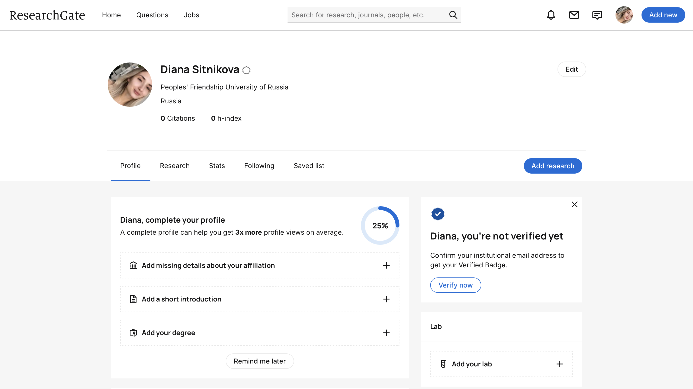
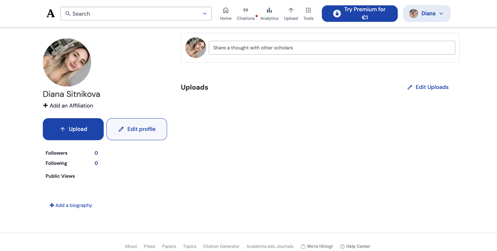
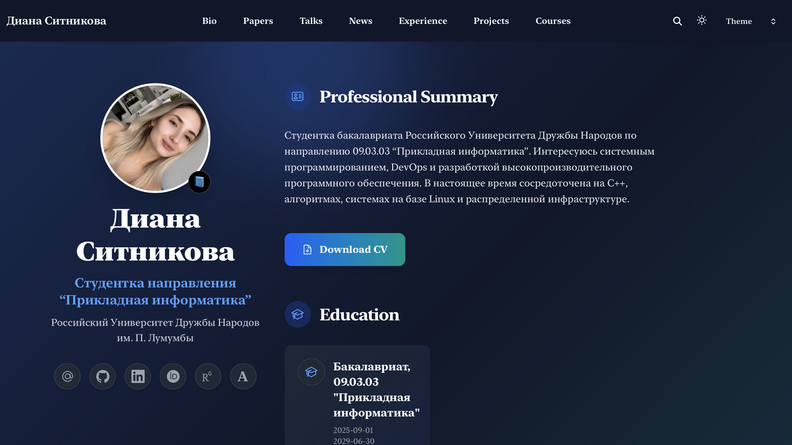
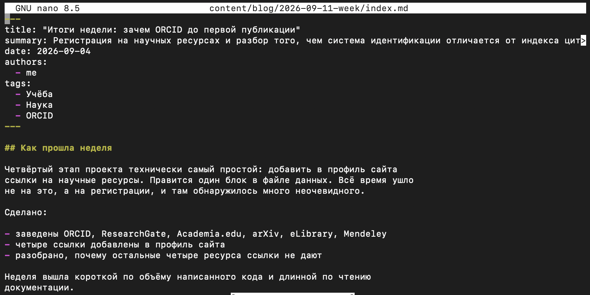
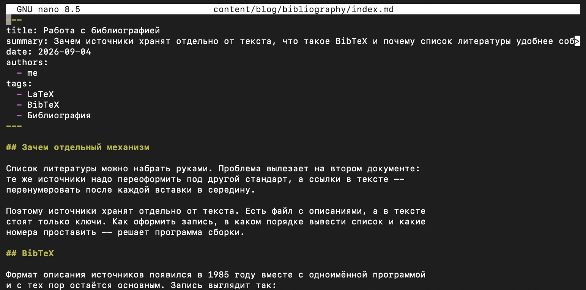
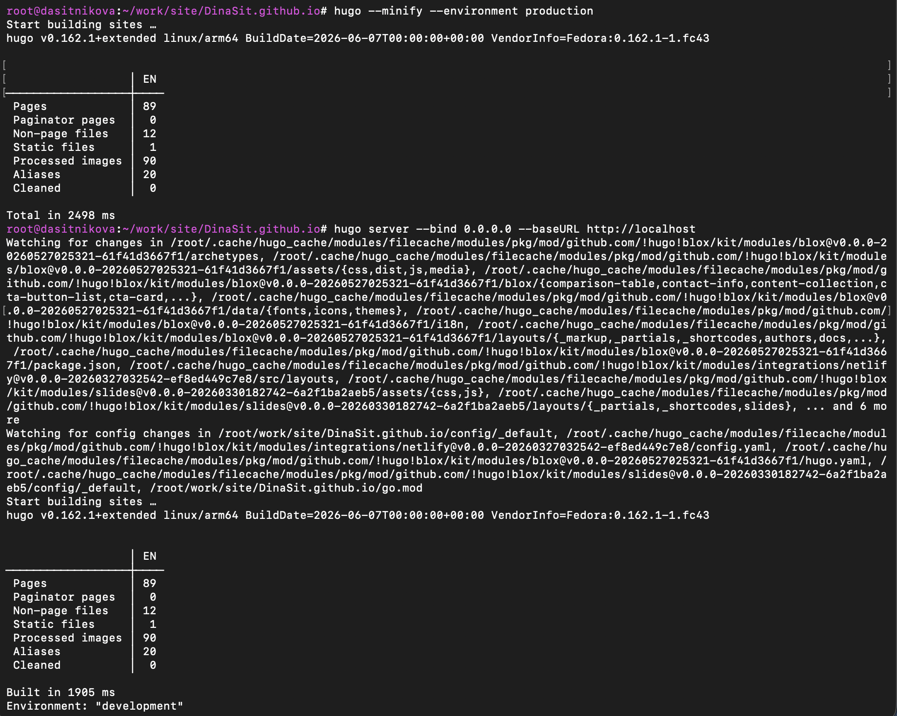
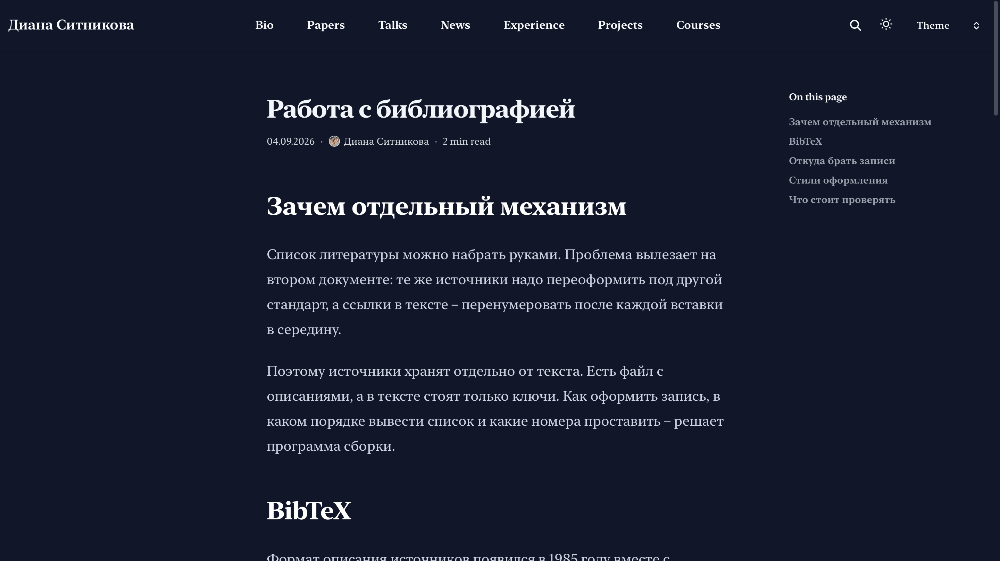
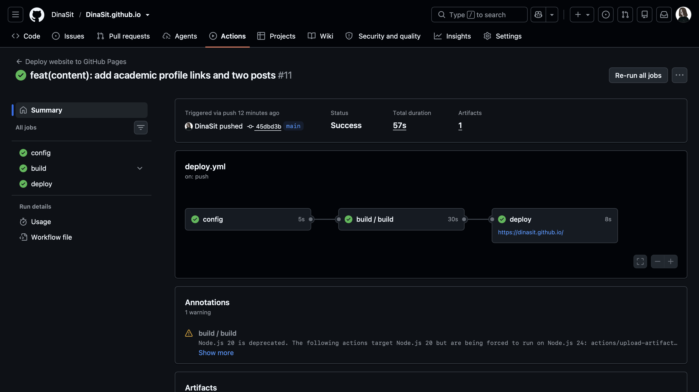

---
## Author
author:
  name: Ситникова Диана Александровна
  degrees: BSc
  email: 1032201746@rudn.ru
  affiliation:
    - name: Российский университет дружбы народов
      country: Российская Федерация
      postal-code: 117198
      city: Москва
      address: ул. Миклухо-Маклая, д. 6

## Title
title: "Отчёт по индивидуальному проекту. Этап 4"
subtitle: "Добавление ссылок на научные и библиометрические ресурсы"
license: "CC BY"
bibliography: bib/cite.bib
---

# Цель работы

Обеспечить связь персонального сайта научного работника с внешними системами научной идентификации и библиометрического учёта, а также подготовить очередные записи блога.

# Задание

В соответствии с методическими указаниями необходимо выполнить следующую последовательность действий [@rudn_project_stages].

1. Добавить на сайт ссылки на научные и библиометрические ресурсы: eLibrary, Google Scholar, ORCID, Mendeley, ResearchGate, Academia.edu, arXiv, GitHub.
2. Сделать пост по прошедшей неделе.
3. Добавить пост на тему по выбору: «Оформление отчёта», «Создание презентаций» либо «Работа с библиографией».

# Краткие теоретические сведения

## Проблема идентификации автора

Фамилия и имя не являются надёжным идентификатором исследователя. Причины этого носят системный характер: распространённые фамилии порождают омонимию, транслитерация кириллицы допускает несколько вариантов написания, фамилия может измениться, а смена организации разрывает связь между работами одного автора.

Следствием является ошибочная атрибуция публикаций и, как результат, искажение библиометрических показателей. Задача устранения этой неоднозначности решается введением постоянного цифрового идентификатора, не зависящего от написания имени и места работы [@haak_article_orcid_en].

## Два класса ресурсов

Перечисленные в задании ресурсы неоднородны. Они разделяются на два класса, различающихся тем, как в них возникает страница автора (@tbl-classes).

| Класс | Как возникает страница | Ресурсы |
|---|---|---|
| Системы идентификации | создаётся при регистрации | ORCID, ResearchGate, Academia.edu, GitHub |
| Индексы цитирования | порождается из проиндексированных работ | eLibrary, Google Scholar, arXiv |

: Классификация ресурсов по способу образования профиля {#tbl-classes}

**Системы идентификации** отвечают на вопрос о том, кто является автором. Профиль в них представляет собой запись о человеке и существует независимо от наличия публикаций. Центральное место среди них занимает ORCID --- некоммерческий реестр, присваивающий исследователю шестнадцатизначный идентификатор вида `0000-0000-0000-0000` [@orcid_org]. Идентификатор сохраняется при смене фамилии, организации и адреса электронной почты, а издательства и агрегаторы используют его для однозначной привязки работ к автору.

ResearchGate и Academia.edu представляют собой научные социальные сети: профиль создаётся регистрацией и служит страницей присутствия, а публикации размещаются автором самостоятельно.

**Индексы цитирования** отвечают на вопрос о том, что автором написано. Авторская страница в них не создаётся пользователем, а порождается системой: сведения о публикациях поступают от издателей или из репозиториев, группируются по автору и образуют профиль. Российский индекс научного цитирования на платформе eLIBRARY.RU предоставляет авторскую страницу через сервис Science Index, доступный при наличии проиндексированных работ [@elibrary_science_index]. Google Scholar формирует профиль из статей, найденных поисковым роботом, и при создании профиля требует подтвердить авторство хотя бы одной работы [@google_scholar_citations]. Архив препринтов arXiv образует авторскую страницу вида `arxiv.org/a/<идентификатор>` из размещённых автором препринтов [@arxiv_author_id].

Практическое следствие классификации состоит в том, что для исследователя, не имеющего публикаций, доступен только первый класс. Отсутствие страницы в индексе цитирования отражает состояние библиометрической базы, а не результат действий пользователя.

## Изменение состава ресурсов

Перечень ресурсов не является неизменным. Система Mendeley, включённая в задание, с ноября 2020 года прекратила поддержку профилей: компания Elsevier объявила о сосредоточении на управлении библиографическими ссылками и удалении социальных функций --- страниц авторов вида `mendeley.com/profiles/<имя>`, поиска по людям, ленты и публичных групп [@mendeley_refocus]. В настоящее время Mendeley представляет собой менеджер библиографических ссылок и авторских страниц не имеет.

## Представление ссылок в профиле сайта

Ссылки на внешние ресурсы описываются в разделе `links` файла профиля владельца `data/authors/me.yaml` [@hugoblox_academic_cv]. Раздел представляет собой список записей, каждая из которых содержит три поля (@tbl-link-fields).

| Поле | Назначение |
|---|---|
| `icon` | значок из подключённого набора |
| `url` | адрес ресурса |
| `label` | подпись, отображаемая при наведении |

: Поля записи о внешней ссылке {#tbl-link-fields}

Тема оформления выводит эти записи рядом значков в карточке владельца на главной странице; вёрстка ряда данными не задаётся.

Значки берутся из трёх наборов, различаемых префиксом имени (@tbl-icon-sets).

| Префикс | Набор | Назначение |
|---|---|---|
| `hero/` | Heroicons | универсальные интерфейсные значки |
| `brands/` | Font Awesome Brands | значки известных сервисов |
| `academicons/` | Academicons | значки научных ресурсов |

: Наборы значков, подключённые в шаблоне {#tbl-icon-sets}

Набор Academicons создан специально для академических сервисов и содержит значки ORCID, ResearchGate, Google Scholar, arXiv и других ресурсов [@academicons]. Имя значка указывается вместе с префиксом набора, например `academicons/orcid`.

# Выполнение работы

## 1. Регистрация в системах идентификации {.unnumbered}

Зарегистрированы учётные записи в ORCID, ResearchGate и Academia.edu. Учётная запись в GitHub существовала ранее и была добавлена в профиль на втором этапе проекта.

В реестре ORCID получен идентификатор `0009-0007-3278-7580`; в записи указана организация --- Российский университет дружбы народов, и статус --- студент направления Computer Science (@fig-orcid).

{#fig-orcid width=100%}

Профиль ResearchGate содержит имя, организацию и страну; библиометрические показатели --- число цитирований и индекс Хирша --- имеют нулевые значения, что соответствует отсутствию публикаций (@fig-rg).

{#fig-rg width=100%}

Профиль Academia.edu создан без привязки к организации, чему соответствует адрес в поддомене `independent` (@fig-academia).

{#fig-academia width=100%}

## 2. Ресурсы, не предоставившие авторской страницы {.unnumbered}

Для четырёх ресурсов из перечня авторская страница получена не была. Причины установлены и приведены в таблице (@tbl-result).

| Ресурс | Класс | Состояние | Причина |
|---|---|---|---|
| ORCID | идентификация | подключён | --- |
| ResearchGate | идентификация | подключён | --- |
| Academia.edu | идентификация | подключён | --- |
| GitHub | идентификация | подключён | --- |
| eLibrary | индекс | не подключён | страница выдаётся сервисом Science Index при наличии проиндексированных работ |
| Google Scholar | индекс | не подключён | мастер создания профиля требует подтвердить авторство публикации |
| arXiv | индекс | не подключён | учётная запись создана, страница образуется после размещения препринта |
| Mendeley | --- | не подключён | профили удалены Elsevier в декабре 2020 года |

: Состояние подключения ресурсов {#tbl-result}

Отдельно отмечен случай Google Scholar. При поиске работ по имени система предложила группу из семи публикаций 2011 и 2013 годов в области медицины, принадлежащих однофамилице. Отнесение этих работ к профилю привело бы к ошибочной атрибуции, поэтому создание профиля не завершено. Ситуация служит непосредственной иллюстрацией задачи, для решения которой предназначен ORCID: совпадение имён не позволяет различить авторов, тогда как цифровой идентификатор делает это однозначно.

Учётная запись в Mendeley создана и используется как менеджер библиографических ссылок; ссылка на неё в профиле не размещена ввиду отсутствия у сервиса авторских страниц.

## 3. Добавление ссылок в профиль {.unnumbered}

Раздел `links` файла профиля дополнен записями о трёх новых ресурсах (@fig-links).

~~~bash
cd ~/work/site/DinaSit.github.io
nano data/authors/me.yaml
~~~

~~~yaml
links:
  - icon: at-symbol
    url: mailto:1032201746@rudn.ru
    label: Связаться со мной
  - icon: brands/github
    url: https://github.com/DinaSit
    label: GitHub
  - icon: brands/linkedin
    url: https://www.linkedin.com/in/dinasit/
    label: LinkedIn
  - icon: academicons/orcid
    url: https://orcid.org/0009-0007-3278-7580
    label: ORCID
  - icon: academicons/researchgate
    url: https://www.researchgate.net/profile/Diana-Sitnikova
    label: ResearchGate
  - icon: academicons/academia
    url: https://independent.academia.edu/DianaSitnikova
    label: Academia.edu
~~~

{#fig-links width=100%}

Из адреса профиля ResearchGate удалён параметр `ev`, передающий сведения об источнике перехода: он не влияет на адресацию и для внешней ссылки избыточен.

Тема оформления вывела записи рядом значков под карточкой владельца на главной странице (@fig-main).

{#fig-main width=100%}

## 4. Запись по прошедшей неделе {.unnumbered}

Запись оформлена страничным пакетом (@fig-week-src).

~~~bash
mkdir -p content/blog/2026-09-11-week
nano content/blog/2026-09-11-week/index.md
~~~

~~~yaml
title: "Итоги недели: зачем ORCID до первой публикации"
summary: Регистрация на научных ресурсах и разбор того, чем система идентификации отличается от индекса цитирования.
date: 2026-09-04
authors:
  - me
tags:
  - Учёба
  - Наука
  - ORCID
~~~

{#fig-week-src width=100%}

Содержание записи построено по рекомендованной структуре [@kulyabov_weekly_post] и включает описание выполненного за неделю, изложение основных наблюдений и планы на следующую неделю. В качестве основного наблюдения приведено различие двух классов ресурсов и случай с однофамилицей в Google Scholar.

## 5. Запись на тему по выбору {.unnumbered}

Из предложенного списка выбрана тема «Работа с библиографией»: она непосредственно связана с содержанием этапа, поскольку идентификаторы автора и публикации образуют единый механизм атрибуции научных результатов (@fig-bib-src).

~~~bash
mkdir -p content/blog/bibliography
nano content/blog/bibliography/index.md
~~~

~~~yaml
title: Работа с библиографией
summary: Зачем источники хранят отдельно от текста, что такое BibTeX и почему список литературы удобнее собирать программой.
date: 2026-09-04
authors:
  - me
tags:
  - LaTeX
  - BibTeX
  - Библиография
~~~

{#fig-bib-src width=100%}

Запись состоит из пяти разделов: обоснование отделения списка источников от текста документа, описание формата BibTeX [@patashnik_bibtexing_en], способы получения библиографических записей через DOI и экспорт с научных ресурсов, стили оформления --- ГОСТ Р 7.0.5--2008 [@gost_7_0_5_2008] и зарубежные --- и рекомендации по проверке результата сборки.

## 6. Сборка и публикация {.unnumbered}

Изменения проверены сборкой в производственном режиме и просмотром результата встроенным веб-сервером (@fig-build).

~~~bash
hugo --minify --environment production
hugo server --bind 0.0.0.0 --baseURL http://localhost
~~~

{#fig-build width=100%}

Обе записи отображаются корректно. Дата выводится в формате `ДД.ММ.ГГГГ`, заданном параметром `date_format` в файле оформления; оглавление страницы построено темой по заголовкам второго уровня (@fig-bib-page).

{#fig-bib-page width=100%}

Изменения зафиксированы в репозитории и отправлены на хостинг [@chacon_book_pro-git_en].

~~~bash
git add -u && git add content data
git commit -m "feat(content): add academic profile links and two posts"
git push
~~~

Отправка запустила рабочий процесс публикации: задания чтения конфигурации, сборки и развёртывания завершились успешно, обновлённый сайт стал доступен по прежнему адресу [@github_actions_docs] (@fig-deploy).

{#fig-deploy width=100%}

# Выводы

В ходе выполнения четвёртого этапа индивидуального проекта персональный сайт связан с внешними системами научной идентификации.

Зарегистрированы учётные записи в ORCID, ResearchGate, Academia.edu, arXiv, eLIBRARY.RU и Mendeley. Ссылки на четыре ресурса --- ORCID, ResearchGate, Academia.edu и GitHub --- размещены в профиле владельца сайта и выведены темой оформления на главной странице. Подготовлены две записи блога: отчёт о прошедшей неделе и материал о работе с библиографией.

Основной результат этапа носит не технический, а классификационный характер. Перечисленные в задании ресурсы принадлежат двум различным классам. Системы идентификации --- ORCID, ResearchGate, Academia.edu, GitHub --- создают профиль при регистрации, поскольку описывают человека. Индексы цитирования --- eLIBRARY.RU, Google Scholar, arXiv --- порождают авторскую страницу из проиндексированных публикаций и при их отсутствии страницы не образуют. Для исследователя, не имеющего публикаций, доступен только первый класс, и это следует из устройства систем, а не из полноты выполнения задания.

Отдельно установлено, что перечень ресурсов, приведённый в методических указаниях, содержит устаревший элемент: авторские страницы Mendeley удалены компанией Elsevier в декабре 2020 года, то есть ранее даты составления указаний.

Практическая ценность идентификатора ORCID подтверждена частным случаем: поиск по имени в Google Scholar обнаружил семь публикаций однофамилицы в области медицины. Совпадение имён не позволяет различить авторов, тогда как цифровой идентификатор устраняет неоднозначность независимо от написания фамилии и места работы. Регистрация идентификатора до появления первой публикации обеспечивает корректную атрибуцию всех последующих работ.

Сайт готов к размещению сведений о персональных проектах, что составляет содержание следующего этапа.

# Список литературы {.unnumbered}

::: {#refs}
:::
