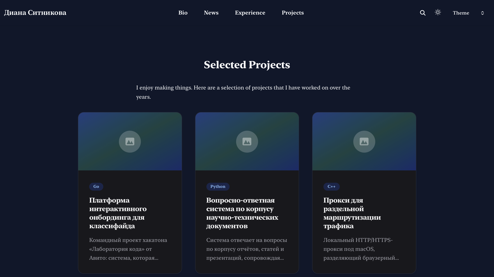

---
## Author
author:
  name: Ситникова Диана Александровна
  degrees: BSc
  email: 1032201746@rudn.ru
  affiliation:
    - name: Российский университет дружбы народов
      country: Российская Федерация
      postal-code: 117198
      city: Москва
      address: ул. Миклухо-Маклая, д. 6
## Title
title: "Индивидуальный проект. Этап 5"
subtitle: "Размещение сведений о персональных проектах"
institute:
  - "Российский университет дружбы народов им. П. Лумумбы"
  - "Преподаватель: д.ф.-м.н., профессор Кулябов Дмитрий Сергеевич"
license: CC BY
date: today
date-format: "YYYY-MM-DD"
header-includes:
  - \usepackage{tikz}
---

# Информация

## Докладчик

:::::::::::::: {.columns align=center}
::: {.column width="68%"}

- Ситникова Диана Александровна
- направление 09.03.03 «Прикладная информатика»
- Российский университет дружбы народов
- [1032201746@rudn.ru](mailto:1032201746@rudn.ru)

:::
::: {.column width="32%"}

{width=100%}

:::
::::::::::::::

# Вводная часть

## Актуальность

- Сайт научного работника представляет не только его самого, но и его работы.
- Описание проекта нужно в двух видах: кратко для списка и подробно для страницы.
- Шаблоны поставляются с примерами, описывающими вымышленного владельца.
- Демонстрационное содержимое, оставленное без замены, искажает представление о владельце.

## Объект и предмет исследования

**Объект** --- персональный сайт научного работника на генераторе Hugo.

**Предмет** --- организация содержимого по коллекциям, устройство записи о проекте, связь состава разделов с навигационным меню и порядок замещения демонстрационных материалов.

## Научная новизна и практическая значимость

**Научная новизна** --- установлено свойство демонстрационного содержимого: правдоподобная заглушка не обнаруживает себя и потому сохраняется дольше пустого раздела.

**Практическая значимость** --- отсюда следует порядок работы с шаблонами: примеры удаляются при развёртывании, а не по мере наполнения.

## Цель, гипотеза и задачи

**Цель** --- разместить сведения о выполненных проектах и привести содержимое сайта в соответствие с фактическим наполнением.

**Гипотеза** --- состав разделов сайта задаётся структурой каталогов, тогда как навигация описывается независимо и требует отдельного согласования.

**Задачи:**

- удалить демонстрационные материалы шаблона;
- создать записи о персональных проектах;
- привести навигационное меню в соответствие составу разделов;
- подготовить две записи блога.

## Материалы и методы

| Компонент | Значение |
|---|---|
| Генератор | Hugo `0.162.1+extended` |
| Коллекции содержимого | `content/projects`, `content/blog` |
| Формат записи | страничный пакет, метаданные YAML |
| Навигация | `config/_default/menus.yaml` |
| Публикация | GitHub Pages через GitHub Actions |

# Содержание исследования

## Каталог задаёт раздел, файл --- запись

\begin{center}
\resizebox{0.92\linewidth}{!}{%
\begin{tikzpicture}[font=\scriptsize, >=latex]
  \draw[very thick] (0,1.2) rectangle (4.2,4.4);
  \node[align=center] at (2.1,4.0) {\textbf{\texttt{content/projects/}}};
  \node[align=left] at (2.1,2.6) {\texttt{\_index.md}\\\texttt{avito-guide/index.md}\\\texttt{graphrag-mining/index.md}\\\texttt{cpp-core-library/index.md}\\\texttt{\dots}};

  \draw[thick] (6.6,3.2) rectangle (11.4,4.4);
  \node[align=center] at (9.0,3.8) {Страница раздела\\«Projects»};

  \draw[thick] (6.6,1.2) rectangle (11.4,2.6);
  \node[align=center] at (9.0,1.9) {Страницы записей\\по одной на проект};

  \draw[->,thick] (4.25,3.8) -- (6.55,3.8);
  \draw[->,thick] (4.25,2.2) -- (6.55,1.9);

  \draw[thick,dashed] (6.6,-0.4) rectangle (11.4,0.6);
  \node[align=center] at (9.0,0.1) {\texttt{menus.yaml} --- описывается отдельно};
  \draw[->,thick,dashed] (9.0,1.15) -- (9.0,0.65);
\end{tikzpicture}%
}
\end{center}

Удаление каталога убирает страницу, но не убирает пункт меню, ведущий на неё.

## Запись делится маркером на две части

| Часть | Где выводится |
|---|---|
| текст до `<!--more-->` | карточка в списке раздела |
| текст после маркера | страница записи |

Метаданные задают название, дату, внешние ссылки и ключевые слова; порядок записей определяет поле `date`.

## Запись описана метаданными и текстом

:::::::::::::: {.columns align=center}
::: {.column width="42%"}

Ссылка на репозиторий задаётся парой «тип --- адрес».

Даты соответствуют последним изменениям в репозиториях, поэтому порядок вывода отражает давность работы.

:::
::: {.column width="58%"}

{width=100%}

:::
::::::::::::::

## Тема собрала раздел из шести записей

:::::::::::::: {.columns align=center}
::: {.column width="42%"}

Карточка содержит ключевое слово, название и краткое описание.

Вёрстка списка данными не задаётся: порядок и вид карточек определяет тема.

:::
::: {.column width="58%"}

{width=100%}

:::
::::::::::::::

## Страница записи содержит полное описание

:::::::::::::: {.columns align=center}
::: {.column width="42%"}

Для командного проекта в тексте разграничен вклад автора.

Ссылка на репозиторий выведена отдельным элементом под заголовком.

:::
::: {.column width="58%"}

{width=100%}

:::
::::::::::::::

# Результаты

## Все пункты задания выполнены

- Создано шесть записей о персональных проектах.
- Удалены демонстрационные материалы из четырёх коллекций.
- Навигационное меню сокращено с семи пунктов до четырёх.
- Описание сайта на главной странице заменено собственным.
- Подготовлены записи по прошедшей неделе и о языках научного программирования.

## Анализ результатов и их применимость

- Число страниц возросло с 89 до 128 за счёт записей и страниц ключевых слов.
- Состав разделов определяется каталогами, навигация --- отдельным файлом.
- Сайт не содержит сведений, не относящихся к владельцу.

Наполненные разделы служат основой для перевода на второй язык.

## Правдоподобная заглушка незаметнее пустого раздела

Пустой раздел обнаруживает себя сам: его видно, и он вызывает действие.

Раздел, занятый связным примерным текстом, внешне неотличим от заполненного --- и сохраняется тем дольше, чем правдоподобнее написан. Поэтому демонстрационные материалы удаляют при развёртывании шаблона, а не по мере наполнения.
