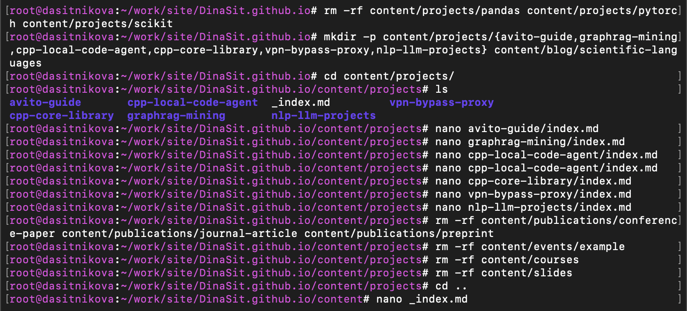
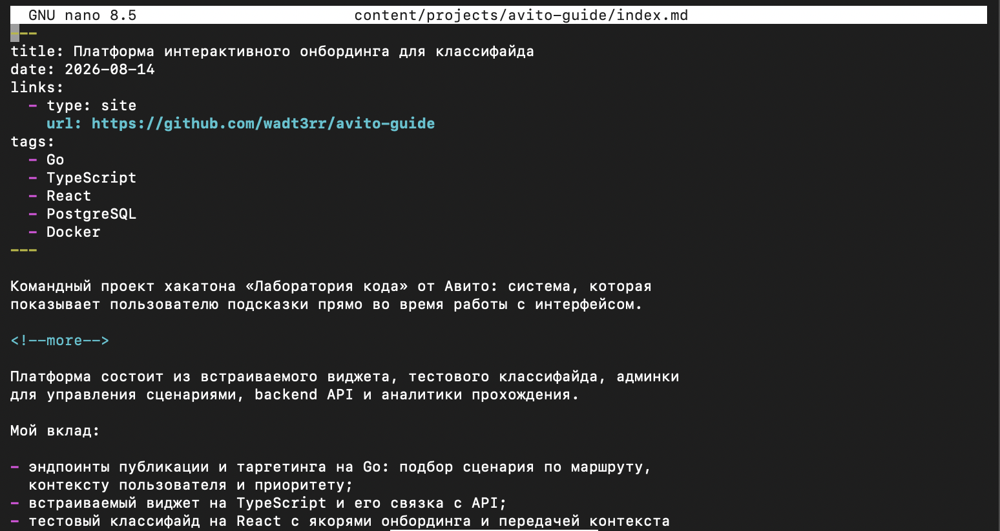
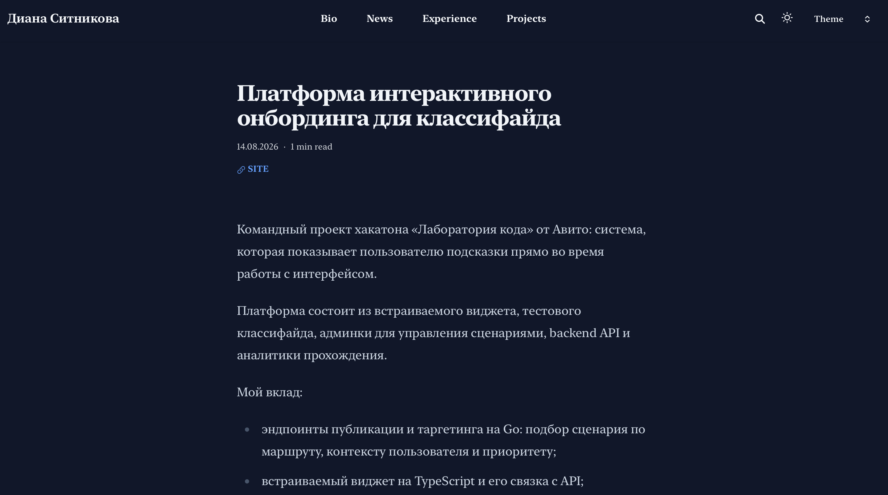
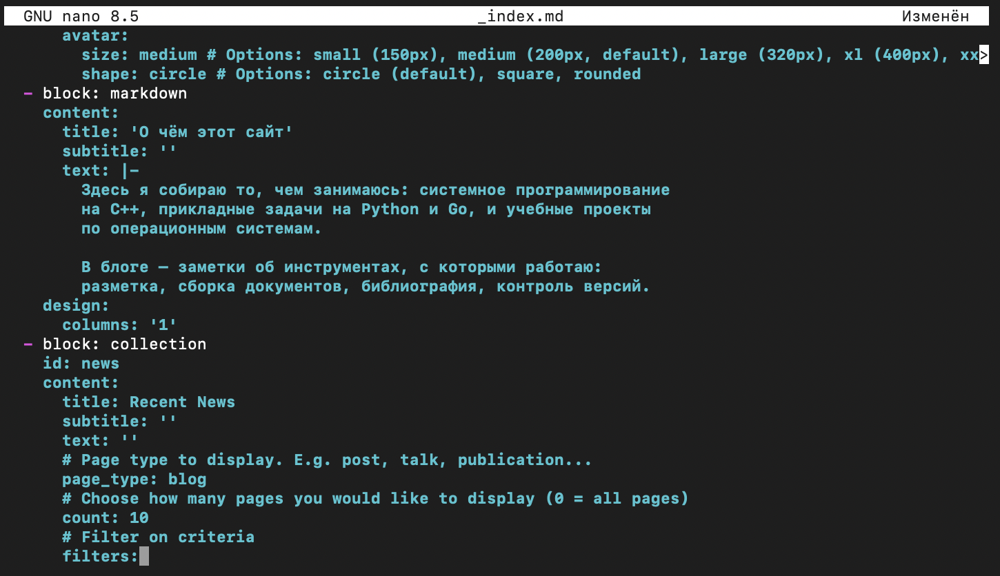
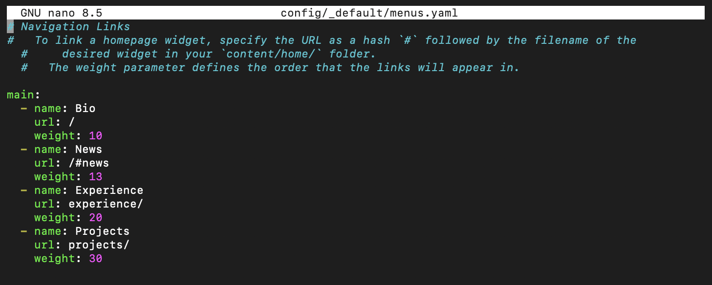
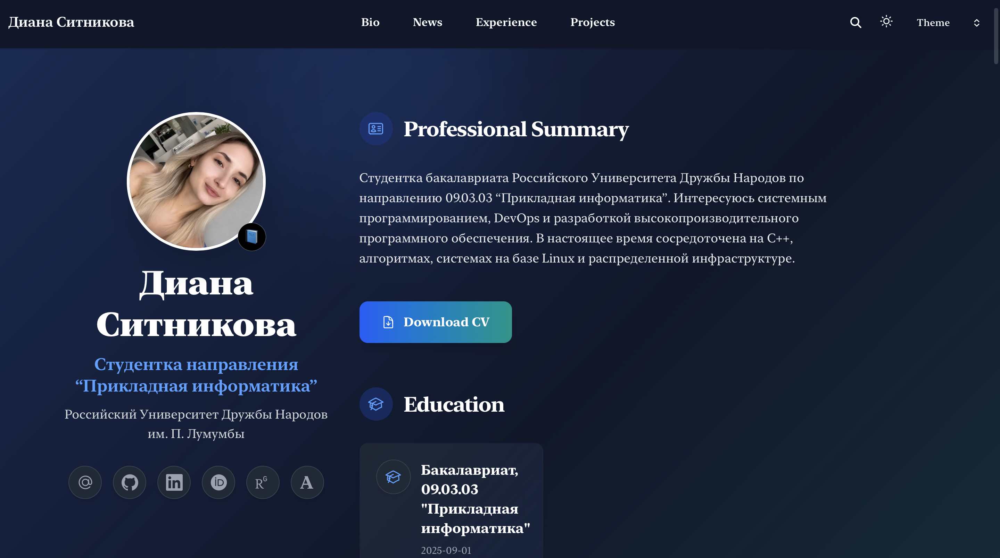
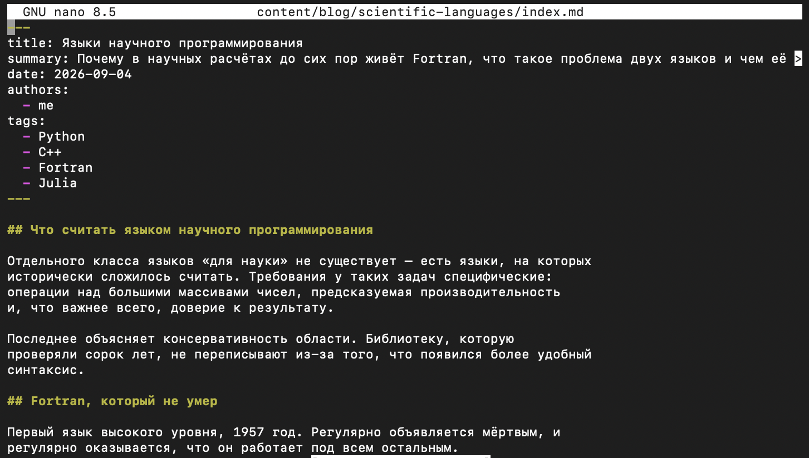
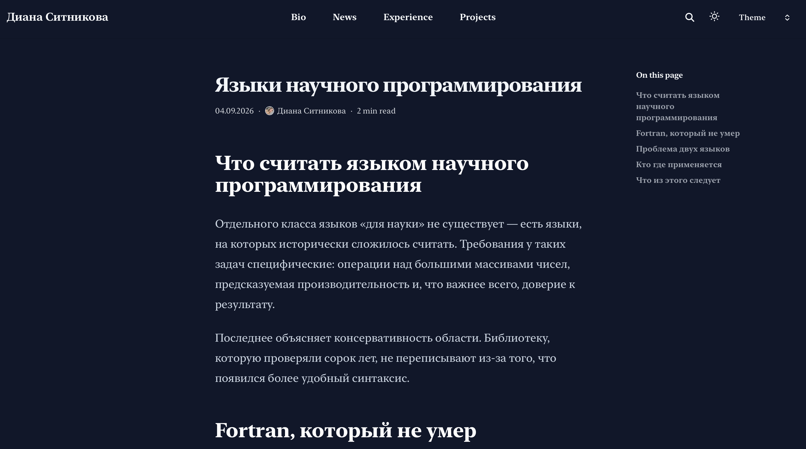
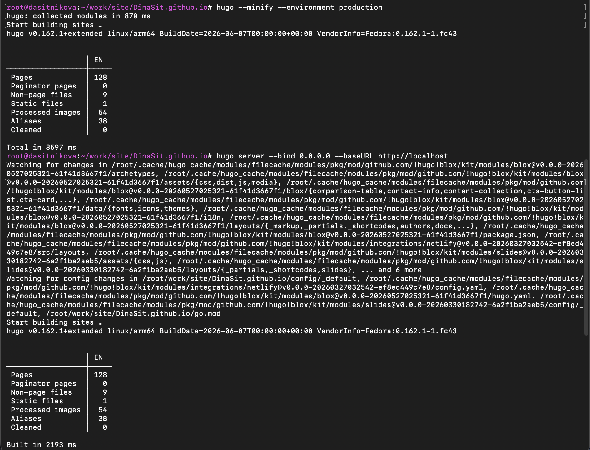
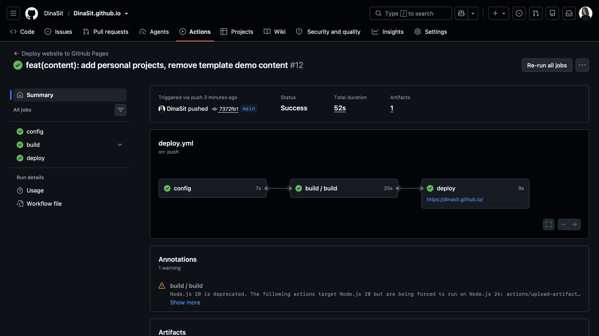

---
## Author
author:
  name: Ситникова Диана Александровна
  degrees: BSc
  email: 1032201746@rudn.ru
  affiliation:
    - name: Российский университет дружбы народов
      country: Российская Федерация
      postal-code: 117198
      city: Москва
      address: ул. Миклухо-Маклая, д. 6

## Title
title: "Отчёт по индивидуальному проекту. Этап 5"
subtitle: "Размещение сведений о персональных проектах"
license: "CC BY"
bibliography: bib/cite.bib
---

# Цель работы

Разместить на персональном сайте научного работника сведения о выполненных проектах и привести состав содержимого в соответствие с фактическим наполнением, устранив демонстрационные материалы шаблона.

# Задание

В соответствии с методическими указаниями необходимо выполнить следующую последовательность действий [@rudn_project_stages].

1. Добавить на сайт все остальные элементы: сделать записи для персональных проектов.
2. Сделать пост по прошедшей неделе.
3. Добавить пост на тему по выбору: «Языки научного программирования».

# Краткие теоретические сведения

## Разделы содержимого как коллекции

Каталог `content` разделён на подкаталоги, каждый из которых образует коллекцию однотипных страниц. Файл `_index.md` в подкаталоге описывает страницу самого раздела: заголовок, вводный текст и способ вывода списка. Вложенные каталоги дают отдельные записи коллекции [@hugo_content_org].

Такая организация означает, что состав разделов сайта задаётся структурой каталогов, а не настройками. Удаление подкаталога с записью убирает соответствующую страницу; удаление каталога раздела убирает раздел целиком.

Шаблон Academic CV предоставляет шесть коллекций, из которых на настоящем этапе используются две (@tbl-sections).

| Коллекция | Назначение | Состояние после этапа |
|---|---|---|
| `blog` | записи блога | заполнена собственными материалами |
| `projects` | описания проектов | заполнена собственными материалами |
| `publications` | научные публикации | демонстрационные записи удалены |
| `events` | доклады и выступления | демонстрационные записи удалены |
| `courses` | учебные материалы | раздел удалён |
| `slides` | презентации | раздел удалён |

: Состав коллекций содержимого {#tbl-sections}

## Страничный пакет записи о проекте

Запись о проекте оформляется страничным пакетом: каталог, содержащий файл `index.md` и относящиеся к записи вложения --- изображения, документы, данные [@hugo_page_bundles]. Вложения перемещаются вместе с каталогом, поэтому запись остаётся самодостаточной единицей содержимого.

Метаданные записи описываются в блоке YAML в начале файла (@tbl-frontmatter).

| Поле | Назначение |
|---|---|
| `title` | название проекта |
| `date` | дата, определяющая порядок вывода записей |
| `links` | внешние ссылки: тип и адрес |
| `tags` | ключевые слова, образующие страницы группировки |

: Поля метаданных записи о проекте {#tbl-frontmatter}

Поле `links` представляет собой список записей вида «тип --- адрес»; тип определяет подпись и значок ссылки, выводимые темой оформления.

## Разделение краткого и полного описания

Текст записи разделяется маркером `<!--more-->`. Фрагмент до маркера образует краткое описание, выводимое в карточке списка; текст ниже отображается только на странице записи [@hugo_summaries].

Механизм позволяет описать проект дважды с разной степенью подробности, не дублируя содержимое: одно предложение для обзорного просмотра и развёрнутое изложение для читателя, открывшего запись.

## Навигационное меню и состав разделов

Пункты верхнего меню описываются в файле `config/_default/menus.yaml` списком записей, каждая из которых содержит название, адрес и числовой вес, задающий порядок вывода [@hugo_menus].

Меню не выводится из состава каталогов автоматически: удаление раздела содержимого не удаляет пункт меню, ведущий на него. Соответствие между составом разделов и составом меню поддерживается вручную, иначе в навигации остаются ссылки на несуществующие страницы.

## Демонстрационное содержимое шаблонов

Шаблоны сайтов поставляются с примерами наполнения. Их назначение --- показать возможности оформления до того, как автор внесёт собственные материалы: примеры демонстрируют доступные типы страниц и служат образцом структуры метаданных.

Однако такие материалы описывают вымышленного владельца сайта. До замены собственными данными они образуют содержимое, не соответствующее действительности, и подлежат удалению при развёртывании либо по мере наполнения разделов.

# Выполнение работы

Работа велась в каталоге сайта `~/work/site/DinaSit.github.io`.

## 1. Удаление демонстрационных материалов {.unnumbered}

Из коллекции проектов удалены три записи, поставляемые с шаблоном; на их месте созданы каталоги для собственных записей (@fig-cleanup).

~~~bash
cd ~/work/site/DinaSit.github.io
rm -rf content/projects/pandas content/projects/pytorch content/projects/scikit
mkdir -p content/projects/{avito-guide,graphrag-mining,cpp-local-code-agent,cpp-core-library,vpn-bypass-proxy,nlp-llm-projects} content/blog/scientific-languages
~~~

Далее удалены демонстрационные записи из остальных коллекций: три публикации, доклад на конференции, учебный курс и презентация.

~~~bash
rm -rf content/publications/conference-paper content/publications/journal-article content/publications/preprint
rm -rf content/events/example
rm -rf content/courses
rm -rf content/slides
~~~

{#fig-cleanup width=100%}

Разделы `publications` и `events` сохранены: их файлы `_index.md` оставлены, поскольку разделы будут заполнены при появлении публикаций и докладов. Разделы `courses` и `slides` удалены целиком как не предусмотренные содержанием проекта.

## 2. Записи о персональных проектах {.unnumbered}

Создано шесть записей, каждая в отдельном страничном пакете (@tbl-projects).

| Запись | Технологии | Происхождение |
|---|---|---|
| Платформа интерактивного онбординга | Go, TypeScript, React, PostgreSQL | хакатон «Лаборатория кода», Авито |
| Вопросно-ответная система по корпусу документов | Python, FastAPI, Neo4j, pgvector | хакатон «Норникель: AI Science Hack» |
| Локальный агент генерации кода | C++, llama.cpp | самостоятельная разработка |
| Реализация базовых компонентов C++ | C++, STL | учебный проект |
| Прокси для раздельной маршрутизации трафика | C++, macOS | самостоятельная разработка |
| NLP-проекты | Python, Transformers | учебные эксперименты |

: Состав записей о персональных проектах {#tbl-projects}

Структура записи показана на примере первой из них (@fig-project-src).

~~~yaml
title: Платформа интерактивного онбординга для классифайда
date: 2026-08-14
links:
  - type: site
    url: https://github.com/wadt3rr/avito-guide
tags:
  - Go
  - TypeScript
  - React
  - PostgreSQL
  - Docker
~~~

{#fig-project-src width=100%}

Даты записей соответствуют датам последних изменений в репозиториях проектов, вследствие чего тема выводит записи в порядке убывания давности работы.

Для командного проекта в тексте записи разграничен вклад автора: перечислены компоненты, разработанные лично, --- эндпоинты публикации и таргетинга, встраиваемый виджет, тестовый сайт и конфигурация развёртывания.

Тема оформления собрала из записей раздел «Projects», выводя карточки с ключевым словом, названием и кратким описанием до маркера `<!--more-->` (@fig-projects).

{#fig-projects width=100%}

Страница отдельной записи содержит полный текст, дату и ссылку на репозиторий (@fig-project-page).

{#fig-project-page width=100%}

## 3. Описание сайта на главной странице {.unnumbered}

Блок `markdown` главной страницы, содержавший демонстрационный текст шаблона, заменён описанием сайта (@fig-index).

~~~bash
nano content/_index.md
~~~

~~~yaml
- block: markdown
  content:
    title: 'О чём этот сайт'
    subtitle: ''
    text: |-
      Здесь я собираю то, чем занимаюсь: системное программирование
      на C++, прикладные задачи на Python и Go, и учебные проекты
      по операционным системам.

      В блоге — заметки об инструментах, с которыми работаю:
      разметка, сборка документов, библиография, контроль версий.
  design:
    columns: '1'
~~~

{#fig-index width=100%}

## 4. Приведение навигационного меню в соответствие {.unnumbered}

После удаления разделов из меню исключены пункты, ведущие на несуществующие страницы (@fig-menus).

~~~bash
nano config/_default/menus.yaml
~~~

~~~yaml
main:
  - name: Bio
    url: /
    weight: 10
  - name: News
    url: /#news
    weight: 13
  - name: Experience
    url: experience/
    weight: 20
  - name: Projects
    url: projects/
    weight: 30
~~~

{#fig-menus width=100%}

Меню сокращено с семи пунктов до четырёх и теперь содержит только разделы, имеющие наполнение. Пункт `News` реализован якорной ссылкой на блок записей главной страницы, остальные ведут на страницы разделов.

Результат виден на главной странице: меню, описание сайта и ряд ссылок на научные ресурсы, добавленный на предыдущем этапе (@fig-main).

{#fig-main width=100%}

## 5. Запись по прошедшей неделе {.unnumbered}

Запись оформлена страничным пакетом и построена по рекомендованной структуре [@kulyabov_weekly_post]: описание выполненного, основные наблюдения и планы на следующую неделю.

~~~bash
mkdir -p content/blog/2026-09-18-week
nano content/blog/2026-09-18-week/index.md
~~~

В качестве основного наблюдения приведено свойство демонстрационного содержимого, отмеченное в теоретической части: незаполненный раздел обнаруживает себя пустотой, тогда как раздел, занятый связным примерным текстом, внешне неотличим от заполненного и потому сохраняется дольше.

## 6. Запись на тему по выбору {.unnumbered}

Подготовлен материал по теме «Языки научного программирования» (@fig-post-src).

~~~bash
mkdir -p content/blog/scientific-languages
nano content/blog/scientific-languages/index.md
~~~

~~~yaml
title: Языки научного программирования
summary: Почему в научных расчётах до сих пор живёт Fortran, что такое проблема двух языков и чем её пытается решить Julia.
date: 2026-09-04
authors:
  - me
tags:
  - Python
  - C++
  - Fortran
  - Julia
~~~

{#fig-post-src width=100%}

Запись состоит из пяти разделов. Вводный раздел обосновывает консервативность области: доверие к результату важнее удобства записи, поэтому проверенные десятилетиями библиотеки не переписываются ради нового синтаксиса.

Второй раздел посвящён языку Fortran [@backus_inproc_fortran_en] и его сохраняющейся роли: библиотеки линейной алгебры BLAS и LAPACK, написанные на нём, остаются вычислительным основанием современных пакетов [@anderson_book_lapack_en]. Обращение к ним происходит опосредованно --- в частности, через библиотеку NumPy, предоставляющую массивы и операции над ними в интерфейсе языка Python [@harris_article_numpy_en].

Третий раздел вводит понятие проблемы двух языков: прототип пишется на языке с удобным синтаксисом, а критический по времени участок --- на компилируемом, что требует владения обоими и поддержки границы между ними. Четвёртый раздел распределяет области применения: Python как язык-связка, C и C++ для вычислительных ядер, R и MATLAB как предметно-ориентированные, Julia как попытка устранить необходимость в двух языках за счёт компиляции непосредственно перед выполнением [@bezanson_article_julia_en].

Материал опубликован и отображается корректно (@fig-post-page).

{#fig-post-page width=100%}

## 7. Сборка и публикация {.unnumbered}

Изменения проверены сборкой в производственном режиме (@fig-build).

~~~bash
hugo --minify --environment production
hugo server --bind 0.0.0.0 --baseURL http://localhost
~~~

{#fig-build width=100%}

Сформировано 128 страниц против 89 на предыдущем этапе. Прирост образован не только семью новыми записями: каждое ключевое слово порождает отдельную страницу группировки, а записи о проектах ввели двенадцать новых значений поля `tags`.

Изменения зафиксированы в репозитории и отправлены на хостинг [@chacon_book_pro-git_en].

~~~bash
git add -u && git add content config
git commit -m "feat(content): add personal projects, remove template demo content"
git push
~~~

Рабочий процесс публикации завершился успешно, обновлённый сайт стал доступен по прежнему адресу [@github_actions_docs] (@fig-deploy).

{#fig-deploy width=100%}

# Выводы

В ходе выполнения пятого этапа индивидуального проекта персональный сайт приведён в состояние, соответствующее фактической деятельности владельца.

Создано шесть записей о персональных проектах, охватывающих системное программирование на C++, разработку сервисов на Go и Python и прикладные задачи обработки естественного языка. Для командного проекта разграничен вклад автора. Удалены демонстрационные материалы шаблона из четырёх коллекций, состав навигационного меню приведён в соответствие с составом разделов, описание сайта на главной странице заменено собственным. Подготовлены две записи блога.

Работа выявила существенное свойство организации содержимого в генераторе статических сайтов: состав разделов определяется структурой каталогов, а не настройками, тогда как навигационное меню описывается независимо. Удаление раздела не влечёт удаления ведущего на него пункта меню, вследствие чего соответствие между наполнением и навигацией требует отдельного контроля.

Отдельно отмечено свойство демонстрационного содержимого, определяющее порядок работы с шаблонами. Незаполненный раздел обнаруживает себя пустотой и потому вызывает действие. Раздел, занятый связным примерным текстом, внешне неотличим от заполненного, не привлекает внимания и сохраняется тем дольше, чем правдоподобнее написан. Практическое следствие состоит в том, что демонстрационные материалы целесообразно удалять при развёртывании шаблона, до начала наполнения разделов собственными данными.

Число страниц сайта возросло с 89 до 128. Сайт содержит полный набор сведений о владельце и его работах на одном языке, что позволяет перейти к завершающему этапу --- обеспечению двуязычности.

# Список литературы {.unnumbered}

::: {#refs}
:::
