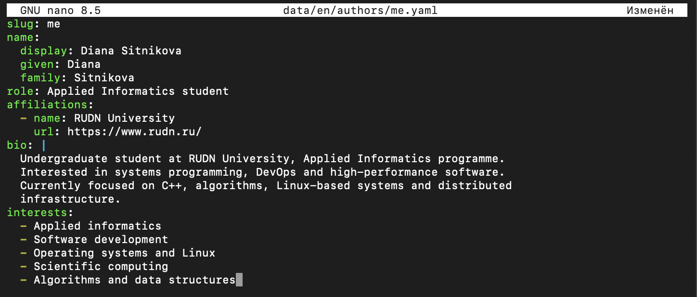

---
## Author
author:
  name: Ситникова Диана Александровна
  degrees: BSc
  email: 1032201746@rudn.ru
  affiliation:
    - name: Российский университет дружбы народов
      country: Российская Федерация
      postal-code: 117198
      city: Москва
      address: ул. Миклухо-Маклая, д. 6
## Title
title: "Индивидуальный проект. Этап 6"
subtitle: "Обеспечение двуязычности сайта"
institute:
  - "Российский университет дружбы народов им. П. Лумумбы"
  - "Преподаватель: д.ф.-м.н., профессор Кулябов Дмитрий Сергеевич"
license: CC BY
date: today
date-format: "YYYY-MM-DD"
header-includes:
  - \usepackage{tikz}
---

# Информация

## Докладчик

:::::::::::::: {.columns align=center}
::: {.column width="68%"}

- Ситникова Диана Александровна
- направление 09.03.03 «Прикладная информатика»
- Российский университет дружбы народов
- [1032201746@rudn.ru](mailto:1032201746@rudn.ru)

:::
::: {.column width="32%"}

{width=100%}

:::
::::::::::::::

# Вводная часть

## Актуальность

- Научная коммуникация ведётся на двух языках: национальном и английском.
- Сайт на одном языке ограничивает круг читателей.
- Дублирование сайта целиком приводит к расхождению версий при первой же правке.
- Требуется механизм, различающий переводимые и непереводимые данные.

## Объект и предмет исследования

**Объект** --- многоязычный режим генератора статических сайтов Hugo.

**Предмет** --- разделение содержимого по языкам, перевод элементов интерфейса и параметров сайта, а также механизм языкового переопределения данных о владельце.

## Научная новизна и практическая значимость

**Научная новизна** --- установлена граница между переводимыми и непереводимыми полями профиля, и показано, что применяемая тема выражает это различие частичным переопределением данных.

**Практическая значимость** --- изменение непереводимого поля вносится однократно и распространяется на все языковые версии.

## Цель, гипотеза и задачи

**Цель** --- обеспечить поддержку русского и английского языков на персональном сайте.

**Гипотеза** --- перевод целесообразно выражать как переопределение части данных, а не как их вторую копию.

**Задачи:**

- описать два языка с локалями, каталогами и меню;
- разделить содержимое по языковым каталогам;
- подготовить английский профиль владельца и английское содержимое;
- подготовить парные записи блога.

## Материалы и методы

| Компонент | Значение |
|---|---|
| Генератор | Hugo `0.162.1+extended` |
| Локали | `ru-ru` и `en-us` по стандарту BCP 47 |
| Разделение содержимого | `contentDir` для каждого языка |
| Данные владельца | `data/authors/` и `data/en/authors/` |
| Публикация | GitHub Pages через GitHub Actions |

# Содержание исследования

## Перевод --- переопределение, а не вторая копия

\begin{center}
\resizebox{0.92\linewidth}{!}{%
\begin{tikzpicture}[font=\scriptsize, >=latex]
  \draw[very thick] (0,2.6) rectangle (4.6,4.4);
  \node[align=center] at (2.3,4.0) {\textbf{\texttt{data/authors/me.yaml}}};
  \node[align=center] at (2.3,3.2) {все поля профиля\\имя · ссылки · даты\\навыки · достижения};

  \draw[thick,dashed] (0,0.2) rectangle (4.6,1.8);
  \node[align=center] at (2.3,1.4) {\textbf{\texttt{data/en/authors/me.yaml}}};
  \node[align=center] at (2.3,0.7) {только переводимые\\биография · должность · интересы};

  \draw[very thick] (6.6,1.6) rectangle (9.0,3.0);
  \node[align=center] at (7.8,2.3) {наложение};

  \draw[thick] (11.0,1.6) rectangle (14.6,3.0);
  \node[align=center] at (12.8,2.3) {Английский профиль\\переопределено 6 полей,\\остальные унаследованы};

  \draw[->,thick] (4.65,3.4) -- (6.55,2.6);
  \draw[->,thick,dashed] (4.65,1.0) -- (6.55,2.0);
  \draw[->,thick] (9.05,2.3) -- (10.95,2.3);
\end{tikzpicture}%
}
\end{center}

Изменение непереводимого поля вносится один раз и действует в обеих версиях.

## Переводится меньшая часть профиля

| Переводится | Не переводится |
|---|---|
| биография, должность | идентификатор ORCID |
| области интересов | адреса внешних профилей |
| названия групп навыков | даты обучения и работы |
| названия организаций | числовые уровни владения |
| подписи достижений | названия технологий |

Ключевые слова записей тоже не переводятся: `Go` и `PostgreSQL` одинаковы в обоих языках, а перевод породил бы два несвязанных набора страниц группировки.

## Язык описывается пятью свойствами

:::::::::::::: {.columns align=center}
::: {.column width="42%"}

`locale` задаёт код по стандарту BCP 47, `contentDir` --- каталог страниц.

Параметры и меню объявляются в составе языка, поэтому общий файл меню становится лишним.

:::
::: {.column width="58%"}

{width=100%}

:::
::::::::::::::

## Языковой файл содержит только различия

:::::::::::::: {.columns align=center}
::: {.column width="42%"}

Ссылки, идентификаторы, образование и достижения в него не включены.

Они наследуются из основного файла профиля при наложении.

:::
::: {.column width="58%"}

{width=100%}

:::
::::::::::::::

## Тема собрала вторую версию сайта

:::::::::::::: {.columns align=center}
::: {.column width="42%"}

Английская версия доступна в подкаталоге `/en/`, русская --- в корне.

Переключатель языков сформирован автоматически по описанию языков.

:::
::: {.column width="58%"}

{width=100%}

:::
::::::::::::::

# Результаты

## Все пункты задания выполнены

- Объявлены два языка с локалями, каталогами, параметрами и меню.
- Содержимое перенесено в языковые каталоги средствами системы контроля версий.
- Создана английская версия: 12 страниц, включая шесть записей о проектах.
- Подготовлен английский профиль владельца.
- Подготовлены парные записи блога и английский вариант поста по выбору.

## Анализ результатов и их применимость

- Сборка даёт две версии за один проход: 78 страниц русской и 60 английской.
- Языковые версии не обязаны совпадать по составу страниц.
- Надписи интерфейса переводит тема, содержимое --- автор.

Проект завершён: из шаблона получен двуязычный сайт с автоматической публикацией.

## Переводится не всё, и видно это только при переводе

Пока сайт одноязычный, данные выглядят однородными. Перевод разделяет их на две группы, и граница оказывается не там, где ожидалось: меньшая часть полей меняется, большая остаётся.

Механизм наложения закрепляет это разделение в структуре: языковой файл описывает различия, а не повторяет целое.
