---
## Author
author:
  name: Ситникова Диана Александровна
  degrees: BSc
  email: 1032201746@rudn.ru
  affiliation:
    - name: Российский университет дружбы народов
      country: Российская Федерация
      postal-code: 117198
      city: Москва
      address: ул. Миклухо-Маклая, д. 6

## Title
title: "Отчёт по индивидуальному проекту. Этап 6"
subtitle: "Обеспечение двуязычности сайта"
license: "CC BY"
bibliography: bib/cite.bib
---

# Цель работы

Обеспечить поддержку русского и английского языков на персональном сайте научного работника: перевести элементы интерфейса, разделить содержимое по языкам и подготовить парные записи блога.

# Задание

В соответствии с методическими указаниями необходимо выполнить следующую последовательность действий [@rudn_project_stages].

1. Обеспечить поддержку английского и русского языков.
2. Перевести элементы сайта на оба языка.
3. Разместить контент на обоих языках.
4. Сделать пост по прошедшей неделе.
5. Добавить пост на тему по выбору на двух языках.

# Краткие теоретические сведения

## Многоязычный режим генератора

Генератор Hugo поддерживает многоязычный режим, при котором из одного проекта формируется несколько языковых версий сайта. Каждая версия имеет собственное дерево страниц, собственные параметры и собственную навигацию; сборка обеих выполняется за один проход [@hugo_multilingual].

Языки описываются в отдельном конфигурационном файле, где каждому присваивается набор свойств (@tbl-lang-params).

| Свойство | Назначение |
|---|---|
| `locale` | код языка и региона по стандарту BCP 47 |
| `contentDir` | каталог, содержащий страницы этой языковой версии |
| `weight` | порядок языка в переключателе |
| `params` | параметры сайта, специфичные для языка |
| `menu` | состав навигационного меню на этом языке |

: Свойства языка в конфигурации {#tbl-lang-params}

Значение `locale` записывается по правилам, установленным документом BCP 47: код языка, при необходимости дополненный кодом региона --- `ru-ru`, `en-us` [@rfc5646_bcp47]. По этому коду тема оформления выбирает языковые ресурсы: формат даты, правила множественного числа, направление письма. Соответствующие данные сопровождаются консорциумом Unicode в репозитории CLDR и используются большинством современных систем [@unicode_cldr].

Параметр `defaultContentLanguage` определяет язык по умолчанию, а `defaultContentLanguageInSubdir` --- размещается ли он в отдельном подкаталоге. При отключённом параметре язык по умолчанию доступен в корне сайта, а остальные --- в подкаталогах с кодом языка.

## Разделение содержимого по языкам

Hugo допускает два способа разделения страниц по языкам: суффикс в имени файла и отдельный каталог для каждого языка [@hugo_multilingual]. Применяемый шаблон использует второй: свойство `contentDir` указывает, из какого каталога брать страницы данной языковой версии [@hugoblox_academic_cv].

Способ имеет практическое следствие: языковые версии страниц не обязаны совпадать по составу. Раздел, для которого перевод не подготовлен, в соответствующей языковой версии просто отсутствует, и это не является ошибкой сборки. Тема выводит переключатель языков для тех страниц, у которых перевод существует.

## Перевод элементов интерфейса

Переводимое разделяется на две категории, различающиеся тем, кто отвечает за перевод.

**Надписи интерфейса** --- подписи кнопок, заголовки служебных блоков, названия месяцев, форматы дат --- принадлежат теме оформления. Тема содержит словари для поддерживаемых языков, и перевод этих надписей выполняется автоматически при указании локали.

**Содержимое сайта** --- тексты страниц, названия разделов, пункты меню, описание сайта --- принадлежит автору и переводится вручную.

Первая категория достаётся при объявлении языка, вторая требует отдельной работы для каждой языковой версии.

## Языковые данные и частичное переопределение

Сведения о владельце сайта хранятся не в содержимом, а в каталоге данных, который в Hugo не разделён по языкам [@hugo_data_templates]. Применяемая тема решает это следующим образом: сначала читается основной файл `data/authors/`, затем поверх него накладывается языковой файл `data/<язык>/authors/`, если таковой существует. Значения языкового файла имеют приоритет, остальные наследуются от основного.

Механизм реализует частичное переопределение: языковой файл содержит только те поля, которые действительно меняются при переводе. Разделение полей по этому признаку показано в таблице (@tbl-translatable).

| Переводится | Не переводится |
|---|---|
| биография, должность | идентификатор ORCID |
| области интересов | адреса внешних профилей |
| названия групп навыков | даты обучения и работы |
| названия организаций | числовые уровни владения |
| подписи достижений | названия технологий |

: Разделение полей профиля по признаку переводимости {#tbl-translatable}

Альтернативой было бы полное дублирование файла данных. Его недостаток очевиден: при изменении непереводимого поля --- например, при добавлении ссылки на новый профиль --- правку пришлось бы вносить в оба файла, и расхождение становится вопросом времени.

# Выполнение работы

Работа велась в каталоге сайта `~/work/site/DinaSit.github.io`.

## 1. Установка языка по умолчанию {.unnumbered}

В основном конфигурационном файле языком по умолчанию назначен русский (@fig-hugo-yaml).

~~~bash
cd ~/work/site/DinaSit.github.io
nano config/_default/hugo.yaml
~~~

~~~yaml
defaultContentLanguage: ru
hasCJKLanguage: false
defaultContentLanguageInSubdir: false
removePathAccents: true
~~~

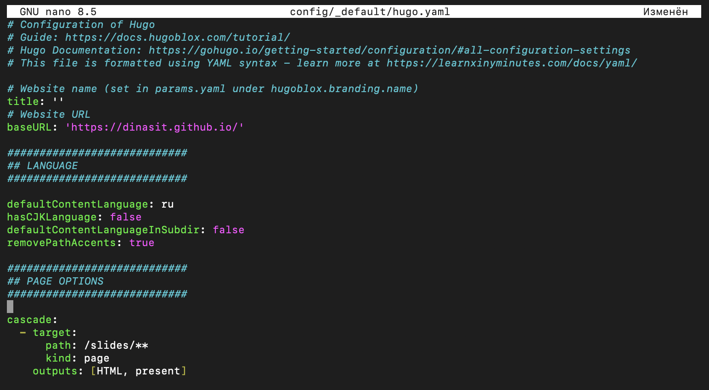{#fig-hugo-yaml width=100%}

Значение `defaultContentLanguageInSubdir` оставлено отключённым, вследствие чего русская версия размещается в корне сайта, а английская --- в подкаталоге `/en/`.

## 2. Описание языков {.unnumbered}

Описание языков заменено полностью: вместо единственного английского объявлены два языка, каждый со своей локалью, каталогом содержимого, параметрами и меню (@fig-languages).

~~~bash
nano config/_default/languages.yaml
~~~

~~~yaml
ru:
  locale: ru-ru
  label: Русский
  contentDir: content/ru
  weight: 1
  params:
    hugoblox:
      identity:
        name: 'Диана Ситникова'
        tagline: 'Студентка направления «Прикладная информатика», РУДН'
  menu:
    main:
      - name: Био
        url: /
        weight: 10
      - name: Новости
        url: /#news
        weight: 13
      - name: Опыт
        url: experience/
        weight: 20
      - name: Проекты
        url: projects/
        weight: 30
~~~

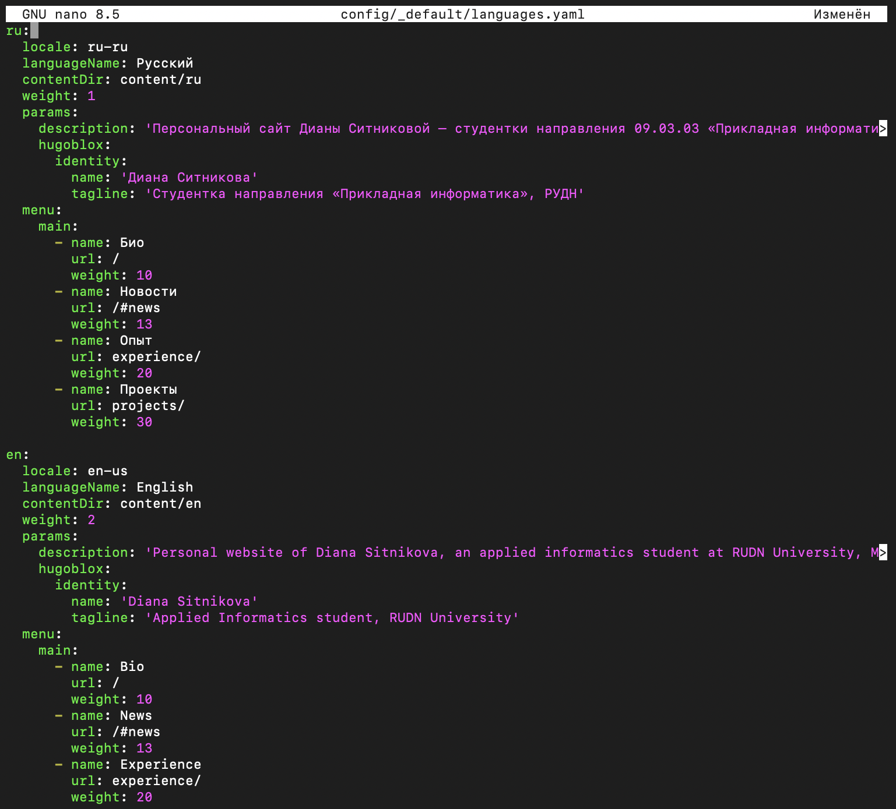{#fig-languages width=100%}

Английский язык описан симметрично: локаль `en-us`, каталог `content/en`, собственные название сайта, краткая подпись, описание для поисковых систем и меню.

Поскольку меню теперь описано в составе языка, ранее использовавшийся общий файл `config/_default/menus.yaml` удалён --- иначе два описания меню конкурировали бы между собой [@hugo_menus].

## 3. Перенос содержимого {.unnumbered}

Содержимое, существовавшее к началу этапа, перенесено в каталог русской версии (@fig-move).

~~~bash
mkdir -p content/ru
git mv content/_index.md content/experience.md content/authors content/blog content/projects content/publications content/events content/ru/
ls content/ru/
~~~

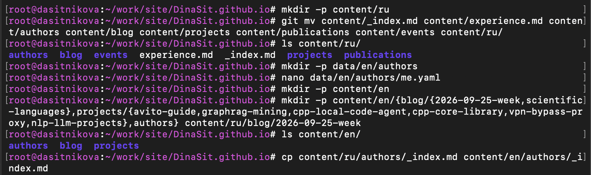{#fig-move width=100%}

Перемещение выполнено средствами системы контроля версий, а не файловой системы: команда `git mv` сохраняет историю файлов, тогда как удаление с последующим созданием разрывает её [@chacon_book_pro-git_en].

Затем создана структура каталогов английской версии.

~~~bash
mkdir -p content/en/{blog/{2026-09-25-week,scientific-languages},projects/{avito-guide,graphrag-mining,cpp-local-code-agent,cpp-core-library,vpn-bypass-proxy,nlp-llm-projects},authors}
cp content/ru/authors/_index.md content/en/authors/_index.md
~~~

## 4. Языковой профиль владельца {.unnumbered}

Создан каталог языковых данных и в нём английский вариант профиля (@fig-data-en).

~~~bash
mkdir -p data/en/authors
nano data/en/authors/me.yaml
~~~

~~~yaml
slug: me
name:
  display: Diana Sitnikova
  given: Diana
  family: Sitnikova
role: Applied Informatics student
affiliations:
  - name: RUDN University
    url: https://www.rudn.ru/
bio: |
  Undergraduate student at RUDN University, Applied Informatics programme.
  Interested in systems programming, DevOps and high-performance software.
interests:
  - Applied informatics
  - Software development
  - Operating systems and Linux
~~~

{#fig-data-en width=100%}

Файл содержит только переводимые поля. Ссылки на внешние профили, идентификатор ORCID, сведения об образовании, достижения и уровни владения навыками в него не включены --- они наследуются из основного файла профиля.

## 5. Русскоязычные элементы страницы опыта {.unnumbered}

Страница опыта содержала заголовки блоков на английском языке, унаследованные от шаблона. В русской версии они заменены (@fig-ru-exp).

~~~yaml
  - block: resume-skills
    content:
      title: Навыки и интересы
      username: me
  - block: resume-awards
    content:
      title: Достижения
      username: me
  - block: resume-languages
    content:
      title: Языки
      username: me
~~~

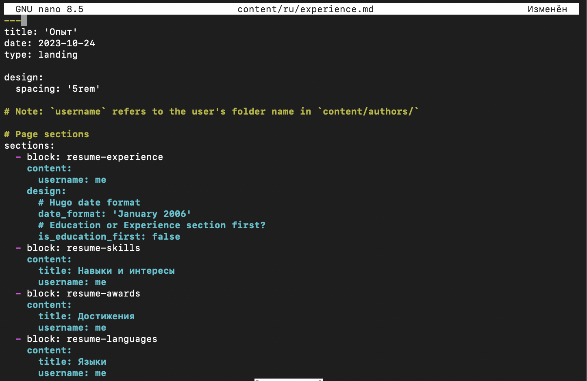{#fig-ru-exp width=100%}

Английская версия страницы создана с теми же блоками и англоязычными заголовками.

## 6. Английское содержимое {.unnumbered}

Подготовлены английские версии страниц разделов и записей (@tbl-en-content).

| Материал | Количество |
|---|---|
| Главная страница и страница опыта | 2 |
| Страницы разделов блога и проектов | 2 |
| Записи о персональных проектах | 6 |
| Записи блога | 2 |

: Состав английской версии сайта {#tbl-en-content}

Структура записи полностью повторяет русскую: те же метаданные, тот же маркер разделения краткого и полного описания, те же ключевые слова (@fig-en-project).

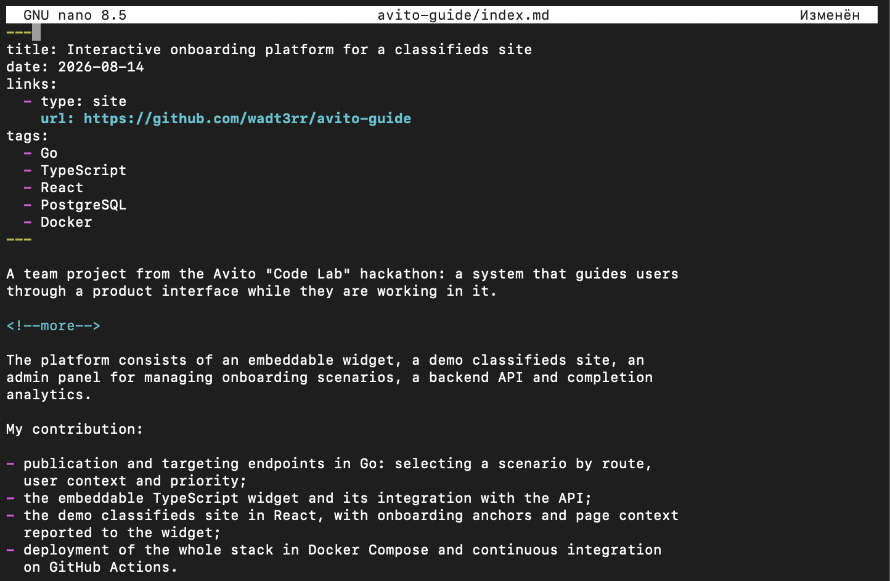{#fig-en-project width=100%}

Ключевые слова намеренно оставлены без перевода: `Go`, `TypeScript`, `PostgreSQL` --- названия технологий, одинаковые в обоих языках. Их перевод привёл бы к появлению двух несвязанных наборов страниц группировки.

Записи блога, созданные на предыдущих этапах, оставлены только в русской версии. Отсутствие перевода не является ошибкой: генератор выводит в каждой языковой версии те страницы, которые для неё существуют.

## 7. Записи блога {.unnumbered}

Подготовлена запись по прошедшей неделе в двух вариантах --- русском и английском. Её содержание построено по рекомендованной структуре [@kulyabov_weekly_post] и посвящено наблюдению, сделанному в ходе этапа: разделению данных профиля на переводимые и непереводимые.

Требование задания о записи на тему по выбору на двух языках выполнено материалом «Языки научного программирования», подготовленным на предыдущем этапе: создан его английский вариант (@fig-en-post). Запись описывает роль языка Fortran и происходящих от него библиотек линейной алгебры [@backus_inproc_fortran_en], проблему двух языков и попытку её устранения средствами языка Julia [@bezanson_article_julia_en].

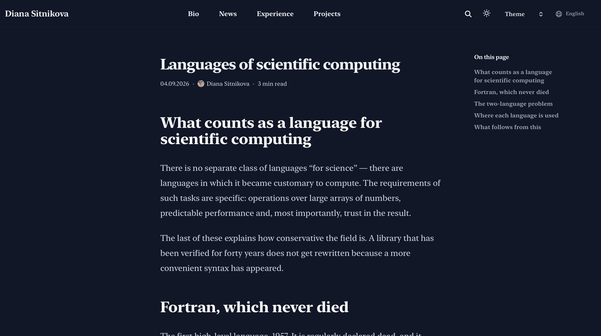{#fig-en-post width=100%}

## 8. Сборка и публикация {.unnumbered}

Результат проверен сборкой в производственном режиме (@fig-build).

~~~bash
hugo --minify --environment production
~~~

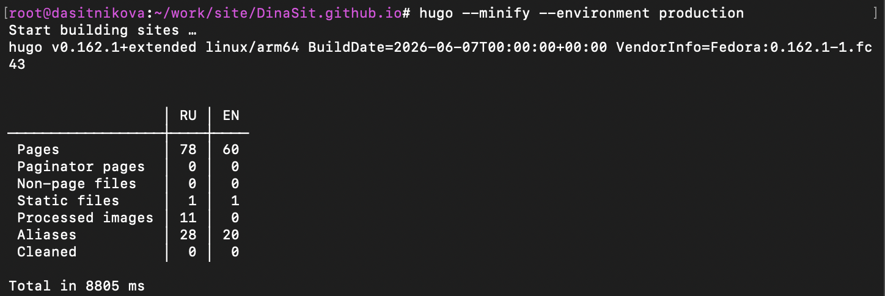{#fig-build width=100%}

Таблица сборки содержит две колонки: 78 страниц русской версии и 60 английской. Различие объясняется составом содержимого --- в русской версии присутствуют записи блога всех предыдущих этапов.

Русская версия открывается в корне сайта; меню, название и краткая подпись выведены по-русски (@fig-ru-main).

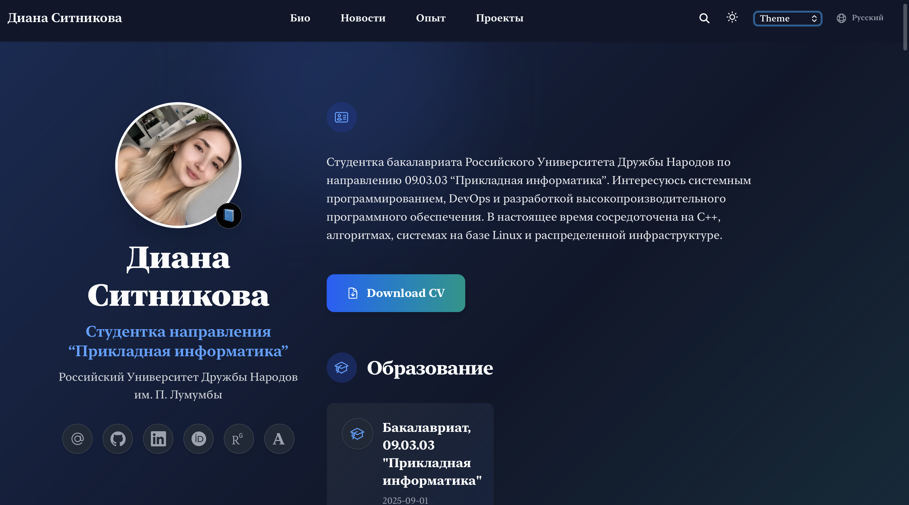{#fig-ru-main width=100%}

Английская версия доступна в подкаталоге `/en/` (@fig-en-main).

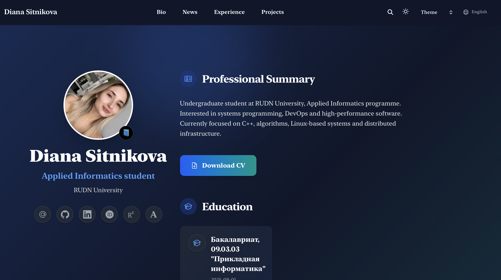{#fig-en-main width=100%}

Переключатель языков сформирован темой автоматически на основании описания языков в конфигурации (@fig-switch).

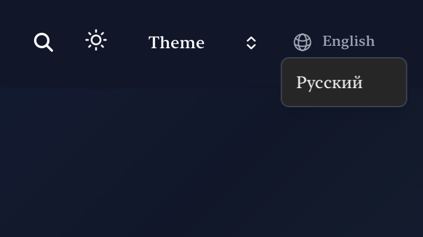{#fig-switch width=100%}

Раздел проектов английской версии содержит все шесть записей (@fig-en-projects).

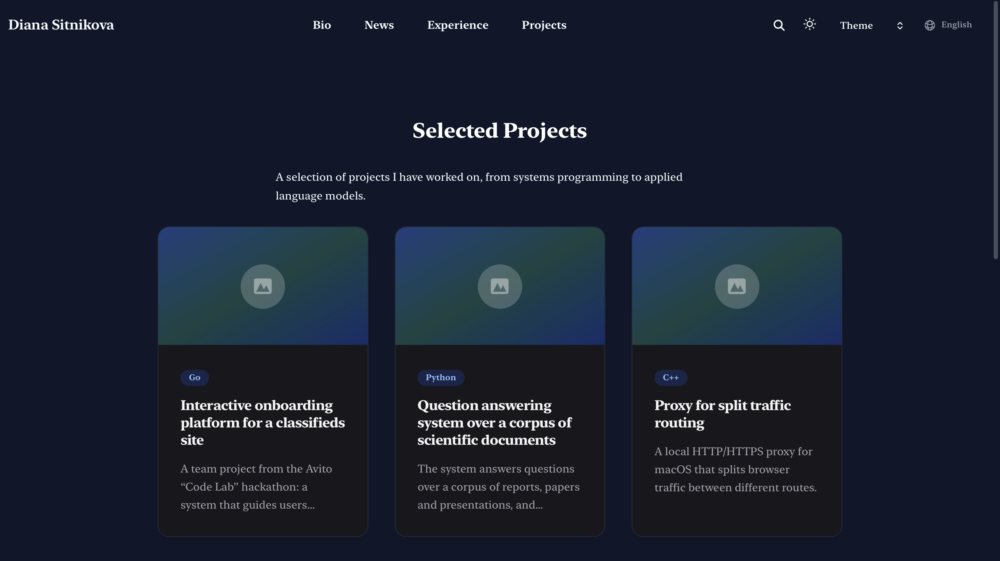{#fig-en-projects width=100%}

Изменения зафиксированы в репозитории и отправлены на хостинг.

~~~bash
git add -A
git commit -m "feat(i18n): add Russian and English language versions"
git push
~~~

Рабочий процесс публикации завершился успешно [@github_actions_docs] (@fig-deploy).

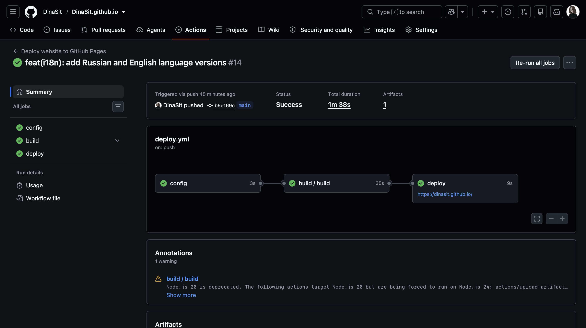{#fig-deploy width=100%}

# Выводы

В ходе выполнения шестого, завершающего этапа индивидуального проекта персональный сайт научного работника переведён в двуязычный режим.

Объявлены два языка с указанием локалей по стандарту BCP 47, каталогов содержимого, параметров и навигационных меню. Существовавшее содержимое перенесено в каталог русской версии средствами системы контроля версий с сохранением истории файлов. Создана английская версия: главная страница, страница опыта, страницы двух разделов, шесть записей о проектах и две записи блога. Подготовлен английский вариант профиля владельца. Требование о записи на тему по выбору на двух языках выполнено.

Основной результат этапа состоит в установлении границы между переводимыми и непереводимыми данными. Профиль владельца содержит около двадцати полей, из которых при переводе изменяется меньшая часть: биография, должность, области интересов и названия групп. Идентификатор ORCID, адреса внешних профилей, даты, числовые уровни владения и названия технологий одинаковы в любой языковой версии.

Применяемая тема оформления кодирует это различие в способе чтения данных: основной файл профиля дополняется языковым, содержащим только изменившиеся поля. Тем самым перевод выражен не как вторая копия данных, а как частичное переопределение первой. Практическое следствие --- изменение непереводимого поля вносится однократно и распространяется на все языковые версии, тогда как при полном дублировании расхождение версий было бы неизбежным.

Отдельно установлено, что перевод содержимого и перевод интерфейса --- задачи разной природы. Надписи, формируемые темой оформления, переводятся автоматически при объявлении локали, поскольку соответствующие словари входят в её состав. Содержимое страниц переводится автором и автоматизации не поддаётся.

Завершение этапа означает завершение индивидуального проекта. Из шаблона, содержавшего демонстрационные материалы вымышленного владельца, получен персональный сайт научного работника с биографией, сведениями об образовании, опыте, навыках и достижениях, ссылками на научные профили, описаниями шести проектов и записями блога --- на двух языках, с автоматической публикацией при каждом изменении исходных текстов.

# Список литературы {.unnumbered}

::: {#refs}
:::
